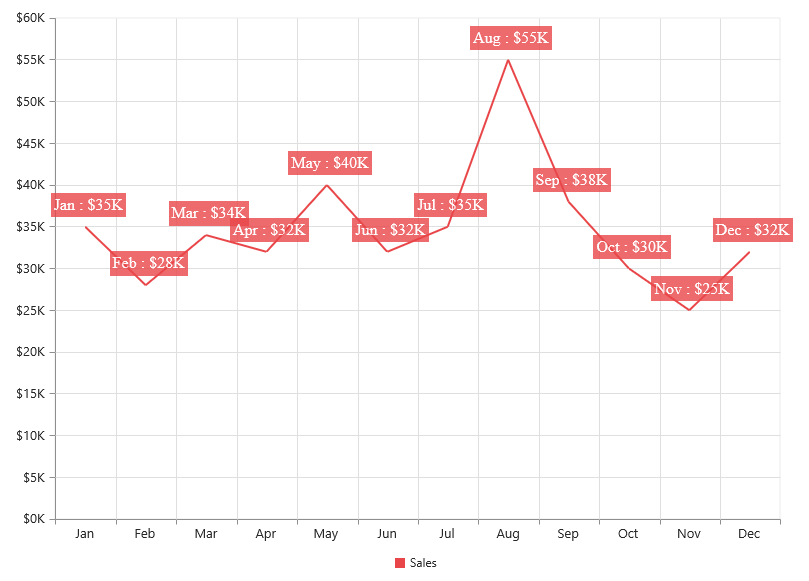

# Getting Started

This section explains you the steps required to populate the Chart with data, add data labels, tooltips and title to the Chart. This section covers only the minimal features that you need to know to get started with the Chart.

## Create a Simple Chart in Aurelia

Before we start with Chart, please refer [this](https://help.syncfusion.com/aurelia/overview#getting-started) page for general information regarding integrating Syncfusion widget’s.

For quick start, we already configured a template project in GitHub repository [syncfusion-template-repository](https://github.com/aurelia-ui-toolkits/syncfusion-template-repository). Run the below set of commands to clone the repository and install the required packages for Syncfusion Aurelia application.



    > git clone "https://github.com/aurelia-ui-toolkits/syncfusion-template-repository"
    > cd syncfusion-template-repository
    > npm install
    > jspm install



The below steps describes to create Syncfusion Aurelia Chart component.

    Create Chart folder inside src/samples/ location.
    Create Chart.html file inside src/samples/Chart folder and use the below code example to render the Chart component.

## Adding script reference

Create an **HTML** page and add the scripts references in the order mentioned in the following code example.



<!DOCTYPE html>
<html>
<head>
    <!--  jquery script  -->
     
    <!-- Essential JS UI widget -->
    
</head>
<body>
</body>
</html>



In the above code, ej.web.all.min.js script reference has been added for demonstration purpose. It is not recommended to use this for deployment purpose, as its file size is larger since it contains all the widgets. Instead, you can use [`CSG`](http://csg.syncfusion.com/) utility to generate a custom script file with the required widgets for deployment purpose.

## Initialize chart



<template>
    

        <ej-chart id="container" >
           
        </ej-chart>
    

</template>



Now, the Chart is rendered with some auto-generated random values and with default Column chart type.

## Populate chart with data

Now, this section explains how to plot JSON data to the Chart. First, let us prepare a sample JSON data with each object containing following fields – month and sales.



  this.chartData = [
      { month: 'Jan', sales: 35 },
      { month: 'Feb', sales: 28 },
      { month: 'Mar', sales: 34 },
      { month: 'Apr', sales: 32 },
      { month: 'May', sales: 40 },
      { month: 'Jun', sales: 32 },
      { month: 'Jul', sales: 35 },
      { month: 'Aug', sales: 55 },
      { month: 'Sep', sales: 38 },
      { month: 'Oct', sales: 30 },
      { month: 'Nov', sales: 25 },
      { month: 'Dec', sales: 32 }];



Add a series object to the chart by using the series option and set the chart type as *line* by using the *type* option. 



<template>
    

        <ej-chart id="container">
            <ej-series e-type="line">
            </ej-series>
        </ej-chart>
    

</template>



You can also add multiple series objects based on your requirement. Refer to the Chart Types and Chart Series sections to know more about chart types, how to add multiple series and customize series appearance.

Now, map the month and sales values in the data source to the line series by setting the *x-name* and *y-name* with the field names respectively and then set the actual data by using the *data-source* option. Refer to the Data Binding section to know more about binding the local and remote data to the chart.



<template>
    

        <ej-chart id="container">
            <ej-series e-data-source.bind="chartData" e-x-name="month" e-y-name="sales" e-type="line">
            </ej-series>
        </ej-chart>
    

</template>



Since the data is related to sales, format the vertical axis labels by adding ‘$’ as a prefix and ‘K’ as a suffix to each label. This can be achieved by setting the "${value}K" to the *labelFormat* option of the axis. Here, {value} acts as a placeholder for each axis label, "$" and "K" are the actual prefix and suffix added to each axis label. 

The following code example illustrates this,



    //Customize the axis label format.
    this.primaryYAxis = {labelFormat: '${value}K'};





<template>
    

        <ej-chart id="container" e-primary-y-axis.bind="primaryYAxis">
           
        </ej-chart>
    

</template>



Refer to the Axis section to know more about axis types, adding multiple axes and other customization options.

## Add Data Labels

You can add data labels to improve the readability of the chart. This can be achieved by enabling the *visible* option in the *dataLabel* option. Now, the data labels are rendered at the top of all the data points.

The following code example illustrates this,



            this.marker = {
                         dataLabel: {
                                //Enable data label in the chart 
                                visible: true
                   }};





<template>
    

        <ej-chart id="container">
            <ej-series e-marker.bind="marker">
            </ej-series>
        </ej-chart>
    

</template>



There are situations where the default label content is not sufficient to the user. In this case, you can use the *template* option to format the label content with some additional information.

 

<!DOCTYPE html>
<html>
<body>
      

         
#point.x#:$#point.y#K

      

</body>
</html>



The above HTML template is used as a template for each data label. Here, "point.x" and "point.y" are the placeholder text used to display the corresponding data point’s x & y value.

The following code example shows how to set the id of the above template to *template* option,



      this.marker = {
                dataLabel: {
                   //Enable data label in the chart 
                   visible: true,
                   //Set the id of HTML template to the chart series
                   template: "dataLabelTemplate"
       }};





<template>
    

        <ej-chart id="container">
            <ej-series e-marker.bind="marker">
            </ej-series>
        </ej-chart>
    

</template>



Refer to the Data Markers section to know more about the options available to customize it.

## Enable Legend

You can enable or disable the legend by using the *visible* option in the *legend*. It is enabled in the chart, by default.



   this.glegend = { 
	      //Enable chart legend
	      visible: true
		  };





<template>
    

        <ej-chart id="container" e-legend.bind="legend">
            <ej-series e-name="Sales">
            </ej-series>
        </ej-chart>
    

</template>



Refer to the Legend section to know more about how to position legend and customize its appearance.

## Enable Tooltip

The Tooltip is useful when you cannot display information by using the Data Labels due to the space constraints. You can enable tooltip by using the *visible* option of the **tooltip** in the specific series.

The following code example illustrates this,



this.tooltip = { 
	           //Enable tooltip in chart area
	           visible: true
	         };             





<template>
    

        <ej-chart id="container">
            <ej-series e-tooltip.bind="tooltip">
            </ej-series>
        </ej-chart>
    

</template>



Refer to the Tooltip section to know more about formatting tooltip contents and customizing its appearance.

## Add Chart Title

You need to add a title to the chart to provide quick information to the user about the data being plotted in the chart. You can add it by using the *text* option of the **title**.



	this.title = {
	         //Add chart title
             text: 'Sales Analysis'
	       };	            





<template>
    

        <ej-chart id="container">
            <ej-series e-legend.bind="legend">
            </ej-series>
        </ej-chart>
    

</template>



Refer to the Chart Title section to know more about aligning title, customizing its appearance and adding subtitle to the chart.
