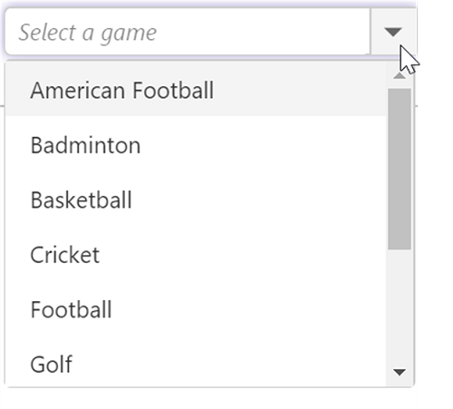

# Getting Started

The external script dependencies of the ComboBox widget are,

* [jQuery 1.7.1](http://jquery.com/) and later versions.

And the internal script dependencies of the ComboBox widget are:

<table>
	<tr>
		<th>File </th>
		<th>Description / Usage </th>
	</tr>
	<tr>
		<td>ej.core.min.js</td>
		<td>Must be referred always before using all the JS controls.</td>
	</tr>
	<tr>
		<td>ej.data.min.js</td>
		<td>Used to handle data operation and should be used while binding data to JS controls.</td>
	</tr>
	<tr>
		<td>ej.combobox.min.js</td>
		<td>The ComboBox's main file</td>
	</tr>
	<tr>
		<td>ej.globalize.min.js</td>
		<td>processing specific source-side actions globally.</td>
	</tr>
</table>

For getting started you can use the ‘ej.web.all.min.js’ file, which encapsulates all the 'ej' controls and frameworks in one single file.  

For themes, you can use the ‘ej.web.all.min.css’ CDN link from the snippet given. To add the themes in your application, please refer [this link](https://help.syncfusion.com/js/theming-in-essential-javascript-components#adding-specific-theme-to-your-application).

This section helps to understand the getting started of the Aurelia ComboBox with the step-by-step instructions.

## Create an ComboBox

You can create an Aurelia application and add necessary scripts and styles with the help of the given [Aurelia Getting Started Documentation](https://help.syncfusion.com/aurelia/overview).

We already configured a template project in GitHub repository [syncfusion-template-repository](https://github.com/aurelia-ui-toolkits/syncfusion-template-repository). Run the below set of commands to clone the repository and install the required packages for Syncfusion Aurelia application.



> git clone "https://github.com/aurelia-ui-toolkits/syncfusion-template-repository"
> cd syncfusion-template-repository
> npm install
> jspm install



The below steps describes to create Syncfusion Aurelia ComboBox component.

* Create `combobox` folder inside `src/samples/` location.
* Create `combobox.html` file inside `src/samples/combobox` folder and use the below code example to render the ComboBox component.



<template>
     <input type="text" ej-combo-box="e-data-source.bind:dataSource;e-fields.bind:fields;e-place-holder-text:Select a game;e-width:40%" id="list" />
</template>



* Create `combobox.js` file with the below code snippet inside `src/samples/combobox` folder.



export class DefaultComboBox {
   datasource = [
        { id: 'level1', game: 'American Football' }, { id: 'level2', game: 'Badminton' },
        { id: 'level3', game: 'Basketball' }, { id: 'level4', game: 'Cricket' },
        { id: 'level5', game: 'Football' }, { id: 'level6', game: 'Golf' },
        { id: 'level7', game: 'Hockey' }, { id: 'level8', game: 'Rugby' },
        { id: 'level9', game: 'Snooker' }, { id: 'level10', game: 'Tennis' }
    ];
    constructor() {
        this.dataSource = this.datasource;
        this.fields= { text: 'game', value: 'id'};
    }
}



* Now, we are going to configure the navigation for created ComboBox sample in `src/app.js` file.



export class App {
 configureRouter(config, router) {
  config.title = 'Aurelia Syncfusion';
  config.map([
   { route: ['', 'welcome'], name: 'welcome', moduleId: 'welcome',                              
                nav: true, title: 'Welcome' },
   { route: 'child-router',  name: 'child-router', moduleId: 'child-router',                         
                nav: true, title: 'Child Router' },
   { route: 'button',        name: 'button', moduleId: 'samples/button/button',                
                nav: true, title: 'Button' },
   { route: 'combobox',        name: 'combobox',       moduleId: 'samples/combobox/combobox',                
                nav: true, title: 'ComboBox' }
 ]);
 this.router = router;
 }
}



* To run the application, execute the following command.



gulp watch



Execution of above code will render the following output.

## Custom Values

The ComboBox allows the user to give input as custom value which is not required to present in predefined set of values. By default, this support is enabled by [allowCustom](https://help.syncfusion.com/api/js/ejcombobox#members:allowcustom) property. In this case, both text field and value field considered as same. The custom value will be sent to post back handler when a form is about to be submitted.



<template>
<input type="text" ej-combo-box="e-data-source.bind:sportsData;e-fields.bind:fields;e-place-holder-text:Select a game;e-width:40%;e-allowCustom.bind:allowCustom;" id="list" />
</template>





export class DefaultComboBox {
  sportsData = [
    { Id: 'game1', Game: 'Badminton' },
    { Id: 'game2', Game: 'Football' },
    { Id: 'game3', Game: 'Tennis' }
];

    constructor() {
        this.dataSource = this.sportsData;
        this.fields= { text: 'Game', value: 'Id'};
        this.allowCustom = true;
    }
}



## Configure the Popup List

By default, the width of the popup list automatically adjusts according to the ComboBox input element's width, and the height of the popup list has '300px'.

The height and width of the popup list can also be customized using the [popupHeight](https://help.syncfusion.com/api/js/ejcombobox#members:popupheight) and [popupWidth](https://help.syncfusion.com/api/js/ejcombobox#members:popupwidth) properties respectively.

In the following sample, popup list's width and height are configured.



<template>
<input type="text" ej-combo-box="e-data-source.bind:sportsData;e-fields.bind:fields;e-place-holder-text:Select a game;e-width:40%;e-allowCustom.bind:allowCustom;e-popupWidth:250px;e-popupHeight:200px" id="list" />
</template>





export class DefaultComboBox {
  sportsData = [
    { Id: 'game1', Game: 'Badminton' },
    { Id: 'game2', Game: 'Football' },
    { Id: 'game3', Game: 'Tennis' }
];

    constructor() {
        this.dataSource = this.sportsData;
        this.fields= { text: 'Game', value: 'Id'};
        this.allowCustom = true;
    }
}


