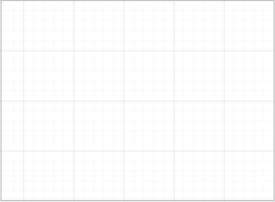
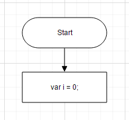
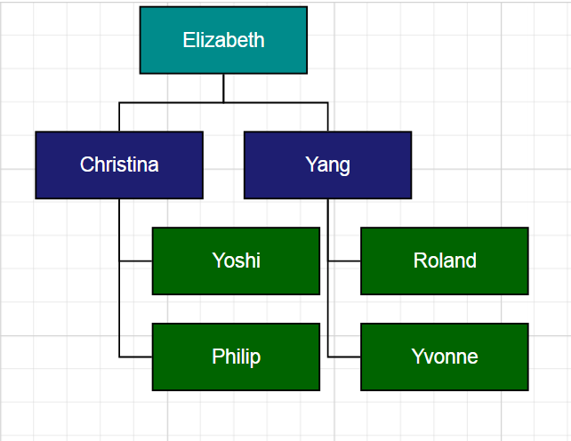

# Getting started

This section explains briefly about how to create a **Diagram** control in your application with **Aurelia**.

## Initialize Diagram

* To create Syncfusion Aurelia application refer [Aurelia Getting Started documentation](https://help.syncfusion.com/aurelia/overview#getting-started "").
* Create `diagram` folder inside `src/samples` location.
* Create `diagram.html` file inside  `src/samples/diagram` folder and use the below code for rendering Diagram component 



<!DOCTYPE html>
<template>
     <ej-diagram e-width="100%" e-height="600px">
        </ej-diagram>
</template>



* Create `diagram.js` file inside `src/samples/diagram` folder with below code snippet.



export class Diagram {
    constructor() {}
    }



This creates an empty diagram as shown in image

## Populate Diagram with nodes and connectors

* This section explains how to populate JSON data to the Diagram. 

* The Diagram is rendered based on default `width` and `height`. You can also customize the Diagram dimension by setting the `width` and `height` attribute in `scrollSettings`.



<!DOCTYPE html >
<template>
     <ej-diagram e-width="100%" e-height="600px" e-nodes.bind="nodes" 
         e-connectors.bind="connectors" >
    </ej-diagram>
</template>





export class BasicUse {
  constructor() {
    let margin = { 'left': 20, 'top': 0, 'right': 20, 'bottom': 0 };
    this.nodes = [
        {name: "Start",offsetX: 300,offsetY: 50,width: 140,height: 50,labels: [{text: "Start"}],type: "flow",shape: "terminator"},
        {name: "Init",offsetX: 300,offsetY: 140,width: 140,height: 50,labels: [{text: "var i = 0;"}],type: "flow",shape: "process"}];
    this.connectors = [
            { name: 'connector1', sourceNode: 'Start', targetNode: 'Init' }];
                }
            }



### Business object (Employee information)

* Define Employee Information as JSON data. The following code example shows an employee array whose,
	* `Name` is used as a unique identifier and
	* `ReportingPerson` is used to identify the person to whom an employee report to, in the organization.



 let data = [
	{ Name: "Elizabeth", Role: "Director" },
	{ Name: "Christina", ReportingPerson: "Elizabeth", Role: "Manager" },
	{ Name: "Yoshi", ReportingPerson: "Christina", Role: "Lead" },
	{ Name: "Philip", ReportingPerson: "Christina", Role: "Lead" },
	{ Name: "Yang", ReportingPerson: "Elizabeth", Role: "Manager" },
	{ Name: "Roland", ReportingPerson: "Yang", Role: "Lead" },
	{ Name: "Yvonne", ReportingPerson: "Yang", Role: "Lead" }
];



### Map data source

* You can configure this "Employee Information" with Diagram, so that the node and connector are automatically generated using mapping properties. DefaultSettings can define the default appearance of node and connector. 

* The NodeTemplate is used to update each node based on employee data.

* The following code examples show how dataSourceSetting is used to map id and parent with property name identifiers for employee information.


<!DOCTYPE html>
<template>
    <ej-diagram id="diagram" e-height="450px" 
                e-layout.bind="layout"
                e-default-settings.bind="defaultSettings"
                e-data-source-settings.bind="dataSourceSettings" 
                e-node-template.bind="nodeTemplate">
    </ej-diagram>
</template>





export class OrganizationalChart {
    constructor() {
        var codes = {
            Director: "rgb(0, 139,139)",
            Manager: "rgb(30, 30,113)",
            Lead: "rgb(0, 100,0)"
        }
        function nodeTemplate(diagram, node) {
            node.labels[0].text = node.Name;
            node.fillColor = codes[node.Role];
        }
        this.layout = {type: "organizationalchart", orientation: "toptobottom", horizontalSpacing: 25, verticalSpacing: 35, marginX: 3, marginY: 3 };
        this.defaultSettings = {
            node: { constraints: ej.datavisualization.Diagram.NodeConstraints.Select | ej.datavisualization.Diagram.NodeConstraints.PointerEvents, width: 100, height: 40, borderColor: "black", labels: [{ fontColor: "#ffffff" }] },
            connector: {
                lineColor: "#000000", segments: [{ type: "orthogonal" }], targetDecorator: { shape: "none" },
                constraints: ej.datavisualization.Diagram.ConnectorConstraints.None
            }
        };
        this.nodeTemplate = nodeTemplate;
        this.dataSourceSettings = {
            id: "Name", parent: "ReportingPerson", dataSource: data
        };
    }}


* The Employee details are displayed in the Diagram as follows.

