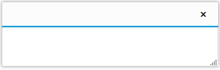
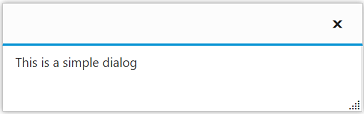
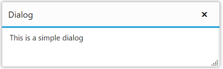
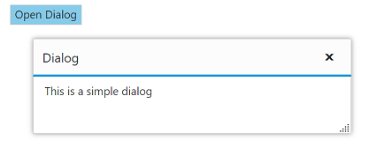

# Getting Started

This section helps you to understand the getting started of the Dialog component with the step-by-step instructions.

## Create a Dialog Component

* To create Syncfusion Aurelia application refer [Aurelia Getting Started](https://help.syncfusion.com/aurelia/overview#getting-started) Documentation.
* Create `dialog` folder inside `src/samples` location.
* Create `dialog.html` file inside `src/samples/dialog` folder and use the below code for rendering Dialog component.



    <template>
    <ej-dialog id="basicDialog" e-title="Audi Q3 Drive" e-width="550" e-min-width="310" e-min-height="215">
    </ej-dialog>
    </template>


 

* Create `dialog.js` file inside `src/samples/dialog` folder with below code snippet.



    export class BasicUse {
    constructor() {    
    }
    }



This will render an empty Dialog control on executing.

## Add dialog content

You can add the content to Dialog Control. Refer the below code for adding content in dialog component. 



    <ej-dialog id="basicDialog" e-title="Audi Q3 Drive" e-width="550" e-min-width="310" e-min-height="215" e-containment=".control">
    <h1>Audi Q3</h1>
    

            This is a simple dialog.
    

    </ej-dialog>



Run the above code and output renders as follows,

## Set the title

You can set Dialog control title as follows.



    <ej-dialog id="basicDialog" e-title="Dialog" e-width="550" e-min-width="310" e-min-height="215" e-containment=".control">
        <h1>Audi Q3</h1>
        

                This is a simple dialog.
        

    </ej-dialog>



Run the above code and your output will be,

## Open Dialog dynamically

In most cases, the Dialog control are needed only in dynamic actions like showing some messages on clicking a button, to provide alert, etc. So the Dialog control provides “open” and “close” methods to open/close the dialogs dynamically.
The Dialog control can be hidden on initialize using **e-show-on-init** property which should be set to false. 

Use the below code in the html file. The dialog will be opened on clicking the Button control.



    <button id="btnOpen" class="e-btn" ej-button="e-text:Click to open dialog; size: medium, type: button, height: 30, width: 150" e-on-click.trigger="onOpen()"></button>
    <ej-dialog id="basicDialog" e-title="Audi Q3 Drive" e-width="550" e-min-width="310" e-min-height="215" e-show-on-init=false e-containment=".control" e-on-close.trigger="onDialogClose()">
        <h1>Audi Q3</h1>
        

        This is a simple dialog.
        

    </ej-dialog>



Add the following in the script section.



    export class BasicUse {
        onOpen(args) {
            $('#btnOpen').hide();
            $('#basicDialog').ejDialog('open');
        }
        onDialogClose(args) {
            $('#btnOpen').show();
        }
    }



Run the above code, you get the output as below,

> _Note:_ _You can find the Dialog properties from the_ [API reference](https://help.syncfusion.com/api/js/ejdialog) _document_
