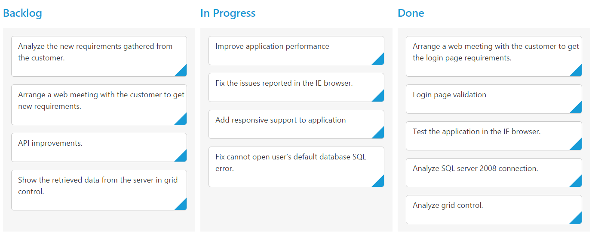

# Columns 

Column fields are present in the [`e-data-source.bind`](https://help.syncfusion.com/api/js/ejkanban#members:datasource) schema and it is rendering cards based its mapping column values.

## Key Mapping

To render Kanban with simple cards, you need to map the `e-data-source.bind` fields to Kanban cards and [`ej-kanban-columns`](https://help.syncfusion.com/api/js/ejkanban#members:columns). The required mapping field are listed as follows

<table>
<tr>
<th>
Mapping Fields</th><th>
Description</th></tr>
<tr>
<td>
{{ '[e-key-field](https://help.syncfusion.com/api/js/ejkanban#members:keyField)' | markdownify }} </td><td>
Map the column name to use as {{ '[e-key](https://help.syncfusion.com/api/js/ejkanban#members:columns-key)'| markdownify }} values to columns.</td></tr>
<tr>
<td>
{{ '[ej-kanban-column.e-key](https://help.syncfusion.com/api/js/ejkanban#members:columns-key)' | markdownify }} </td><td>
Map the corresponding `e-key` values of `e-key-field` column to each columns.</td></tr>
<tr>
<td>
{{ '[ej-kanban-column.e-header-text](https://help.syncfusion.com/api/js/ejkanban#members:columns-headertext)' | markdownify }} </td><td>
 It represents the title for particular column</td></tr>
<tr>
<td>
{{ '[e-fields.bind.content](https://help.syncfusion.com/api/js/ejkanban#members:fields-content)' | markdownify }} </td><td>
Map the column name to use as content to cards.</td></tr>
</table>

N> 1. If the column with `e-key-field` is not in the dataSource and `e-key` values specified will not available in column values, then the cards will not be rendered.
N> 2. If the `e-fields.bind.content` is not in the dataSource, then empty cards will be rendered.

The following code example describes the above behavior.



<template>
  

     <ej-kanban id="Kanban" e-data-source.bind="KanbanData" e-key-field="Status" e-fields.bind="Field">
       <ej-kanban-column  e-header-text="Backlog" e-key="Open"></ej-kanban-column>
	   <ej-kanban-column  e-header-text="In Progress" e-key="InProgress"></ej-kanban-column>
	   <ej-kanban-column  e-header-text="Testing" e-key="Testing"></ej-kanban-column>
	   <ej-kanban-column  e-header-text="Done" e-key="Close"></ej-kanban-column>
     </ej-kanban>
  

</template>





export class Kanban {
    constructor() {
        this.KanbanData = [
          { Id: 1, Status: 'Open', Summary: 'Analyze the new requirements gathered from the customer.', Type: 'Story', Priority: 'Low', Tags: 'Analyze,Customer', Estimate: 3.5, Assignee: 'Laura Callahan', ImgUrl: 'images/kanban/1.png', RankId: 1 },
          { Id: 2, Status: 'InProgress', Summary: 'Improve application performance', Type: 'Improvement', Priority: 'Normal', Tags: 'Improvement', Estimate: 6, Assignee: 'Andrew Fuller', ImgUrl: 'images/kanban/2.png', RankId: 1 },
          { Id: 3, Status: 'Open', Summary: 'Arrange a web meeting with the customer to get new requirements.', Type: 'Others', Priority: 'Critical', Tags: 'Meeting', Estimate: 5.5, Assignee: 'Janet Leverling', ImgUrl: 'images/kanban/3.png', RankId: 2 },
          { Id: 4, Status: 'InProgress', Summary: 'Fix the issues reported in the IE browser.', Type: 'Bug', Priority: 'Release Breaker', Tags: 'IE', Estimate: 2.5, Assignee: 'Janet Leverling', ImgUrl: 'images/kanban/3.png', RankId: 2 },
          { Id: 5, Status: 'InProgress', Summary: 'Fix the issues reported by the customer.', Type: 'Bug', Priority: 'Low', Tags: 'Customer', Estimate: '3.5', Assignee: 'Andrew Fuller', ImgUrl: 'images/kanban/5.png', RankId: 1 },
          { Id: 6, Status: 'Close', Summary: 'Arrange a web meeting with the customer to get the login page requirements.', Type: 'Others', Priority: 'Low', Tags: 'Meeting', Estimate: 2, Assignee: 'Laura Callahan', ImgUrl: 'images/kanban/6.png', RankId: 1 },
          { Id: 7, Status: 'Testing', Summary: 'Validate new requirements', Type: 'Improvement', Priority: 'Low', Tags: 'Validation', Estimate: 1.5, Assignee: 'Andrew Fuller', ImgUrl: 'images/kanban/7.png', RankId: 3 },
          { Id: 8, Status: 'Close', Summary: 'Login page validation', Type: 'Story', Priority: 'Release Breaker', Tags: 'Validation,Fix', Estimate: 2.5, Assignee: 'Laura Callahan', ImgUrl: 'images/kanban/8.png', RankId: 2 },
          { Id: 9, Status: 'Testing', Summary: 'Fix the issues reported in Safari browser.', Type: 'Bug', Priority: 'Release Breaker', Tags: 'Fix,Safari', Estimate: 1.5, Assignee: 'Laura Callahan', ImgUrl: 'images/kanban/1.png', RankId: 2 },
          { Id: 10, Status: 'Close', Summary: 'Test the application in the IE browser.', Type: 'Story', Priority: 'Low', Tags: 'Testing,IE', Estimate: 5.5, Assignee: 'Andrew Fuller', ImgUrl: 'images/kanban/4.png', RankId: 3 },
          { Id: 11, Status: "Validate", Summary: "Validate the issues reported by the customer.", Type: "Story", Priority: "High", Tags: "Validation,Fix", Estimate: 1, Assignee: "Steven walker", ImgUrl: "/images/kanban/5.png", RankId: 1 },
          { Id: 12, Status: "Testing", Summary: "Check Login page validation.", Type: "Story", Priority: "Release Breaker", Tags: "Testing", Estimate: 0.5, Assignee: "Michael Suyama", ImgUrl: "/images/kanban/6.png", RankId: 3 },
          { Id: 13, Status: "Open", Summary: "API improvements.", Type: "Improvement", Priority: "High", Tags: "Grid,API", Estimate: 3.5, Assignee: "Robert King", ImgUrl: "/images/kanban/7.png", RankId: 3 },
          { Id: 14, Status: "InProgress", Summary: "Add responsive support to application", Type: "Epic", Priority: "Critical", Tags: "Responsive", Estimate: 6, Assignee: "Laura Callahan", ImgUrl: "/images/kanban/8.png", RankId: 3 },
          { Id: 15, Status: "Open", Summary: "Show the retrieved data from the server in grid control.", Type: "Story", Priority: "High", Tags: "Database,SQL", Estimate: 5.5, Assignee: "Margaret hamilt", ImgUrl: "/images/kanban/4.png", RankId: 4 },
          { Id: 16, Status: "InProgress", Summary: "Fix cannot open user’s default database SQL error.", Priority: "Critical", Type: "Bug", Tags: "Database,Sql2008", Estimate: 2.5, Assignee: "Janet Leverling", ImgUrl: "/images/kanban/3.png", RankId: 4 },
          { Id: 17, Status: "Testing", Summary: "Fix the issues reported in data binding.", Type: "Story", Priority: "Normal", Tags: "Databinding", Estimate: "3.5", Assignee: "Janet Leverling", ImgUrl: "/images/kanban/3.png", RankId: 4 },
          { Id: 18, Status: "Close", Summary: "Analyze SQL server 2008 connection.", Type: "Story", Priority: "Release Breaker", Tags: "Grid,Sql", Estimate: 2, Assignee: "Andrew Fuller", ImgUrl: "/images/kanban/2.png", RankId: 4 },
          { Id: 19, Status: "Validate", Summary: "Validate databinding issues.", Type: "Story", Priority: "Low", Tags: "Validation", Estimate: 1.5, Assignee: "Margaret hamilt", ImgUrl: "/images/kanban/4.png", RankId: 1 },
          { Id: 20, Status: "Close", Summary: "Analyze grid control.", Type: "Story", Priority: "High", Tags: "Analyze", Estimate: 2.5, Assignee: "Margaret hamilt", ImgUrl: "/images/kanban/4.png", RankId: 5 }];
          this.Field = { primaryKey: 'Id', content: 'Summary'};
    }
}



The following output is displayed as a result of the above code example.

## Multiple Key Mapping

You can map more than one datasource fields as [`e-key`](https://help.syncfusion.com/api/js/ejkanban#members:columns-key) values to show different key cards into single column. For e.g , you can map "Validate,In progress" keys under "In progress" column. 

The following code example and screenshot which describes the above behavior.



<template>
  

     <ej-kanban id="Kanban" e-data-source.bind="KanbanData" e-key-field="Status" e-fields.bind="Field" e-allow-title="true">
       <ej-kanban-column  e-header-text="Backlog" e-key="Open"></ej-kanban-column>
	   <ej-kanban-column  e-header-text="In Progress or Validate" e-key="InProgress,Validate"></ej-kanban-column>
	   <ej-kanban-column  e-header-text="Testing" e-key="Testing"></ej-kanban-column>
	   <ej-kanban-column  e-header-text="Done" e-key="Close"></ej-kanban-column>
     </ej-kanban>
  

</template>





export class Kanban {
    constructor() {
        this.KanbanData = [
          { Id: 1, Status: "Open", Summary: "Analyze the new requirements gathered from the customer.", Type: "Story", Priority: "Low", Tags: "Analyze,Customer", Estimate: 3.5, Assignee: "Nancy Davloio", ImgUrl: "/images/kanban/1.png", RankId: 1 },
          { Id: 2, Status: "InProgress", Summary: "Improve application performance", Type: "Improvement", Priority: "Normal", Tags: "Improvement", Estimate: 6, Assignee: "Andrew Fuller", ImgUrl: "/images/kanban/2.png", RankId: 1 },
          { Id: 3, Status: "Open", Summary: "Arrange a web meeting with the customer to get new requirements.", Type: "Others", Priority: "Critical", Tags: "Meeting", Estimate: 5.5, Assignee: "Janet Leverling", ImgUrl: "/images/kanban/3.png", RankId: 2 },
          { Id: 4, Status: "InProgress", Summary: "Fix the issues reported in the IE browser.", Type: "Bug", Priority: "Release Breaker", Tags: "IE", Estimate: 2.5, Assignee: "Janet Leverling", ImgUrl: "/images/kanban/3.png", RankId: 2 },
          { Id: 5, Status: "Testing", Summary: "Fix the issues reported by the customer.", Type: "Bug", Priority: "Low", Tags: "Customer", Estimate: "3.5", Assignee: "Steven walker", ImgUrl:"/images/kanban/5.png", RankId: 1 },
          { Id: 6, Status: "Close", Summary: "Arrange a web meeting with the customer to get the login page requirements.", Type: "Others", Priority: "Low", Tags: "Meeting", Estimate: 2, Assignee: "Michael Suyama", ImgUrl: "/images/kanban/6.png", RankId: 1 },
          { Id: 7, Status: "Validate", Summary: "Validate new requirements", Type: "Improvement", Priority: "Low", Tags: "Validation", Estimate: 1.5, Assignee: "Robert King", ImgUrl: "/images/kanban/7.png", RankId: 1 },
          { Id: 8, Status: "Close", Summary: "Login page validation", Type: "Story", Priority: "Release Breaker", Tags: "Validation,Fix", Estimate: 2.5, Assignee: "Laura Callahan", ImgUrl: "/images/kanban/8.png", RankId: 2 },
          { Id: 9, Status: "Testing", Summary: "Fix the issues reported in Safari browser.", Type: "Bug", Priority: "Release Breaker", Tags: "Fix,Safari", Estimate: 1.5, Assignee: "Nancy Davloio", ImgUrl: "/images/kanban/1.png", RankId: 2 },
          { Id: 10, Status: "Close", Summary: "Test the application in the IE browser.", Type: "Story", Priority: "Low", Tags: "Testing,IE", Estimate: 5.5, Assignee: "Margaret hamilt", ImgUrl: "/images/kanban/4.png", RankId: 3 }];
          this.Field = { primaryKey: 'Id', content: 'Summary', imageUrl: 'ImgUrl'};
    }
}
   


The following output is displayed as a result of the above code example.

## Headers

### Header Template

The template design that applies on for the column header. To render template, set [`e-header-template`](https://help.syncfusion.com/api/js/ejkanban#members:columns-headertemplate) property of the [`ej-kanban-column`](https://help.syncfusion.com/api/js/ejkanban#members:columns).

You can use JsRender syntax in the template. For more information about JsRender syntax, please refer the [`link`](https://www.jsviews.com/).

The following code example describes the above behavior.



<template>
  

     <ej-kanban id="Kanban" e-data-source.bind="KanbanData" e-key-field="Status" e-fields.bind="Field">
       <ej-kanban-column  e-header-text="Backlog" e-key="Open" e-header-template="#column1"></ej-kanban-column>
	   <ej-kanban-column  e-header-text="In Progress" e-key="InProgress"></ej-kanban-column>
	   <ej-kanban-column  e-header-text="Testing" e-key="Testing"></ej-kanban-column>
	   <ej-kanban-column  e-header-text="Done" e-key="Close" e-header-template="#column4"></ej-kanban-column>
     </ej-kanban>
  

    
    

         Done
    

   
</template>





   export class Kanban {
    constructor() {
        this.KanbanData = [
          { Id: 1, Status: "Open", Summary: "Analyze the new requirements gathered from the customer.", Type: "Story", Priority: "Low", Tags: "Analyze,Customer", Estimate: 3.5, Assignee: "Nancy Davloio", ImgUrl: "/images/kanban/1.png", RankId: 1 },
          { Id: 2, Status: "InProgress", Summary: "Improve application performance", Type: "Improvement", Priority: "Normal", Tags: "Improvement", Estimate: 6, Assignee: "Andrew Fuller", ImgUrl: "/images/kanban/2.png", RankId: 1 },
          { Id: 3, Status: "Open", Summary: "Arrange a web meeting with the customer to get new requirements.", Type: "Others", Priority: "Critical", Tags: "Meeting", Estimate: 5.5, Assignee: "Janet Leverling", ImgUrl: "/images/kanban/3.png", RankId: 2 },
          { Id: 4, Status: "InProgress", Summary: "Fix the issues reported in the IE browser.", Type: "Bug", Priority: "Release Breaker", Tags: "IE", Estimate: 2.5, Assignee: "Janet Leverling", ImgUrl: "/images/kanban/3.png", RankId: 2 },
          { Id: 5, Status: "Testing", Summary: "Fix the issues reported by the customer.", Type: "Bug", Priority: "Low", Tags: "Customer", Estimate: "3.5", Assignee: "Steven walker", ImgUrl:"/images/kanban/5.png", RankId: 1 },
          { Id: 6, Status: "Close", Summary: "Arrange a web meeting with the customer to get the login page requirements.", Type: "Others", Priority: "Low", Tags: "Meeting", Estimate: 2, Assignee: "Michael Suyama", ImgUrl: "/images/kanban/6.png", RankId: 1 },
          { Id: 7, Status: "Validate", Summary: "Validate new requirements", Type: "Improvement", Priority: "Low", Tags: "Validation", Estimate: 1.5, Assignee: "Robert King", ImgUrl: "/images/kanban/7.png", RankId: 1 },
          { Id: 8, Status: "Close", Summary: "Login page validation", Type: "Story", Priority: "Release Breaker", Tags: "Validation,Fix", Estimate: 2.5, Assignee: "Laura Callahan", ImgUrl: "/images/kanban/8.png", RankId: 2 },
          { Id: 9, Status: "Testing", Summary: "Fix the issues reported in Safari browser.", Type: "Bug", Priority: "Release Breaker", Tags: "Fix,Safari", Estimate: 1.5, Assignee: "Nancy Davloio", ImgUrl: "/images/kanban/1.png", RankId: 2 },
          { Id: 10, Status: "Close", Summary: "Test the application in the IE browser.", Type: "Story", Priority: "Low", Tags: "Testing,IE", Estimate: 5.5, Assignee: "Margaret hamilt", ImgUrl: "/images/kanban/4.png", RankId: 3 },
          { Id: 11, Status: "Validate", Summary: "Validate the issues reported by the customer.", Type: "Story", Priority: "High", Tags: "Validation,Fix", Estimate: 1, Assignee: "Steven walker", ImgUrl: "/images/kanban/5.png", RankId: 1 },
          { Id: 12, Status: "Testing", Summary: "Check Login page validation.", Type: "Story", Priority: "Release Breaker", Tags: "Testing", Estimate: 0.5, Assignee: "Michael Suyama", ImgUrl: "/images/kanban/6.png", RankId: 3 },
          { Id: 13, Status: "Open", Summary: "API improvements.", Type: "Improvement", Priority: "High", Tags: "Grid,API", Estimate: 3.5, Assignee: "Robert King", ImgUrl: "/images/kanban/7.png", RankId: 3 },
          { Id: 14, Status: "InProgress", Summary: "Add responsive support to application", Type: "Epic", Priority: "Critical", Tags: "Responsive", Estimate: 6, Assignee: "Laura Callahan", ImgUrl: "/images/kanban/8.png", RankId: 3 },
          { Id: 15, Status: "Open", Summary: "Show the retrieved data from the server in grid control.", Type: "Story", Priority: "High", Tags: "Database,SQL", Estimate: 5.5, Assignee: "Margaret hamilt", ImgUrl: "/images/kanban/4.png", RankId: 4 },
          { Id: 16, Status: "InProgress", Summary: "Fix cannot open user’s default database SQL error.", Priority: "Critical", Type: "Bug", Tags: "Database,Sql2008", Estimate: 2.5, Assignee: "Janet Leverling", ImgUrl: "/images/kanban/3.png", RankId: 4 },
          { Id: 17, Status: "Testing", Summary: "Fix the issues reported in data binding.", Type: "Story", Priority: "Normal", Tags: "Databinding", Estimate: "3.5", Assignee: "Janet Leverling", ImgUrl: "/images/kanban/3.png", RankId: 4 },
          { Id: 18, Status: "Close", Summary: "Analyze SQL server 2008 connection.", Type: "Story", Priority: "Release Breaker", Tags: "Grid,Sql", Estimate: 2, Assignee: "Andrew Fuller", ImgUrl: "/images/kanban/2.png", RankId: 4 },
          { Id: 19, Status: "Validate", Summary: "Validate databinding issues.", Type: "Story", Priority: "Low", Tags: "Validation", Estimate: 1.5, Assignee: "Margaret hamilt", ImgUrl: "/images/kanban/4.png", RankId: 1 },
          { Id: 20, Status: "Close", Summary: "Analyze grid control.", Type: "Story", Priority: "High", Tags: "Analyze", Estimate: 2.5, Assignee: "Margaret hamilt", ImgUrl: "/images/kanban/4.png", RankId: 5 }];
        this.Field = { primaryKey: 'Id', content: 'Summary'};
    }
}



The following output is displayed as a result of the above code example.

## Width

You can specify the width for particular column by setting [`e-width`](https://help.syncfusion.com/api/js/ejkanban#members:columns-width) property of [`ej-kanban-column`](https://help.syncfusion.com/api/js/ejkanban#members:columns) as in pixel (ex: 100) or in percentage (ex: 40%).

The following code example describes the above behavior.


  
<template>
  

     <ej-kanban id="Kanban" e-data-source.bind="KanbanData" e-key-field="Status" e-fields.bind="Field">
       <ej-kanban-column  e-header-text="Backlog" e-key="Open" e-width="5%"></ej-kanban-column>
	   <ej-kanban-column  e-header-text="In Progress" e-key="InProgress" e-width="12%"></ej-kanban-column>
	   <ej-kanban-column  e-header-text="Testing" e-key="Testing" e-width="100"></ej-kanban-column>
	   <ej-kanban-column  e-header-text="Done" e-key="Close" e-width="100"></ej-kanban-column>
     </ej-kanban>
  

</template>





export class Kanban {
    constructor() {
        this.KanbanData = [
          { Id: 1, Status: "Open", Summary: "Analyze the new requirements gathered from the customer.", Type: "Story", Priority: "Low", Tags: "Analyze,Customer", Estimate: 3.5, Assignee: "Nancy Davloio", ImgUrl: "/images/kanban/1.png", RankId: 1 },
          { Id: 2, Status: "InProgress", Summary: "Improve application performance", Type: "Improvement", Priority: "Normal", Tags: "Improvement", Estimate: 6, Assignee: "Andrew Fuller", ImgUrl: "/images/kanban/2.png", RankId: 1 },
          { Id: 3, Status: "Open", Summary: "Arrange a web meeting with the customer to get new requirements.", Type: "Others", Priority: "Critical", Tags: "Meeting", Estimate: 5.5, Assignee: "Janet Leverling", ImgUrl: "/images/kanban/3.png", RankId: 2 },
          { Id: 4, Status: "InProgress", Summary: "Fix the issues reported in the IE browser.", Type: "Bug", Priority: "Release Breaker", Tags: "IE", Estimate: 2.5, Assignee: "Janet Leverling", ImgUrl: "/images/kanban/3.png", RankId: 2 },
          { Id: 5, Status: "Testing", Summary: "Fix the issues reported by the customer.", Type: "Bug", Priority: "Low", Tags: "Customer", Estimate: "3.5", Assignee: "Steven walker", ImgUrl:"/images/kanban/5.png", RankId: 1 },
          { Id: 6, Status: "Close", Summary: "Arrange a web meeting with the customer to get the login page requirements.", Type: "Others", Priority: "Low", Tags: "Meeting", Estimate: 2, Assignee: "Michael Suyama", ImgUrl: "/images/kanban/6.png", RankId: 1 },
          { Id: 7, Status: "Validate", Summary: "Validate new requirements", Type: "Improvement", Priority: "Low", Tags: "Validation", Estimate: 1.5, Assignee: "Robert King", ImgUrl: "/images/kanban/7.png", RankId: 1 },
          { Id: 8, Status: "Close", Summary: "Login page validation", Type: "Story", Priority: "Release Breaker", Tags: "Validation,Fix", Estimate: 2.5, Assignee: "Laura Callahan", ImgUrl: "/images/kanban/8.png", RankId: 2 },
          { Id: 9, Status: "Testing", Summary: "Fix the issues reported in Safari browser.", Type: "Bug", Priority: "Release Breaker", Tags: "Fix,Safari", Estimate: 1.5, Assignee: "Nancy Davloio", ImgUrl: "/images/kanban/1.png", RankId: 2 },
          { Id: 10, Status: "Close", Summary: "Test the application in the IE browser.", Type: "Story", Priority: "Low", Tags: "Testing,IE", Estimate: 5.5, Assignee: "Margaret hamilt", ImgUrl: "/images/kanban/4.png", RankId: 3 },
          { Id: 11, Status: "Validate", Summary: "Validate the issues reported by the customer.", Type: "Story", Priority: "High", Tags: "Validation,Fix", Estimate: 1, Assignee: "Steven walker", ImgUrl: "/images/kanban/5.png", RankId: 1 },
          { Id: 12, Status: "Testing", Summary: "Check Login page validation.", Type: "Story", Priority: "Release Breaker", Tags: "Testing", Estimate: 0.5, Assignee: "Michael Suyama", ImgUrl: "/images/kanban/6.png", RankId: 3 },
          { Id: 13, Status: "Open", Summary: "API improvements.", Type: "Improvement", Priority: "High", Tags: "Grid,API", Estimate: 3.5, Assignee: "Robert King", ImgUrl: "/images/kanban/7.png", RankId: 3 },
          { Id: 14, Status: "InProgress", Summary: "Add responsive support to application", Type: "Epic", Priority: "Critical", Tags: "Responsive", Estimate: 6, Assignee: "Laura Callahan", ImgUrl: "/images/kanban/8.png", RankId: 3 },
          { Id: 15, Status: "Open", Summary: "Show the retrieved data from the server in grid control.", Type: "Story", Priority: "High", Tags: "Database,SQL", Estimate: 5.5, Assignee: "Margaret hamilt", ImgUrl: "/images/kanban/4.png", RankId: 4 },
          { Id: 16, Status: "InProgress", Summary: "Fix cannot open user’s default database SQL error.", Priority: "Critical", Type: "Bug", Tags: "Database,Sql2008", Estimate: 2.5, Assignee: "Janet Leverling", ImgUrl: "/images/kanban/3.png", RankId: 4 },
          { Id: 17, Status: "Testing", Summary: "Fix the issues reported in data binding.", Type: "Story", Priority: "Normal", Tags: "Databinding", Estimate: "3.5", Assignee: "Janet Leverling", ImgUrl: "/images/kanban/3.png", RankId: 4 },
          { Id: 18, Status: "Close", Summary: "Analyze SQL server 2008 connection.", Type: "Story", Priority: "Release Breaker", Tags: "Grid,Sql", Estimate: 2, Assignee: "Andrew Fuller", ImgUrl: "/images/kanban/2.png", RankId: 4 },
          { Id: 19, Status: "Validate", Summary: "Validate databinding issues.", Type: "Story", Priority: "Low", Tags: "Validation", Estimate: 1.5, Assignee: "Margaret hamilt", ImgUrl: "/images/kanban/4.png", RankId: 1 },
          { Id: 20, Status: "Close", Summary: "Analyze grid control.", Type: "Story", Priority: "High", Tags: "Analyze", Estimate: 2.5, Assignee: "Margaret hamilt", ImgUrl: "/images/kanban/4.png", RankId: 5 }];
        this.Field = { primaryKey: 'Id', content: 'Summary'};
    }
}



The following output is displayed as a result of the above code example.

## Visibility 

You can hide particular column in Kanban by setting [`e-visible`](https://help.syncfusion.com/api/js/ejkanban#members:columns-visible) property of it as false.

The following code example describes the above behavior.



<template>
  

     <ej-kanban id="Kanban" e-data-source.bind="KanbanData" e-key-field="Status" e-fields.bind="Field">
       <ej-kanban-column  e-header-text="Backlog" e-key="Open"></ej-kanban-column>
	   <ej-kanban-column  e-header-text="In Progress" e-key="InProgress"></ej-kanban-column>
	   <ej-kanban-column  e-header-text="Testing" e-key="Testing" e-visible="false"></ej-kanban-column>
	   <ej-kanban-column  e-header-text="Done" e-key="Close"></ej-kanban-column>
     </ej-kanban>
  

</template>





export class Kanban {
    constructor() {
        this.KanbanData = [
          { Id: 1, Status: "Open", Summary: "Analyze the new requirements gathered from the customer.", Type: "Story", Priority: "Low", Tags: "Analyze,Customer", Estimate: 3.5, Assignee: "Nancy Davloio", ImgUrl: "/images/kanban/1.png", RankId: 1 },
          { Id: 2, Status: "InProgress", Summary: "Improve application performance", Type: "Improvement", Priority: "Normal", Tags: "Improvement", Estimate: 6, Assignee: "Andrew Fuller", ImgUrl: "/images/kanban/2.png", RankId: 1 },
          { Id: 3, Status: "Open", Summary: "Arrange a web meeting with the customer to get new requirements.", Type: "Others", Priority: "Critical", Tags: "Meeting", Estimate: 5.5, Assignee: "Janet Leverling", ImgUrl: "/images/kanban/3.png", RankId: 2 },
          { Id: 4, Status: "InProgress", Summary: "Fix the issues reported in the IE browser.", Type: "Bug", Priority: "Release Breaker", Tags: "IE", Estimate: 2.5, Assignee: "Janet Leverling", ImgUrl: "/images/kanban/3.png", RankId: 2 },
          { Id: 5, Status: "Testing", Summary: "Fix the issues reported by the customer.", Type: "Bug", Priority: "Low", Tags: "Customer", Estimate: "3.5", Assignee: "Steven walker", ImgUrl:"/images/kanban/5.png", RankId: 1 },
          { Id: 6, Status: "Close", Summary: "Arrange a web meeting with the customer to get the login page requirements.", Type: "Others", Priority: "Low", Tags: "Meeting", Estimate: 2, Assignee: "Michael Suyama", ImgUrl: "/images/kanban/6.png", RankId: 1 },
          { Id: 7, Status: "Validate", Summary: "Validate new requirements", Type: "Improvement", Priority: "Low", Tags: "Validation", Estimate: 1.5, Assignee: "Robert King", ImgUrl: "/images/kanban/7.png", RankId: 1 },
          { Id: 8, Status: "Close", Summary: "Login page validation", Type: "Story", Priority: "Release Breaker", Tags: "Validation,Fix", Estimate: 2.5, Assignee: "Laura Callahan", ImgUrl: "/images/kanban/8.png", RankId: 2 },
          { Id: 9, Status: "Testing", Summary: "Fix the issues reported in Safari browser.", Type: "Bug", Priority: "Release Breaker", Tags: "Fix,Safari", Estimate: 1.5, Assignee: "Nancy Davloio", ImgUrl: "/images/kanban/1.png", RankId: 2 },
          { Id: 10, Status: "Close", Summary: "Test the application in the IE browser.", Type: "Story", Priority: "Low", Tags: "Testing,IE", Estimate: 5.5, Assignee: "Margaret hamilt", ImgUrl: "/images/kanban/4.png", RankId: 3 },
          { Id: 11, Status: "Validate", Summary: "Validate the issues reported by the customer.", Type: "Story", Priority: "High", Tags: "Validation,Fix", Estimate: 1, Assignee: "Steven walker", ImgUrl: "/images/kanban/5.png", RankId: 1 },
          { Id: 12, Status: "Testing", Summary: "Check Login page validation.", Type: "Story", Priority: "Release Breaker", Tags: "Testing", Estimate: 0.5, Assignee: "Michael Suyama", ImgUrl: "/images/kanban/6.png", RankId: 3 },
          { Id: 13, Status: "Open", Summary: "API improvements.", Type: "Improvement", Priority: "High", Tags: "Grid,API", Estimate: 3.5, Assignee: "Robert King", ImgUrl: "/images/kanban/7.png", RankId: 3 },
          { Id: 14, Status: "InProgress", Summary: "Add responsive support to application", Type: "Epic", Priority: "Critical", Tags: "Responsive", Estimate: 6, Assignee: "Laura Callahan", ImgUrl: "/images/kanban/8.png", RankId: 3 },
          { Id: 15, Status: "Open", Summary: "Show the retrieved data from the server in grid control.", Type: "Story", Priority: "High", Tags: "Database,SQL", Estimate: 5.5, Assignee: "Margaret hamilt", ImgUrl: "/images/kanban/4.png", RankId: 4 },
          { Id: 16, Status: "InProgress", Summary: "Fix cannot open user’s default database SQL error.", Priority: "Critical", Type: "Bug", Tags: "Database,Sql2008", Estimate: 2.5, Assignee: "Janet Leverling", ImgUrl: "/images/kanban/3.png", RankId: 4 },
          { Id: 17, Status: "Testing", Summary: "Fix the issues reported in data binding.", Type: "Story", Priority: "Normal", Tags: "Databinding", Estimate: "3.5", Assignee: "Janet Leverling", ImgUrl: "/images/kanban/3.png", RankId: 4 },
          { Id: 18, Status: "Close", Summary: "Analyze SQL server 2008 connection.", Type: "Story", Priority: "Release Breaker", Tags: "Grid,Sql", Estimate: 2, Assignee: "Andrew Fuller", ImgUrl: "/images/kanban/2.png", RankId: 4 },
          { Id: 19, Status: "Validate", Summary: "Validate databinding issues.", Type: "Story", Priority: "Low", Tags: "Validation", Estimate: 1.5, Assignee: "Margaret hamilt", ImgUrl: "/images/kanban/4.png", RankId: 1 },
          { Id: 20, Status: "Close", Summary: "Analyze grid control.", Type: "Story", Priority: "High", Tags: "Analyze", Estimate: 2.5, Assignee: "Margaret hamilt", ImgUrl: "/images/kanban/4.png", RankId: 5 }];
        this.Field = { primaryKey: 'Id', content: 'Summary'};
    }
}



The following output is displayed as a result of the above code example.

## Toggle 

You can set particular column collapsed state in Kanban by setting [`e-is-collapsed`](https://help.syncfusion.com/api/js/ejkanban#members:columns-iscollapsed) property of it as true. You need to set [`e-allow-toggle-column`](https://help.syncfusion.com/api/js/ejkanban#members:allowtogglecolumn) as true to use “Expand/Collapse” Column.

The following code example describes the above behavior.



<template>
  

     <ej-kanban id="Kanban" e-data-source.bind="KanbanData" e-key-field="Status" e-fields.bind="Field" e-allow-toggle-column="true">
       <ej-kanban-column  e-header-text="Backlog" e-key="Open" e-is-collapsed="true"></ej-kanban-column>
	   <ej-kanban-column  e-header-text="In Progress" e-key="InProgress"></ej-kanban-column>
	   <ej-kanban-column  e-header-text="Testing" e-key="Testing"></ej-kanban-column>
	   <ej-kanban-column  e-header-text="Done" e-key="Close"></ej-kanban-column>
     </ej-kanban>
  

</template>





export class Kanban {
    constructor() {
        this.KanbanData = [
          { Id: 1, Status: "Open", Summary: "Analyze the new requirements gathered from the customer.", Type: "Story", Priority: "Low", Tags: "Analyze,Customer", Estimate: 3.5, Assignee: "Nancy Davloio", ImgUrl: "/images/kanban/1.png", RankId: 1 },
          { Id: 2, Status: "InProgress", Summary: "Improve application performance", Type: "Improvement", Priority: "Normal", Tags: "Improvement", Estimate: 6, Assignee: "Andrew Fuller", ImgUrl: "/images/kanban/2.png", RankId: 1 },
          { Id: 3, Status: "Open", Summary: "Arrange a web meeting with the customer to get new requirements.", Type: "Others", Priority: "Critical", Tags: "Meeting", Estimate: 5.5, Assignee: "Janet Leverling", ImgUrl: "/images/kanban/3.png", RankId: 2 },
          { Id: 4, Status: "InProgress", Summary: "Fix the issues reported in the IE browser.", Type: "Bug", Priority: "Release Breaker", Tags: "IE", Estimate: 2.5, Assignee: "Janet Leverling", ImgUrl: "/images/kanban/3.png", RankId: 2 },
          { Id: 5, Status: "Testing", Summary: "Fix the issues reported by the customer.", Type: "Bug", Priority: "Low", Tags: "Customer", Estimate: "3.5", Assignee: "Steven walker", ImgUrl:"/images/kanban/5.png", RankId: 1 },
          { Id: 6, Status: "Close", Summary: "Arrange a web meeting with the customer to get the login page requirements.", Type: "Others", Priority: "Low", Tags: "Meeting", Estimate: 2, Assignee: "Michael Suyama", ImgUrl: "/images/kanban/6.png", RankId: 1 },
          { Id: 7, Status: "Validate", Summary: "Validate new requirements", Type: "Improvement", Priority: "Low", Tags: "Validation", Estimate: 1.5, Assignee: "Robert King", ImgUrl: "/images/kanban/7.png", RankId: 1 },
          { Id: 8, Status: "Close", Summary: "Login page validation", Type: "Story", Priority: "Release Breaker", Tags: "Validation,Fix", Estimate: 2.5, Assignee: "Laura Callahan", ImgUrl: "/images/kanban/8.png", RankId: 2 },
          { Id: 9, Status: "Testing", Summary: "Fix the issues reported in Safari browser.", Type: "Bug", Priority: "Release Breaker", Tags: "Fix,Safari", Estimate: 1.5, Assignee: "Nancy Davloio", ImgUrl: "/images/kanban/1.png", RankId: 2 },
          { Id: 10, Status: "Close", Summary: "Test the application in the IE browser.", Type: "Story", Priority: "Low", Tags: "Testing,IE", Estimate: 5.5, Assignee: "Margaret hamilt", ImgUrl: "/images/kanban/4.png", RankId: 3 },
          { Id: 11, Status: "Validate", Summary: "Validate the issues reported by the customer.", Type: "Story", Priority: "High", Tags: "Validation,Fix", Estimate: 1, Assignee: "Steven walker", ImgUrl: "/images/kanban/5.png", RankId: 1 },
          { Id: 12, Status: "Testing", Summary: "Check Login page validation.", Type: "Story", Priority: "Release Breaker", Tags: "Testing", Estimate: 0.5, Assignee: "Michael Suyama", ImgUrl: "/images/kanban/6.png", RankId: 3 },
          { Id: 13, Status: "Open", Summary: "API improvements.", Type: "Improvement", Priority: "High", Tags: "Grid,API", Estimate: 3.5, Assignee: "Robert King", ImgUrl: "/images/kanban/7.png", RankId: 3 },
          { Id: 14, Status: "InProgress", Summary: "Add responsive support to application", Type: "Epic", Priority: "Critical", Tags: "Responsive", Estimate: 6, Assignee: "Laura Callahan", ImgUrl: "/images/kanban/8.png", RankId: 3 },
          { Id: 15, Status: "Open", Summary: "Show the retrieved data from the server in grid control.", Type: "Story", Priority: "High", Tags: "Database,SQL", Estimate: 5.5, Assignee: "Margaret hamilt", ImgUrl: "/images/kanban/4.png", RankId: 4 },
          { Id: 16, Status: "InProgress", Summary: "Fix cannot open user’s default database SQL error.", Priority: "Critical", Type: "Bug", Tags: "Database,Sql2008", Estimate: 2.5, Assignee: "Janet Leverling", ImgUrl: "/images/kanban/3.png", RankId: 4 },
          { Id: 17, Status: "Testing", Summary: "Fix the issues reported in data binding.", Type: "Story", Priority: "Normal", Tags: "Databinding", Estimate: "3.5", Assignee: "Janet Leverling", ImgUrl: "/images/kanban/3.png", RankId: 4 },
          { Id: 18, Status: "Close", Summary: "Analyze SQL server 2008 connection.", Type: "Story", Priority: "Release Breaker", Tags: "Grid,Sql", Estimate: 2, Assignee: "Andrew Fuller", ImgUrl: "/images/kanban/2.png", RankId: 4 },
          { Id: 19, Status: "Validate", Summary: "Validate databinding issues.", Type: "Story", Priority: "Low", Tags: "Validation", Estimate: 1.5, Assignee: "Margaret hamilt", ImgUrl: "/images/kanban/4.png", RankId: 1 },
          { Id: 20, Status: "Close", Summary: "Analyze grid control.", Type: "Story", Priority: "High", Tags: "Analyze", Estimate: 2.5, Assignee: "Margaret hamilt", ImgUrl: "/images/kanban/4.png", RankId: 5 }];
        this.Field = { primaryKey: 'Id', content: 'Summary'};
    }
}



The following output is displayed as a result of the above code example.

## Allow Dragging

You can enable and disable drag behavior to the cards in the Kanban columns using the `e-allow-drag` property and the default value is `true`.

The following code example describes the above behavior.



<template>
  

     <ej-kanban id="Kanban" e-data-source.bind="KanbanData" e-key-field="Status" e-fields.bind="Field">
       <ej-kanban-column  e-header-text="Backlog" e-key="Open" e-allow-drag="false"></ej-kanban-column>
	   <ej-kanban-column  e-header-text="In Progress" e-key="InProgress"></ej-kanban-column>
	   <ej-kanban-column  e-header-text="Done" e-key="Close"></ej-kanban-column>
     </ej-kanban>
  

</template>





  export class Kanban {
    constructor() {
        this.KanbanData = [
          { Id: 1, Status: "Open", Summary: "Analyze the new requirements gathered from the customer.", Type: "Story", Priority: "Low", Tags: "Analyze,Customer", Estimate: 3.5, Assignee: "Nancy Davloio", ImgUrl: "/images/kanban/1.png", RankId: 1 },
          { Id: 2, Status: "InProgress", Summary: "Improve application performance", Type: "Improvement", Priority: "Normal", Tags: "Improvement", Estimate: 6, Assignee: "Andrew Fuller", ImgUrl: "/images/kanban/2.png", RankId: 1 },
          { Id: 3, Status: "Open", Summary: "Arrange a web meeting with the customer to get new requirements.", Type: "Others", Priority: "Critical", Tags: "Meeting", Estimate: 5.5, Assignee: "Janet Leverling", ImgUrl: "/images/kanban/3.png", RankId: 2 },
          { Id: 4, Status: "InProgress", Summary: "Fix the issues reported in the IE browser.", Type: "Bug", Priority: "Release Breaker", Tags: "IE", Estimate: 2.5, Assignee: "Janet Leverling", ImgUrl: "/images/kanban/3.png", RankId: 2 },
          { Id: 5, Status: "Testing", Summary: "Fix the issues reported by the customer.", Type: "Bug", Priority: "Low", Tags: "Customer", Estimate: "3.5", Assignee: "Steven walker", ImgUrl:"/images/kanban/5.png", RankId: 1 },
          { Id: 6, Status: "Close", Summary: "Arrange a web meeting with the customer to get the login page requirements.", Type: "Others", Priority: "Low", Tags: "Meeting", Estimate: 2, Assignee: "Michael Suyama", ImgUrl: "/images/kanban/6.png", RankId: 1 },
          { Id: 7, Status: "Validate", Summary: "Validate new requirements", Type: "Improvement", Priority: "Low", Tags: "Validation", Estimate: 1.5, Assignee: "Robert King", ImgUrl: "/images/kanban/7.png", RankId: 1 },
          { Id: 8, Status: "Close", Summary: "Login page validation", Type: "Story", Priority: "Release Breaker", Tags: "Validation,Fix", Estimate: 2.5, Assignee: "Laura Callahan", ImgUrl: "/images/kanban/8.png", RankId: 2 },
          { Id: 9, Status: "Testing", Summary: "Fix the issues reported in Safari browser.", Type: "Bug", Priority: "Release Breaker", Tags: "Fix,Safari", Estimate: 1.5, Assignee: "Nancy Davloio", ImgUrl: "/images/kanban/1.png", RankId: 2 },
          { Id: 10, Status: "Close", Summary: "Test the application in the IE browser.", Type: "Story", Priority: "Low", Tags: "Testing,IE", Estimate: 5.5, Assignee: "Margaret hamilt", ImgUrl: "/images/kanban/4.png", RankId: 3 },
          { Id: 11, Status: "Validate", Summary: "Validate the issues reported by the customer.", Type: "Story", Priority: "High", Tags: "Validation,Fix", Estimate: 1, Assignee: "Steven walker", ImgUrl: "/images/kanban/5.png", RankId: 1 },
          { Id: 12, Status: "Testing", Summary: "Check Login page validation.", Type: "Story", Priority: "Release Breaker", Tags: "Testing", Estimate: 0.5, Assignee: "Michael Suyama", ImgUrl: "/images/kanban/6.png", RankId: 3 },
          { Id: 13, Status: "Open", Summary: "API improvements.", Type: "Improvement", Priority: "High", Tags: "Grid,API", Estimate: 3.5, Assignee: "Robert King", ImgUrl: "/images/kanban/7.png", RankId: 3 },
          { Id: 14, Status: "InProgress", Summary: "Add responsive support to application", Type: "Epic", Priority: "Critical", Tags: "Responsive", Estimate: 6, Assignee: "Laura Callahan", ImgUrl: "/images/kanban/8.png", RankId: 3 },
          { Id: 15, Status: "Open", Summary: "Show the retrieved data from the server in grid control.", Type: "Story", Priority: "High", Tags: "Database,SQL", Estimate: 5.5, Assignee: "Margaret hamilt", ImgUrl: "/images/kanban/4.png", RankId: 4 },
          { Id: 16, Status: "InProgress", Summary: "Fix cannot open user’s default database SQL error.", Priority: "Critical", Type: "Bug", Tags: "Database,Sql2008", Estimate: 2.5, Assignee: "Janet Leverling", ImgUrl: "/images/kanban/3.png", RankId: 4 },
          { Id: 17, Status: "Testing", Summary: "Fix the issues reported in data binding.", Type: "Story", Priority: "Normal", Tags: "Databinding", Estimate: "3.5", Assignee: "Janet Leverling", ImgUrl: "/images/kanban/3.png", RankId: 4 },
          { Id: 18, Status: "Close", Summary: "Analyze SQL server 2008 connection.", Type: "Story", Priority: "Release Breaker", Tags: "Grid,Sql", Estimate: 2, Assignee: "Andrew Fuller", ImgUrl: "/images/kanban/2.png", RankId: 4 },
          { Id: 19, Status: "Validate", Summary: "Validate databinding issues.", Type: "Story", Priority: "Low", Tags: "Validation", Estimate: 1.5, Assignee: "Margaret hamilt", ImgUrl: "/images/kanban/4.png", RankId: 1 },
          { Id: 20, Status: "Close", Summary: "Analyze grid control.", Type: "Story", Priority: "High", Tags: "Analyze", Estimate: 2.5, Assignee: "Margaret hamilt", ImgUrl: "/images/kanban/4.png", RankId: 5 }];
        this.Field = { primaryKey: 'Id', content: 'Summary', priority: 'RankId'};
    }
}



The following output is displayed as a result of the above code example.

## Allow Dropping

You can enable and disable drop behavior to the cards in the Kanban columns using the `e-allow-drop` property and the default value is `true`.

The following code example describes the above behavior.



<template>
  

     <ej-kanban id="Kanban" e-data-source.bind="KanbanData" e-key-field="Status" e-fields.bind="Field">
       <ej-kanban-column  e-header-text="Backlog" e-key="Open"></ej-kanban-column>
	   <ej-kanban-column  e-header-text="In Progress" e-key="InProgress"></ej-kanban-column>
	   <ej-kanban-column  e-header-text="Done" e-key="Close" e-allow-drop="false"></ej-kanban-column>
     </ej-kanban>
  

</template>





export class Kanban {
    constructor() {
        this.KanbanData = [
          { Id: 1, Status: "Open", Summary: "Analyze the new requirements gathered from the customer.", Type: "Story", Priority: "Low", Tags: "Analyze,Customer", Estimate: 3.5, Assignee: "Nancy Davloio", ImgUrl: "/images/kanban/1.png", RankId: 1 },
          { Id: 2, Status: "InProgress", Summary: "Improve application performance", Type: "Improvement", Priority: "Normal", Tags: "Improvement", Estimate: 6, Assignee: "Andrew Fuller", ImgUrl: "/images/kanban/2.png", RankId: 1 },
          { Id: 3, Status: "Open", Summary: "Arrange a web meeting with the customer to get new requirements.", Type: "Others", Priority: "Critical", Tags: "Meeting", Estimate: 5.5, Assignee: "Janet Leverling", ImgUrl: "/images/kanban/3.png", RankId: 2 },
          { Id: 4, Status: "InProgress", Summary: "Fix the issues reported in the IE browser.", Type: "Bug", Priority: "Release Breaker", Tags: "IE", Estimate: 2.5, Assignee: "Janet Leverling", ImgUrl: "/images/kanban/3.png", RankId: 2 },
          { Id: 5, Status: "Testing", Summary: "Fix the issues reported by the customer.", Type: "Bug", Priority: "Low", Tags: "Customer", Estimate: "3.5", Assignee: "Steven walker", ImgUrl:"/images/kanban/5.png", RankId: 1 },
          { Id: 6, Status: "Close", Summary: "Arrange a web meeting with the customer to get the login page requirements.", Type: "Others", Priority: "Low", Tags: "Meeting", Estimate: 2, Assignee: "Michael Suyama", ImgUrl: "/images/kanban/6.png", RankId: 1 },
          { Id: 7, Status: "Validate", Summary: "Validate new requirements", Type: "Improvement", Priority: "Low", Tags: "Validation", Estimate: 1.5, Assignee: "Robert King", ImgUrl: "/images/kanban/7.png", RankId: 1 },
          { Id: 8, Status: "Close", Summary: "Login page validation", Type: "Story", Priority: "Release Breaker", Tags: "Validation,Fix", Estimate: 2.5, Assignee: "Laura Callahan", ImgUrl: "/images/kanban/8.png", RankId: 2 },
          { Id: 9, Status: "Testing", Summary: "Fix the issues reported in Safari browser.", Type: "Bug", Priority: "Release Breaker", Tags: "Fix,Safari", Estimate: 1.5, Assignee: "Nancy Davloio", ImgUrl: "/images/kanban/1.png", RankId: 2 },
          { Id: 10, Status: "Close", Summary: "Test the application in the IE browser.", Type: "Story", Priority: "Low", Tags: "Testing,IE", Estimate: 5.5, Assignee: "Margaret hamilt", ImgUrl: "/images/kanban/4.png", RankId: 3 },
          { Id: 11, Status: "Validate", Summary: "Validate the issues reported by the customer.", Type: "Story", Priority: "High", Tags: "Validation,Fix", Estimate: 1, Assignee: "Steven walker", ImgUrl: "/images/kanban/5.png", RankId: 1 },
          { Id: 12, Status: "Testing", Summary: "Check Login page validation.", Type: "Story", Priority: "Release Breaker", Tags: "Testing", Estimate: 0.5, Assignee: "Michael Suyama", ImgUrl: "/images/kanban/6.png", RankId: 3 },
          { Id: 13, Status: "Open", Summary: "API improvements.", Type: "Improvement", Priority: "High", Tags: "Grid,API", Estimate: 3.5, Assignee: "Robert King", ImgUrl: "/images/kanban/7.png", RankId: 3 },
          { Id: 14, Status: "InProgress", Summary: "Add responsive support to application", Type: "Epic", Priority: "Critical", Tags: "Responsive", Estimate: 6, Assignee: "Laura Callahan", ImgUrl: "/images/kanban/8.png", RankId: 3 },
          { Id: 15, Status: "Open", Summary: "Show the retrieved data from the server in grid control.", Type: "Story", Priority: "High", Tags: "Database,SQL", Estimate: 5.5, Assignee: "Margaret hamilt", ImgUrl: "/images/kanban/4.png", RankId: 4 },
          { Id: 16, Status: "InProgress", Summary: "Fix cannot open user’s default database SQL error.", Priority: "Critical", Type: "Bug", Tags: "Database,Sql2008", Estimate: 2.5, Assignee: "Janet Leverling", ImgUrl: "/images/kanban/3.png", RankId: 4 },
          { Id: 17, Status: "Testing", Summary: "Fix the issues reported in data binding.", Type: "Story", Priority: "Normal", Tags: "Databinding", Estimate: "3.5", Assignee: "Janet Leverling", ImgUrl: "/images/kanban/3.png", RankId: 4 },
          { Id: 18, Status: "Close", Summary: "Analyze SQL server 2008 connection.", Type: "Story", Priority: "Release Breaker", Tags: "Grid,Sql", Estimate: 2, Assignee: "Andrew Fuller", ImgUrl: "/images/kanban/2.png", RankId: 4 },
          { Id: 19, Status: "Validate", Summary: "Validate databinding issues.", Type: "Story", Priority: "Low", Tags: "Validation", Estimate: 1.5, Assignee: "Margaret hamilt", ImgUrl: "/images/kanban/4.png", RankId: 1 },
          { Id: 20, Status: "Close", Summary: "Analyze grid control.", Type: "Story", Priority: "High", Tags: "Analyze", Estimate: 2.5, Assignee: "Margaret hamilt", ImgUrl: "/images/kanban/4.png", RankId: 5 }];
        this.Field = { primaryKey: 'Id', content: 'Summary', priority: 'RankId'};
    }
}



The following output is displayed as a result of the above code example.

## Items Count

You can show total cards count in each column's header using the property `e-enable-total-count` and the default value is `false`.

The following code example describes the above behavior.



<template>
  

     <ej-kanban id="Kanban" e-data-source.bind="KanbanData" e-key-field="Status" e-fields.bind="Field" e-enable-total-count="true">
       <ej-kanban-column  e-header-text="Backlog" e-key="Open"></ej-kanban-column>
	   <ej-kanban-column  e-header-text="In Progress" e-key="InProgress"></ej-kanban-column>
	   <ej-kanban-column  e-header-text="Done" e-key="Close"></ej-kanban-column>
     </ej-kanban>
  

</template>





export class Kanban {
    constructor() {
        this.KanbanData = [
          { Id: 1, Status: "Open", Summary: "Analyze the new requirements gathered from the customer.", Type: "Story", Priority: "Low", Tags: "Analyze,Customer", Estimate: 3.5, Assignee: "Nancy Davloio", ImgUrl: "/images/kanban/1.png", RankId: 1 },
          { Id: 2, Status: "InProgress", Summary: "Improve application performance", Type: "Improvement", Priority: "Normal", Tags: "Improvement", Estimate: 6, Assignee: "Andrew Fuller", ImgUrl: "/images/kanban/2.png", RankId: 1 },
          { Id: 3, Status: "Open", Summary: "Arrange a web meeting with the customer to get new requirements.", Type: "Others", Priority: "Critical", Tags: "Meeting", Estimate: 5.5, Assignee: "Janet Leverling", ImgUrl: "/images/kanban/3.png", RankId: 2 },
          { Id: 4, Status: "InProgress", Summary: "Fix the issues reported in the IE browser.", Type: "Bug", Priority: "Release Breaker", Tags: "IE", Estimate: 2.5, Assignee: "Janet Leverling", ImgUrl: "/images/kanban/3.png", RankId: 2 },
          { Id: 5, Status: "Testing", Summary: "Fix the issues reported by the customer.", Type: "Bug", Priority: "Low", Tags: "Customer", Estimate: "3.5", Assignee: "Steven walker", ImgUrl:"/images/kanban/5.png", RankId: 1 },
          { Id: 6, Status: "Close", Summary: "Arrange a web meeting with the customer to get the login page requirements.", Type: "Others", Priority: "Low", Tags: "Meeting", Estimate: 2, Assignee: "Michael Suyama", ImgUrl: "/images/kanban/6.png", RankId: 1 },
          { Id: 7, Status: "Validate", Summary: "Validate new requirements", Type: "Improvement", Priority: "Low", Tags: "Validation", Estimate: 1.5, Assignee: "Robert King", ImgUrl: "/images/kanban/7.png", RankId: 1 },
          { Id: 8, Status: "Close", Summary: "Login page validation", Type: "Story", Priority: "Release Breaker", Tags: "Validation,Fix", Estimate: 2.5, Assignee: "Laura Callahan", ImgUrl: "/images/kanban/8.png", RankId: 2 },
          { Id: 9, Status: "Testing", Summary: "Fix the issues reported in Safari browser.", Type: "Bug", Priority: "Release Breaker", Tags: "Fix,Safari", Estimate: 1.5, Assignee: "Nancy Davloio", ImgUrl: "/images/kanban/1.png", RankId: 2 },
          { Id: 10, Status: "Close", Summary: "Test the application in the IE browser.", Type: "Story", Priority: "Low", Tags: "Testing,IE", Estimate: 5.5, Assignee: "Margaret hamilt", ImgUrl: "/images/kanban/4.png", RankId: 3 },
          { Id: 11, Status: "Validate", Summary: "Validate the issues reported by the customer.", Type: "Story", Priority: "High", Tags: "Validation,Fix", Estimate: 1, Assignee: "Steven walker", ImgUrl: "/images/kanban/5.png", RankId: 1 },
          { Id: 12, Status: "Testing", Summary: "Check Login page validation.", Type: "Story", Priority: "Release Breaker", Tags: "Testing", Estimate: 0.5, Assignee: "Michael Suyama", ImgUrl: "/images/kanban/6.png", RankId: 3 },
          { Id: 13, Status: "Open", Summary: "API improvements.", Type: "Improvement", Priority: "High", Tags: "Grid,API", Estimate: 3.5, Assignee: "Robert King", ImgUrl: "/images/kanban/7.png", RankId: 3 },
          { Id: 14, Status: "InProgress", Summary: "Add responsive support to application", Type: "Epic", Priority: "Critical", Tags: "Responsive", Estimate: 6, Assignee: "Laura Callahan", ImgUrl: "/images/kanban/8.png", RankId: 3 },
          { Id: 15, Status: "Open", Summary: "Show the retrieved data from the server in grid control.", Type: "Story", Priority: "High", Tags: "Database,SQL", Estimate: 5.5, Assignee: "Margaret hamilt", ImgUrl: "/images/kanban/4.png", RankId: 4 },
          { Id: 16, Status: "InProgress", Summary: "Fix cannot open user’s default database SQL error.", Priority: "Critical", Type: "Bug", Tags: "Database,Sql2008", Estimate: 2.5, Assignee: "Janet Leverling", ImgUrl: "/images/kanban/3.png", RankId: 4 },
          { Id: 17, Status: "Testing", Summary: "Fix the issues reported in data binding.", Type: "Story", Priority: "Normal", Tags: "Databinding", Estimate: "3.5", Assignee: "Janet Leverling", ImgUrl: "/images/kanban/3.png", RankId: 4 },
          { Id: 18, Status: "Close", Summary: "Analyze SQL server 2008 connection.", Type: "Story", Priority: "Release Breaker", Tags: "Grid,Sql", Estimate: 2, Assignee: "Andrew Fuller", ImgUrl: "/images/kanban/2.png", RankId: 4 },
          { Id: 19, Status: "Validate", Summary: "Validate databinding issues.", Type: "Story", Priority: "Low", Tags: "Validation", Estimate: 1.5, Assignee: "Margaret hamilt", ImgUrl: "/images/kanban/4.png", RankId: 1 },
          { Id: 20, Status: "Close", Summary: "Analyze grid control.", Type: "Story", Priority: "High", Tags: "Analyze", Estimate: 2.5, Assignee: "Margaret hamilt", ImgUrl: "/images/kanban/4.png", RankId: 5 }];
        this.Field = { primaryKey: 'Id', content: 'Summary', priority: 'RankId'};
    }
}    
    


The following output is displayed as a result of the above code example.

## Customize Items Count Text

You can customize the Items count text using the property `e-total-count.bind.text`.

The following code example describes the above behavior.



<template>
  

     <ej-kanban id="Kanban" e-data-source.bind="KanbanData" e-key-field="Status" e-fields.bind="Field" e-enable-total-count="true">
       <ej-kanban-column  e-header-text="Backlog" e-key="Open" e-total-count.bind="totalCount"></ej-kanban-column>
	   <ej-kanban-column  e-header-text="In Progress" e-key="InProgress"></ej-kanban-column>
	   <ej-kanban-column  e-header-text="Done" e-key="Close"></ej-kanban-column>
     </ej-kanban>
  

</template>





export class Kanban {
    constructor() {
        this.KanbanData = [
          { Id: 1, Status: "Open", Summary: "Analyze the new requirements gathered from the customer.", Type: "Story", Priority: "Low", Tags: "Analyze,Customer", Estimate: 3.5, Assignee: "Nancy Davloio", ImgUrl: "/images/kanban/1.png", RankId: 1 },
          { Id: 2, Status: "InProgress", Summary: "Improve application performance", Type: "Improvement", Priority: "Normal", Tags: "Improvement", Estimate: 6, Assignee: "Andrew Fuller", ImgUrl: "/images/kanban/2.png", RankId: 1 },
          { Id: 3, Status: "Open", Summary: "Arrange a web meeting with the customer to get new requirements.", Type: "Others", Priority: "Critical", Tags: "Meeting", Estimate: 5.5, Assignee: "Janet Leverling", ImgUrl: "/images/kanban/3.png", RankId: 2 },
          { Id: 4, Status: "InProgress", Summary: "Fix the issues reported in the IE browser.", Type: "Bug", Priority: "Release Breaker", Tags: "IE", Estimate: 2.5, Assignee: "Janet Leverling", ImgUrl: "/images/kanban/3.png", RankId: 2 },
          { Id: 5, Status: "Testing", Summary: "Fix the issues reported by the customer.", Type: "Bug", Priority: "Low", Tags: "Customer", Estimate: "3.5", Assignee: "Steven walker", ImgUrl:"/images/kanban/5.png", RankId: 1 },
          { Id: 6, Status: "Close", Summary: "Arrange a web meeting with the customer to get the login page requirements.", Type: "Others", Priority: "Low", Tags: "Meeting", Estimate: 2, Assignee: "Michael Suyama", ImgUrl: "/images/kanban/6.png", RankId: 1 },
          { Id: 7, Status: "Validate", Summary: "Validate new requirements", Type: "Improvement", Priority: "Low", Tags: "Validation", Estimate: 1.5, Assignee: "Robert King", ImgUrl: "/images/kanban/7.png", RankId: 1 },
          { Id: 8, Status: "Close", Summary: "Login page validation", Type: "Story", Priority: "Release Breaker", Tags: "Validation,Fix", Estimate: 2.5, Assignee: "Laura Callahan", ImgUrl: "/images/kanban/8.png", RankId: 2 },
          { Id: 9, Status: "Testing", Summary: "Fix the issues reported in Safari browser.", Type: "Bug", Priority: "Release Breaker", Tags: "Fix,Safari", Estimate: 1.5, Assignee: "Nancy Davloio", ImgUrl: "/images/kanban/1.png", RankId: 2 },
          { Id: 10, Status: "Close", Summary: "Test the application in the IE browser.", Type: "Story", Priority: "Low", Tags: "Testing,IE", Estimate: 5.5, Assignee: "Margaret hamilt", ImgUrl: "/images/kanban/4.png", RankId: 3 },
          { Id: 11, Status: "Validate", Summary: "Validate the issues reported by the customer.", Type: "Story", Priority: "High", Tags: "Validation,Fix", Estimate: 1, Assignee: "Steven walker", ImgUrl: "/images/kanban/5.png", RankId: 1 },
          { Id: 12, Status: "Testing", Summary: "Check Login page validation.", Type: "Story", Priority: "Release Breaker", Tags: "Testing", Estimate: 0.5, Assignee: "Michael Suyama", ImgUrl: "/images/kanban/6.png", RankId: 3 },
          { Id: 13, Status: "Open", Summary: "API improvements.", Type: "Improvement", Priority: "High", Tags: "Grid,API", Estimate: 3.5, Assignee: "Robert King", ImgUrl: "/images/kanban/7.png", RankId: 3 },
          { Id: 14, Status: "InProgress", Summary: "Add responsive support to application", Type: "Epic", Priority: "Critical", Tags: "Responsive", Estimate: 6, Assignee: "Laura Callahan", ImgUrl: "/images/kanban/8.png", RankId: 3 },
          { Id: 15, Status: "Open", Summary: "Show the retrieved data from the server in grid control.", Type: "Story", Priority: "High", Tags: "Database,SQL", Estimate: 5.5, Assignee: "Margaret hamilt", ImgUrl: "/images/kanban/4.png", RankId: 4 },
          { Id: 16, Status: "InProgress", Summary: "Fix cannot open user’s default database SQL error.", Priority: "Critical", Type: "Bug", Tags: "Database,Sql2008", Estimate: 2.5, Assignee: "Janet Leverling", ImgUrl: "/images/kanban/3.png", RankId: 4 },
          { Id: 17, Status: "Testing", Summary: "Fix the issues reported in data binding.", Type: "Story", Priority: "Normal", Tags: "Databinding", Estimate: "3.5", Assignee: "Janet Leverling", ImgUrl: "/images/kanban/3.png", RankId: 4 },
          { Id: 18, Status: "Close", Summary: "Analyze SQL server 2008 connection.", Type: "Story", Priority: "Release Breaker", Tags: "Grid,Sql", Estimate: 2, Assignee: "Andrew Fuller", ImgUrl: "/images/kanban/2.png", RankId: 4 },
          { Id: 19, Status: "Validate", Summary: "Validate databinding issues.", Type: "Story", Priority: "Low", Tags: "Validation", Estimate: 1.5, Assignee: "Margaret hamilt", ImgUrl: "/images/kanban/4.png", RankId: 1 },
          { Id: 20, Status: "Close", Summary: "Analyze grid control.", Type: "Story", Priority: "High", Tags: "Analyze", Estimate: 2.5, Assignee: "Margaret hamilt", ImgUrl: "/images/kanban/4.png", RankId: 5 }];
        this.Field = { primaryKey: 'Id', content: 'Summary', priority: 'RankId'};
        this.totalCount = { text: "Backlog Count"};
    }
}



The following output is displayed as a result of the above code example.

