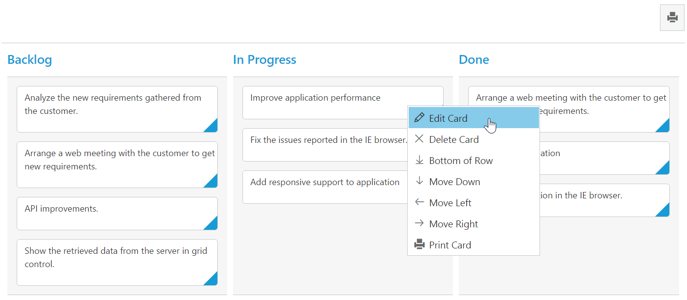

# Context Menu  

Context menu is used to improve user action with Kanban using popup menu. It can be shown by defining ['enable`](https://help.syncfusion.com/api/js/ejkanban#members:contextmenusettings-enable) as true. Context menu has option to add default items in [`menuItems`](https://help.syncfusion.com/api/js/ejkanban#members:contextmenusettings-menuitems) and customized items in [`customMenuItems`](https://help.syncfusion.com/api/js/ejkanban#members:contextmenusettings-custommenuitems).

## Default Context Menu items

Please find the below table for default context menu items and its actions.

<table>
        <tr>
            <th>
                Section 
            </th>
            <th>
               Context menu items 
            </th>
            <th>
                Action
            </th>
        </tr>
        <tr>
            <td rowspan="2">
                Header 
            </td>
            <td>
                Hide Column
            </td>
            <td>
               Hide the current column 
            </td>
        </tr>
        <tr>
            <td>
                Visible Columns
            </td>
            <td>
                Show the column if already hidden 
            </td>
        </tr>
       <tr>
            <td>
                Content
            </td>
            <td>
                Add Card 
            </td>
             <td>
                Start Add new card 
            </td>
        </tr>
        <tr>
            <td rowspan="10">
                Card
            </td>
            <td>
               Edit Card 
            </td>
            <td>
               Start Edit in current card 
            </td>
        </tr>
        <tr>
            <td>
               Delete Card 
            </td>
            <td>
                Delete the current card 
            </td>
        </tr>
        <tr>
            <td>
                Top of Row
            </td>
            <td>
                Move the card to Top of Row
            </td>
        </tr>
        <tr>
            <td>
               Bottom of Row
            </td>
            <td>
                Move the card to Bottom of Row
            </td>
        </tr>
        <tr>
            <td>
               Move Up
            </td>
            <td>
                Move the card in Up direction 
            </td>
        </tr>
        <tr>
            <td>
               Move Down
            </td>
            <td>
               Move the card in Down direction
            </td>
        </tr>
        <tr>
            <td>
                Move Left
            </td>
            <td>
                Move the card in Left direction
            </td>
        </tr>
        <tr>
            <td>
               Move Right
            </td>
            <td>
                Move the card in Right direction
            </td>
        </tr>
        <tr>
            <td>
              Move to Swimlane
            </td>
            <td>
                Move the card to Swim lane which is chosen from given list
            </td>
        </tr>
         <tr>
            <td>
              Print Card
            </td>
            <td>
                Print the specific card
            </td>
        </tr>
    </table>

    
The following code example describes the above behavior.



<template>
    

        <ej-kanban id="Kanban" e-data-source.bind="KanbanData" e-key-field="Status" e-fields.bind="Field" e-context-menu-settings.bind="contextMenuSettings">
            <ej-kanban-column e-header-text="Backlog" e-key="Open"></ej-kanban-column>
            <ej-kanban-column e-header-text="In Progress" e-key="InProgress"></ej-kanban-column>
            <ej-kanban-column e-header-text="Testing" e-key="Testing"></ej-kanban-column>
            <ej-kanban-column e-header-text="Done" e-key="Close"></ej-kanban-column>
        </ej-kanban>
    

</template>





export class Kanban {
    constructor() {
        this.KanbanData = [
           { Id: 1, Status: "Open", Summary: "Analyze the new requirements gathered from the customer.", Type: "Story", Priority: "Low", Tags: "Analyze,Customer", Estimate: 3.5, Assignee: "Nancy", ImageUrl: "/images/kanban/1.png", RankId: 1 },
           { Id: 2, Status: "InProgress", Summary: "Improve application performance", Type: "Improvement", Priority: "Normal", Tags: "Improvement", Estimate: 6, Assignee: "Andrew Fuller", ImageUrl: "/images/kanban/2.png", RankId: 1 },
           { Id: 3, Status: "Open", Summary: "Arrange a web meeting with the customer to get new requirements.", Type: "Others", Priority: "Critical", Tags: "Meeting", Estimate: 5.5, Assignee: "Janet Leverling", ImageUrl: "/images/kanban/3.png", RankId: 2 },
           { Id: 4, Status: "InProgress", Summary: "Fix the issues reported in the IE browser.", Type: "Bug", Priority: "Release Breaker", Tags: "IE", Estimate: 2.5, Assignee: "Janet Leverling", ImageUrl: "/images/kanban/3.png", RankId: 2 },
           { Id: 5, Status: "Testing", Summary: "Fix the issues reported by the customer.", Type: "Bug", Priority: "Low", Tags: "Customer", Estimate: "3.5", Assignee: "Steven walker", ImageUrl:"/images/kanban/5.png", RankId: 1 },
           { Id: 6, Status: "Close", Summary: "Arrange a web meeting with the customer to get the login page requirements.", Type: "Others", Priority: "Low", Tags: "Meeting", Estimate: 2, Assignee: "Michael Suyama", ImageUrl: "/images/kanban/6.png", RankId: 1 },
           { Id: 7, Status: "Validate", Summary: "Validate new requirements", Type: "Improvement", Priority: "Low", Tags: "Validation", Estimate: 1.5, Assignee: "Robert King", ImageUrl: "/images/kanban/7.png", RankId: 1 },
           { Id: 8, Status: "Close", Summary: "Login page validation", Type: "Story", Priority: "Release Breaker", Tags: "Validation,Fix", Estimate: 2.5, Assignee: "Laura Callahan", ImageUrl: "/images/kanban/8.png", RankId: 2 },
           { Id: 9, Status: "Testing", Summary: "Fix the issues reported in Safari browser.", Type: "Bug", Priority: "Release Breaker", Tags: "Fix,Safari", Estimate: 1.5, Assignee: "Nancy", ImageUrl: "/images/kanban/1.png", RankId: 2 },
           { Id: 10, Status: "Close", Summary: "Test the application in the IE browser.", Type: "Story", Priority: "Low", Tags: "Testing,IE", Estimate: 5.5, Assignee: "Margaret", ImageUrl: "/images/kanban/4.png", RankId: 3 },
           { Id: 11, Status: "Validate", Summary: "Validate the issues reported by the customer.", Type: "Story", Priority: "High", Tags: "Validation,Fix", Estimate: 1, Assignee: "Steven walker", ImageUrl: "/images/kanban/5.png", RankId: 1 },
           { Id: 12, Status: "Testing", Summary: "Check Login page validation.", Type: "Story", Priority: "Release Breaker", Tags: "Testing", Estimate: 0.5, Assignee: "Michael Suyama", ImageUrl: "/images/kanban/6.png", RankId: 3 },
           { Id: 13, Status: "Open", Summary: "API improvements.", Type: "Improvement", Priority: "High", Tags: "Grid,API", Estimate: 3.5, Assignee: "Robert King", ImageUrl: "/images/kanban/7.png", RankId: 3 },
           { Id: 14, Status: "InProgress", Summary: "Add responsive support to application", Type: "Epic", Priority: "Critical", Tags: "Responsive", Estimate: 6, Assignee: "Laura Callahan", ImageUrl: "/images/kanban/8.png", RankId: 3 },
           { Id: 15, Status: "Open", Summary: "Show the retrieved data from the server in grid control.", Type: "Story", Priority: "High", Tags: "Database,SQL", Estimate: 5.5, Assignee: "Margaret", ImageUrl: "/images/kanban/4.png", RankId: 4 },
           { Id: 16, Status: "InProgress", Summary: "Fix cannot open user’s default database SQL error.", Priority: "Critical", Type: "Bug", Tags: "Database,Sql2008", Estimate: 2.5, Assignee: "Janet Leverling", ImageUrl: "/images/kanban/3.png", RankId: 4 },
           { Id: 17, Status: "Testing", Summary: "Fix the issues reported in data binding.", Type: "Story", Priority: "Normal", Tags: "DataBinding", Estimate: "3.5", Assignee: "Janet Leverling", ImageUrl: "/images/kanban/3.png", RankId: 4 },
           { Id: 18, Status: "Close", Summary: "Analyze SQL server 2008 connection.", Type: "Story", Priority: "Release Breaker", Tags: "Grid,Sql", Estimate: 2, Assignee: "Andrew Fuller", ImageUrl: "/images/kanban/2.png", RankId: 4 },
           { Id: 19, Status: "Validate", Summary: "Validate dataBinding issues.", Type: "Story", Priority: "Low", Tags: "Validation", Estimate: 1.5, Assignee: "Margaret", ImageUrl: "/images/kanban/4.png", RankId: 1 },
           { Id: 20, Status: "Close", Summary: "Analyze grid control.", Type: "Story", Priority: "High", Tags: "Analyze", Estimate: 2.5, Assignee: "Margaret", ImageUrl: "/images/kanban/4.png", RankId: 5 }];
        this.Field = { primaryKey: 'Id', content: 'Summary'};
    }
}



The following output is displayed as a result of the above code example.

