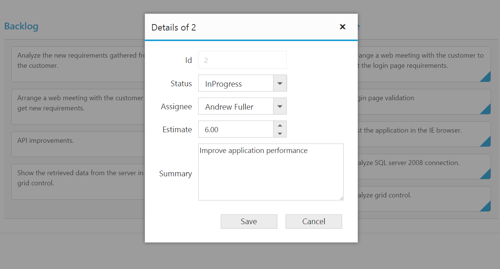
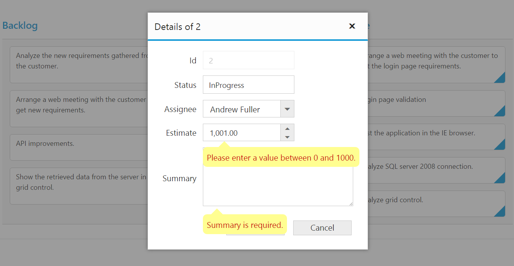

# Editing

The Kanban control has support for dynamic insertion, updating and deletion of cards. 

Set [`allowEditing`](https://help.syncfusion.com/api/js/ejkanban#members:editsettings-allowediting) and [`allowAdding`](https://help.syncfusion.com/api/js/ejkanban#members:editsettings-allowadding) property as true to enable editing/inserting respectively. The primary key for the data source should be defined in [`primaryKey`](https://help.syncfusion.com/api/js/ejkanban#members:primarykey), for editing to work properly. 

You can start the edit action by double clicking the particular card. Similarly, you can add new card to Kanban either by double clicking the particular cell or on an external button which is bound to call [`addCard`](https://help.syncfusion.com/api/js/ejkanban#methods:kanbanedit-addcard) method of Kanban. 

Deletion of the card is possible by using [`deleteCard`](https://help.syncfusion.com/api/js/ejkanban#methods:kanbanedit-deletecard) by passing primary key as attribute.

N> In Kanban, the `primary key` column will be automatically set to `read only` while editing the card which is to avoid duplicate entry in the cards.

## Configuring Edit Items

You need to configure the list of data source fields that are allowable in editing state using [`editItems`](https://help.syncfusion.com/api/js/ejkanban#members:editsettings-edititems) property. The [`field`](https://help.syncfusion.com/api/js/ejkanban#members:editsettings-edititems-field) property of [`editItems`](https://help.syncfusion.com/api/js/ejkanban#members:editsettings-edititems) needs to be mapped with data source fields.

You can map the data source field as title to edit form using [`title`](https://help.syncfusion.com/api/js/ejkanban#members:fields-title) property of `fields`. By default, it’s mapped with `primaryKey`.

The following code example describes the above behavior.



<template>
  

     <ej-kanban id="Kanban" e-data-source.bind="KanbanData" e-key-field="Status" e-fields.bind="Field" e-edit-settings.bind="editSettings">
       <ej-kanban-column  e-header-text="Backlog" e-key="Open"></ej-kanban-column>
	   <ej-kanban-column  e-header-text="In Progress" e-key="InProgress"></ej-kanban-column>
	   <ej-kanban-column  e-header-text="Done" e-key="Close"></ej-kanban-column>
     </ej-kanban>
  

</template>





export class Kanban {
    constructor() {
        this.KanbanData = [
           { Id: 1, Status: "Open", Summary: "Analyze the new requirements gathered from the customer.", Type: "Story", Priority: "Low", Tags: "Analyze,Customer", Estimate: 3.5, Assignee: "Nancy", ImageUrl: "/images/kanban/1.png", RankId: 1 },
           { Id: 2, Status: "InProgress", Summary: "Improve application performance", Type: "Improvement", Priority: "Normal", Tags: "Improvement", Estimate: 6, Assignee: "Andrew Fuller", ImageUrl: "/images/kanban/2.png", RankId: 1 },
           { Id: 3, Status: "Open", Summary: "Arrange a web meeting with the customer to get new requirements.", Type: "Others", Priority: "Critical", Tags: "Meeting", Estimate: 5.5, Assignee: "Janet Leverling", ImageUrl: "/images/kanban/3.png", RankId: 2 },
           { Id: 4, Status: "InProgress", Summary: "Fix the issues reported in the IE browser.", Type: "Bug", Priority: "Release Breaker", Tags: "IE", Estimate: 2.5, Assignee: "Janet Leverling", ImageUrl: "/images/kanban/3.png", RankId: 2 },
           { Id: 5, Status: "Testing", Summary: "Fix the issues reported by the customer.", Type: "Bug", Priority: "Low", Tags: "Customer", Estimate: "3.5", Assignee: "Steven walker", ImageUrl:"/images/kanban/5.png", RankId: 1 },
           { Id: 6, Status: "Close", Summary: "Arrange a web meeting with the customer to get the login page requirements.", Type: "Others", Priority: "Low", Tags: "Meeting", Estimate: 2, Assignee: "Michael Suyama", ImageUrl: "/images/kanban/6.png", RankId: 1 },
           { Id: 7, Status: "Validate", Summary: "Validate new requirements", Type: "Improvement", Priority: "Low", Tags: "Validation", Estimate: 1.5, Assignee: "Robert King", ImageUrl: "/images/kanban/7.png", RankId: 1 },
           { Id: 8, Status: "Close", Summary: "Login page validation", Type: "Story", Priority: "Release Breaker", Tags: "Validation,Fix", Estimate: 2.5, Assignee: "Laura Callahan", ImageUrl: "/images/kanban/8.png", RankId: 2 },
           { Id: 9, Status: "Testing", Summary: "Fix the issues reported in Safari browser.", Type: "Bug", Priority: "Release Breaker", Tags: "Fix,Safari", Estimate: 1.5, Assignee: "Nancy", ImageUrl: "/images/kanban/1.png", RankId: 2 },
           { Id: 10, Status: "Close", Summary: "Test the application in the IE browser.", Type: "Story", Priority: "Low", Tags: "Testing,IE", Estimate: 5.5, Assignee: "Margaret", ImageUrl: "/images/kanban/4.png", RankId: 3 },
           { Id: 11, Status: "Validate", Summary: "Validate the issues reported by the customer.", Type: "Story", Priority: "High", Tags: "Validation,Fix", Estimate: 1, Assignee: "Steven walker", ImageUrl: "/images/kanban/5.png", RankId: 1 },
           { Id: 12, Status: "Testing", Summary: "Check Login page validation.", Type: "Story", Priority: "Release Breaker", Tags: "Testing", Estimate: 0.5, Assignee: "Michael Suyama", ImageUrl: "/images/kanban/6.png", RankId: 3 },
           { Id: 13, Status: "Open", Summary: "API improvements.", Type: "Improvement", Priority: "High", Tags: "Grid,API", Estimate: 3.5, Assignee: "Robert King", ImageUrl: "/images/kanban/7.png", RankId: 3 },
           { Id: 14, Status: "InProgress", Summary: "Add responsive support to application", Type: "Epic", Priority: "Critical", Tags: "Responsive", Estimate: 6, Assignee: "Laura Callahan", ImageUrl: "/images/kanban/8.png", RankId: 3 },
           { Id: 15, Status: "Open", Summary: "Show the retrieved data from the server in grid control.", Type: "Story", Priority: "High", Tags: "Database,SQL", Estimate: 5.5, Assignee: "Margaret", ImageUrl: "/images/kanban/4.png", RankId: 4 },
           { Id: 16, Status: "InProgress", Summary: "Fix cannot open user’s default database SQL error.", Priority: "Critical", Type: "Bug", Tags: "Database,Sql2008", Estimate: 2.5, Assignee: "Janet Leverling", ImageUrl: "/images/kanban/3.png", RankId: 4 },
           { Id: 17, Status: "Testing", Summary: "Fix the issues reported in data binding.", Type: "Story", Priority: "Normal", Tags: "DataBinding", Estimate: "3.5", Assignee: "Janet Leverling", ImageUrl: "/images/kanban/3.png", RankId: 4 },
           { Id: 18, Status: "Close", Summary: "Analyze SQL server 2008 connection.", Type: "Story", Priority: "Release Breaker", Tags: "Grid,Sql", Estimate: 2, Assignee: "Andrew Fuller", ImageUrl: "/images/kanban/2.png", RankId: 4 },
           { Id: 19, Status: "Validate", Summary: "Validate dataBinding issues.", Type: "Story", Priority: "Low", Tags: "Validation", Estimate: 1.5, Assignee: "Margaret", ImageUrl: "/images/kanban/4.png", RankId: 1 },
           { Id: 20, Status: "Close", Summary: "Analyze grid control.", Type: "Story", Priority: "High", Tags: "Analyze", Estimate: 2.5, Assignee: "Margaret", ImageUrl: "/images/kanban/4.png", RankId: 5 }];
        this.Field = { primaryKey: 'Id', content: 'Summary'};
        this.editSettings = {
            editItems: [
                { field: "Id" },
                { field: "Status", editType: ej.Kanban.EditingType.Dropdown },
                { field: "Assignee", editType: ej.Kanban.EditingType.Dropdown },
                { field: "Estimate", editType: ej.Kanban.EditingType.Numeric, editParams: { decimalPlaces: 2 } },
                { field: "Summary", editType: ej.Kanban.EditingType.TextArea, editParams: {height:100,width:200}}
            ],
            allowEditing: true,
            allowAdding: true
        };
    }
}



The following output is displayed as a result of the above code example.

## Edit modes

### Dialog

Set [`editMode`](https://help.syncfusion.com/api/js/ejkanban#members:editsettings-editmode) as `dialog` to edit data using a dialog box, which displays the fields associated with the data card being edited. Default value is `dialog`.

N> For [`editMode`](https://help.syncfusion.com/api/js/ejkanban#members:editsettings-editmode) property you can assign either `string` value (“dialog”) or `enum` value (`ej.Kanban.EditMode.Dialog`).

The following code example describes the above behavior.



<template>
  

     <ej-kanban id="Kanban" e-data-source.bind="KanbanData" e-key-field="Status" e-fields.bind="Field" e-edit-settings.bind="editSettings">
       <ej-kanban-column  e-header-text="Backlog" e-key="Open"></ej-kanban-column>
	   <ej-kanban-column  e-header-text="In Progress" e-key="InProgress"></ej-kanban-column>
	   <ej-kanban-column  e-header-text="Done" e-key="Close"></ej-kanban-column>
     </ej-kanban>
  

</template>





export class Kanban {
    constructor() {
        this.KanbanData = [
           { Id: 1, Status: "Open", Summary: "Analyze the new requirements gathered from the customer.", Type: "Story", Priority: "Low", Tags: "Analyze,Customer", Estimate: 3.5, Assignee: "Nancy", ImageUrl: "/images/kanban/1.png", RankId: 1 },
           { Id: 2, Status: "InProgress", Summary: "Improve application performance", Type: "Improvement", Priority: "Normal", Tags: "Improvement", Estimate: 6, Assignee: "Andrew Fuller", ImageUrl: "/images/kanban/2.png", RankId: 1 },
           { Id: 3, Status: "Open", Summary: "Arrange a web meeting with the customer to get new requirements.", Type: "Others", Priority: "Critical", Tags: "Meeting", Estimate: 5.5, Assignee: "Janet Leverling", ImageUrl: "/images/kanban/3.png", RankId: 2 },
           { Id: 4, Status: "InProgress", Summary: "Fix the issues reported in the IE browser.", Type: "Bug", Priority: "Release Breaker", Tags: "IE", Estimate: 2.5, Assignee: "Janet Leverling", ImageUrl: "/images/kanban/3.png", RankId: 2 },
           { Id: 5, Status: "Testing", Summary: "Fix the issues reported by the customer.", Type: "Bug", Priority: "Low", Tags: "Customer", Estimate: "3.5", Assignee: "Steven walker", ImageUrl:"/images/kanban/5.png", RankId: 1 },
           { Id: 6, Status: "Close", Summary: "Arrange a web meeting with the customer to get the login page requirements.", Type: "Others", Priority: "Low", Tags: "Meeting", Estimate: 2, Assignee: "Michael Suyama", ImageUrl: "/images/kanban/6.png", RankId: 1 },
           { Id: 7, Status: "Validate", Summary: "Validate new requirements", Type: "Improvement", Priority: "Low", Tags: "Validation", Estimate: 1.5, Assignee: "Robert King", ImageUrl: "/images/kanban/7.png", RankId: 1 },
           { Id: 8, Status: "Close", Summary: "Login page validation", Type: "Story", Priority: "Release Breaker", Tags: "Validation,Fix", Estimate: 2.5, Assignee: "Laura Callahan", ImageUrl: "/images/kanban/8.png", RankId: 2 },
           { Id: 9, Status: "Testing", Summary: "Fix the issues reported in Safari browser.", Type: "Bug", Priority: "Release Breaker", Tags: "Fix,Safari", Estimate: 1.5, Assignee: "Nancy", ImageUrl: "/images/kanban/1.png", RankId: 2 },
           { Id: 10, Status: "Close", Summary: "Test the application in the IE browser.", Type: "Story", Priority: "Low", Tags: "Testing,IE", Estimate: 5.5, Assignee: "Margaret", ImageUrl: "/images/kanban/4.png", RankId: 3 },
           { Id: 11, Status: "Validate", Summary: "Validate the issues reported by the customer.", Type: "Story", Priority: "High", Tags: "Validation,Fix", Estimate: 1, Assignee: "Steven walker", ImageUrl: "/images/kanban/5.png", RankId: 1 },
           { Id: 12, Status: "Testing", Summary: "Check Login page validation.", Type: "Story", Priority: "Release Breaker", Tags: "Testing", Estimate: 0.5, Assignee: "Michael Suyama", ImageUrl: "/images/kanban/6.png", RankId: 3 },
           { Id: 13, Status: "Open", Summary: "API improvements.", Type: "Improvement", Priority: "High", Tags: "Grid,API", Estimate: 3.5, Assignee: "Robert King", ImageUrl: "/images/kanban/7.png", RankId: 3 },
           { Id: 14, Status: "InProgress", Summary: "Add responsive support to application", Type: "Epic", Priority: "Critical", Tags: "Responsive", Estimate: 6, Assignee: "Laura Callahan", ImageUrl: "/images/kanban/8.png", RankId: 3 },
           { Id: 15, Status: "Open", Summary: "Show the retrieved data from the server in grid control.", Type: "Story", Priority: "High", Tags: "Database,SQL", Estimate: 5.5, Assignee: "Margaret", ImageUrl: "/images/kanban/4.png", RankId: 4 },
           { Id: 16, Status: "InProgress", Summary: "Fix cannot open user’s default database SQL error.", Priority: "Critical", Type: "Bug", Tags: "Database,Sql2008", Estimate: 2.5, Assignee: "Janet Leverling", ImageUrl: "/images/kanban/3.png", RankId: 4 },
           { Id: 17, Status: "Testing", Summary: "Fix the issues reported in data binding.", Type: "Story", Priority: "Normal", Tags: "DataBinding", Estimate: "3.5", Assignee: "Janet Leverling", ImageUrl: "/images/kanban/3.png", RankId: 4 },
           { Id: 18, Status: "Close", Summary: "Analyze SQL server 2008 connection.", Type: "Story", Priority: "Release Breaker", Tags: "Grid,Sql", Estimate: 2, Assignee: "Andrew Fuller", ImageUrl: "/images/kanban/2.png", RankId: 4 },
           { Id: 19, Status: "Validate", Summary: "Validate dataBinding issues.", Type: "Story", Priority: "Low", Tags: "Validation", Estimate: 1.5, Assignee: "Margaret", ImageUrl: "/images/kanban/4.png", RankId: 1 },
           { Id: 20, Status: "Close", Summary: "Analyze grid control.", Type: "Story", Priority: "High", Tags: "Analyze", Estimate: 2.5, Assignee: "Margaret", ImageUrl: "/images/kanban/4.png", RankId: 5 }];
        this.Field = { primaryKey: 'Id', content: 'Summary'};
        this.editSettings = {
            editItems: [
                    { field: "Id" },
                    { field: "Status", editType: ej.Kanban.EditingType.Dropdown },
                    { field: "Assignee", editType: ej.Kanban.EditingType.Dropdown },
                    { field: "Estimate", editType: ej.Kanban.EditingType.Numeric, editParams: { decimalPlaces: 2 } },
                    { field: "Summary", editType: ej.Kanban.EditingType.TextArea }
            ],
            allowEditing: true,
            allowAdding: true
        };
    }
}



The following output is displayed as a result of the above code example.

### External Form

Set the [`editMode`](https://help.syncfusion.com/api/js/ejkanban#members:editsettings-editmode) as `ExternalForm` to open the edit form in outside kanban content.

The following code example describes the above behavior.



<template>
  

     <ej-kanban id="Kanban" e-data-source.bind="KanbanData" e-key-field="Status" e-fields.bind="Field" e-edit-settings.bind="editSettings" e-allow-title="true" e-scroll-settings.bind="scrollSettings" e-allow-scrolling="true">
       <ej-kanban-column  e-header-text="Backlog" e-key="Open"></ej-kanban-column>
	   <ej-kanban-column  e-header-text="In Progress" e-key="InProgress"></ej-kanban-column>
	   <ej-kanban-column  e-header-text="Done" e-key="Close"></ej-kanban-column>
     </ej-kanban>
  

</template>





export class Kanban {
    constructor() {
        this.KanbanData = [
           { Id: 1, Status: "Open", Summary: "Analyze the new requirements gathered from the customer.", Type: "Story", Priority: "Low", Tags: "Analyze,Customer", Estimate: 3.5, Assignee: "Nancy", ImageUrl: "/images/kanban/1.png", RankId: 1 },
           { Id: 2, Status: "InProgress", Summary: "Improve application performance", Type: "Improvement", Priority: "Normal", Tags: "Improvement", Estimate: 6, Assignee: "Andrew Fuller", ImageUrl: "/images/kanban/2.png", RankId: 1 },
           { Id: 3, Status: "Open", Summary: "Arrange a web meeting with the customer to get new requirements.", Type: "Others", Priority: "Critical", Tags: "Meeting", Estimate: 5.5, Assignee: "Janet Leverling", ImageUrl: "/images/kanban/3.png", RankId: 2 },
           { Id: 4, Status: "InProgress", Summary: "Fix the issues reported in the IE browser.", Type: "Bug", Priority: "Release Breaker", Tags: "IE", Estimate: 2.5, Assignee: "Janet Leverling", ImageUrl: "/images/kanban/3.png", RankId: 2 },
           { Id: 5, Status: "Testing", Summary: "Fix the issues reported by the customer.", Type: "Bug", Priority: "Low", Tags: "Customer", Estimate: "3.5", Assignee: "Steven walker", ImageUrl:"/images/kanban/5.png", RankId: 1 },
           { Id: 6, Status: "Close", Summary: "Arrange a web meeting with the customer to get the login page requirements.", Type: "Others", Priority: "Low", Tags: "Meeting", Estimate: 2, Assignee: "Michael Suyama", ImageUrl: "/images/kanban/6.png", RankId: 1 },
           { Id: 7, Status: "Validate", Summary: "Validate new requirements", Type: "Improvement", Priority: "Low", Tags: "Validation", Estimate: 1.5, Assignee: "Robert King", ImageUrl: "/images/kanban/7.png", RankId: 1 },
           { Id: 8, Status: "Close", Summary: "Login page validation", Type: "Story", Priority: "Release Breaker", Tags: "Validation,Fix", Estimate: 2.5, Assignee: "Laura Callahan", ImageUrl: "/images/kanban/8.png", RankId: 2 },
           { Id: 9, Status: "Testing", Summary: "Fix the issues reported in Safari browser.", Type: "Bug", Priority: "Release Breaker", Tags: "Fix,Safari", Estimate: 1.5, Assignee: "Nancy", ImageUrl: "/images/kanban/1.png", RankId: 2 },
           { Id: 10, Status: "Close", Summary: "Test the application in the IE browser.", Type: "Story", Priority: "Low", Tags: "Testing,IE", Estimate: 5.5, Assignee: "Margaret", ImageUrl: "/images/kanban/4.png", RankId: 3 },
           { Id: 11, Status: "Validate", Summary: "Validate the issues reported by the customer.", Type: "Story", Priority: "High", Tags: "Validation,Fix", Estimate: 1, Assignee: "Steven walker", ImageUrl: "/images/kanban/5.png", RankId: 1 },
           { Id: 12, Status: "Testing", Summary: "Check Login page validation.", Type: "Story", Priority: "Release Breaker", Tags: "Testing", Estimate: 0.5, Assignee: "Michael Suyama", ImageUrl: "/images/kanban/6.png", RankId: 3 },
           { Id: 13, Status: "Open", Summary: "API improvements.", Type: "Improvement", Priority: "High", Tags: "Grid,API", Estimate: 3.5, Assignee: "Robert King", ImageUrl: "/images/kanban/7.png", RankId: 3 },
           { Id: 14, Status: "InProgress", Summary: "Add responsive support to application", Type: "Epic", Priority: "Critical", Tags: "Responsive", Estimate: 6, Assignee: "Laura Callahan", ImageUrl: "/images/kanban/8.png", RankId: 3 },
           { Id: 15, Status: "Open", Summary: "Show the retrieved data from the server in grid control.", Type: "Story", Priority: "High", Tags: "Database,SQL", Estimate: 5.5, Assignee: "Margaret", ImageUrl: "/images/kanban/4.png", RankId: 4 },
           { Id: 16, Status: "InProgress", Summary: "Fix cannot open user’s default database SQL error.", Priority: "Critical", Type: "Bug", Tags: "Database,Sql2008", Estimate: 2.5, Assignee: "Janet Leverling", ImageUrl: "/images/kanban/3.png", RankId: 4 },
           { Id: 17, Status: "Testing", Summary: "Fix the issues reported in data binding.", Type: "Story", Priority: "Normal", Tags: "DataBinding", Estimate: "3.5", Assignee: "Janet Leverling", ImageUrl: "/images/kanban/3.png", RankId: 4 },
           { Id: 18, Status: "Close", Summary: "Analyze SQL server 2008 connection.", Type: "Story", Priority: "Release Breaker", Tags: "Grid,Sql", Estimate: 2, Assignee: "Andrew Fuller", ImageUrl: "/images/kanban/2.png", RankId: 4 },
           { Id: 19, Status: "Validate", Summary: "Validate dataBinding issues.", Type: "Story", Priority: "Low", Tags: "Validation", Estimate: 1.5, Assignee: "Margaret", ImageUrl: "/images/kanban/4.png", RankId: 1 },
           { Id: 20, Status: "Close", Summary: "Analyze grid control.", Type: "Story", Priority: "High", Tags: "Analyze", Estimate: 2.5, Assignee: "Margaret", ImageUrl: "/images/kanban/4.png", RankId: 5 }];
        this.Field = { primaryKey: 'Id', content: 'Summary'};
        this.editSettings = {
        editMode: ej.Kanban.EditMode.ExternalForm,
        editItems: [
                    { field: "Id", editType: ej.Kanban.EditingType.String,validationRules: { required: true, number: true }},
                    { field: "Status", editType: ej.Kanban.EditingType.Dropdown },
                    { field: "Summary", editType: ej.Kanban.EditingType.TextArea,validationRules: { required: true}},
        ],
        allowEditing: true,
        allowAdding: true
        };
        this.scrollSettings ={
            height:500,
            width:700,
        };
    }
};



The following output is displayed as a result of the above code example.

Form Position:

Form Position can be customized by setting the [`formPosition`](https://help.syncfusion.com/api/js/ejkanban#members:editsettings-formposition) property of [`e-edit-settings.bind'](https://help.syncfusion.com/api/js/ejkanban#members:editsettings) as "right" or "bottom".

The following code example describes the above behavior.



<template>
  

     <ej-kanban id="Kanban" e-data-source.bind="KanbanData" e-key-field="Status" e-fields.bind="Field" e-edit-settings.bind="editSettings" e-allow-title="true" e-scroll-settings.bind="scrollSettings" e-allow-scrolling="true">
       <ej-kanban-column  e-header-text="Backlog" e-key="Open"></ej-kanban-column>
	   <ej-kanban-column  e-header-text="In Progress" e-key="InProgress"></ej-kanban-column>
	   <ej-kanban-column  e-header-text="Done" e-key="Close"></ej-kanban-column>
     </ej-kanban>
  

</template>





export class Kanban {
    constructor() {
        this.KanbanData = [
           { Id: 1, Status: "Open", Summary: "Analyze the new requirements gathered from the customer.", Type: "Story", Priority: "Low", Tags: "Analyze,Customer", Estimate: 3.5, Assignee: "Nancy", ImageUrl: "/images/kanban/1.png", RankId: 1 },
           { Id: 2, Status: "InProgress", Summary: "Improve application performance", Type: "Improvement", Priority: "Normal", Tags: "Improvement", Estimate: 6, Assignee: "Andrew Fuller", ImageUrl: "/images/kanban/2.png", RankId: 1 },
           { Id: 3, Status: "Open", Summary: "Arrange a web meeting with the customer to get new requirements.", Type: "Others", Priority: "Critical", Tags: "Meeting", Estimate: 5.5, Assignee: "Janet Leverling", ImageUrl: "/images/kanban/3.png", RankId: 2 },
           { Id: 4, Status: "InProgress", Summary: "Fix the issues reported in the IE browser.", Type: "Bug", Priority: "Release Breaker", Tags: "IE", Estimate: 2.5, Assignee: "Janet Leverling", ImageUrl: "/images/kanban/3.png", RankId: 2 },
           { Id: 5, Status: "Testing", Summary: "Fix the issues reported by the customer.", Type: "Bug", Priority: "Low", Tags: "Customer", Estimate: "3.5", Assignee: "Steven walker", ImageUrl:"/images/kanban/5.png", RankId: 1 },
           { Id: 6, Status: "Close", Summary: "Arrange a web meeting with the customer to get the login page requirements.", Type: "Others", Priority: "Low", Tags: "Meeting", Estimate: 2, Assignee: "Michael Suyama", ImageUrl: "/images/kanban/6.png", RankId: 1 },
           { Id: 7, Status: "Validate", Summary: "Validate new requirements", Type: "Improvement", Priority: "Low", Tags: "Validation", Estimate: 1.5, Assignee: "Robert King", ImageUrl: "/images/kanban/7.png", RankId: 1 },
           { Id: 8, Status: "Close", Summary: "Login page validation", Type: "Story", Priority: "Release Breaker", Tags: "Validation,Fix", Estimate: 2.5, Assignee: "Laura Callahan", ImageUrl: "/images/kanban/8.png", RankId: 2 },
           { Id: 9, Status: "Testing", Summary: "Fix the issues reported in Safari browser.", Type: "Bug", Priority: "Release Breaker", Tags: "Fix,Safari", Estimate: 1.5, Assignee: "Nancy", ImageUrl: "/images/kanban/1.png", RankId: 2 },
           { Id: 10, Status: "Close", Summary: "Test the application in the IE browser.", Type: "Story", Priority: "Low", Tags: "Testing,IE", Estimate: 5.5, Assignee: "Margaret", ImageUrl: "/images/kanban/4.png", RankId: 3 },
           { Id: 11, Status: "Validate", Summary: "Validate the issues reported by the customer.", Type: "Story", Priority: "High", Tags: "Validation,Fix", Estimate: 1, Assignee: "Steven walker", ImageUrl: "/images/kanban/5.png", RankId: 1 },
           { Id: 12, Status: "Testing", Summary: "Check Login page validation.", Type: "Story", Priority: "Release Breaker", Tags: "Testing", Estimate: 0.5, Assignee: "Michael Suyama", ImageUrl: "/images/kanban/6.png", RankId: 3 },
           { Id: 13, Status: "Open", Summary: "API improvements.", Type: "Improvement", Priority: "High", Tags: "Grid,API", Estimate: 3.5, Assignee: "Robert King", ImageUrl: "/images/kanban/7.png", RankId: 3 },
           { Id: 14, Status: "InProgress", Summary: "Add responsive support to application", Type: "Epic", Priority: "Critical", Tags: "Responsive", Estimate: 6, Assignee: "Laura Callahan", ImageUrl: "/images/kanban/8.png", RankId: 3 },
           { Id: 15, Status: "Open", Summary: "Show the retrieved data from the server in grid control.", Type: "Story", Priority: "High", Tags: "Database,SQL", Estimate: 5.5, Assignee: "Margaret", ImageUrl: "/images/kanban/4.png", RankId: 4 },
           { Id: 16, Status: "InProgress", Summary: "Fix cannot open user’s default database SQL error.", Priority: "Critical", Type: "Bug", Tags: "Database,Sql2008", Estimate: 2.5, Assignee: "Janet Leverling", ImageUrl: "/images/kanban/3.png", RankId: 4 },
           { Id: 17, Status: "Testing", Summary: "Fix the issues reported in data binding.", Type: "Story", Priority: "Normal", Tags: "DataBinding", Estimate: "3.5", Assignee: "Janet Leverling", ImageUrl: "/images/kanban/3.png", RankId: 4 },
           { Id: 18, Status: "Close", Summary: "Analyze SQL server 2008 connection.", Type: "Story", Priority: "Release Breaker", Tags: "Grid,Sql", Estimate: 2, Assignee: "Andrew Fuller", ImageUrl: "/images/kanban/2.png", RankId: 4 },
           { Id: 19, Status: "Validate", Summary: "Validate dataBinding issues.", Type: "Story", Priority: "Low", Tags: "Validation", Estimate: 1.5, Assignee: "Margaret", ImageUrl: "/images/kanban/4.png", RankId: 1 },
           { Id: 20, Status: "Close", Summary: "Analyze grid control.", Type: "Story", Priority: "High", Tags: "Analyze", Estimate: 2.5, Assignee: "Margaret", ImageUrl: "/images/kanban/4.png", RankId: 5 }];
        this.Field = { primaryKey: 'Id', content: 'Summary'};
        this.editSettings = {
            editMode:ej.Kanban.EditMode.ExternalForm,
            formPosition: ej.Kanban.FormPosition.Bottom,
            editItems: [
                 { field: "Id", editType: ej.Kanban.EditingType.String,validationRules: { required: true, number: true }},
                 { field: "Status", editType: ej.Kanban.EditingType.Dropdown },
                 { field: "Assignee", editType: ej.Kanban.EditingType.Dropdown },
                 { field: "Estimate", editType: ej.Kanban.EditingType.Numeric, editParams: { decimalPlaces: 2 },validationRules: {range: [0, 1000]}},
                 { field: "Summary", editType: ej.Kanban.EditingType.TextArea,validationRules: { required: true}}
            ],
            allowEditing: true,
            allowAdding: true
        };
        this.scrollSettings ={
            height:250,
            width:700,
        };
    }
}; 
        


The following output is displayed as a result of the above code example.

## Cell edit type and its params

The edit type of bound column can be customized using [`editType`](https://help.syncfusion.com/api/js/ejkanban#members:editsettings-edititems-edittype) property of [`editItems`](https://help.syncfusion.com/api/js/ejkanban#members:editsettings-edititems). The following Essential JavaScript controls are supported built-in by `editType`. And also you can define the model for all the edit types controls while editing through `editParams` property of `editItems`.

The following table describes [`editType`](https://help.syncfusion.com/api/js/ejkanban#members:editsettings-edititems-edittype) and their corresponding [`editParams`](https://help.syncfusion.com/api/js/ejkanban#members:editsettings-edititems-editparams) of the specific data type of the column.

<table>
<tr>
<th>
EditType</th><th>
EditParams</th>
<th>
Description</th>
<th>
Example</th>
</tr>
<tr>
<td>
Numeric</td><td>
{{ '[ejTextBoxes](https://help.syncfusion.com/api/js/ejtextboxes)' | markdownify }} </td>
<td>
control for integers, double, and decimal data’s</td>
<td>
editParams: { decimalPlaces: 2}</td>
</tr>
<tr>
<td>
String</td><td>
HTML Textbox</td>
<td>
HTML Textbox</td>
<td>
-</td>
</tr>
<tr>
<td>
DatePicker </td><td>
{{ '[ejDatePicker](https://help.syncfusion.com/api/js/ejdatepicker)' | markdownify }} </td>
<td>
control for date data</td>
<td>
editParams: { buttonText : "Now" }</td>
</tr>
<tr>
<td>
DateTimePicker </td><td>
{{ '[ejDateTimePicker](https://help.syncfusion.com/api/js/ejdatetimepicker)' | markdownify }} </td>
<td>
control for date data-time data</td>
<td>
editParams: { enabled: true }</td>
</tr>
<tr>
<td>
DropDown </td><td>
{{ '[ejDropDownList](https://help.syncfusion.com/api/js/ejdropdownlist)' | markdownify }} </td>
<td>
control for list of data</td>
<td>
editParams: { allowGrouping: true }</td>
</tr>
<tr>
<td>
RTE </td><td>
{{ '[ejRTE](https://help.syncfusion.com/api/js/ejrte)' | markdownify }} </td>
<td>
control for customizing text in RTE format</td>
<td>
editParams: { allowResize: true }</td>
</tr>
<tr>
<td>
TextArea </td><td>
HTML TextArea</td>
<td>
Control for multi-line plain-text editing</td>
<td>
editParams:{height:100,width:200}</td>
</tr>
</table>

N> 1. If [`editType`](https://help.syncfusion.com/api/js/ejkanban#members:editsettings-edititems-edittype) is not set, then by default it will display HTML textbox while editing a card.
N> 2. For [`editType`](https://help.syncfusion.com/api/js/ejkanban#members:editsettings-edititems-edittype) property you can assign either string value (“numericedit”) or `enum` value (`ej.Kanban.EditingType.Numeric`).

The following code example describes the above behavior.



<template>
  

     <ej-kanban id="Kanban" e-data-source.bind="KanbanData" e-key-field="Status" e-fields.bind="Field" e-edit-settings.bind="editSettings">
       <ej-kanban-column  e-header-text="Backlog" e-key="Open"></ej-kanban-column>
	   <ej-kanban-column  e-header-text="In Progress" e-key="InProgress"></ej-kanban-column>
	   <ej-kanban-column  e-header-text="Done" e-key="Close"></ej-kanban-column>
     </ej-kanban>
  

</template>





export class Kanban {
    constructor() {
        this.KanbanData = [
           { Id: 1, Status: "Open", Summary: "Analyze the new requirements gathered from the customer.", Type: "Story", Priority: "Low", Tags: "Analyze,Customer", Estimate: 3.5, Assignee: "Nancy", ImageUrl: "/images/kanban/1.png", RankId: 1 },
           { Id: 2, Status: "InProgress", Summary: "Improve application performance", Type: "Improvement", Priority: "Normal", Tags: "Improvement", Estimate: 6, Assignee: "Andrew Fuller", ImageUrl: "/images/kanban/2.png", RankId: 1 },
           { Id: 3, Status: "Open", Summary: "Arrange a web meeting with the customer to get new requirements.", Type: "Others", Priority: "Critical", Tags: "Meeting", Estimate: 5.5, Assignee: "Janet Leverling", ImageUrl: "/images/kanban/3.png", RankId: 2 },
           { Id: 4, Status: "InProgress", Summary: "Fix the issues reported in the IE browser.", Type: "Bug", Priority: "Release Breaker", Tags: "IE", Estimate: 2.5, Assignee: "Janet Leverling", ImageUrl: "/images/kanban/3.png", RankId: 2 },
           { Id: 5, Status: "Testing", Summary: "Fix the issues reported by the customer.", Type: "Bug", Priority: "Low", Tags: "Customer", Estimate: "3.5", Assignee: "Steven walker", ImageUrl:"/images/kanban/5.png", RankId: 1 },
           { Id: 6, Status: "Close", Summary: "Arrange a web meeting with the customer to get the login page requirements.", Type: "Others", Priority: "Low", Tags: "Meeting", Estimate: 2, Assignee: "Michael Suyama", ImageUrl: "/images/kanban/6.png", RankId: 1 },
           { Id: 7, Status: "Validate", Summary: "Validate new requirements", Type: "Improvement", Priority: "Low", Tags: "Validation", Estimate: 1.5, Assignee: "Robert King", ImageUrl: "/images/kanban/7.png", RankId: 1 },
           { Id: 8, Status: "Close", Summary: "Login page validation", Type: "Story", Priority: "Release Breaker", Tags: "Validation,Fix", Estimate: 2.5, Assignee: "Laura Callahan", ImageUrl: "/images/kanban/8.png", RankId: 2 },
           { Id: 9, Status: "Testing", Summary: "Fix the issues reported in Safari browser.", Type: "Bug", Priority: "Release Breaker", Tags: "Fix,Safari", Estimate: 1.5, Assignee: "Nancy", ImageUrl: "/images/kanban/1.png", RankId: 2 },
           { Id: 10, Status: "Close", Summary: "Test the application in the IE browser.", Type: "Story", Priority: "Low", Tags: "Testing,IE", Estimate: 5.5, Assignee: "Margaret", ImageUrl: "/images/kanban/4.png", RankId: 3 },
           { Id: 11, Status: "Validate", Summary: "Validate the issues reported by the customer.", Type: "Story", Priority: "High", Tags: "Validation,Fix", Estimate: 1, Assignee: "Steven walker", ImageUrl: "/images/kanban/5.png", RankId: 1 },
           { Id: 12, Status: "Testing", Summary: "Check Login page validation.", Type: "Story", Priority: "Release Breaker", Tags: "Testing", Estimate: 0.5, Assignee: "Michael Suyama", ImageUrl: "/images/kanban/6.png", RankId: 3 },
           { Id: 13, Status: "Open", Summary: "API improvements.", Type: "Improvement", Priority: "High", Tags: "Grid,API", Estimate: 3.5, Assignee: "Robert King", ImageUrl: "/images/kanban/7.png", RankId: 3 },
           { Id: 14, Status: "InProgress", Summary: "Add responsive support to application", Type: "Epic", Priority: "Critical", Tags: "Responsive", Estimate: 6, Assignee: "Laura Callahan", ImageUrl: "/images/kanban/8.png", RankId: 3 },
           { Id: 15, Status: "Open", Summary: "Show the retrieved data from the server in grid control.", Type: "Story", Priority: "High", Tags: "Database,SQL", Estimate: 5.5, Assignee: "Margaret", ImageUrl: "/images/kanban/4.png", RankId: 4 },
           { Id: 16, Status: "InProgress", Summary: "Fix cannot open user’s default database SQL error.", Priority: "Critical", Type: "Bug", Tags: "Database,Sql2008", Estimate: 2.5, Assignee: "Janet Leverling", ImageUrl: "/images/kanban/3.png", RankId: 4 },
           { Id: 17, Status: "Testing", Summary: "Fix the issues reported in data binding.", Type: "Story", Priority: "Normal", Tags: "DataBinding", Estimate: "3.5", Assignee: "Janet Leverling", ImageUrl: "/images/kanban/3.png", RankId: 4 },
           { Id: 18, Status: "Close", Summary: "Analyze SQL server 2008 connection.", Type: "Story", Priority: "Release Breaker", Tags: "Grid,Sql", Estimate: 2, Assignee: "Andrew Fuller", ImageUrl: "/images/kanban/2.png", RankId: 4 },
           { Id: 19, Status: "Validate", Summary: "Validate dataBinding issues.", Type: "Story", Priority: "Low", Tags: "Validation", Estimate: 1.5, Assignee: "Margaret", ImageUrl: "/images/kanban/4.png", RankId: 1 },
           { Id: 20, Status: "Close", Summary: "Analyze grid control.", Type: "Story", Priority: "High", Tags: "Analyze", Estimate: 2.5, Assignee: "Margaret", ImageUrl: "/images/kanban/4.png", RankId: 5 }];
        this.Field = { primaryKey: 'Id', content: 'Summary'};
        this.editSettings = {
            editItems: [
                   { field: "Id" },
                   { field: "Status", editType: ej.Kanban.EditingType.Dropdown },
                   { field: "Estimate", editType: ej.Kanban.EditingType.Numeric, editParams: { decimalPlaces: 2 } },
                   { field: "Summary", editType: ej.Kanban.EditingType.RTE, editParams: { height:150,minHeight: 100 } }
            ],
            allowEditing: true,
            allowAdding: true
        };
    }
};



The following output is displayed as a result of the above code example.

## Column Validation

We can validate the value of the added or edited card cell before saving.

The below validation script files are needed when editing is enabled with validation.

1.	jquery.validate.min.js
2.	jquery.validate.unobtrusive.min.js

N> If you enabled the unobtrusive option, then need to refer the jquery.validate.unobtrusive.min.js
file in your application along with the other script.

### jQuery Validation

You can set validation rules using [`validationRules`](https://help.syncfusion.com/api/js/ejkanban#members:editsettings-edititems-validationrules) property of [`ej-kanban-column`](https://help.syncfusion.com/api/js/ejkanban#members:columns). The following are jQuery validation methods.

#### List of jQuery validation methods

<table>
<tr>
<th>
Rules</th><th>
Description</th>
</tr>
<tr>
<td>
required</td><td>
Requires an element.</td></tr>
<tr>
<td>
remote</td><td>
Requests a resource to check the element for validity.</td></tr>
<tr>
<td>
minlength</td><td>
Requires the element to be of given minimum length.</td></tr>
<tr>
<td>
maxlength</td><td>
Requires the element to be of given maximum length.</td></tr>
<tr>
<td>
rangelength</td><td>
Requires the element to be in given value range.</td></tr>
<tr>
<td>
min</td><td>
The element requires a given minimum.</td></tr>
<tr>
<td>
max</td><td>
The element requires a given maximum.</td></tr>
<tr>
<td>
range</td><td>
Requires the element to be in a given value range.</td></tr>
<tr>
<td>
email</td><td>
The element requires a valid email.</td></tr>
<tr>
<td>
url</td><td>
The element requires a valid url.</td></tr>
<tr>
<td>
date</td><td>
Requires the element to be a date.</td></tr>
<tr>
<td>
dateISO</td><td>
The element requires an ISO date.</td></tr>
<tr>
<td>
number</td><td>
The element requires a decimal number.</td></tr>
<tr>
<td>
digits</td><td>
The element requires digits only.</td></tr>
<tr>
<td>
creditcard</td><td>
Requires the element to be a credit card number.</td></tr>
<tr>
<td>
equalTo</td><td>
Requires the element to be the same as another.</td></tr>
</table>

Kanban supports all the standard validation methods of jQuery, please refer the jQuery validation documentation [`link`](https://jqueryvalidation.org/) for more information.

The following code example describes the above behavior.



<template>
  

     <ej-kanban id="Kanban" e-data-source.bind="KanbanData" e-key-field="Status" e-fields.bind="Field" e-edit-settings.bind="editSettings">
       <ej-kanban-column  e-header-text="Backlog" e-key="Open"></ej-kanban-column>
	   <ej-kanban-column  e-header-text="In Progress" e-key="InProgress"></ej-kanban-column>
	   <ej-kanban-column  e-header-text="Done" e-key="Close"></ej-kanban-column>
     </ej-kanban>
  

</template>





export class Kanban {
    constructor() {
        this.KanbanData = [
           { Id: 1, Status: "Open", Summary: "Analyze the new requirements gathered from the customer.", Type: "Story", Priority: "Low", Tags: "Analyze,Customer", Estimate: 3.5, Assignee: "Nancy", ImageUrl: "/images/kanban/1.png", RankId: 1 },
           { Id: 2, Status: "InProgress", Summary: "Improve application performance", Type: "Improvement", Priority: "Normal", Tags: "Improvement", Estimate: 6, Assignee: "Andrew Fuller", ImageUrl: "/images/kanban/2.png", RankId: 1 },
           { Id: 3, Status: "Open", Summary: "Arrange a web meeting with the customer to get new requirements.", Type: "Others", Priority: "Critical", Tags: "Meeting", Estimate: 5.5, Assignee: "Janet Leverling", ImageUrl: "/images/kanban/3.png", RankId: 2 },
           { Id: 4, Status: "InProgress", Summary: "Fix the issues reported in the IE browser.", Type: "Bug", Priority: "Release Breaker", Tags: "IE", Estimate: 2.5, Assignee: "Janet Leverling", ImageUrl: "/images/kanban/3.png", RankId: 2 },
           { Id: 5, Status: "Testing", Summary: "Fix the issues reported by the customer.", Type: "Bug", Priority: "Low", Tags: "Customer", Estimate: "3.5", Assignee: "Steven walker", ImageUrl:"/images/kanban/5.png", RankId: 1 },
           { Id: 6, Status: "Close", Summary: "Arrange a web meeting with the customer to get the login page requirements.", Type: "Others", Priority: "Low", Tags: "Meeting", Estimate: 2, Assignee: "Michael Suyama", ImageUrl: "/images/kanban/6.png", RankId: 1 },
           { Id: 7, Status: "Validate", Summary: "Validate new requirements", Type: "Improvement", Priority: "Low", Tags: "Validation", Estimate: 1.5, Assignee: "Robert King", ImageUrl: "/images/kanban/7.png", RankId: 1 },
           { Id: 8, Status: "Close", Summary: "Login page validation", Type: "Story", Priority: "Release Breaker", Tags: "Validation,Fix", Estimate: 2.5, Assignee: "Laura Callahan", ImageUrl: "/images/kanban/8.png", RankId: 2 },
           { Id: 9, Status: "Testing", Summary: "Fix the issues reported in Safari browser.", Type: "Bug", Priority: "Release Breaker", Tags: "Fix,Safari", Estimate: 1.5, Assignee: "Nancy", ImageUrl: "/images/kanban/1.png", RankId: 2 },
           { Id: 10, Status: "Close", Summary: "Test the application in the IE browser.", Type: "Story", Priority: "Low", Tags: "Testing,IE", Estimate: 5.5, Assignee: "Margaret", ImageUrl: "/images/kanban/4.png", RankId: 3 },
           { Id: 11, Status: "Validate", Summary: "Validate the issues reported by the customer.", Type: "Story", Priority: "High", Tags: "Validation,Fix", Estimate: 1, Assignee: "Steven walker", ImageUrl: "/images/kanban/5.png", RankId: 1 },
           { Id: 12, Status: "Testing", Summary: "Check Login page validation.", Type: "Story", Priority: "Release Breaker", Tags: "Testing", Estimate: 0.5, Assignee: "Michael Suyama", ImageUrl: "/images/kanban/6.png", RankId: 3 },
           { Id: 13, Status: "Open", Summary: "API improvements.", Type: "Improvement", Priority: "High", Tags: "Grid,API", Estimate: 3.5, Assignee: "Robert King", ImageUrl: "/images/kanban/7.png", RankId: 3 },
           { Id: 14, Status: "InProgress", Summary: "Add responsive support to application", Type: "Epic", Priority: "Critical", Tags: "Responsive", Estimate: 6, Assignee: "Laura Callahan", ImageUrl: "/images/kanban/8.png", RankId: 3 },
           { Id: 15, Status: "Open", Summary: "Show the retrieved data from the server in grid control.", Type: "Story", Priority: "High", Tags: "Database,SQL", Estimate: 5.5, Assignee: "Margaret", ImageUrl: "/images/kanban/4.png", RankId: 4 },
           { Id: 16, Status: "InProgress", Summary: "Fix cannot open user’s default database SQL error.", Priority: "Critical", Type: "Bug", Tags: "Database,Sql2008", Estimate: 2.5, Assignee: "Janet Leverling", ImageUrl: "/images/kanban/3.png", RankId: 4 },
           { Id: 17, Status: "Testing", Summary: "Fix the issues reported in data binding.", Type: "Story", Priority: "Normal", Tags: "DataBinding", Estimate: "3.5", Assignee: "Janet Leverling", ImageUrl: "/images/kanban/3.png", RankId: 4 },
           { Id: 18, Status: "Close", Summary: "Analyze SQL server 2008 connection.", Type: "Story", Priority: "Release Breaker", Tags: "Grid,Sql", Estimate: 2, Assignee: "Andrew Fuller", ImageUrl: "/images/kanban/2.png", RankId: 4 },
           { Id: 19, Status: "Validate", Summary: "Validate dataBinding issues.", Type: "Story", Priority: "Low", Tags: "Validation", Estimate: 1.5, Assignee: "Margaret", ImageUrl: "/images/kanban/4.png", RankId: 1 },
           { Id: 20, Status: "Close", Summary: "Analyze grid control.", Type: "Story", Priority: "High", Tags: "Analyze", Estimate: 2.5, Assignee: "Margaret", ImageUrl: "/images/kanban/4.png", RankId: 5 }];
        this.Field = { primaryKey: 'Id', content: 'Summary'};
        this.editSettings = {
            editItems: [
                  { field: "Id" },
                  { field: "Status", editType: ej.Kanban.EditingType.String },
                  { field: "Assignee", editType: ej.Kanban.EditingType.Dropdown },
                  { field: "Estimate", editType: ej.Kanban.EditingType.Numeric, editParams: { decimalPlaces: 2 }, validationRules: { range: [0, 1000] } },
                  { field: "Summary", editType: ej.Kanban.EditingType.TextArea, validationRules: { required: true } }
            ],
            allowEditing: true,
            allowAdding: true
        };
    }
};  



The following output is displayed as a result of the above code example.

