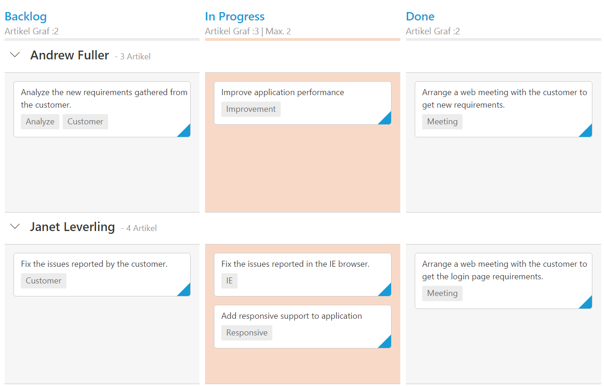

# Localization

## Localization

All text in Kanban can be localized using `ej.Kanban.Locale` object. Please find the table with list of properties and its value in locale object.

<table>
<tr>
<th>
Locale key words </th><th>
Text</th></tr>
<tr>
<td>
[`EmptyCard`]
</td><td>
No cards to display
</td></tr>
<tr>
<td>
[`SaveButton`]
</td><td>
Save
</td></tr>
<tr>
<td>
[`CancelButton`]
</td><td>
Cancel
</td></tr>
<tr>
<td>
[`EditFormTitle`]
</td><td>
Details of
</td></tr>
<tr>
<td>
[`AddFormTitle`]
</td><td>
Add New Card
</td></tr>
<tr>
<td>
[`SwimlaneCaptionFormat`]
</td><td>
    "- {{:count}}{{if count == 1 }} item {{else}} items {{/if}}"
</td></tr>
<tr>
<td>
[`FilterSettings`]
</td><td>
Filters:
</td></tr>
<tr>
<td>
[`Min`]
</td><td>
Min
</td></tr>
<tr>
<td>
[`Max`]
</td><td>
Max
</td></tr>
<tr>
<td>
[`FilterOfText`]
</td><td>
Of
</td></tr>
<tr>
<td>
[`Cards`]
</td><td>
Cards
</td></tr>
<tr>
<td>
[`ItemsCount`]
</td><td>
Items Count :
</td></tr>
<tr>
<td>
[`Unassigned`]
</td><td>
Unassigned
</td></tr>
<tr>
<td>
[`AddCard`]
</td><td>
Add Card
</td></tr>
<tr>
<td>
[`EditCard`]
</td><td>
Edit Card
</td></tr>
<tr>
<td>
[`DeleteCard`]
</td><td>
Delete Card
</td></tr>
<tr>
<td>
[`TopofRow`]
</td><td>
Top of Row
</td></tr>
<tr>
<td>
[`BottomofRow`]
</td><td>
Bottom of Row
</td></tr>
<tr>
<td>
[`MoveUp`]
</td><td>
Move Up
</td></tr>
<tr>
<td>
[`MoveDown`]
</td><td>
Move Down
</td></tr>
<tr>
<td>
[`MoveLeft`]
</td><td>
Move Left
</td></tr>
<tr>
<td>
[`MoveRight`]
</td><td>
Move Right
</td></tr>
<tr>
<td>
[`MovetoSwimlane`]
</td><td>
Move to Swimlane
</td></tr>
<tr>
<td>
[`HideColumn`]
</td><td>
Hide Column
</td></tr>
<tr>
<td>
[`VisibleColumns`]
</td><td>
Visible Columns
</td></tr>
<tr>
<td>
[`PrintCard`]
</td><td>
Print Card
</td></tr>
<tr>
<td>
[`Search`]
</td><td>
Search
</td></tr>
</table>

The following code example describes the above behavior.



<template>
    

        <ej-kanban id="Kanban" e-data-source.bind="KanbanData" e-locale="de-DE" e-enable-total-count="true" e-key-field="Status" e-fields.bind="Field">
            <ej-kanban-column e-header-text="Backlog" e-key="Open"></ej-kanban-column>
            <ej-kanban-column e-header-text="In Progress" e-key="InProgress" e-constraints.bind="constraints"></ej-kanban-column>
            <ej-kanban-column e-header-text="Done" e-key="Close"></ej-kanban-column>
        </ej-kanban>
    

</template>





export class Kanban {
    constructor() {
        this.KanbanData = [
           { Id: 1, Status: "Open", Summary: "Analyze the new requirements gathered from the customer.", Type: "Story", Priority: "Low", Tags: "Analyze,Customer", Estimate: 3.5, Assignee: "Nancy", ImageUrl: "/images/kanban/1.png", RankId: 1 },
           { Id: 2, Status: "InProgress", Summary: "Improve application performance", Type: "Improvement", Priority: "Normal", Tags: "Improvement", Estimate: 6, Assignee: "Andrew Fuller", ImageUrl: "/images/kanban/2.png", RankId: 1 },
           { Id: 3, Status: "Open", Summary: "Arrange a web meeting with the customer to get new requirements.", Type: "Others", Priority: "Critical", Tags: "Meeting", Estimate: 5.5, Assignee: "Janet Leverling", ImageUrl: "/images/kanban/3.png", RankId: 2 },
           { Id: 4, Status: "InProgress", Summary: "Fix the issues reported in the IE browser.", Type: "Bug", Priority: "Release Breaker", Tags: "IE", Estimate: 2.5, Assignee: "Janet Leverling", ImageUrl: "/images/kanban/3.png", RankId: 2 },
           { Id: 5, Status: "Testing", Summary: "Fix the issues reported by the customer.", Type: "Bug", Priority: "Low", Tags: "Customer", Estimate: "3.5", Assignee: "Steven walker", ImageUrl:"/images/kanban/5.png", RankId: 1 },
           { Id: 6, Status: "Close", Summary: "Arrange a web meeting with the customer to get the login page requirements.", Type: "Others", Priority: "Low", Tags: "Meeting", Estimate: 2, Assignee: "Michael Suyama", ImageUrl: "/images/kanban/6.png", RankId: 1 },
           { Id: 7, Status: "Validate", Summary: "Validate new requirements", Type: "Improvement", Priority: "Low", Tags: "Validation", Estimate: 1.5, Assignee: "Robert King", ImageUrl: "/images/kanban/7.png", RankId: 1 },
           { Id: 8, Status: "Close", Summary: "Login page validation", Type: "Story", Priority: "Release Breaker", Tags: "Validation,Fix", Estimate: 2.5, Assignee: "Laura Callahan", ImageUrl: "/images/kanban/8.png", RankId: 2 },
           { Id: 9, Status: "Testing", Summary: "Fix the issues reported in Safari browser.", Type: "Bug", Priority: "Release Breaker", Tags: "Fix,Safari", Estimate: 1.5, Assignee: "Nancy", ImageUrl: "/images/kanban/1.png", RankId: 2 },
           { Id: 10, Status: "Close", Summary: "Test the application in the IE browser.", Type: "Story", Priority: "Low", Tags: "Testing,IE", Estimate: 5.5, Assignee: "Margaret", ImageUrl: "/images/kanban/4.png", RankId: 3 },
           { Id: 11, Status: "Validate", Summary: "Validate the issues reported by the customer.", Type: "Story", Priority: "High", Tags: "Validation,Fix", Estimate: 1, Assignee: "Steven walker", ImageUrl: "/images/kanban/5.png", RankId: 1 },
           { Id: 12, Status: "Testing", Summary: "Check Login page validation.", Type: "Story", Priority: "Release Breaker", Tags: "Testing", Estimate: 0.5, Assignee: "Michael Suyama", ImageUrl: "/images/kanban/6.png", RankId: 3 },
           { Id: 13, Status: "Open", Summary: "API improvements.", Type: "Improvement", Priority: "High", Tags: "Grid,API", Estimate: 3.5, Assignee: "Robert King", ImageUrl: "/images/kanban/7.png", RankId: 3 },
           { Id: 14, Status: "InProgress", Summary: "Add responsive support to application", Type: "Epic", Priority: "Critical", Tags: "Responsive", Estimate: 6, Assignee: "Laura Callahan", ImageUrl: "/images/kanban/8.png", RankId: 3 },
           { Id: 15, Status: "Open", Summary: "Show the retrieved data from the server in grid control.", Type: "Story", Priority: "High", Tags: "Database,SQL", Estimate: 5.5, Assignee: "Margaret", ImageUrl: "/images/kanban/4.png", RankId: 4 },
           { Id: 16, Status: "InProgress", Summary: "Fix cannot open user’s default database SQL error.", Priority: "Critical", Type: "Bug", Tags: "Database,Sql2008", Estimate: 2.5, Assignee: "Janet Leverling", ImageUrl: "/images/kanban/3.png", RankId: 4 },
           { Id: 17, Status: "Testing", Summary: "Fix the issues reported in data binding.", Type: "Story", Priority: "Normal", Tags: "DataBinding", Estimate: "3.5", Assignee: "Janet Leverling", ImageUrl: "/images/kanban/3.png", RankId: 4 },
           { Id: 18, Status: "Close", Summary: "Analyze SQL server 2008 connection.", Type: "Story", Priority: "Release Breaker", Tags: "Grid,Sql", Estimate: 2, Assignee: "Andrew Fuller", ImageUrl: "/images/kanban/2.png", RankId: 4 },
           { Id: 19, Status: "Validate", Summary: "Validate dataBinding issues.", Type: "Story", Priority: "Low", Tags: "Validation", Estimate: 1.5, Assignee: "Margaret", ImageUrl: "/images/kanban/4.png", RankId: 1 },
           { Id: 20, Status: "Close", Summary: "Analyze grid control.", Type: "Story", Priority: "High", Tags: "Analyze", Estimate: 2.5, Assignee: "Margaret", ImageUrl: "/images/kanban/4.png", RankId: 5 }];
        this.Field = { primaryKey: 'Id', content: 'Summary', swimlaneKey: 'Assignee', tag:'Tags'};
        ej.Kanban.Locale["de-DE"] = {
              EmptyCard: "Keine Karten angezeigt werden",
              SaveButton: "Speichern",
              CancelButton: "stornieren",
              EditFormTitle: "Details von ",
              AddFormTitle: "Neue Karte hinzufügen",
              SwimlaneCaptionFormat: "- {{:count}}{{if count == 1 }} Artikel {{else}} Artikel {{/if}}",
              FilterSettings: "Filter:",
              FilterOfText: "Von",
              Max: "Max.",
              Min: "Min.",
              Cards: "Karten",
              ItemsCount:"Artikel Graf :",
              Unassigned:"Nicht zugewiesen",
          };
         this.constraints={max:"2"};
    }
}



The following output is displayed as a result of the above code example.

