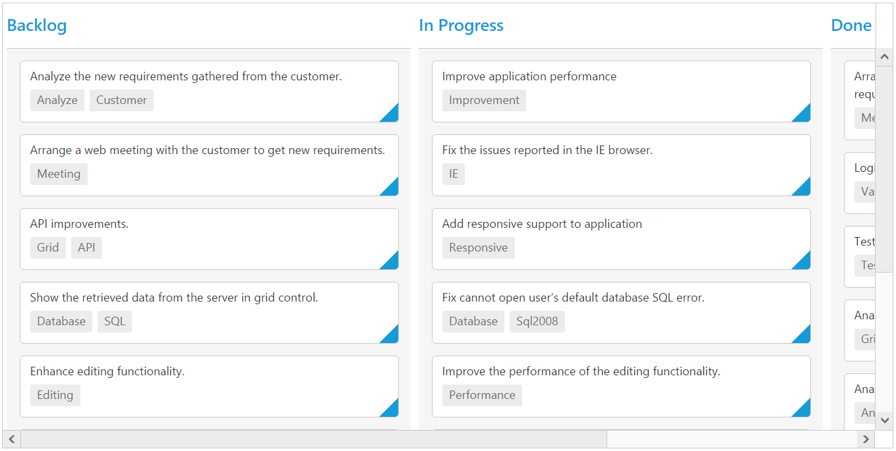
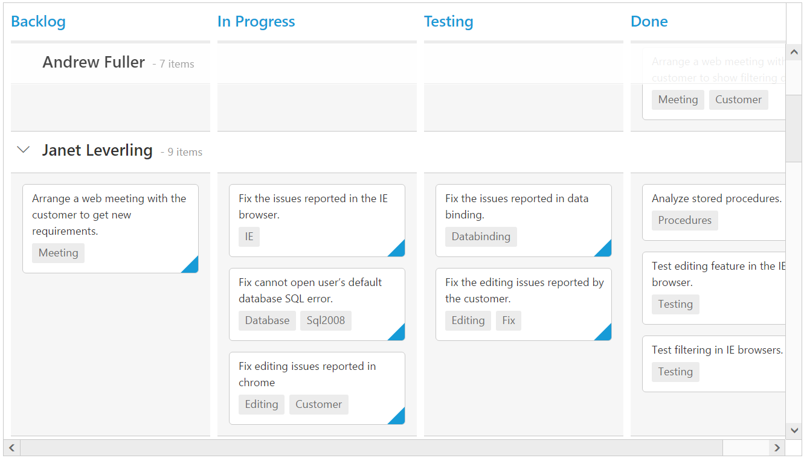

# Scrolling

Scrolling can be enabled by setting [`e-allow-scrolling`](https://help.syncfusion.com/api/js/ejkanban#members:allowscrolling) as true. The height and width can be set to Kanban by using the properties [`height`](https://help.syncfusion.com/api/js/ejkanban#members:scrollsettings-height) and [`width`](https://help.syncfusion.com/api/js/ejkanban#members:scrollsettings-width) respectively.

N> The height and width can be set in percentage and pixel. The default value for [`height`](https://help.syncfusion.com/api/js/ejkanban#members:scrollsettings-height) and [`width`](https://help.syncfusion.com/api/js/ejkanban#members:scrollsettings-width) in [`e-scroll-settings.bind`](https://help.syncfusion.com/api/js/ejkanban#members:scrollsettings) is 0 and auto respectively.

## Set width and height in pixel

To specify the [`width`](https://help.syncfusion.com/api/js/ejkanban#members:scrollsettings-width) and [`height`](https://help.syncfusion.com/api/js/ejkanban#members:scrollsettings-height) in pixel, by set the pixel value as integer.

The following code example describes the above behavior.



<template>
  

     <ej-kanban id="Kanban" e-data-source.bind="KanbanData" e-key-field="Status" e-fields.bind="Field" e-allow-scrolling="true" e-scroll-settings.bind="scrollSettings">
       <ej-kanban-column  e-header-text="Backlog" e-key="Open"></ej-kanban-column>
	   <ej-kanban-column  e-header-text="In Progress" e-key="InProgress"></ej-kanban-column>
	   <ej-kanban-column  e-header-text="Done" e-key="Close"></ej-kanban-column>
     </ej-kanban>
  

</template>





export class Kanban {
    constructor() {
        this.KanbanData = [
           { Id: 1, Status: "Open", Summary: "Analyze the new requirements gathered from the customer.", Type: "Story", Priority: "Low", Tags: "Analyze,Customer", Estimate: 3.5, Assignee: "Nancy Davloio", ImgUrl: "/images/kanban/1.png", RankId: 1 },
           { Id: 2, Status: "InProgress", Summary: "Improve application performance", Type: "Improvement", Priority: "Normal", Tags: "Improvement", Estimate: 6, Assignee: "Andrew Fuller", ImgUrl: "/images/kanban/2.png", RankId: 1 },
           { Id: 3, Status: "Open", Summary: "Arrange a web meeting with the customer to get new requirements.", Type: "Others", Priority: "Critical", Tags: "Meeting", Estimate: 5.5, Assignee: "Janet Leverling", ImgUrl: "/images/kanban/3.png", RankId: 2 },
           { Id: 4, Status: "InProgress", Summary: "Fix the issues reported in the IE browser.", Type: "Bug", Priority: "Release Breaker", Tags: "IE", Estimate: 2.5, Assignee: "Janet Leverling", ImgUrl: "/images/kanban/3.png", RankId: 2 },
           { Id: 5, Status: "Testing", Summary: "Fix the issues reported by the customer.", Type: "Bug", Priority: "Low", Tags: "Customer", Estimate: "3.5", Assignee: "Steven walker", ImgUrl:"/images/kanban/5.png", RankId: 1 },
           { Id: 6, Status: "Close", Summary: "Arrange a web meeting with the customer to get the login page requirements.", Type: "Others", Priority: "Low", Tags: "Meeting", Estimate: 2, Assignee: "Michael Suyama", ImgUrl: "/images/kanban/6.png", RankId: 1 },
           { Id: 7, Status: "Validate", Summary: "Validate new requirements", Type: "Improvement", Priority: "Low", Tags: "Validation", Estimate: 1.5, Assignee: "Robert King", ImgUrl: "/images/kanban/7.png", RankId: 1 },
           { Id: 8, Status: "Close", Summary: "Login page validation", Type: "Story", Priority: "Release Breaker", Tags: "Validation,Fix", Estimate: 2.5, Assignee: "Laura Callahan", ImgUrl: "/images/kanban/8.png", RankId: 2 },
           { Id: 9, Status: "Testing", Summary: "Fix the issues reported in Safari browser.", Type: "Bug", Priority: "Release Breaker", Tags: "Fix,Safari", Estimate: 1.5, Assignee: "Nancy Davloio", ImgUrl: "/images/kanban/1.png", RankId: 2 },
           { Id: 10, Status: "Close", Summary: "Test the application in the IE browser.", Type: "Story", Priority: "Low", Tags: "Testing,IE", Estimate: 5.5, Assignee: "Margaret hamilt", ImgUrl: "/images/kanban/4.png", RankId: 3 },
           { Id: 11, Status: "Validate", Summary: "Validate the issues reported by the customer.", Type: "Story", Priority: "High", Tags: "Validation,Fix", Estimate: 1, Assignee: "Steven walker", ImgUrl: "/images/kanban/5.png", RankId: 1 },
           { Id: 12, Status: "Testing", Summary: "Check Login page validation.", Type: "Story", Priority: "Release Breaker", Tags: "Testing", Estimate: 0.5, Assignee: "Michael Suyama", ImgUrl: "/images/kanban/6.png", RankId: 3 },
           { Id: 13, Status: "Open", Summary: "API improvements.", Type: "Improvement", Priority: "High", Tags: "Grid,API", Estimate: 3.5, Assignee: "Robert King", ImgUrl: "/images/kanban/7.png", RankId: 3 },
           { Id: 14, Status: "InProgress", Summary: "Add responsive support to application", Type: "Epic", Priority: "Critical", Tags: "Responsive", Estimate: 6, Assignee: "Laura Callahan", ImgUrl: "/images/kanban/8.png", RankId: 3 },
           { Id: 15, Status: "Open", Summary: "Show the retrieved data from the server in grid control.", Type: "Story", Priority: "High", Tags: "Database,SQL", Estimate: 5.5, Assignee: "Margaret hamilt", ImgUrl: "/images/kanban/4.png", RankId: 4 },
           { Id: 16, Status: "InProgress", Summary: "Fix cannot open user’s default database SQL error.", Priority: "Critical", Type: "Bug", Tags: "Database,Sql2008", Estimate: 2.5, Assignee: "Janet Leverling", ImgUrl: "/images/kanban/3.png", RankId: 4 },
           { Id: 17, Status: "Testing", Summary: "Fix the issues reported in data binding.", Type: "Story", Priority: "Normal", Tags: "Databinding", Estimate: "3.5", Assignee: "Janet Leverling", ImgUrl: "/images/kanban/3.png", RankId: 4 },
           { Id: 18, Status: "Close", Summary: "Analyze SQL server 2008 connection.", Type: "Story", Priority: "Release Breaker", Tags: "Grid,Sql", Estimate: 2, Assignee: "Andrew Fuller", ImgUrl: "/images/kanban/2.png", RankId: 4 },
           { Id: 19, Status: "Validate", Summary: "Validate databinding issues.", Type: "Story", Priority: "Low", Tags: "Validation", Estimate: 1.5, Assignee: "Margaret hamilt", ImgUrl: "/images/kanban/4.png", RankId: 1 },
           { Id: 20, Status: "Close", Summary: "Analyze grid control.", Type: "Story", Priority: "High", Tags: "Analyze", Estimate: 2.5, Assignee: "Margaret hamilt", ImgUrl: "/images/kanban/4.png", RankId: 5 }];
        this.Field = { primaryKey: 'Id', content: 'Summary', tag:'Tags'};
        this.scrollSettings = {
            width: 900,
            height: 450
        };
    }
};



The following output is displayed as a result of the above code example.

## Set height and width in percentage

To specify the [`width`](https://help.syncfusion.com/api/js/ejkanban#members:scrollsettings-width) and ['height`](https://help.syncfusion.com/api/js/ejkanban#members:scrollsettings-height) in percentage, by set the percentage value as string.

The following code example describes the above behavior.



<template>
  

     <ej-kanban id="Kanban" e-data-source.bind="KanbanData" e-key-field="Status" e-fields.bind="Field" e-allow-scrolling="true" e-scroll-settings.bind="scrollSettings">
       <ej-kanban-column  e-header-text="Backlog" e-key="Open"></ej-kanban-column>
	   <ej-kanban-column  e-header-text="In Progress" e-key="InProgress"></ej-kanban-column>
	   <ej-kanban-column  e-header-text="Done" e-key="Close"></ej-kanban-column>
     </ej-kanban>
  

</template>





export class Kanban {
    constructor() {
        this.KanbanData = [
           { Id: 1, Status: "Open", Summary: "Analyze the new requirements gathered from the customer.", Type: "Story", Priority: "Low", Tags: "Analyze,Customer", Estimate: 3.5, Assignee: "Nancy Davloio", ImgUrl: "/images/kanban/1.png", RankId: 1 },
           { Id: 2, Status: "InProgress", Summary: "Improve application performance", Type: "Improvement", Priority: "Normal", Tags: "Improvement", Estimate: 6, Assignee: "Andrew Fuller", ImgUrl: "/images/kanban/2.png", RankId: 1 },
           { Id: 3, Status: "Open", Summary: "Arrange a web meeting with the customer to get new requirements.", Type: "Others", Priority: "Critical", Tags: "Meeting", Estimate: 5.5, Assignee: "Janet Leverling", ImgUrl: "/images/kanban/3.png", RankId: 2 },
           { Id: 4, Status: "InProgress", Summary: "Fix the issues reported in the IE browser.", Type: "Bug", Priority: "Release Breaker", Tags: "IE", Estimate: 2.5, Assignee: "Janet Leverling", ImgUrl: "/images/kanban/3.png", RankId: 2 },
           { Id: 5, Status: "Testing", Summary: "Fix the issues reported by the customer.", Type: "Bug", Priority: "Low", Tags: "Customer", Estimate: "3.5", Assignee: "Steven walker", ImgUrl:"/images/kanban/5.png", RankId: 1 },
           { Id: 6, Status: "Close", Summary: "Arrange a web meeting with the customer to get the login page requirements.", Type: "Others", Priority: "Low", Tags: "Meeting", Estimate: 2, Assignee: "Michael Suyama", ImgUrl: "/images/kanban/6.png", RankId: 1 },
           { Id: 7, Status: "Validate", Summary: "Validate new requirements", Type: "Improvement", Priority: "Low", Tags: "Validation", Estimate: 1.5, Assignee: "Robert King", ImgUrl: "/images/kanban/7.png", RankId: 1 },
           { Id: 8, Status: "Close", Summary: "Login page validation", Type: "Story", Priority: "Release Breaker", Tags: "Validation,Fix", Estimate: 2.5, Assignee: "Laura Callahan", ImgUrl: "/images/kanban/8.png", RankId: 2 },
           { Id: 9, Status: "Testing", Summary: "Fix the issues reported in Safari browser.", Type: "Bug", Priority: "Release Breaker", Tags: "Fix,Safari", Estimate: 1.5, Assignee: "Nancy Davloio", ImgUrl: "/images/kanban/1.png", RankId: 2 },
           { Id: 10, Status: "Close", Summary: "Test the application in the IE browser.", Type: "Story", Priority: "Low", Tags: "Testing,IE", Estimate: 5.5, Assignee: "Margaret hamilt", ImgUrl: "/images/kanban/4.png", RankId: 3 },
           { Id: 11, Status: "Validate", Summary: "Validate the issues reported by the customer.", Type: "Story", Priority: "High", Tags: "Validation,Fix", Estimate: 1, Assignee: "Steven walker", ImgUrl: "/images/kanban/5.png", RankId: 1 },
           { Id: 12, Status: "Testing", Summary: "Check Login page validation.", Type: "Story", Priority: "Release Breaker", Tags: "Testing", Estimate: 0.5, Assignee: "Michael Suyama", ImgUrl: "/images/kanban/6.png", RankId: 3 },
           { Id: 13, Status: "Open", Summary: "API improvements.", Type: "Improvement", Priority: "High", Tags: "Grid,API", Estimate: 3.5, Assignee: "Robert King", ImgUrl: "/images/kanban/7.png", RankId: 3 },
           { Id: 14, Status: "InProgress", Summary: "Add responsive support to application", Type: "Epic", Priority: "Critical", Tags: "Responsive", Estimate: 6, Assignee: "Laura Callahan", ImgUrl: "/images/kanban/8.png", RankId: 3 },
           { Id: 15, Status: "Open", Summary: "Show the retrieved data from the server in grid control.", Type: "Story", Priority: "High", Tags: "Database,SQL", Estimate: 5.5, Assignee: "Margaret hamilt", ImgUrl: "/images/kanban/4.png", RankId: 4 },
           { Id: 16, Status: "InProgress", Summary: "Fix cannot open user’s default database SQL error.", Priority: "Critical", Type: "Bug", Tags: "Database,Sql2008", Estimate: 2.5, Assignee: "Janet Leverling", ImgUrl: "/images/kanban/3.png", RankId: 4 },
           { Id: 17, Status: "Testing", Summary: "Fix the issues reported in data binding.", Type: "Story", Priority: "Normal", Tags: "Databinding", Estimate: "3.5", Assignee: "Janet Leverling", ImgUrl: "/images/kanban/3.png", RankId: 4 },
           { Id: 18, Status: "Close", Summary: "Analyze SQL server 2008 connection.", Type: "Story", Priority: "Release Breaker", Tags: "Grid,Sql", Estimate: 2, Assignee: "Andrew Fuller", ImgUrl: "/images/kanban/2.png", RankId: 4 },
           { Id: 19, Status: "Validate", Summary: "Validate databinding issues.", Type: "Story", Priority: "Low", Tags: "Validation", Estimate: 1.5, Assignee: "Margaret hamilt", ImgUrl: "/images/kanban/4.png", RankId: 1 },
           { Id: 20, Status: "Close", Summary: "Analyze grid control.", Type: "Story", Priority: "High", Tags: "Analyze", Estimate: 2.5, Assignee: "Margaret hamilt", ImgUrl: "/images/kanban/4.png", RankId: 5 }];
        this.Field = { primaryKey: 'Id', content: 'Summary', tag:'Tags'};
        this.scrollSettings = {
            width: "70%",
            height: "70%"
        };
    }
};



The following output is displayed as a result of the above code example.

## Set width as auto

Specify [`width`](https://help.syncfusion.com/api/js/ejkanban#members:scrollsettings-width) property of [`e-scroll-settings.bind`](https://help.syncfusion.com/api/js/ejkanban#members:scrollsettings) as auto, then the scrollbar is rendered only when the Kanban width exceeds the browser window width.

The following code example describes the above behavior.



<template>
  

     <ej-kanban id="Kanban" e-data-source.bind="KanbanData" e-key-field="Status" e-fields.bind="Field" e-allow-scrolling="true" e-scroll-settings.bind="scrollSettings">
       <ej-kanban-column  e-header-text="Backlog" e-key="Open"></ej-kanban-column>
	   <ej-kanban-column  e-header-text="In Progress" e-key="InProgress"></ej-kanban-column>
	   <ej-kanban-column  e-header-text="Done" e-key="Close"></ej-kanban-column>
     </ej-kanban>
  

</template>





   export class Kanban {
    constructor() {
        this.KanbanData = [
           { Id: 1, Status: "Open", Summary: "Analyze the new requirements gathered from the customer.", Type: "Story", Priority: "Low", Tags: "Analyze,Customer", Estimate: 3.5, Assignee: "Nancy Davloio", ImgUrl: "/images/kanban/1.png", RankId: 1 },
           { Id: 2, Status: "InProgress", Summary: "Improve application performance", Type: "Improvement", Priority: "Normal", Tags: "Improvement", Estimate: 6, Assignee: "Andrew Fuller", ImgUrl: "/images/kanban/2.png", RankId: 1 },
           { Id: 3, Status: "Open", Summary: "Arrange a web meeting with the customer to get new requirements.", Type: "Others", Priority: "Critical", Tags: "Meeting", Estimate: 5.5, Assignee: "Janet Leverling", ImgUrl: "/images/kanban/3.png", RankId: 2 },
           { Id: 4, Status: "InProgress", Summary: "Fix the issues reported in the IE browser.", Type: "Bug", Priority: "Release Breaker", Tags: "IE", Estimate: 2.5, Assignee: "Janet Leverling", ImgUrl: "/images/kanban/3.png", RankId: 2 },
           { Id: 5, Status: "Testing", Summary: "Fix the issues reported by the customer.", Type: "Bug", Priority: "Low", Tags: "Customer", Estimate: "3.5", Assignee: "Steven walker", ImgUrl:"/images/kanban/5.png", RankId: 1 },
           { Id: 6, Status: "Close", Summary: "Arrange a web meeting with the customer to get the login page requirements.", Type: "Others", Priority: "Low", Tags: "Meeting", Estimate: 2, Assignee: "Michael Suyama", ImgUrl: "/images/kanban/6.png", RankId: 1 },
           { Id: 7, Status: "Validate", Summary: "Validate new requirements", Type: "Improvement", Priority: "Low", Tags: "Validation", Estimate: 1.5, Assignee: "Robert King", ImgUrl: "/images/kanban/7.png", RankId: 1 },
           { Id: 8, Status: "Close", Summary: "Login page validation", Type: "Story", Priority: "Release Breaker", Tags: "Validation,Fix", Estimate: 2.5, Assignee: "Laura Callahan", ImgUrl: "/images/kanban/8.png", RankId: 2 },
           { Id: 9, Status: "Testing", Summary: "Fix the issues reported in Safari browser.", Type: "Bug", Priority: "Release Breaker", Tags: "Fix,Safari", Estimate: 1.5, Assignee: "Nancy Davloio", ImgUrl: "/images/kanban/1.png", RankId: 2 },
           { Id: 10, Status: "Close", Summary: "Test the application in the IE browser.", Type: "Story", Priority: "Low", Tags: "Testing,IE", Estimate: 5.5, Assignee: "Margaret hamilt", ImgUrl: "/images/kanban/4.png", RankId: 3 },
           { Id: 11, Status: "Validate", Summary: "Validate the issues reported by the customer.", Type: "Story", Priority: "High", Tags: "Validation,Fix", Estimate: 1, Assignee: "Steven walker", ImgUrl: "/images/kanban/5.png", RankId: 1 },
           { Id: 12, Status: "Testing", Summary: "Check Login page validation.", Type: "Story", Priority: "Release Breaker", Tags: "Testing", Estimate: 0.5, Assignee: "Michael Suyama", ImgUrl: "/images/kanban/6.png", RankId: 3 },
           { Id: 13, Status: "Open", Summary: "API improvements.", Type: "Improvement", Priority: "High", Tags: "Grid,API", Estimate: 3.5, Assignee: "Robert King", ImgUrl: "/images/kanban/7.png", RankId: 3 },
           { Id: 14, Status: "InProgress", Summary: "Add responsive support to application", Type: "Epic", Priority: "Critical", Tags: "Responsive", Estimate: 6, Assignee: "Laura Callahan", ImgUrl: "/images/kanban/8.png", RankId: 3 },
           { Id: 15, Status: "Open", Summary: "Show the retrieved data from the server in grid control.", Type: "Story", Priority: "High", Tags: "Database,SQL", Estimate: 5.5, Assignee: "Margaret hamilt", ImgUrl: "/images/kanban/4.png", RankId: 4 },
           { Id: 16, Status: "InProgress", Summary: "Fix cannot open user’s default database SQL error.", Priority: "Critical", Type: "Bug", Tags: "Database,Sql2008", Estimate: 2.5, Assignee: "Janet Leverling", ImgUrl: "/images/kanban/3.png", RankId: 4 },
           { Id: 17, Status: "Testing", Summary: "Fix the issues reported in data binding.", Type: "Story", Priority: "Normal", Tags: "Databinding", Estimate: "3.5", Assignee: "Janet Leverling", ImgUrl: "/images/kanban/3.png", RankId: 4 },
           { Id: 18, Status: "Close", Summary: "Analyze SQL server 2008 connection.", Type: "Story", Priority: "Release Breaker", Tags: "Grid,Sql", Estimate: 2, Assignee: "Andrew Fuller", ImgUrl: "/images/kanban/2.png", RankId: 4 },
           { Id: 19, Status: "Validate", Summary: "Validate databinding issues.", Type: "Story", Priority: "Low", Tags: "Validation", Estimate: 1.5, Assignee: "Margaret hamilt", ImgUrl: "/images/kanban/4.png", RankId: 1 },
           { Id: 20, Status: "Close", Summary: "Analyze grid control.", Type: "Story", Priority: "High", Tags: "Analyze", Estimate: 2.5, Assignee: "Margaret hamilt", ImgUrl: "/images/kanban/4.png", RankId: 5 }];
        this.Field = { primaryKey: 'Id', content: 'Summary', tag:'Tags'};
        this.scrollSettings = {
            width: "auto",
            height: 300
        };
    }
};



The following output is displayed as a result of the above code example.

## Enabling freeze swim lane

Set [`e-allow-freeze-swimlane`](https://help.syncfusion.com/api/js/ejkanban#members:scrollsettings-allowfreezeswimlane) as true. This enables scrolling with freezing of swim lane until you scroll to the next Swim lane, which helps user to aware of current swim lane target.

The following code example describes the above behavior.



<template>
  

     <ej-kanban id="Kanban" e-data-source.bind="KanbanData" e-key-field="Status" e-fields.bind="Field" e-allow-scrolling="true" e-scroll-settings.bind="scrollSettings">
       <ej-kanban-column  e-header-text="Backlog" e-key="Open"></ej-kanban-column>
	   <ej-kanban-column  e-header-text="In Progress" e-key="InProgress"></ej-kanban-column>
       <ej-kanban-column e-header-text="Testing" e-key="Testing"></ej-kanban-column>
	   <ej-kanban-column  e-header-text="Done" e-key="Close"></ej-kanban-column>
     </ej-kanban>
  

</template>





export class Kanban {
    constructor() {
        this.KanbanData = [
           { Id: 1, Status: "Open", Summary: "Analyze the new requirements gathered from the customer.", Type: "Story", Priority: "Low", Tags: "Analyze,Customer", Estimate: 3.5, Assignee: "Nancy Davloio", ImgUrl: "/images/kanban/1.png", RankId: 1 },
           { Id: 2, Status: "InProgress", Summary: "Improve application performance", Type: "Improvement", Priority: "Normal", Tags: "Improvement", Estimate: 6, Assignee: "Andrew Fuller", ImgUrl: "/images/kanban/2.png", RankId: 1 },
           { Id: 3, Status: "Open", Summary: "Arrange a web meeting with the customer to get new requirements.", Type: "Others", Priority: "Critical", Tags: "Meeting", Estimate: 5.5, Assignee: "Janet Leverling", ImgUrl: "/images/kanban/3.png", RankId: 2 },
           { Id: 4, Status: "InProgress", Summary: "Fix the issues reported in the IE browser.", Type: "Bug", Priority: "Release Breaker", Tags: "IE", Estimate: 2.5, Assignee: "Janet Leverling", ImgUrl: "/images/kanban/3.png", RankId: 2 },
           { Id: 5, Status: "Testing", Summary: "Fix the issues reported by the customer.", Type: "Bug", Priority: "Low", Tags: "Customer", Estimate: "3.5", Assignee: "Steven walker", ImgUrl:"/images/kanban/5.png", RankId: 1 },
           { Id: 6, Status: "Close", Summary: "Arrange a web meeting with the customer to get the login page requirements.", Type: "Others", Priority: "Low", Tags: "Meeting", Estimate: 2, Assignee: "Michael Suyama", ImgUrl: "/images/kanban/6.png", RankId: 1 },
           { Id: 7, Status: "Validate", Summary: "Validate new requirements", Type: "Improvement", Priority: "Low", Tags: "Validation", Estimate: 1.5, Assignee: "Robert King", ImgUrl: "/images/kanban/7.png", RankId: 1 },
           { Id: 8, Status: "Close", Summary: "Login page validation", Type: "Story", Priority: "Release Breaker", Tags: "Validation,Fix", Estimate: 2.5, Assignee: "Laura Callahan", ImgUrl: "/images/kanban/8.png", RankId: 2 },
           { Id: 9, Status: "Testing", Summary: "Fix the issues reported in Safari browser.", Type: "Bug", Priority: "Release Breaker", Tags: "Fix,Safari", Estimate: 1.5, Assignee: "Nancy Davloio", ImgUrl: "/images/kanban/1.png", RankId: 2 },
           { Id: 10, Status: "Close", Summary: "Test the application in the IE browser.", Type: "Story", Priority: "Low", Tags: "Testing,IE", Estimate: 5.5, Assignee: "Margaret hamilt", ImgUrl: "/images/kanban/4.png", RankId: 3 },
           { Id: 11, Status: "Validate", Summary: "Validate the issues reported by the customer.", Type: "Story", Priority: "High", Tags: "Validation,Fix", Estimate: 1, Assignee: "Steven walker", ImgUrl: "/images/kanban/5.png", RankId: 1 },
           { Id: 12, Status: "Testing", Summary: "Check Login page validation.", Type: "Story", Priority: "Release Breaker", Tags: "Testing", Estimate: 0.5, Assignee: "Michael Suyama", ImgUrl: "/images/kanban/6.png", RankId: 3 },
           { Id: 13, Status: "Open", Summary: "API improvements.", Type: "Improvement", Priority: "High", Tags: "Grid,API", Estimate: 3.5, Assignee: "Robert King", ImgUrl: "/images/kanban/7.png", RankId: 3 },
           { Id: 14, Status: "InProgress", Summary: "Add responsive support to application", Type: "Epic", Priority: "Critical", Tags: "Responsive", Estimate: 6, Assignee: "Laura Callahan", ImgUrl: "/images/kanban/8.png", RankId: 3 },
           { Id: 15, Status: "Open", Summary: "Show the retrieved data from the server in grid control.", Type: "Story", Priority: "High", Tags: "Database,SQL", Estimate: 5.5, Assignee: "Margaret hamilt", ImgUrl: "/images/kanban/4.png", RankId: 4 },
           { Id: 16, Status: "InProgress", Summary: "Fix cannot open user’s default database SQL error.", Priority: "Critical", Type: "Bug", Tags: "Database,Sql2008", Estimate: 2.5, Assignee: "Janet Leverling", ImgUrl: "/images/kanban/3.png", RankId: 4 },
           { Id: 17, Status: "Testing", Summary: "Fix the issues reported in data binding.", Type: "Story", Priority: "Normal", Tags: "Databinding", Estimate: "3.5", Assignee: "Janet Leverling", ImgUrl: "/images/kanban/3.png", RankId: 4 },
           { Id: 18, Status: "Close", Summary: "Analyze SQL server 2008 connection.", Type: "Story", Priority: "Release Breaker", Tags: "Grid,Sql", Estimate: 2, Assignee: "Andrew Fuller", ImgUrl: "/images/kanban/2.png", RankId: 4 },
           { Id: 19, Status: "Validate", Summary: "Validate databinding issues.", Type: "Story", Priority: "Low", Tags: "Validation", Estimate: 1.5, Assignee: "Margaret hamilt", ImgUrl: "/images/kanban/4.png", RankId: 1 },
           { Id: 20, Status: "Close", Summary: "Analyze grid control.", Type: "Story", Priority: "High", Tags: "Analyze", Estimate: 2.5, Assignee: "Margaret hamilt", ImgUrl: "/images/kanban/4.png", RankId: 5 }];
        this.Field = { primaryKey: 'Id', content: 'Summary', tag:'Tags', swimlaneKey: 'Assignee'};
        this.scrollSettings = {
            width: "auto",
            height: 500,
            allowFreezeSwimlane: true
        };
    }
};



The following output is displayed as a result of the above code example.

N> `e-allow-freeze-swimlane` is applicable when swim lane grouping enabled by setting `swimlaneKey`.

