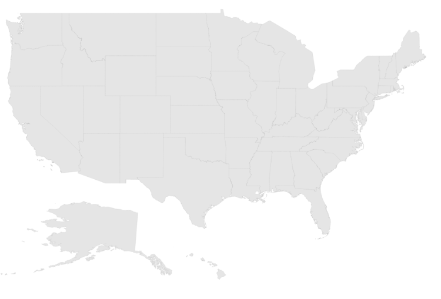

# Getting Started

This section explains briefly about how to create **Maps** in your application with **Aurelia.**

## Create your first Map in Aurelia

Before we start with Map, please refer [this](https://help.syncfusion.com/aurelia/overview#getting-started) page for general information regarding integrating Syncfusion widget’s.

For quick start, we already configured a template project in GitHub repository [syncfusion-template-repository](https://github.com/aurelia-ui-toolkits/syncfusion-template-repository). Run the below set of commands to clone the repository and install the required packages for Syncfusion Aurelia application.



    > git clone "https://github.com/aurelia-ui-toolkits/syncfusion-template-repository"
    > cd syncfusion-template-repository
    > npm install
    > jspm install



The below steps describes to create Syncfusion Aurelia Map component.

    Create Map folder inside src/samples/ location.
    Create Map.html file inside src/samples/Map folder and use the below code example to render the Map component.

You can configure an **Essential Aurelia** Map in simple steps. In this example, you can learn how to configure USA population map with customized appearance and tooltip.

## Add Libraries

To use ejMap, refer the following libraries in **HTML** page. 

* [jQuery](http://jquery.com/) version  1.10.1 and above,
* ej.web.all.min  
* JsRender

You can link these libraries from a [Content Delivery Network (CDN)](https://en.wikipedia.org/wiki/Content_delivery_network).



      <!--  jquery script  -->
     

    <!-- Essential JS UI widget -->
    

    <!-- JS Render widget -->
    



### Prepare Shape Data

The Shape Data collection describing geographical shape information can be obtained from [GEOJSON format shapes](http://www.syncfusion.com/uploads/user/uploads/Maps_GeoJSON.zip). 

In this example, USA shape is used as shape data by utilizing the “**United States of America.json**” file in the following folder structure obtained from downloaded Maps_GeoJSON folder.

**..\ Maps_GeoJSON\All Countries with States**

You can assign the complete contents in “**United States of America.json**” file to new JSON object. For your better understanding, a JS file “**usa.js**” is already created to store JSON data in JSON object “usMap”.

**[usa.js]**



    this.usMap = //Paste all the content copied from the JSON file//



### Prepare DataSource

The datasource is populated with JSON data relative to shape data and stored in JSON object. USA population as datasource is stored as JSON object in “**USA_State_PopulationData**”.



    this.USA_State_PopulationData = [
        { name: "California", population: "38332521" },
        { name: "Texas", population: "26448193" },
        { name: "New York", population: "19651127" },
        { name: "Florida", population: "19552860" },
        { name: "Illinois", population: "12882135" },
        { name: "Pennsylvania", population: "12773801" },
        { name: "Ohio", population: "11570808" },
        { name: "Georgia", population: "9992167" },
        { name: "Michigan", population: "9895622" },
        { name: "North Carolina", population: "9848060" },
        { name: "New Jersey", population: "8899339" },
        { name: "Virginia", population: "8260405" },
        { name: "Washington", population: "6971406" },
        { name: "Massachusetts", population: "6692824" },
        { name: "Arizona", population: "6626624" },
        { name: "Indiana", population: "6570902" },
        { name: "Tennessee", population: "6495978" },
        { name: "Missouri", population: "6044171" },
        { name: "Maryland", population: "5928814" },
        { name: "Wisconsin", population: "5742713" },
        { name: "Minnesota", population: "5420380" },
        { name: "Colorado", population: "5268367" },
        { name: "Alabama", population: "4833722" },
        { name: "South Carolina", population: "4774839" },
        { name: "Louisiana", population: "4625470" },
        { name: "Kentucky", population: "4395295" },
        { name: "Oregon", population: "3930065" },
        { name: "Oklahoma", population: "3850568" },
        { name: "Puerto Rico", population: "3615086" },
        { name: "Connecticut", population: "3596080" },
        { name: "Iowa", population: "3090416" },
        { name: "Mississippi", population: "2991207" },
        { name: "Arkansas", population: "2959373" },
        { name: "Utah", population: "2900872" },
        { name: "Kansas", population: "2893957" },
        { name: "Nevada", population: "2790136" },
        { name: "New Mexico", population: "2085287" },
        { name: "Nebraska", population: "1868516" },
        { name: "West Virginia", population: "1854304" },
        { name: "Idaho", population: "1612136" },
        { name: "Hawaii", population: "1404054" },
        { name: "Maine", population: "1328302" },
        { name: "New Hampshire", population: "1323459" },
        { name: "Rhode Island", population: "1051511" },
        { name: "Montana", population: "1015165" },
        { name: "Delaware", population: "925749" },
        { name: "South Dakota", population: "844877" },
        { name: "Alaska", population: "735132" },
        { name: "North Dakota", population: "723393" },
        { name: "District of Columbia", population: "646449" },
        { name: "Vermont", population: "626630" },
        { name: "Wyoming", population: "582658" }
]



## Initialize Map

1\. Create a **&lt;div&gt;** tag with a specific id and set the height and width to determine the rendering map’s size.


  
  //store USA GEOJSON data in a variable
  this.usMap =  window.usMap;





 <template>
   

 	 <ej-map id="map1">
         </ej-map>
  

</template>



2\. Add a script tag anywhere in the web page and add the following code. 



 <template>
   

   <ej-map id="map1">
		 <ej-layer e-shape-data.bind="usMap"></ej-layer>
	</ej-map>

 

</template>



3\. The final **HTML** file appears as follows.



    <html xmlns="http://www.w3.org/1999/xhtml">
    <head>
        <title>Add USA GEOJSON script file</title>

        <!-- Shape data source file-->
        
    
    </head>
    </html>



The above code renders a map, with default properties and shape input provided through data in layers.

##Data Binding in Map

The following properties in shape layers are used for binding data in **Map** control.

* dataSource
* shapeDataPath
* shapePropertyPath

### DataSource

The `data-source` property accepts collection values as input. For example, the list of objects can be provided as input.

### Shape Data Path

The `shape-data-path` property used to refer the data ID in dataSource. For example, "populationData" JSON object contains data ids ‘name’ and ‘population’. The `shape-data-path` and the `shape-property-path` properties are related to each other (refer to `shape-property-path` for more details).

### Shape Property Path

The `shape-property-path` property is similar to the `shape-data-path` that refers the column name in the `shape-data` property of shape layers to identify the shape. When the values of the `shape-data-path` property in the `data-source` property and the value of `shape-property-path` in the shapeData property match, then the associated object from the `data-source` is bound to the corresponding shape.

The **JSON** object “populationData” is used as dataSource in the following code example.


   
<template>

 	<ej-map id="map1" >
		 <ej-layer e-shape-data.bind="usMap" e-shape-data-path="name" e-shape-property-path="name" e-data-source.bind="USA_State_PopulationData"></ej-layer>
	</ej-map>			
	

</template>


## Customize Map Appearance 

You can customize the shape’s color by using `fill`, `stroke` and `stroke-thickness` properties in `shape-settings`.



this.shapeSettings = { fill: '#9CBF4E', strokeThickness: '0.5', stroke: 'White', highlightStroke: 'White', 
autoFill: false, highlightColor: '#BC5353', selectionColor: '#BC5353', highlightBorderWidth: '1', valuePath: 'population', 
enableGradient: true, colorMappings: { rangeColorMapping: [ { from: 10000001, to: 40000000, gradientColors: ['#F1ECD8', '#DEE2B9']},
{ from: 5000001, to: 10000000, gradientColors: ['#DEE2B9', '#CBD89A']}, { from: 1000001, to: 5000000, gradientColors: ['#CBD89A', '#B8CE7B']}, 
{ from: 500000, to: 1000000, gradientColors: ['#B8CE7B', '#9CBF4E']}]}};





<template>
  

 	<ej-map id="map1">
		 <ej-layer e-layer-type="geometry" e-enable-selection="false" e-enable-mouse-hover="true" e-show-map-items="false" e-shape-settings.bind="shapeSettings" e-shape-data.bind="usMap" e-shape-data-path="name" e-shape-property-path="name" e-data-source.bind="USA_State_PopulationData"></ej-layer>
	</ej-map>			
	
  

 </template> 



### Customize Map Appearance by Range

The Range color mapping is used to differentiate the shape’s fill based on its underlying value and color ranges. The `from` and `to` properties defines the value ranges and the `gradientColors` property defines the equivalent color ranges respective to their value ranges.

N> The `enableGradient` property value is set to true to apply gradient colors for the maps.



this.shapeSettings = { 
     //..
     //range added to shapeSettings
     colorMappings: { rangeColorMapping: [ { from: 10000001, to: 40000000, gradientColors: ['#F1ECD8', '#DEE2B9']}, 
     { from: 5000001, to: 10000000, gradientColors: ['#DEE2B9', '#CBD89A']}, 
     { from: 1000001, to: 5000000, gradientColors: ['#CBD89A', '#B8CE7B']}, 
     { from: 500000, to: 1000000, gradientColors: ['#B8CE7B', '#9CBF4E']}]}};





    <template>
  

 	<ej-map id="map1">
		 <ej-layer e-layer-type="geometry" e-shape-settings.bind="shapeSettings" e-shape-data.bind="usMap" e-shape-data-path="name" e-shape-property-path="name" e-data-source.bind="USA_State_PopulationData"></ej-layer>
	</ej-map>			
	
  

 </template> 



The following screenshot illustrates a map with gradient color property enabled.

## Enable Tooltip

The tooltip is displayed only when the `show-tooltip` is set to “**True**” in the `layers`. By default, it takes the property of the bound object that is referred in the `value-path` and displays its content on hovering the corresponding shape. The `tooltip-template` property is used for customizing the template for tooltip.	



<template>
  

 	<ej-map id="map1" e-enable-animation="true">
		 <ej-layer e-layer-type="geometry" e-shape-settings.bind="shapesettings" e-shape-data.bind="usMap" e-show-tooltip="true" e-tooltip-template="template" e-shape-data-path="name" e-shape-property-path="name" e-data-source.bind="USA_State_PopulationData"></ej-layer>
	</ej-map>			
	
  

  
 </template> 



The following screenshot illustrates a map control displaying a Tooltip.

## Legend

A Legend can be made visible by setting the `showLegend` property in `legend-settings`. 

### Interactive Legend

The legends can be made interactive with an arrow mark indicating the exact range color in the legend, when the mouse hovers on the corresponding shape. You can enable this option by setting the `mode` property in the `legend-settings` value as "**interactive**". The default value of `mode` property is "**default**" to enable the normal legend.

#### Title

Use the `title` property to provide title for interactive legend.

#### Label

You can use `leftLabel` and `rightLabel` property to provide left and right labels for interactive legend.



this.legendSettings = { showLegend: true, position: 'bottomLeft', positionX: 3, positionY: 80, height: 18, width: 190, type: 'layers', mode: 'interactive', title: 'Population', leftLabel: '0.5M', rightLabel: '40M'};





<template>
  

 	<ej-map id="map1" e-enable-animation="true" e-enable-resize="false" >
		 <ej-layer e-layer-type="geometry" e-enable-selection="false" e-enable-mouse-hover="true" e-show-map-items="false" e-shape-settings.bind="shapesettings" e-shape-data.bind="usMap" e-show-tooltip="true" e-tooltip-template="template" e-shape-data-path="name" e-shape-property-path="name" e-data-source.bind="USA_State_PopulationData" e-legend-settings.bind="legendsettings"></ej-layer>
	</ej-map>			
	
  

 </template> 



The following screenshot illustrates a map displaying an interactive legend.

The complete code sample can be found [here](http://www.syncfusion.com/downloads/support/directtrac/general/ze/EssentialStudioforJavaScript_HeatMap1627882807).