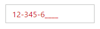

# Getting Started

This section helps to understand the getting started of the Aurelia MaskEdit with the step-by-step instructions.

## Create an MaskEdit Textbox

You can create an Aurelia application and add necessary scripts and styles with the help of the given [Aurelia Getting Started Documentation](https://help.syncfusion.com/aurelia/overview).

We already configured a template project in GitHub repository [syncfusion-template-repository](https://github.com/aurelia-ui-toolkits/syncfusion-template-repository). Run the below set of commands to clone the repository and install the required packages for Syncfusion Aurelia application.



> git clone "https://github.com/aurelia-ui-toolkits/syncfusion-template-repository"
> cd syncfusion-template-repository
> npm install
> jspm install



The below steps describes to create Syncfusion Aurelia MaskEdit component.

* Create `maskedit` folder inside `src/samples/` location.
* Create `maskedit.html` file inside `src/samples/maskedit` folder and use the below code example to render the MaskEdit component.



<template>
       <input id="maskedit" type="text" ej-mask-edit="e-value.bind:mvalue;e-mask-format.bind:maskFormat;e-width.bind:mwidth" />
</template>



* Create `maskedit.js` file with the below code snippet inside `src/samples/maskedit` folder.



export class Default {
    constructor() {
      this.mvalue = '4242422424';
      this.maskFormat = '99 999-99999';
      this.mwidth = '100%';
    }
}



* Now, we are going to configure the navigation for created MaskEdit sample in `src/app.js` file.



export class App {
 configureRouter(config, router) {
  config.title = 'Aurelia Syncfusion';
  config.map([
   { route: ['', 'welcome'], name: 'welcome', moduleId: 'welcome',                              
                nav: true, title: 'Welcome' },
   { route: 'child-router',  name: 'child-router', moduleId: 'child-router',                         
                nav: true, title: 'Child Router' },
   { route: 'button',        name: 'button', moduleId: 'samples/button/button',                
                nav: true, title: 'Button' },
   { route: 'maskedit',        name: 'maskedit',       moduleId: 'samples/maskedit/maskedit',                
                nav: true, title: 'maskedit' }
 ]);
 this.router = router;
 }
}



* To run the application, execute the following command.



gulp watch



Execution of above code will render the following output.

 

## Error Visibility

The MaskEdit has an option that shows the error value with red colored text. It is used to validate the Mask Edit value. You can set the showError property as “true” to enable this option.

The following steps explain the showError property in the MaskEdit control.



<template>
       <input id="maskedit" type="text" ej-mask-edit="e-value.bind:mvalue;e-mask-format.bind:maskFormat;e-show-error.bind:showerror" />
</template>





export class Default {
    constructor() {
      this.mvalue = '123456';
      this.maskFormat = '99 999-99999';
      this.showerror = true;
    }
}



Execution of above code will render the following output.

