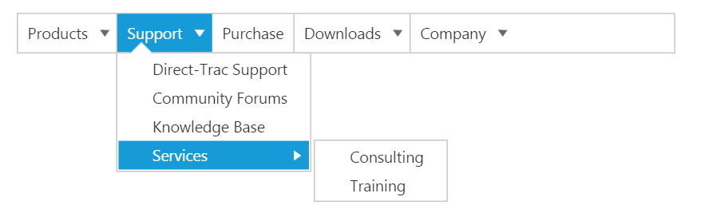
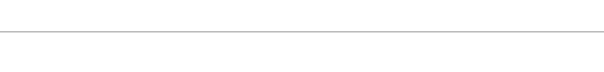
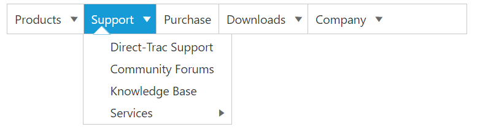

# Getting Started 

This section explains briefly about how to create a **Menu** control in your application with **Aurelia**. The **Essential JavaScript** **Menu** supports displaying a **Menu** of list-out items. This **Menu** is based on ul-li hierarchy, where the sub-list items are rendered as the sub-menu items. The **Menu** control can also be rendered with local and remote data source.  From the following guidelines, you can learn how to customize the **Menu** control for a website. In this case, **Syncfusion's** website **Menu** is discussed. The following screenshot displays the appearance of **Menu**.

 

## Create a Menu

**Essential JavaScript** **Menu** widgets are basically provided with built-in features like keyboard navigation, show and hide **Menu** items with animations, and flexible API's. From the following guidelines, you can learn how to render **Menu** control with Remote data source value.

Before we start with Menu, please refer [this page](https://help.syncfusion.com/aurelia/overview#getting-started) page for general information regarding integrating Syncfusion widget’s.

For quick start, we already configured a template project in GitHub repository [syncfusion-template-repository](https://github.com/aurelia-ui-toolkits/syncfusion-template-repository). Run the below set of commands to clone the repository and install the required packages for Syncfusion Aurelia application.



    > git clone "https://github.com/aurelia-ui-toolkits/syncfusion-template-repository"
    > cd syncfusion-template-repository
    > npm install
    > jspm install



The below steps describes to create Syncfusion Aurelia Menu component.

    Create Menu folder inside src/samples/ location.
    Create Menu.html file inside src/samples/Menu folder and use the below code example to render the Menu component.

Adding element for **Menu** rendering.



     <template>
       

         <ul id="syncfusionProducts" ej-menu>
         </ul>
       

     </template>





    export class menu { }



Output of the above steps.

 

## Configure parent Menu items

Every **Menu** has a list of **Menu** items with list of sub level **Menu** items. From the following guidelines, you can learn how to initialize the root level elements of **Menu** control with Local data source value.  Initialize the **Menu** with data source value as illustrated in the following code example. 



       <template>
          

          <ul id="syncfusionProducts"  ej-menu="e-fields.bind:fields;" >
          </ul>
          

       </template>





       var data = [
            { id: 1, text: "Products", parentId: null },
            { id: 2, text: "Support", parentId: null },
            { id: 3, text: "Purchase", parentId: null },
            { id: 4, text: "Downloads", parentId: null },
			{ id: 5, text: "Company", parentId: null }                 
        ];
     export class menu {
          constructor() {
           this.fields = {dataSource:data, text:"text" , id:"id", parentId:"parentId"};
         }
		
		}



The following screenshot displays output.

 

## Initialize sub-level Menu items

Every **Menu** items have a list of sub level **Menu** items. From the following guidelines, you can learn how to initialize the sub level items of **Menu** control. The **parentId** field is used to map root level **Menu** item to its sub level **Menu** item.								

The following code example describes how to initialize first level sub menu items of product **Menu** item.



       var data = [
            { id: 1, text: "Products", parentId: null },
            { id: 2, text: "Support", parentId: null },
            { id: 3, text: "Purchase", parentId: null },
            { id: 4, text: "Downloads", parentId: null },
			{ id: 5, text: "Company", parentId: null } ,
          //first level child
            { id: 11, parentId: 1, text: "ASP.NET" },
            { id: 12, parentId: 1, text: "ASP.NET MVC" },
            { id: 13, parentId: 1, text: "Mobile MVC" },
            { id: 14, parentId: 1, text: "Silverlight" },
            { id: 15, parentId: 2, text: "Direct-Trac Support" },
            { id: 16, parentId: 2, text: "Community Forums" },
            { id: 17, parentId: 2, text: "Knowledge Base" },
            { id: 18, parentId: 2, text: "Services" },
			{ id: 19, parentId: 4, text: "Evaluation" },
			{ id: 20, parentId: 4, text: "Free E-Books" },
			{ id: 21, parentId: 4, text: "Metro Studio" },
			{ id: 22, parentId: 4, text: "Latest Version" },
			{ id: 23, parentId: 5, text: "Technology Resource Portal " },
			{ id: 24, parentId: 5, text: "Case Studies" },
			{ id: 25, parentId: 5, text: "Bouchers & Datasheets" },
			{ id: 26, parentId: 5, text: "FAQ" }                   			
        ];
      export class menu {
          constructor() {
           this.fields = {dataSource:data, text:"text" , id:"id", parentId:"parentId"};
         }
		
		}
		


Execute the above code example to render the following output.

 

## Define multiple level Menu items

You can define the sub-menu items to multiple levels in **Menu** control. You need to specify the parent Id value to render sub level **Menu** item for the **Menu** items.

To initialize multiple levels sub menu items, use the following code example.



      var data = [
            { id: 1, text: "Products", parentId: null },
            { id: 2, text: "Support", parentId: null },
            { id: 3, text: "Purchase", parentId: null },
            { id: 4, text: "Downloads", parentId: null },
			{ id: 5, text: "Company", parentId: null } ,
          //first level child
            { id: 11, parentId: 1, text: "ASP.NET" },
            { id: 12, parentId: 1, text: "ASP.NET MVC" },
            { id: 13, parentId: 1, text: "Mobile MVC" },
            { id: 14, parentId: 1, text: "Silverlight" },
            { id: 15, parentId: 2, text: "Direct-Trac Support" },
            { id: 16, parentId: 2, text: "Community Forums" },
            { id: 17, parentId: 2, text: "Knowledge Base" },
            { id: 18, parentId: 2, text: "Services" },
			{ id: 19, parentId: 4, text: "Evaluation" },
			{ id: 20, parentId: 4, text: "Free E-Books" },
			{ id: 21, parentId: 4, text: "Metro Studio" },
			{ id: 22, parentId: 4, text: "Latest Version" },
			{ id: 23, parentId: 5, text: "Technology Resource Portal " },
			{ id: 24, parentId: 5, text: "Case Studies" },
			{ id: 25, parentId: 5, text: "Bouchers & Datasheets" },
			{ id: 26, parentId: 5, text: "FAQ" },
       //second level child
            {id: 111, parentId: 18, text: "Consulting" },
            { id: 112, parentId: 18, text: "Training" }       			
        ];
      export class menu {
          constructor() {
           this.fields = {dataSource:data, text:"text" , id:"id", parentId:"parentId"};
         }
		
		}  


The following screenshot is the output.

 

By following the above mentioned steps, you can render the **Menu** control with multiple level sub items through online data source. You can simply customize the **Menu** widget in an efficient manner.

In summary of this getting started, you have now simulated the **Syncfusion�s** website **Menu** with **Essential JavaScript Menu**. You have utilized and learn the appearance customization etc.  

By following the above mentioned steps, you can render the **Menu** control with multiple level sub items. You can simply customize the **Menu** in an efficient manner.

