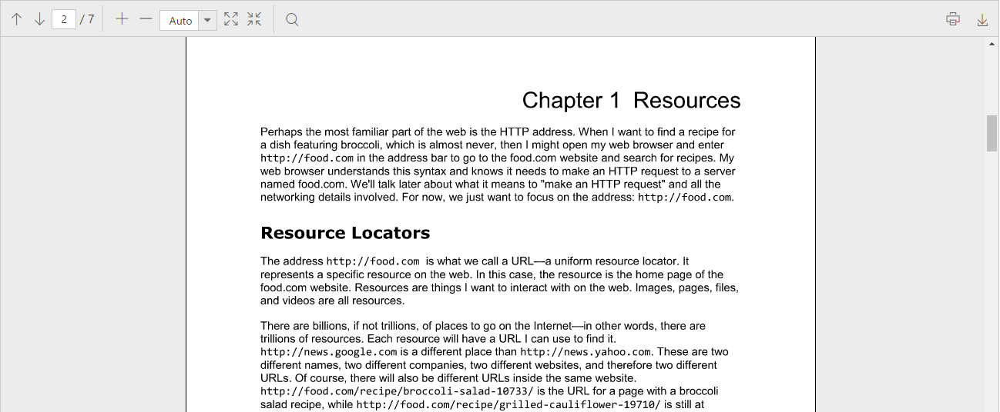

# Getting Started

Before we start with the PDF viewer control, please refer [this page](https://help.syncfusion.com/aurelia/overview#getting-started) for general information regarding integrating Syncfusion widgets.

For quick start, we already configured a template project in GitHub repository [syncfusion-template-repository](https://github.com/aurelia-ui-toolkits/syncfusion-template-repository). Run the below set of commands to clone the repository and install the required packages for Syncfusion Aurelia application.



    > git clone "https://github.com/aurelia-ui-toolkits/syncfusion-template-repository"
    > cd syncfusion-template-repository
    > npm install
    > jspm install



### Control Initialization

The below steps describe about, how to create Syncfusion Aurelia PDF viewer component.

    Create `pdfviewer` folder inside `src/samples/` location.
    Create `pdfviewer.html` file inside `src/samples/pdfviewer` folder and use the below code example to render the PDF viewer component.
	


<template>
  <require from="./pdfviewer.css"></require>
  

    <ej-pdf-viewer id="PdfViewer" e-service-url="http://js.syncfusion.com/ejservices/api/PdfViewer"></ej-pdf-viewer>
  

</template>



* Create `pdfviewer.js` file inside `src/samples/pdfviewer` folder with below code snippet.



export class BasicUse {

  constructor() {}

}



* Create `pdfviewer.css` file inside `src/samples/pdfviewer` folder with below code snippet.



ej-pdf-viewer {
    display: block;
    height: 500px;
}



Now, the PDF viewer control will be rendered with the default PDF document, which is used in the service.

