# Chart types

Essential **PivotChart JS** supports 17 different types of charts as follows:

   * Column
   * Stacking column
   * Bar
   * Stacking bar
   * Line
   * Step line
   * Spline
   * Area
   * Step area
   * Spline area
   * Stacking area
   * Pie
   * Doughnut
   * Pyramid
   * Funnel
   * Scatter
   * Bubble

## Column chart

The **column chart** is the most commonly used chart type. It uses vertical bars (called columns) to display different values of one or more items. Points from adjacent series are drawn as bars next to each other. It is used to compare the frequency, count, total, or average of the data in different categories. It is ideal to show the variations in the value of an item over a period of time.



export class BasicUse {
  constructor() {

        ... //datasource

       this.commonSeries = {
            type: 'column'
        };
    }
}



The following screenshot displays the **column chart**.

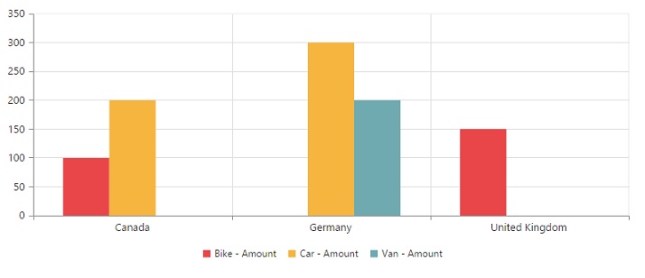

## Stacking column chart

The **stacking column** chart is similar to column chart except the Y-values. These Y-values stack on top of each other in a specified series order. This helps to visualize the relationship of parts to the whole chart across various categories.



export class BasicUse {
  constructor() {

        ... //datasource

       this.commonSeries = {
            type: 'stackingcolumn'
        };
    }
}



The following screenshot displays the **stacking column chart**.

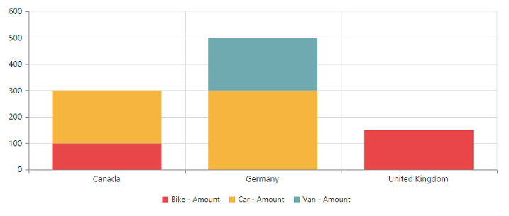

## Bar chart

The **bar chart** displays horizontal bars for each point in the series and points from adjacent series. Bar charts are used to compare values across various categories for displaying the variations in the value of an item over a period of time or comparing the values of several items in a single point of time.



export class BasicUse {
  constructor() {

        ... //datasource

       this.commonSeries = {
            type: 'bar'
        };
    }
}



The following screenshot displays a **bar chart**.

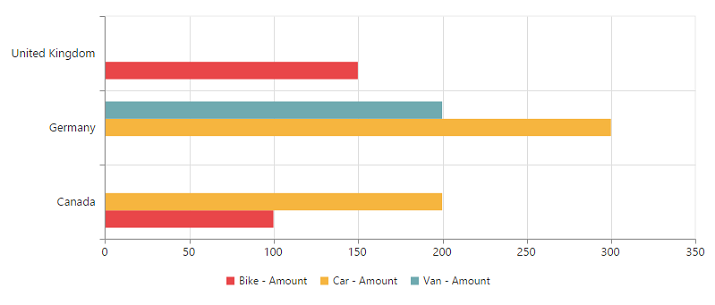

## Stacking bar chart

The **stacking bar chart** is a regular **bar** chart with the X-values stacked on top of each other in the specified series order.



export class BasicUse {
  constructor() {

        ... //datasource

       this.commonSeries = {
            type: 'stackingbar'
        };
    }
}



The following screenshot displays the **stacking bar chart.**

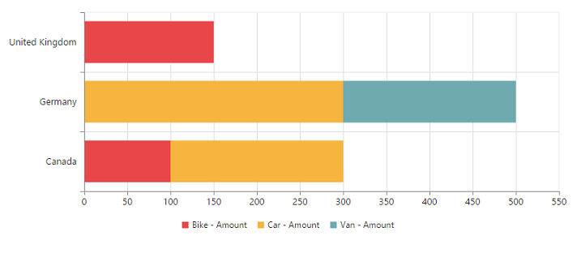

## Line chart

The **line chart** joins the data points on a plot by using straight lines that show trends in the data at equal intervals.



export class BasicUse {
  constructor() {

        ... //datasource

       this.commonSeries = {
            type: 'line'
        };
    }
}



The following screenshot displays the **line chart**.

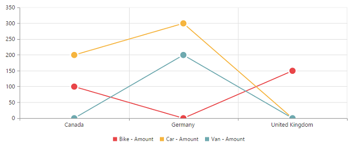

## Step line chart

**Step line chart** uses horizontal and vertical lines to connect the data points resulting in a step like progression.



export class BasicUse {
  constructor() {

        ... //datasource

       this.commonSeries = {
            type: 'stepline'
        };
    }
}



The following screenshot displays the **step line chart.**

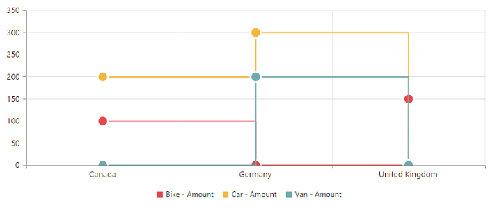

## Spline chart

The **spline chart** is similar to line chart whereas it connects different data points with curved lines instead of straight lines.



export class BasicUse {
  constructor() {

        ... //datasource

       this.commonSeries = {
            type: 'spline'
        };
    }
}



The following screenshot displays the **spline chart**.

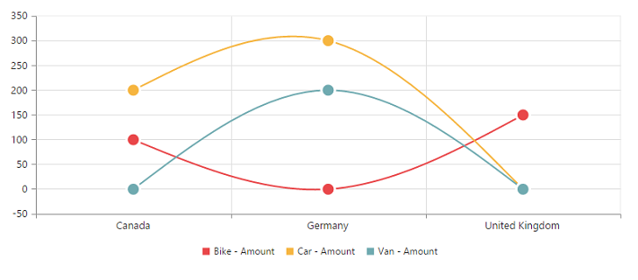

## Area chart

The **area chart** emphasizes the degree of change of values over a period of time. Instead of rendering the data as discrete bars or columns, the area chart renders continuous ebb-and-flow pattern as defined against the y-axis.



export class BasicUse {
  constructor() {

        ... //datasource

       this.commonSeries = {
            type: 'area'
        };
    }
}



The following screenshot displays the **area chart**.

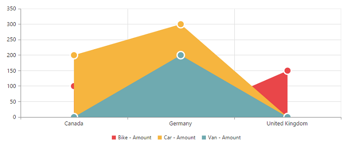

## Step area chart

The **step area** chart is similar to the regular area chart except a straight line tracing the shortest path between the data points. The values are connected by continuous vertical and horizontal lines to form a step like progression.



export class BasicUse {
  constructor() {

        ... //datasource

       this.commonSeries = {
            type: 'steparea'
        };
    }
}



The following screenshot displays the **step area chart.**

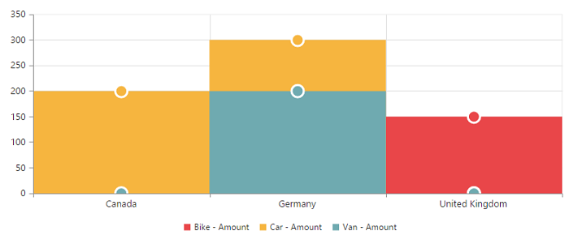

## Spline area chart

The **spline area** chart is similar to area chart which differs by connecting the data points of a series. It connects each series of points by a smooth **spline curve**.



export class BasicUse {
  constructor() {

        ... //datasource

       this.commonSeries = {
            type: 'splinearea'
        };
    }
}



The following screenshot displays the **spline area chart.**

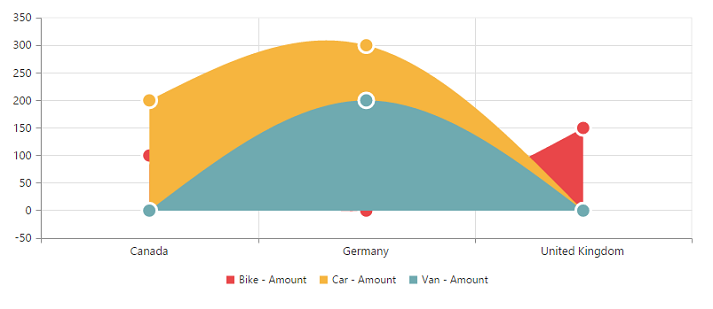

## Stacking area chart

The **stacking area** chart is similar to regular area chart except the “Y-values”. These “Y-values” stack on top of each other in the specified series order. It helps to visualize the relationship of parts to the whole chart across various categories.



export class BasicUse {
  constructor() {

        ... //datasource

       this.commonSeries = {
            type: 'stackingarea'
        };
    }
}



The following screenshot displays the **Stacking Area Chart.**

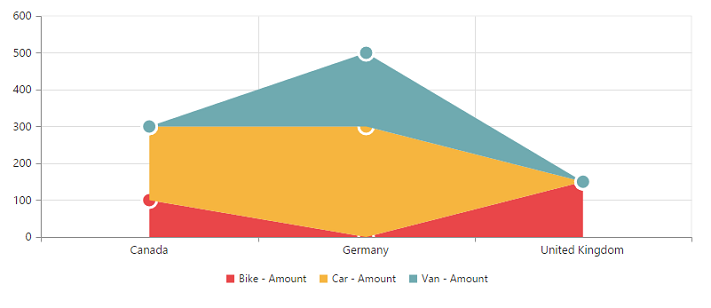

## Pie chart

The **pie chart** is used to summarize a set of categorical data or displaying different values of a given variable (e.g., percentage distribution). This type of chart is a circle form that is divided into several segments. Each segment represents a particular category.



export class BasicUse {
  constructor() {

        ... //datasource

       this.commonSeries = {
            type: 'pie'
        };
    }
}



The following screenshot displays the **pie chart**.

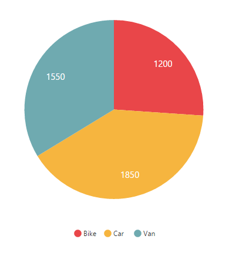

## Doughnut chart

The **doughnut chart** is used to summarize a set of categorical data which possesses a doughnut like structure that is divided into several segments. Each segment represents a particular category.



export class BasicUse {
  constructor() {

        ... //datasource

       this.commonSeries = {
            type: 'doughnut'
        };
    }
}



The following screenshot displays the **doughnut chart**.

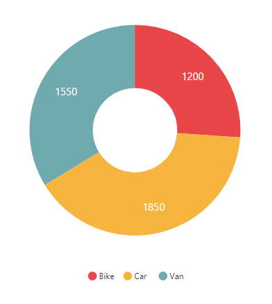

## Pyramid chart

The **pyramid chart** type displays the data in the form of a triangle. It helps you to visualize the data in a hierarchical structure without any axes.



export class BasicUse {
  constructor() {

        ... //datasource

       this.commonSeries = {
            type: 'pyramid'
        };
    }
}



The following screenshot displays the **pyramid chart.**

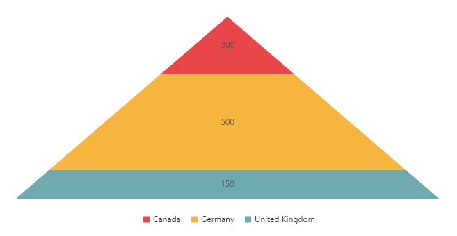

## Funnel chart

The **funnel chart** type displays the data in the form of an inverted triangle. It helps you to visualize the data in a hierarchical structure without any axes.



export class BasicUse {
  constructor() {

        ... //datasource

       this.commonSeries = {
            type: 'funnel'
        };
    }
}



The following screenshot displays the **funnel chart:**

## Scatter chart

The **scatter chart** type displays the data as a collection of points corresponding to associated values.



export class BasicUse {
  constructor() {

        ... //datasource

       this.commonSeries = {
            type: 'scatter'
      };
   }
}



The following screenshot displays the **scatter chart:**

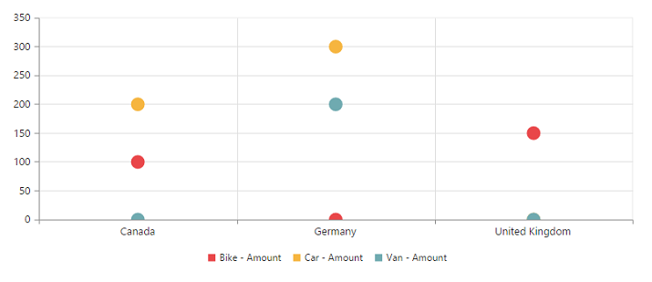

## Bubble chart

The **bubble chart** type displays the data as a collection of bubbles.



export class BasicUse {
  constructor() {

        ... //datasource

       this.commonSeries = {
             type: 'bubble'
        };
    }
}



The following screenshot displays the **bubble chart:**

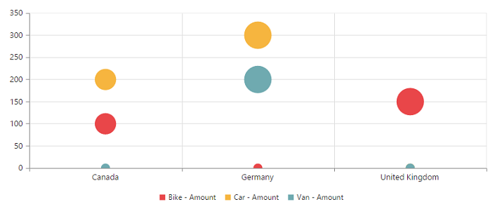

## Combination chart

A **combination chart** combines two or more series types in a single chart. But there are some limitations in the combination chart. They are:

   1. The combination chart cannot combine the column and bar series.
   2. The pie chart cannot be used with other series types.



<template>
  

    <ej-pivot-chart e-common-series-options.bind="commonSeries" e-on-series-rendering.delegate="onSeriesRenders($event.detail)">
    </ej-pivot-chart>
  

</template>





    export class BasicUse {
       constructor() {
            //...
            this.commonSeries = {
             type: 'line'
        };

        }

     onSeriesRenders(args) {
        let chartObj = $('.e-pivotchart').data('ejPivotChart');
        chartObj.model.series[5].type = ej.PivotChart.ChartTypes.Column;
        chartObj.model.series[5].marker.visible = true;
      }
    }


