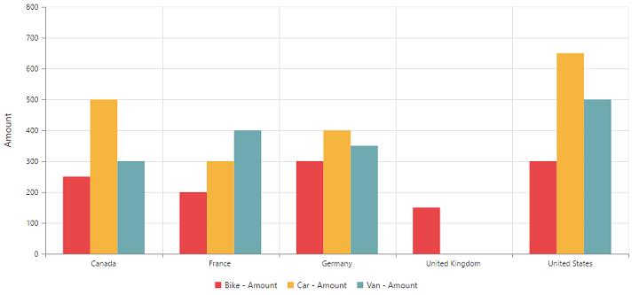

# Getting Started

Before we start with the PivotChart, please refer [this page](https://help.syncfusion.com/aurelia/overview#getting-started) page for general information regarding integrating Syncfusion widgets.

For quick start, we already configured a template project in GitHub repository [syncfusion-template-repository](https://github.com/aurelia-ui-toolkits/syncfusion-template-repository). Run the below set of commands to clone the repository and install the required packages for Syncfusion Aurelia application.



    > git clone "https://github.com/aurelia-ui-toolkits/syncfusion-template-repository"
    > cd syncfusion-template-repository
    > npm install
    > jspm install



## Relational

This section covers the information that you need to know to populate a simple PivotChart with Relational data source.

### Control Initialization

The below steps describes to create Syncfusion Aurelia PivotChart component.

    Create `pivotchart` folder inside `src/samples/` location.
    Create `pivotchart.html` file inside `src/samples/pivotchart` folder and use the below code example to render the PivotChart component.



<template>
  <require from="./pivotchart.css"></require>
  

    <ej-pivot-chart id="PivotChart1"></ej-pivot-chart>
  

</template>



* Create `pivotchart.js` file inside `src/samples/pivotchart` folder with below code snippet.



export class BasicUse {

  constructor() {}

}



* Create `pivotchart.css` file inside `src/samples/pivotchart` folder with below code snippet.



ej-pivot-chart {
    display: block;
    height: 460px;
}



### Populate PivotChart with Data

Let us now see how to populate the PivotChart control using a sample JSON data as shown below.



<template>
  <require from="./pivotchart.css"></require>
  

    <ej-pivot-chart id="PivotChart1" e-data-source.bind="pivotData" e-load.bind="loadTheme" e-common-series-options.bind="commonSeries" e-legend.bind="legend"
      e-size.bind="size" e-primary-y-axis.bind="primaryYAxis">
    </ej-pivot-chart>
  

</template>





export class BasicUse {
  constructor() {
    this.pivotData = {
      data: [{ Amount: 100, Country: 'Canada', Date: 'FY 2005', Product: 'Bike', Quantity: 2, State: 'Alberta' },
        { Amount: 200, Country: 'Canada', Date: 'FY 2006', Product: 'Van', Quantity: 3, State: 'British Columbia' },
        { Amount: 300, Country: 'Canada', Date: 'FY 2007', Product: 'Car', Quantity: 4, State: 'Brunswick' },
        { Amount: 150, Country: 'Canada', Date: 'FY 2008', Product: 'Bike', Quantity: 3, State: 'Manitoba' },
        { Amount: 200, Country: 'Canada', Date: 'FY 2006', Product: 'Car', Quantity: 4, State: 'Ontario' },
        { Amount: 100, Country: 'Canada', Date: 'FY 2007', Product: 'Van', Quantity: 1, State: 'Quebec' },
        { Amount: 200, Country: 'France', Date: 'FY 2005', Product: 'Bike', Quantity: 2, State: 'Charente-Maritime' },
        { Amount: 250, Country: 'France', Date: 'FY 2006', Product: 'Van', Quantity: 4, State: 'Essonne' },
        { Amount: 300, Country: 'France', Date: 'FY 2007', Product: 'Car', Quantity: 3, State: 'Garonne (Haute)' },
        { Amount: 150, Country: 'France', Date: 'FY 2008', Product: 'Van', Quantity: 2, State: 'Gers' },
        { Amount: 200, Country: 'Germany', Date: 'FY 2006', Product: 'Van', Quantity: 3, State: 'Bayern' },
        { Amount: 250, Country: 'Germany', Date: 'FY 2007', Product: 'Car', Quantity: 3, State: 'Brandenburg' },
        { Amount: 150, Country: 'Germany', Date: 'FY 2008', Product: 'Car', Quantity: 4, State: 'Hamburg' },
        { Amount: 200, Country: 'Germany', Date: 'FY 2008', Product: 'Bike', Quantity: 4, State: 'Hessen' },
        { Amount: 150, Country: 'Germany', Date: 'FY 2007', Product: 'Van', Quantity: 3, State: 'Nordrhein-Westfalen' },
        { Amount: 100, Country: 'Germany', Date: 'FY 2005', Product: 'Bike', Quantity: 2, State: 'Saarland' },
        { Amount: 150, Country: 'United Kingdom', Date: 'FY 2008', Product: 'Bike', Quantity: 5, State: 'England' },
        { Amount: 250, Country: 'United States', Date: 'FY 2007', Product: 'Car', Quantity: 4, State: 'Alabama' },
        { Amount: 200, Country: 'United States', Date: 'FY 2005', Product: 'Van', Quantity: 4, State: 'California' },
        { Amount: 100, Country: 'United States', Date: 'FY 2006', Product: 'Bike', Quantity: 2, State: 'Colorado' },
        { Amount: 150, Country: 'United States', Date: 'FY 2008', Product: 'Car', Quantity: 3, State: 'New Mexico' },
        { Amount: 200, Country: 'United States', Date: 'FY 2005', Product: 'Bike', Quantity: 4, State: 'New York' },
        { Amount: 250, Country: 'United States', Date: 'FY 2008', Product: 'Car', Quantity: 3, State: 'North Carolina' },
        { Amount: 300, Country: 'United States', Date: 'FY 2007', Product: 'Van', Quantity: 4, State: 'South Carolina' }
      ],
      rows: [
        {
          fieldName: 'Country',
          fieldCaption: 'Country'
        },
        {
          fieldName: 'State',
          fieldCaption: 'State'
        },
        {
          fieldName: 'Date',
          fieldCaption: 'Date'
        }
      ],
      columns: [
        {
          fieldName: 'Product',
          fieldCaption: 'Product'
        }
      ],
      values: [
        {
          fieldName: 'Amount',
          fieldCaption: 'Amount'
        }
      ]
    };
    this.primaryYAxis = {title: {text: 'Amount'}};
    this.size = {height: '460px', width: '950px'};
    this.legend = {visible: true};
    this.loadTheme = 'laodTheme';
    this.commonSeries = {
      enableAnimation: true,
      type: 'column'
    };
  }
}



The above code will generate a simple PivotChart with sales amount over products in different regions.

## OLAP

This section covers the information that you need to know to populate a simple PivotChart with OLAP data source.

### Control Initialization

The below steps describes to create Syncfusion Aurelia PivotChart component.

    Create `pivotchart` folder inside `src/samples/` location.
    Create `pivotchart.html` file inside `src/samples/pivotchart` folder and use the below code example to render the PivotChart component.



<template>
  <require from="./pivotchart.css"></require>
  

    <ej-pivot-chart id="PivotChart1"></ej-pivot-chart>
  

</template>



* Create `pivotchart.js` file inside `src/samples/pivotchart` folder with below code snippet.



export class BasicUse {

  constructor() {}

}



* Create `pivotchart.css` file inside `src/samples/pivotchart` folder with below code snippet.



ej-pivot-chart {
    display: block;
    height: 460px;
}



### Populate PivotChart with Data

Let us now see how to populate the PivotChart control using a sample JSON data as shown below.



<template>
  <require from="./pivotchart.css"></require>
  

    <ej-pivot-chart id="PivotChart1" e-data-source.bind="pivotData" e-load.bind="loadTheme" e-common-series-options.bind="commonSeries" e-legend.bind="legend"
      e-size.bind="size" e-primary-y-axis.bind="primaryYAxis" e-primary-x-axis.bind="primaryXAxis">
    </ej-pivot-chart>
  

</template>





export class BasicUse {
  constructor() {
    this.pivotData = {
      data: 'http://bi.syncfusion.com/olap/msmdpump.dll', //data
      catalog: 'Adventure Works DW 2008 SE',
      cube: 'Adventure Works',
      rows: [
        {
          fieldName: '[Date].[Fiscal]'
        }
      ],
      columns: [
        {
          fieldName: '[Customer].[Customer Geography]'
        }
      ],
      values: [
        {
          measures: [
            {
              fieldName: '[Measures].[Internet Sales Amount]'
            }
          ],
          axis: 'columns'
        }
      ]
    };
    this.commonSeries = {
      enableAnimation: true,
      type: 'column'
    };
    this.loadTheme = 'loadTheme';
    this.primaryYAxis = {title: {text: 'Internet Sales Amount'}};
    this.size = {height: '460px', width: '950px'};
    this.legend = {visible: true, rowCount: 2 };
  }
}



The above code will generate a simple PivotChart with internet sales amount over a period of fiscal years across different customer geographic locations.

