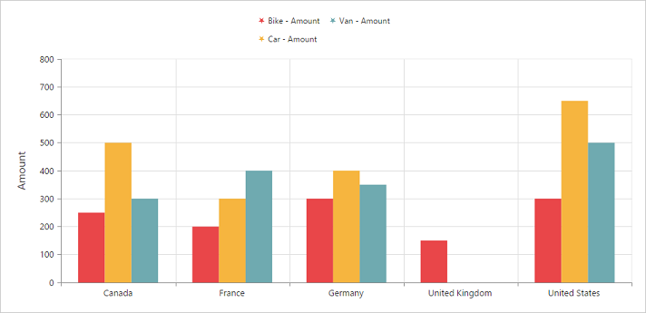
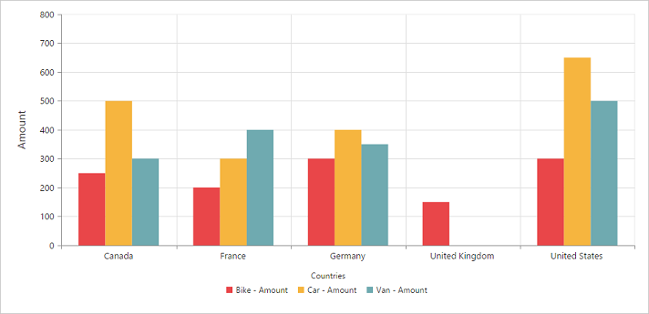
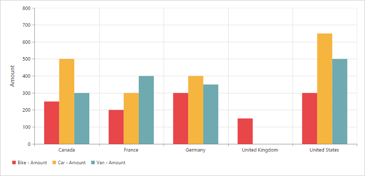
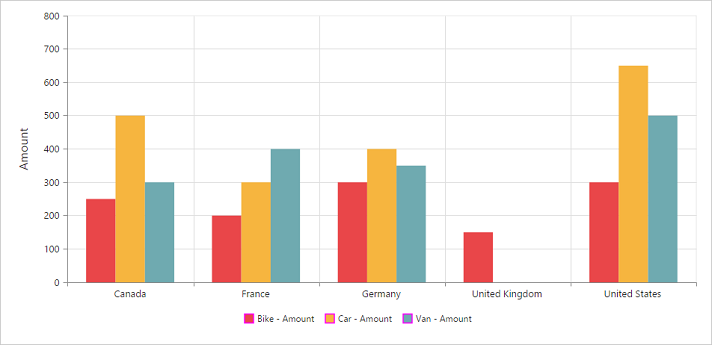
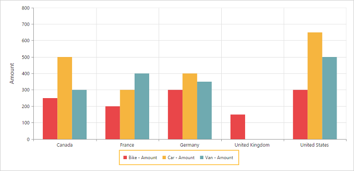

# Legend

## Legend visibility

You can enable or disable the legend by using the [`visible`](/api/js/ejchart#members:legend) property in the [`legend`](/api/js/ejchart#members:legend) object. By default, the legend is enabled in the pivot chart.

N> By default, the legend is visible in the pivot chart.



<template>
  

    <ej-pivot-chart e-legend.bind="legend">
    </ej-pivot-chart>
  

</template>





export class BasicUse {
  constructor() {

        ... //datasource

      this.legend = {visible: true};
    }
}



## Legend shape
You can customize the legend [`shape`](/api/js/ejchart#members:legend-shape) in the pivot chart widget. The default value of legend shape is “Rectangle”. The following are the supported legend shapes:

* Rectangle
* Circle
* Cross
* Diamond
* Pentagon
* Hexagon
* Star
* Ellipse
* Triangle.



<template>
  

    <ej-pivot-chart e-legend.bind="legend">
    </ej-pivot-chart>
  

</template>





export class BasicUse {
  constructor() {

        ... //datasource

      this.legend = { visible: true, shape: 'circle' };
    }
}



## Legend position
By using the [`position`](/api/js/ejchart#members:legend-position) property, you can place the legend at top, bottom, left, or right of the pivot chart.

N> The default value of the legend position is bottom in the pivot chart.



<template>
  

    <ej-pivot-chart e-legend.bind="legend">
    </ej-pivot-chart>
  

</template>





export class BasicUse {
  constructor() {

        ... //datasource

      this.legend = { visible: true, position:'top' };
    }
}



## Legend title
To add a legend title, you should specify the title text in the [`title.text`](/api/js/ejchart#members:legend-title-text) property.



<template>
  

    <ej-pivot-chart e-legend.bind="legend">
    </ej-pivot-chart>
  

</template>





export class BasicUse {
  constructor() {

        ... //datasource

      this.legend = {visible: true, title: { text: 'Countries'}};
    }
}



## Legend alignment
You can align the legend to center, far, and near based on its position in the chart area by using the [`alignment`](/api/js/ejchart#members:legend-alignment).



<template>
  

    <ej-pivot-chart e-legend.bind="legend">
    </ej-pivot-chart>
  

</template>





export class BasicUse {
  constructor() {

        ... //datasource

      this.legend = {visible: true, alignment: 'near'};
    }
}



## Legend items - size and border
By using the [`itemStyle.width`](/api/js/ejchart#members:legend-itemstyle-width), [`itemStyle.height`](/api/js/ejchart#members:legend-itemstyle-height), and [`itemStyle.border`](/api/js/ejchart#members:legend-itemstyle-border) properties of the legend, you can change the size and border of legend items.



<template>
  

    <ej-pivot-chart e-legend.bind="legend">
    </ej-pivot-chart>
  

</template>





export class BasicUse {
  constructor() {

        ... //datasource

      this.legend = {visible: true, itemStyle:
            {
                height: 12,
                width: 12,
                border:
                {
                    color: 'magenta',
                    width: 1.5
                }
            }
        };
    }
}



## Legend border
By using the [`border`](/api/js/ejchart#members:legend-border) in the legend, you can customize the color and width of the border.



<template>
  

    <ej-pivot-chart e-legend.bind="legend">
    </ej-pivot-chart>
  

</template>





export class BasicUse {
  constructor() {

        ... //datasource

      this.legend = {visible: true, border:
            {
                color: "#FFC342",
                width: 2
            }

        };
    }
}



## Legend text
By using the [`font`](/api/js/ejchart#members:legend-font), you can customize the font family, font style, font weight, and size of the legend text.



<template>
  

    <ej-pivot-chart e-legend.bind="legend">
    </ej-pivot-chart>
  

</template>





export class BasicUse {
  constructor() {

        ... //datasource

      this.legend = {visible: true,
            font: {
                fontFamily: 'Segoe UI',
                fontStyle: 'italic',
                fontWeight: 'bold',
                size: '13px'
            }

        };
    }
}



