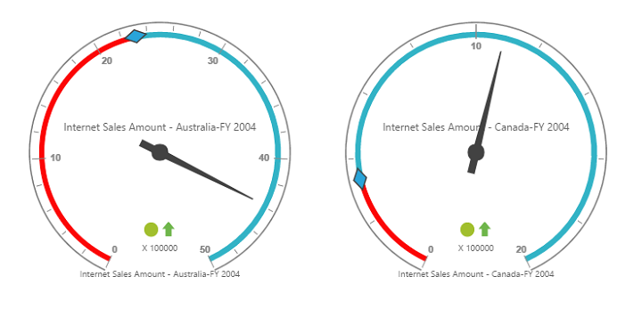

# Getting Started

Before we start with the PivotGauge, please refer [this page](https://help.syncfusion.com/aurelia/overview#getting-started) page for general information regarding integrating Syncfusion widgets.

For quick start, we already configured a template project in GitHub repository [syncfusion-template-repository](https://github.com/aurelia-ui-toolkits/syncfusion-template-repository). Run the below set of commands to clone the repository and install the required packages for Syncfusion Aurelia application.



    > git clone "https://github.com/aurelia-ui-toolkits/syncfusion-template-repository"
    > cd syncfusion-template-repository
    > npm install
    > jspm install



## Relational

This section covers the information that you need to know to populate a simple PivotGauge with Relational data source.

### Control Initialization

The below steps describes to create Syncfusion Aurelia PivotGauge component.

    Create `pivotgauge` folder inside `src/samples/` location.
    Create `pivotgauge.html` file inside `src/samples/pivotgauge` folder and use the below code example to render the PivotGauge component.



<template>
  <require from="./pivotgauge.css"></require>
  

    <ej-pivot-gauge id="PivotGauge1"></ej-pivot-gauge>
  

</template>



* Create `pivotgauge.js` file inside `src/samples/pivotgauge` folder with below code snippet.



export class BasicUse {

  constructor() {}

}



* Create `pivotgauge.css` file inside `src/samples/pivotgauge` folder with below code snippet.



ej-pivot-gauge {
    min-height: 275px; 
    height: 338px; 
    width: 100%; 
    overflow: auto; 
    position:relative !important;
}



### Populate PivotGauge with data

Let us now see how to populate the PivotGauge control using a sample JSON data as shown below.



<template>
  <require from="./pivotgauge.css"></require>
  

    <ej-pivot-gauge id="PivotGauge1" e-data-source.bind="pivotData" e-enable-tooltip="true" e-rows-count.bind="rowsCount" e-columns-count.bind="columnsCount" 
    e-scales.bind="scales" e-load.bind="loadGaugeTheme" e-background-color="transparent">
    </ej-pivot-gauge>
  

</template>





export class BasicUse {
  constructor() {
    this.pivotData = {
      data: [{ Amount: 100, Country: 'Canada', Date: 'FY 2005', Product: 'Bike', Quantity: 2, State: 'Alberta' },
        { Amount: 200, Country: 'Canada', Date: 'FY 2006', Product: 'Van', Quantity: 3, State: 'British Columbia' },
        { Amount: 300, Country: 'Canada', Date: 'FY 2007', Product: 'Car', Quantity: 4, State: 'Brunswick' },
        { Amount: 150, Country: 'Canada', Date: 'FY 2008', Product: 'Bike', Quantity: 3, State: 'Manitoba' },
        { Amount: 200, Country: 'Canada', Date: 'FY 2006', Product: 'Car', Quantity: 4, State: 'Ontario' },
        { Amount: 100, Country: 'Canada', Date: 'FY 2007', Product: 'Van', Quantity: 1, State: 'Quebec' },
        { Amount: 200, Country: 'France', Date: 'FY 2005', Product: 'Bike', Quantity: 2, State: 'Charente-Maritime' },
        { Amount: 250, Country: 'France', Date: 'FY 2006', Product: 'Van', Quantity: 4, State: 'Essonne' },
        { Amount: 300, Country: 'France', Date: 'FY 2007', Product: 'Car', Quantity: 3, State: 'Garonne (Haute)' },
        { Amount: 150, Country: 'France', Date: 'FY 2008', Product: 'Van', Quantity: 2, State: 'Gers' },
        { Amount: 200, Country: 'Germany', Date: 'FY 2006', Product: 'Van', Quantity: 3, State: 'Bayern' },
        { Amount: 250, Country: 'Germany', Date: 'FY 2007', Product: 'Car', Quantity: 3, State: 'Brandenburg' },
        { Amount: 150, Country: 'Germany', Date: 'FY 2008', Product: 'Car', Quantity: 4, State: 'Hamburg' },
        { Amount: 200, Country: 'Germany', Date: 'FY 2008', Product: 'Bike', Quantity: 4, State: 'Hessen' },
        { Amount: 150, Country: 'Germany', Date: 'FY 2007', Product: 'Van', Quantity: 3, State: 'Nordrhein-Westfalen' },
        { Amount: 100, Country: 'Germany', Date: 'FY 2005', Product: 'Bike', Quantity: 2, State: 'Saarland' },
        { Amount: 150, Country: 'United Kingdom', Date: 'FY 2008', Product: 'Bike', Quantity: 5, State: 'England' },
        { Amount: 250, Country: 'United States', Date: 'FY 2007', Product: 'Car', Quantity: 4, State: 'Alabama' },
        { Amount: 200, Country: 'United States', Date: 'FY 2005', Product: 'Van', Quantity: 4, State: 'California' },
        { Amount: 100, Country: 'United States', Date: 'FY 2006', Product: 'Bike', Quantity: 2, State: 'Colorado' },
        { Amount: 150, Country: 'United States', Date: 'FY 2008', Product: 'Car', Quantity: 3, State: 'New Mexico' },
        { Amount: 200, Country: 'United States', Date: 'FY 2005', Product: 'Bike', Quantity: 4, State: 'New York' },
        { Amount: 250, Country: 'United States', Date: 'FY 2008', Product: 'Car', Quantity: 3, State: 'North Carolina' },
        { Amount: 300, Country: 'United States', Date: 'FY 2007', Product: 'Van', Quantity: 4, State: 'South Carolina' }
      ],
      rows: [
        {
          fieldName: 'Country',
          fieldCaption: 'Country'
        },
        {
          fieldName: 'State',
          fieldCaption: 'State'
        }
      ],
      columns: [
        {
          fieldName: 'Product',
          fieldCaption: 'Product'
        }
      ],
      values: [
        {
          fieldName: 'Amount',
          fieldCaption: 'Amount'
        },
        {
          fieldName: 'Quantity',
          fieldCaption: 'Quantity'
        }
      ]
    };
    this.rowsCount = 2;
    this.columnsCount = 3;
    this.backgroundColor = 'transparent';
    this.loadGaugeTheme = 'loadGaugeTheme';
    this.scales = [{
      showRanges: true,
      radius: 150, showScaleBar: true, size: 1,
      border: {
        width: 0.5
      },
      showIndicators: true, showLabels: true,
      pointers: [{
        showBackNeedle: true,
        backNeedleLength: 20,
        length: 125,
        width: 7
      },
      {
        type: 'marker',
        markerType: 'diamond',
        distanceFromScale: 5,
        placement: 'center',
        backgroundColor: '#29A4D9',
        length: 25,
        width: 15
      }],
      ticks: [{
        type: 'major',
        distanceFromScale: 2,
        height: 16,
        width: 1, color: '#8c8c8c'
      }, {
        type: 'minor',
        height: 6,
        width: 1,
        distanceFromScale: 2,
        color: '#8c8c8c'
      }],
      labels: [{
        color: '#8c8c8c'
      }],
      ranges: [{
        distanceFromScale: -5,
        backgroundColor: '#fc0606',
        border: {
          color: '#fc0606'
        }
      }, {
        distanceFromScale: -5
      }],
      customLabels: [{
        position: { x: 180, y: 290 },
        font: { size: '10px', fontFamily: 'Segoe UI', fontStyle: 'Normal' }, color: '#666666'
      }, {
        position: { x: 180, y: 320 },
        font: { size: '10px', fontFamily: 'Segoe UI', fontStyle: 'Normal' }, lcolor: '#666666'
      }, {
        position: { x: 180, y: 150 },
        font: { size: '12px', fontFamily: 'Segoe UI', fontStyle: 'Normal' }, color: '#666666'
      }]
    }];
  }
}



The above code will generate a simple PivotGauge as shown in below figure.

## OLAP

This section covers the information that you need to know to populate a simple PivotGauge with OLAP data source.

### Control Initialization

The below steps describes to create Syncfusion Aurelia PivotGauge component.

    Create `pivotgauge` folder inside `src/samples/` location.
    Create `pivotgauge.html` file inside `src/samples/pivotgauge` folder and use the below code example to render the PivotGauge component.



<template>
  <require from="./pivotgauge.css"></require>
  

    <ej-pivot-gauge id="PivotGauge1"></ej-pivot-gauge>
  

</template>



* Create `pivotgauge.js` file inside `src/samples/pivotgauge` folder with below code snippet.



export class BasicUse {

  constructor() {}

}



* Create `pivotgauge.css` file inside `src/samples/pivotgauge` folder with below code snippet.



ej-pivot-gauge {
    min-height: 275px; 
    height: 338px; 
    width: 100%; 
    overflow: auto; 
    position:relative !important;
}



### Populate PivotGauge with data

Let us now see how to populate the PivotGauge control using a sample JSON data as shown below.



<template>
  <require from="./pivotgauge.css"></require>
  

   <ej-pivot-gauge id="PivotGauge1" e-data-source.bind="pivotData" e-enable-tooltip="true" e-rows-count.bind="rowsCount" e-columns-count.bind="columnsCount" 
    e-scales.bind="scales" e-load.bind="loadGaugeTheme" e-background-color="transparent">
    </ej-pivot-gauge>
  

</template>





import {Component, ViewEncapsulation} from '@angular/core';

@Component({
  selector: 'sd-home',
  templateUrl: 'app/components/pivotgauge/pivotgauge.component.html', //give the path file for pivotgauge component html file.
  styleUrls: ['app/components/pivotgauge/pivotgauge.component.css'],  //give the path file for pivotgauge component css file.
})
export class PivotGaugeComponent {
  public data; cube; catalog; rows; columns;values;scales;
    constructor() {
      this.data = "http://bi.syncfusion.com/olap/msmdpump.dll";
      this.cube = "Adventure Works";
      this.catalog = "Adventure Works DW 2008 SE";
      this.rows = [{ fieldName: "[Date].[Fiscal]", filterItems: { filterType: "include", values: ["[Date].[Fiscal].[Fiscal Year].&amp;[2004]"] } }];
      this.columns = [{ fieldName: "[Customer].[Customer Geography]" }];
      this.values = [{ measures: [{ fieldName: "[Measures].[Internet Sales Amount]", }, { fieldName: "[Measures].[Internet Revenue Status]" }, { fieldName: "[Measures].[Internet Revenue Trend]" }, { fieldName: "[Measures].[Internet Revenue Goal]" },], axis: "columns" }];
      this.scales = [{
                            showRanges: true,
                            radius: 150, showScaleBar: true, size: 1,
                            border: {
                                width: 0.5
                            },
                            showIndicators: true, showLabels: true,
                            pointers: [{
                                    showBackNeedle: true,
                                    backNeedleLength: 20,
                                    length: 120,
                                    width: 7
                                },
                                {
                                    type: "marker",
                                    markerType: "diamond",
                                    distanceFromScale: 5,
                                    placement: "center",
                                    backgroundColor: "#29A4D9",
                                    length: 25,
                                    width: 15
                                }],
                            ticks: [{
                                    type: "major",
                                    distanceFromScale: 2,
                                    height: 16,
                                    width: 1, color: "#8c8c8c"
                                },
                                {
                                    type: "minor",
                                    height: 6,
                                    width: 1,
                                    distanceFromScale: 2,
                                    color: "#8c8c8c"
                                }],
                            labels: [{
                                    color: "#8c8c8c"
                                }],
                            ranges: [{
                                    distanceFromScale: -5,
                                    backgroundColor: "#fc0606",
                                    border: { color: "#fc0606" }
                                }, {
                                    distanceFromScale: -5
                                }],
                            customLabels: [{
                                    position: { x: 180, y: 290 },
                                    font: { size: "10px", fontFamily: "Segoe UI", fontStyle: "Normal" }, color: "#666666"
                                }, {
                                    position: { x: 180, y: 320 },
                                    font: { size: "10px", fontFamily: "Segoe UI", fontStyle: "Normal" }, color: "#666666"
                                }, {
                                    position: { x: 180, y: 150 },
                                    font: { size: "12px", fontFamily: "Segoe UI", fontStyle: "Normal" }, color: "#666666"
                                }]
                        }];
    }
}



The above code will generate a simple PivotGauge as shown in below figure.

