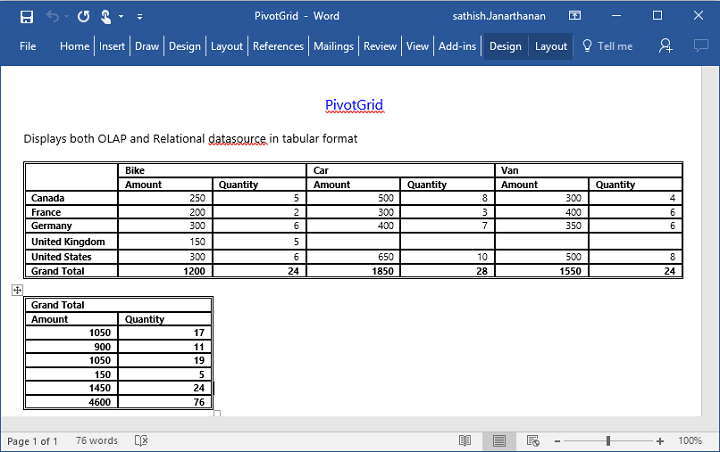

# Exporting

The pivot grid control can be exported to the following file formats:

* Microsoft Excel
* Microsoft Word
* PDF
* CSV

The pivot grid control can be exported by invoking the [`exportPivotGrid`](../api/ejpivotgrid#methods:exportPivotGrid) public method, with an appropriate export option as a parameter.

## JSON export



<template>
  

  

   <ej-pivot-grid id="PivotGrid1">
    </ej-pivot-grid>
    

    
Exporting:

    <button id="button" ej-button="e-text.bind:textValue1" e-on-click.trigger="exportBtnClick($event)" style="margin-top: 10px">Apply</button>
  

</template>





export class BasicUse {
  constructor() {

        ... //datasource
    }

    exportBtnClick() {
    let gridObj = $('.e-pivotgrid').data("ejPivotGrid");
    gridObj.exportPivotGrid("http://js.syncfusion.com/ejservices/api/PivotGrid/Olap/ExcelExport", "fileName");
   }
}



### Excel export

You can export the contents of the pivot grid to a Microsoft Excel document for future archival, references, and analysis purposes.

To achieve Excel export, the service URL and the file name are set as parameters.



export class BasicUse {

    function exportBtnClick(args)
    {
        var pGridObj = $('#PivotGrid1').data("ejPivotGrid");
        pGridObj.exportPivotGrid("http://js.syncfusion.com/ejservices/api/PivotGrid/Olap/ExcelExport", "fileName");
    }
}



### Word export

You can export the contents of the pivot grid to a Word document for future archival, references, and analysis purposes.

To achieve Word export, the service URL and the file name are set as parameters.



export class BasicUse {

    function exportBtnClick(args)
    {
        var pGridObj = $('#PivotGrid1').data("ejPivotGrid");
        pGridObj.exportPivotGrid("http://js.syncfusion.com/ejservices/api/PivotGrid/Olap/WordExport", "fileName");
    }
}



### PDF export

You can export the contents of the pivot grid to a PDF document for future archival, references, and analysis purposes.

To achieve PDF export, the service URL and the file name are set as parameters.



export class BasicUse {

    function exportBtnClick(args)
    {
        var pGridObj = $('#PivotGrid1').data("ejPivotGrid");
        pGridObj.exportPivotGrid("http://js.syncfusion.com/ejservices/api/PivotGrid/Olap/PDFExport", "fileName");
    }
}



### CSV export

You can export the contents of the pivot grid to a CSV document for future archival, references, and analysis purposes.

To achieve CSV export, the service URL and the file name are set as parameters.



export class BasicUse {

    function exportBtnClick(args)
    {
        var pGridObj = $('#PivotGrid1').data("ejPivotGrid");
        pGridObj.exportPivotGrid("http://js.syncfusion.com/ejservices/api/PivotGrid/Olap/CSVExport", "fileName");
    }
}



### Customize the export document name

For customizing the file name, you should set the file name as parameter to **exportPivotGrid**  method along with the service URL.



export class BasicUse {

    exportBtnClick(args)
    {
        var pGridObj = $('#PivotGrid1').data("ejPivotGrid");
        pGridObj.exportPivotGrid("http://js.syncfusion.com/ejservices/api/PivotGrid/Olap/ExcelExport", "File name is customized here");
    }
}



## Exporting customization

You can add title and description to the exporting document by using the title and description properties respectively obtained in the `beforeExport` event. Similarly, you can enable or disable styling on the exported document by using the `exportWithStyle` property.



<template>
   

   <ej-pivot-grid id="PivotGrid1" e-on-before-export.delegate="Exporting($event.detail)">
    </ej-pivot-grid>
    

</template>





export class BasicUse {

    Exporting(args) {
         args.title = "PivotGrid";
         args.description = "Displays both OLAP and Relational datasource in tabular format";
		 args.exportWithStyle = true;   // by default it sets as true. It improves performance on exporting huge data when it sets as false.
        }
}



### Exporting complete data on Paging

When paging is enabled, you can export the complete data by enabling the [enableCompleteDataExport](/api/js/ejpivotclient#members:enablecompletedataexport) property.



<template>
   

   <ej-pivot-grid id="PivotGrid1" e-enable-complete-data-export="true">
    </ej-pivot-grid>
    

   </template>



The following screenshot shows the pivot grid control exported to the Excel document:

The following screenshot shows the pivot grid control exported to the Word document:

The following screenshot shows the pivot grid control exported to the PDF document:

The following screenshot shows the pivot grid control exported to the CSV document:

