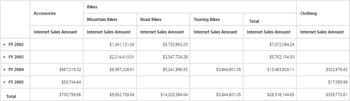

# Named Sets

Named sets is a multidimensional expression (MDX) that returns a set of dimension members, that can be created by combining cube data, arithmetic operators, numbers, and functions.

You can bind the named sets in the PivotGrid by setting it's unique name in the [`fieldName`](/api/js/ejpivotgrid#members:datasource-rows-fieldname) property either in row or column axis and the [`isNamedSets`](/api/js/ejpivotgrid#members:datasource-columns-isnamedsets) boolean property to "true".



export class BasicUse {
  constructor() {
    this.pivotData = {
                data: "https://bi.syncfusion.com/olap/msmdpump.dll", //data
                catalog: "Adventure Works DW 2008 SE",
                cube: "Adventure Works",
                rows: [{
                    fieldName: "[Date].[Fiscal]"
                }],
                columns: [{
                    fieldName: "[Core Product Group]",
                    isNamedSets: true
                }],
                values: [{
                    measures: [{
                        fieldName: "[Measures].[Internet Sales Amount]",
                    }],
                axis: "columns"
        }]
    };
  }
}


