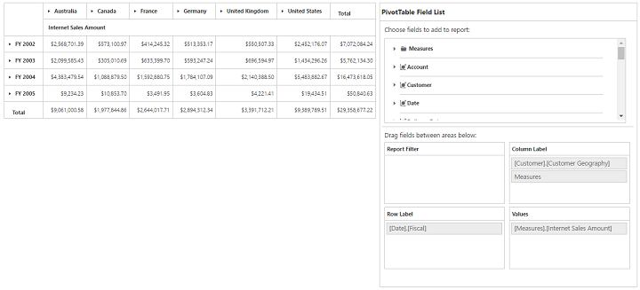
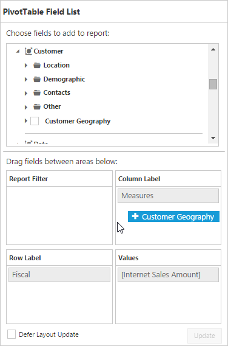
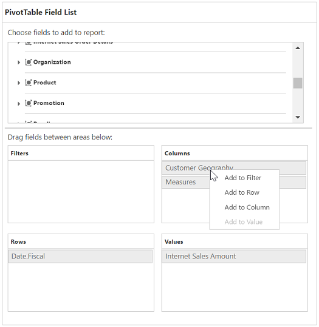
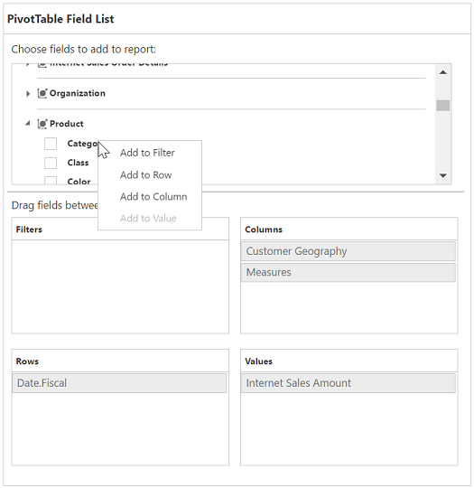

# PivotTable field list

## Initialization
The field list, also known as Pivot Schema Designer, allows you to add, rearrange, filter, and remove fields to show the data in the pivot grid as exactly you want.

Based on the data source and OLAP bound to the pivot grid control, the PivotTable field list will be automatically populated with cube information or field names. The PivotTable field list provides an Excel like appearance and behavior.

To initialize the PivotTable field list, first you should define a “div” tag with an appropriate “id” attribute which acts as a container for the widget. Then, you should initialize the PivotTable field list by using the **“ejPivotSchemaDesigner”** method.



<template>
  <require from="./OLAP.css"></require>
  

    <ej-pivot-grid id="fieldList" e-data-source.bind="pivotData" e-pivot-table-field-list-id.bind="PivotSchemaDesigner">
      </ej-pivot-grid>
    <ej-pivot-schema-designer id="PivotSchemaDesigner1" e-olap-settings.bind="olapSettings"></ej-pivot-schema-designer>
  

</template>





export class BasicUse {
  constructor() {
    this.pivotData = {
      data: 'https://bi.syncfusion.com/olap/msmdpump.dll', //data
      catalog: 'Adventure Works DW 2008 SE',
      cube: 'Adventure Works',
      rows: [
        {
          fieldName: '[Date].[Fiscal]'
        }
      ],
      columns: [
        {
          fieldName: '[Customer].[Customer Geography]'
        }
      ],
      values: [
        {
          measures: [
            {
              fieldName: '[Measures].[Internet Sales Amount]'
            }
          ],
          axis: 'columns'
        }
      ]
    };
    this.olapSettings = {
      showKpi: false, showNamedSets: true
    };
    this.PivotSchemaDesigner = 'PivotSchemaDesigner1';
  }
}



## Layout
The top portion of the layout shows field or cube items in a categorized way. They can be dynamically added to the report either by the drag and drop option or through the simple check box selection.

On item(s) selection, they will be placed in the row section except numeric based item(s) or measures, which alone will be placed in the value section, by default.

The bottom portion of the layout is segregated as below:

* Report filter: Exclusively designed to filter the item(s) placed in the particular position of the layout.
* Value section: The value label usually displays the numeric value item(s) present in the report.
* Column section: It is used to display the item(s) as column header and values in the pivot grid control.
* Row section: It is used to display the item(s) as row header and values in the pivot grid control.

## UI interactions

### By drag and drop

You can alter the report on fly through the drag-and-drop operation. You can drag any item from the field list and drop it into column, row, value, or filter section available at the bottom of the field list.

### By tree view selection

You can also alter the report on fly through the check and uncheck option as an alternate. By default, fields will be added to the row label when checked.

### By context menu

You can also alter the report by using the context menu.

## Searching values
Search option in the field list allows you to search a specific value that needs to be filtered from the list of values in the filter pop-up window.

## Filtering
Values can be filtered by checking/unchecking the check box besides them, in the filter pop-up window. At least, one value should be present in the checked state while filtering. Otherwise “Ok” will be disabled.

## Defer update
Defer update in the field list allows you to refresh the control on-demand and not during every UI operation. This operation can be enabled/disabled through the [`enableDeferUpdate`](/api/js/ejpivotgrid#members:enabledeferupdate) property internally.
