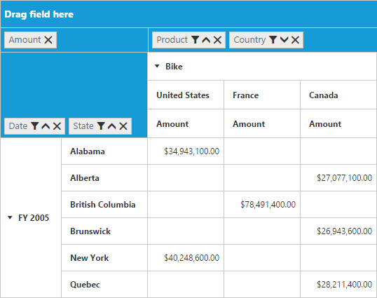

# Grouping Bar

## Initialization
Grouping bar allows you to dynamically alter the report by filter, sort, and remove operations in the PivotGrid control. Based on the relational datasource and report bound to the PivotGrid control, the grouping bar will be automatically populated. You can enable the grouping bar option in the PivotGrid by setting the [`enableGroupingBar`](/api/js/ejpivotgrid#members:enablegroupingbar) property to true.



<template>
  

    <ej-pivot-grid id="groupingBar" e-enable-grouping-bar="true">
    </ej-pivot-grid>
  

</template>





export class BasicUse {
  constructor() {
    this.pivotData = {
      data: [{ Amount: 100, Country: 'Canada', Date: 'FY 2005', Product: 'Bike', Quantity: 2, State: 'Alberta' },
        { Amount: 200, Country: 'Canada', Date: 'FY 2006', Product: 'Van', Quantity: 3, State: 'British Columbia' },
        { Amount: 300, Country: 'Canada', Date: 'FY 2007', Product: 'Car', Quantity: 4, State: 'Brunswick' },
        { Amount: 150, Country: 'Canada', Date: 'FY 2008', Product: 'Bike', Quantity: 3, State: 'Manitoba' },
        { Amount: 200, Country: 'Canada', Date: 'FY 2006', Product: 'Car', Quantity: 4, State: 'Ontario' },
        { Amount: 100, Country: 'Canada', Date: 'FY 2007', Product: 'Van', Quantity: 1, State: 'Quebec' },
        { Amount: 200, Country: 'France', Date: 'FY 2005', Product: 'Bike', Quantity: 2, State: 'Charente-Maritime' },
        { Amount: 250, Country: 'France', Date: 'FY 2006', Product: 'Van', Quantity: 4, State: 'Essonne' },
        { Amount: 300, Country: 'France', Date: 'FY 2007', Product: 'Car', Quantity: 3, State: 'Garonne (Haute)' },
        { Amount: 150, Country: 'France', Date: 'FY 2008', Product: 'Van', Quantity: 2, State: 'Gers' },
        { Amount: 200, Country: 'Germany', Date: 'FY 2006', Product: 'Van', Quantity: 3, State: 'Bayern' },
        { Amount: 250, Country: 'Germany', Date: 'FY 2007', Product: 'Car', Quantity: 3, State: 'Brandenburg' },
        { Amount: 150, Country: 'Germany', Date: 'FY 2008', Product: 'Car', Quantity: 4, State: 'Hamburg' },
        { Amount: 200, Country: 'Germany', Date: 'FY 2008', Product: 'Bike', Quantity: 4, State: 'Hessen' },
        { Amount: 150, Country: 'Germany', Date: 'FY 2007', Product: 'Van', Quantity: 3, State: 'Nordrhein-Westfalen' },
        { Amount: 100, Country: 'Germany', Date: 'FY 2005', Product: 'Bike', Quantity: 2, State: 'Saarland' },
        { Amount: 150, Country: 'United Kingdom', Date: 'FY 2008', Product: 'Bike', Quantity: 5, State: 'England' },
        { Amount: 250, Country: 'United States', Date: 'FY 2007', Product: 'Car', Quantity: 4, State: 'Alabama' },
        { Amount: 200, Country: 'United States', Date: 'FY 2005', Product: 'Van', Quantity: 4, State: 'California' },
        { Amount: 100, Country: 'United States', Date: 'FY 2006', Product: 'Bike', Quantity: 2, State: 'Colorado' },
        { Amount: 150, Country: 'United States', Date: 'FY 2008', Product: 'Car', Quantity: 3, State: 'New Mexico' },
        { Amount: 200, Country: 'United States', Date: 'FY 2005', Product: 'Bike', Quantity: 4, State: 'New York' },
        { Amount: 250, Country: 'United States', Date: 'FY 2008', Product: 'Car', Quantity: 3, State: 'North Carolina' },
        { Amount: 300, Country: 'United States', Date: 'FY 2007', Product: 'Van', Quantity: 4, State: 'South Carolina' }
      ],
      rows: [
        {
          fieldName: 'Country',
          fieldCaption: 'Country'
        }
      ],
      columns: [
        {
          fieldName: 'Product',
          fieldCaption: 'Product'
        },
        {
          fieldName: 'Date',
          fieldCaption: 'Date'
        }
      ],
      values: [
        {
          fieldName: 'Amount',
          fieldCaption: 'Amount'
        }
      ]
    };
  }
}



## Drag and drop

You can alter the report on fly through the drag-and-drop operation.

## Context menu

You can also alter the report by using the context menu.

## Searching values
Search option in the grouping bar allows you to search a specific value that needs to be filtered from the list of values in the filter pop-up window.

## Filtering values
Filtering option in the grouping bar allows you to select a specific set of values that needs to be displayed in the PivotGrid control. At least, one value should be present in the checked state while filtering. Otherwise, “Ok” will be disabled.

## Sorting values
Sorting option in the grouping bar allows you to arrange headers in ascending or descending order. Sorting option is applicable for fields that are available only in the row and column region. By default, headers are sorted in the ascending order. Regarding the sorting indicator, an up arrow denotes the ascending order and a down arrow denotes the descending order.

## Removing field
Remove option in the grouping bar allows you to completely remove a specific field from the PivotGrid control. Remove operation can be achieved either by clicking the remove icon in each field or by dragging and dropping the field out of the grouping bar region.

