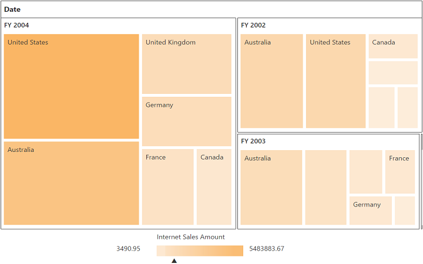

# Getting Started

Before we start with the PivotTreeMap, please refer [this page](https://help.syncfusion.com/aurelia/overview#getting-started) page for general information regarding integrating Syncfusion widgets.

For quick start, we already configured a template project in GitHub repository [syncfusion-template-repository](https://github.com/aurelia-ui-toolkits/syncfusion-template-repository). Run the below set of commands to clone the repository and install the required packages for Syncfusion Aurelia application.



    > git clone "https://github.com/aurelia-ui-toolkits/syncfusion-template-repository"
    > cd syncfusion-template-repository
    > npm install
    > jspm install



### Control Initialization

The below steps describes to create Syncfusion Aurelia PivotTreeMap component.

    Create `pivottreemap` folder inside `src/samples/` location.
    Create `pivottreemap.html` file inside `src/samples/pivottreemap` folder and use the below code example to render the PivotTreeMap component.



<template>
  <require from="./pivottreemap.css"></require>
  

    <ej-pivot-tree-map id="PivotTreeMap1"></ej-pivot-tree-map>
  

</template>



* Create `pivottreemap.js` file inside `src/samples/pivottreemap` folder with below code snippet.



export class BasicUse {

  constructor() {}

}



* Create `pivottreemap.css` file inside `src/samples/pivottreemap` folder with below code snippet.



ej-pivot-tree-map {
    min-height: 275px; 
    min-width: 525px; 
    height: 460px; 
    width: 99%; 
    position:relative !important; 
    display: block;
}



### Populate PivotTreeMap with Data

Let us now see how to populate the PivotTreeMap control using a sample data as shown below.



<template>
  <require from="./pivottreemap.css"></require>  
  

   <ej-pivot-tree-map id="PivotTreeMap1" e-data-source.bind="pivotData">
    </ej-pivot-tree-map>
  

  <!--Tooltip labels can be localized here-->
   
</template>





export class BasicUse {
  constructor() {
    this.pivotData = {
      data: 'http://bi.syncfusion.com/olap/msmdpump.dll', //data
      catalog: 'Adventure Works DW 2008 SE',
      cube: 'Adventure Works',
      rows: [
        {
          fieldName: '[Date].[Fiscal]'
        }
      ],
      columns: [
        {
          fieldName: '[Customer].[Customer Geography]'
        }
      ],
      values: [
        {
          measures: [
            {
              fieldName: '[Measures].[Internet Sales Amount]'
            }
          ],
          axis: 'columns'
        }
      ]
    };
  }
}



The above code will generate a simple PivotTreeMap with internet sales amount over a period of fiscal years across different customer geographic locations.

