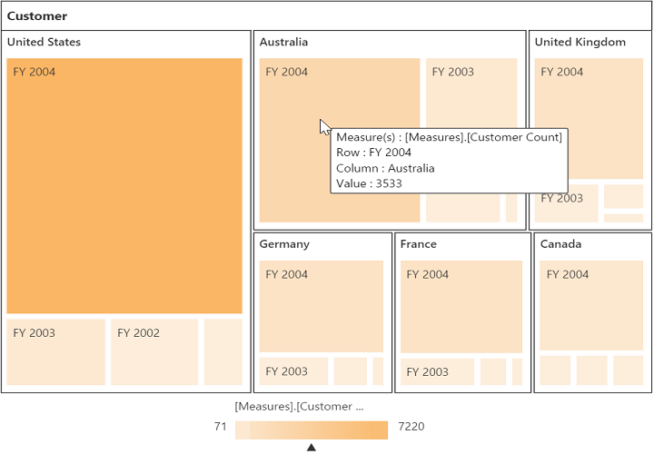

#Legend

##Legend visibility

The legend shows the value range differences and color occurrence in the respective leaf node while hovering it with a cursor.

N> By default, the legend is visible in the pivot tree map.

You can disable the legend by setting the property **showLegend** as **false**. The following code example illustrates how to disable the legend:



<template>
  

    <ej-pivot-tree-map id="pivotTreeMapColor" e-data-source.bind="pivotData" e-on-render-success.trigger="showLegend($event)">
    </ej-pivot-tree-map>
  

  <!--Tooltip labels can be localized here-->
  
</template>





export class BasicUse {
    showLegend(args) {
        let pivotTreeMap = $("#PivotTreeMap1TreeMapContainer").data("ejTreeMap");
        pivotTreeMap.model.showLegend = false;
        pivotTreeMap.refresh();
  }
}



