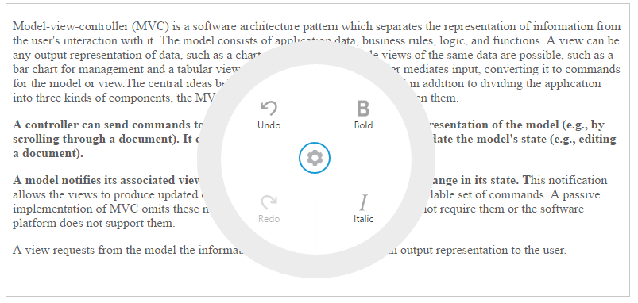

# Getting Started

This section helps to understand the getting started of the RadialMenu component for Aurelia.

## Create a RadialMenu Component

*	To create Syncfusion Aurelia application refer [Aurelia Getting Started](https://help.syncfusion.com/aurelia/overview#getting-started) Documentation.
*	Create `radialMenu` folder inside `src/samples` location.
* Create `radialMenu.html` file inside `src/samples/radialMenu` folder and use the below code for rendering RadialMenu component.



    <template>
      <ej-radial-menu id="defaultradialmenu" e-auto-open="false">                            
      </ej-radial-menu>
    </template>

 

* Create `radialMenu.js` file inside `src/samples/radialMenu` folder with below code snippet.



    export class BasicUse {
    constructor() {
    this.width= '100%';
    }
    }



## Image and text configuration

You can set the images for each item by giving the image URL with the **e-image-url** attribute in the inner list element and text with **e-text** attribute. Refer to the following code example. 



    <ej-radial-menu id="defaultRadialMenu" e-auto-open="false">            
      <ej-item e-image-url="images/RadialMenu/font.png" e-text="Bold"></ej-item>
      <ej-item e-image-url="images/RadialMenu/f1.png" e-text="Italic"></ej-item>
      <ej-item e-image-url="images/RadialMenu/redo.png" e-text="Redo" e-enabled="false"></ej-item>
      <ej-item e-image-url="images/RadialMenu/undo.png" e-text="Undo" e-enabled="false"></ej-item>     
    </ej-radial-menu>



Refer to the following code example to add target content to the **RadialMenu**.



    

      

      

      <textarea id="rteSample1"  style="height: 440px" ej-rte="e-width.bind:width; e-min-width:10; e-show-toolbar: false; e-show-context-menu:false;" e-on-select.trigger="radialShow($event)" e-on-change.trigger="rteChange($event)">
      Model–view–controller (MVC) is a software architecture pattern which separates the representation of information from the user's interaction with it.
      The model consists of application data, business rules, logic, and functions. A view can be any output representation of data, such as a chart or a diagram.
      Multiple views of the same data are possible, such as a bar chart for management and a tabular view for accountants.
      The controller mediates input, converting it to commands for the model or view.The central ideas behind MVC are code re-usability and n addition to dividing the application into three kinds of components, the MVC design defines the interactions between them.

      A controller can send commands to its associated view to change the view's presentation of the model (e.g., by scrolling through a document). It can also send commands to the model to update the model's state (e.g., editing a document).

      A model notifies its associated views and controllers when there has been a change in its state. This notification allows the views to produce updated output, and the controllers to change the available set of commands. A passive implementation of MVC omits these notifications, because the application does not require them or the software platform does not support them.

      A view requests from the model the information that it needs to generate an output representation to the user.
      </textarea>
      

      

    



Add the following styles in your code.



    .e-radialmenu .imageclass {
        background-image: url(content/images/RadialMenu/settings.png);
    }

    .e-radialmenu .backimageclass {
        background-image: url(content/images/RadialMenu/Back_button.png);
    }



## Displaying RadialMenu

You can display the Radial Menu by performing desired action on the target content while selecting the text inside the target. Therefore, call the **select** event of the RTE content. Refer to the following code example and add it to the script.



    radialShow(e) {
      let target;
      let radialRadius;
      let radialDiameter;
      let iframeY;
      let iframeX;
      let xPosition;
      let yPosition;
      let x;
      let y;
      target = $('#radialtarget1');
      radialRadius = 150;
      radialDiameter = 2 * radialRadius;
      $('#defaultRadialMenu').ejRadialMenu({ autoOpen: true });
      iframeY = e.detail.event.clientY;
      iframeX = e.detail.event.clientX;
      xPosition = (iframeX > radialRadius ? iframeX - radialRadius : 0);
      yPosition = (iframeY > radialRadius ? iframeY - radialRadius : 0);
      x = iframeX > (target.width() - radialRadius) ? (target.width() - radialDiameter) : xPosition;
      y = iframeY > (target.height() - radialRadius) ? (target.height() - radialDiameter) : yPosition;
      $('#defaultRadialMenu').ejRadialMenu('setPosition', x, y);
      $('iframe').contents().find('body').blur();
    }



Run the above code and select any text inside the target. The settings icon is displayed. Click that icon to render the following output.

## RadialMenu item functionalities

You can set the functionalities for each item and define click function by using **e-on-click.trigger** attribute. Refer to the following code example. Define the click function for Radial Menu component items as follows.



    <ej-radial-menu id="defaultRadialMenu" e-auto-open="false" e-on-click.trigger="itemsClick($event)">            
      <ej-item e-image-url="images/RadialMenu/font.png" e-text="Bold"></ej-item>
      <ej-item e-image-url="images/RadialMenu/f1.png" e-text="Italic"></ej-item>
      <ej-item e-image-url="images/RadialMenu/redo.png" e-text="Redo" e-enabled="false"></ej-item>
      <ej-item e-image-url="images/RadialMenu/undo.png" e-text="Undo" e-enabled="false"></ej-item>     
    </ej-radial-menu>



Refer to the following code example to add functionalities for each items in **Click** event and you can enable items in RadialMenu by using **Change** event in component constructor’s file.



    export class BasicUse {
      constructor() {
    }
    rteChange(args) {
        $('#defaultRadialMenu').ejRadialMenu('enableItem', 'Undo');
      }
    itemsClick(e) {
    let rteObj = $('#rteSample1').data('ejRTE');
    if (e.detail.text && e.detail.text.toLowerCase() === 'bold') {
      rteObj.executeCommand('bold');
    }
    if (e.detail.text && e.detail.text.toLowerCase() === 'italic') {
      this.italic(e.detail.text);
    }
    if (e.detail.text && e.detail.text.toLowerCase() === 'undo') {
      this.undo(e.detail.text);
    }
    if (e.detail.text && e.detail.text.toLowerCase() === 'redo') {
      this.redo(e.detail.text);
    }
    }
    italic(e) {
      let rteObj = $('#rteSample1').data('ejRTE');
      rteObj.executeCommand('italic');
    }
    undo(e) {
      let rteObj = $('#rteSample1').data('ejRTE');
      rteObj.executeCommand('undo');
      $('#defaultRadialMenu').ejRadialMenu('disableItem', 'Undo');
      $('#defaultRadialMenu').ejRadialMenu('enableItem', 'Redo');
    }
    redo(e) {
      let rteObj = $('#rteSample1').data('ejRTE');
      rteObj.executeCommand('redo');
      $('#defaultRadialMenu').ejRadialMenu('disableItem', 'Redo');
      $('#defaultRadialMenu').ejRadialMenu('enableItem', 'Undo');
    }
    }



Run the above code and select any text inside the target. The settings icon is displayed. Click that icon to render the RadialMenu component. Click **bold** item in `RadialMenu` component, to render the following output.

> _Note:_ _You can find the RadialMenu properties from the_ [API reference](https://help.syncfusion.com/api/js/ejradialmenu) _document_

