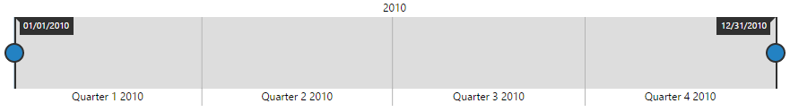
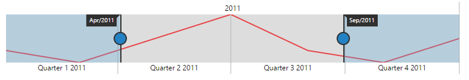
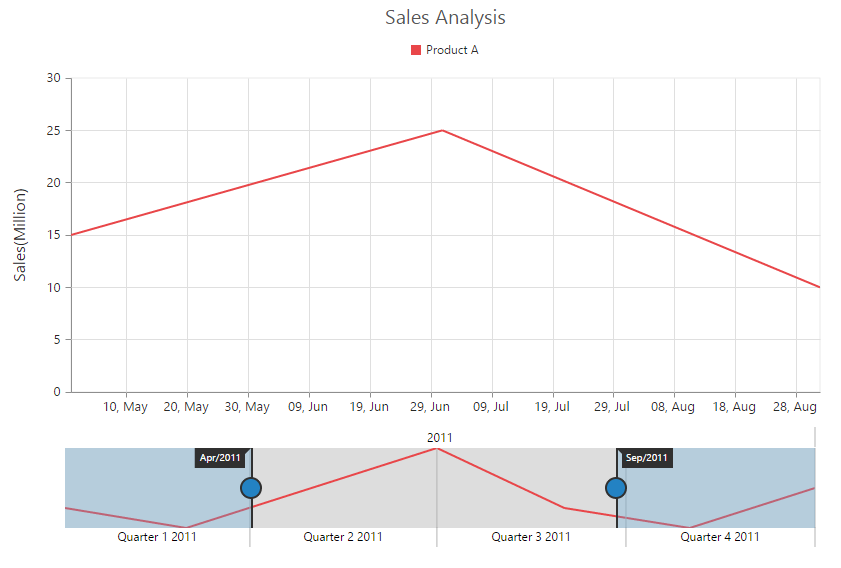
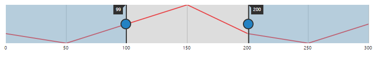

# Getting Started

This section explains briefly about how to create a **RangeNavigator** in your application with **Aurelia**.

## Create your first RangeNavigator in Aurelia

This section encompasses on how to configure the ejRangeNavigator and update the chart control for RangeNavigator’s selected range. It also helps you to learn how to pass the required data to RangeNavigator and customize the scale and selected range for your requirements. In this example, you will look at the steps to configure a RangeNavigator to analyze sales of a product for a particular quarter in a year.

 

Before we start with RangeNavigator, please refer [this](https://help.syncfusion.com/aurelia/overview#getting-started) page for general information regarding integrating Syncfusion widget’s.

For quick start, we already configured a template project in GitHub repository [syncfusion-template-repository](https://github.com/aurelia-ui-toolkits/syncfusion-template-repository). Run the below set of commands to clone the repository and install the required packages for Syncfusion Aurelia application.



    > git clone "https://github.com/aurelia-ui-toolkits/syncfusion-template-repository"
    > cd syncfusion-template-repository
    > npm install
    > jspm install



The below steps describes to create Syncfusion Aurelia RangeNavigator component.

    Create RangeNavigator folder inside src/samples/ location.
    Create RangeNavigator.html file inside src/samples/RangeNavigator folder and use the below code example to render the RangeNavigator component.

## Adding script reference

Create an **HTML** page and add the scripts references in the order mentioned in the following code example.



<!DOCTYPE html>
<html>
<head>
    <!--  jquery script  -->
     
    <!-- Essential JS UI widget -->
    
</head>
<body>
</body>
</html>



In the above code, ej.web.all.min.js script reference has been added for demonstration purpose. It is not recommended to use this for deployment purpose, as its file size is larger since it contains all the widgets. Instead, you can use [`CSG`](http://csg.syncfusion.com/) utility to generate a custom script file with the required widgets for deployment purpose.

2. Add a script tag inside the &lt;Body&gt; tag and add the following code example.  

The following code example renders a **RangeNavigator** with a range from 2010, January 1st to December 31st.



      this.rangeSettings = {
             start: "2010/1/1", end: "2010/12/31"
          };





<template>
    

        <ej-range-navigator id="navigator"
		                       e-range-settings.bind="rangeSettings">
        </ej-range-navigator>
    

</template>
          


The following screen shot displays the **RangeNavigator** with a range from 2010, January 1st to December 31st.

 

**Add series**

To add series to **RangeNavigator,** you need to set **dataSource** property of **RangeNavigator** as shown in the following code example. 

You can create data source for **RangeNavigator** as follows.



       this.dataSource = [{ "xDate": new Date(2011, 0, 1), "yValue": 10 },
                        { "xDate": new Date(2011, 2, 1), "yValue": 5 },
                        { "xDate": new Date(2011, 4, 1), "yValue": 15 },
                        { "xDate": new Date(2011, 6, 1), "yValue": 25 },
                        { "xDate": new Date(2011, 8, 1), "yValue": 10 },
                        { "xDate": new Date(2011, 10, 1), "yValue": 5 },
                        { "xDate": new Date(2011, 12, 1), "yValue": 15 }];



Now, add the **dataSource** to the **RangeNavigator** and provide the field name to get the values from the **data-source** in **x-name** and **y-name** options.



<template>
    

        <ej-range-navigator id="navigator" e-data-source.bind="dataSource" e-x-name="xDate"
                            e-y-name="yValue">
        </ej-range-navigator>
    

</template>



The following screenshot displays a RangeNavigator with the default **"Line"** series type.

 

**Enable tooltip**

You can customize **Tooltip** for RangeNavigator using **tooltip** option. You can use **tooltipDisplayMode** option in **tooltip**,to display the tooltip "always" or "ondemand" (displays tooltip only while dragging the sliders). You can also specify label format for tooltip using **labelFormat**.

The following code sample shows how to enable a Tooltip.



this.tooltip =  {
            visible: true, labelFormat: "MMM/yyyy", tooltipDisplayMode: "always",
          };





 <template>
    

        <ej-range-navigator id="navigator"  e-tooltip-settings.bind="tooltip">
        </ej-range-navigator>
    

</template>



The following screenshot displays the label format **Tooltip** in RangeNavigator:

 

**Update Chart**

You can use **RangeNavigator** with controls such as **chart** and **grid** to view the range of data selected in **RangeNavigator**. 

In order to update **chart**, whenever the selected range changes in **RangeNavigator**, you need to use **rangeChanged** event of **ejRangeNavigator** and then update the **chart** with the selected data in this event. 

You can create a chart with line series using the following code sample.

1. Create a &lt;div&gt; tag with an id.



<template>
    

        <ej-chart id="chartContent">
        </ej-chart>
    

</template>



2. Add a script tag inside the body tag and add the following code sample. 



    this.dataSource = [{ "xDate": new Date(2011, 0, 1), "yValue": 10 },
                        { "xDate": new Date(2011, 2, 1), "yValue": 5 },
                        { "xDate": new Date(2011, 4, 1), "yValue": 15 },
                        { "xDate": new Date(2011, 6, 1), "yValue": 25 },
                        { "xDate": new Date(2011, 8, 1), "yValue": 10 },
                        { "xDate": new Date(2011, 10, 1), "yValue": 5 },
                        { "xDate": new Date(2011, 12, 1), "yValue": 15 }];
	    this.tooltip =  {
            visible: true, labelFormat: "MMM/yyyy", tooltipDisplayMode: "always",
          };
		  this.title = {
	         //Add chart title
             text: 'Sales Analysis'
	       };
		   this.legend = { 
	           //Enable chart legend
	           visible: true,
			   position: 'top'
		  };

           





<template>
 

        <ej-chart id="chartContent" e-title.bind="title" e-legend.bind="legend" e-size.bind="size">
            <ej-series e-type="line" e-name="Product A" e-x-name="xDate"
                            e-y-name="yValue" e-data-source.bind="dataSource">
            </ej-series>
        </ej-chart>
    

    </template>



You can update the chart with the selected data using the **on-range-changed** event of **RangeNavigator**.



 <template>
    

        <ej-range-navigator id="navigator" e-size-settings.bind="sizeSettings" e-data-source.bind="dataSource" e-x-name="xDate"
                            e-y-name="yValue" e-tooltip-settings.bind="tooltip" e-on-range-changed.trigger="onChartLoaded($event)">
        </ej-range-navigator>
    





 onChartLoaded(sender) {
    let chartObj = $('#chartContent').data('ejChart');
    if (chartObj) {
      chartObj.model.primaryXAxis.zoomPosition = sender.detail.zoomPosition;
      chartObj.model.primaryXAxis.zoomFactor = sender.detail.zoomFactor;
      $('#chartContent').ejChart('redraw');
    }
  }
  


The following screenshot displays how a RangeNavigator is updated when a selected range is changed.

 

**Set value type**

**RangeNavigator** can also be used with numerical values. You can specify the data type using **value-type** option. 

You can create a **data-source** for Chart Series with integer Values using the following code sample.



    this.dataSource = [
    { "xDate": 0, "yValue": 10 },
    { "xDate": 50, "yValue": 5 },
    { "xDate": 100, "yValue": 15 },
    { "xDate": 150, "yValue": 25 },
    { "xDate": 200, "yValue": 10 },
    { "xDate": 250, "yValue": 5 },
    { "xDate": 300, "yValue": 15 },
    ];



Now, you can set the **data-source** for Chart Series and **value-type** property to "numeric" as given in the following code example.



  <template>
    

        <ej-range-navigator id="navigator" e-size-settings.bind="sizeSettings" e-data-source.bind="dataSource" e-x-name="xDate"
                            e-y-name="yValue" e-value-type="numeric">
        </ej-range-navigator>
    

</template>



The following screenshot displays a RangeNavigator with numerical values:

 

