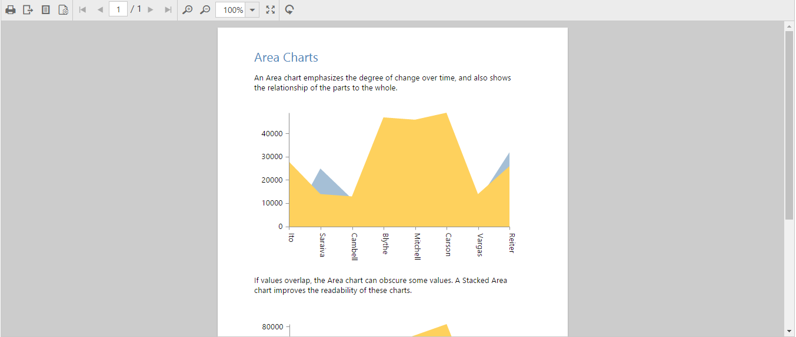

# Getting Started

Before we start with the ReportViewer, please refer [this page](https://help.syncfusion.com/aurelia/overview#getting-started) page for general information regarding integrating Syncfusion widgets.

For quick start, we already configured a template project in GitHub repository [syncfusion-template-repository](https://github.com/aurelia-ui-toolkits/syncfusion-template-repository). Run the below set of commands to clone the repository and install the required packages for Syncfusion Aurelia application.



    > git clone "https://github.com/aurelia-ui-toolkits/syncfusion-template-repository"
    > cd syncfusion-template-repository
    > npm install
    > jspm install



## Create your first ReportViewer in Aurelia

This section explains briefly about how to create a ReportViewer in your web application with Aurelia.

### Control Initialization

The below steps describes to create Syncfusion Aurelia ReportViewer component.

    Create `reportviewer` folder inside `src/samples/` location.    
    
1.Create `reportviewer.html` file inside `src/samples/reportviewer` folder and use the below code example to render the ReportViewer component.   
 


<template>
    <require from="./reportviewer.css"></require>
    

        <ej-report-viewer id="container" e-report-service-url="http://js.syncfusion.com/ejservices/api/ReportViewer" e-processing-mode="Remote" e-report-path="GroupingAgg.rdl"></ej-report-viewer>
    

</template>



N> Default RDL Report will be rendered, which is used in the online service.You can obtain sample rdl/rdlc files from Syncfusion installed location (%userprofile%\AppData\Local\Syncfusion\EssentialStudio\{{ site.releaseversion }}\Common\Data\ejReportTemplate).

2.Create `reportviewer.js` file inside `src/samples/reportviewer` folder with below code snippet.



export class RDLSample {
  
  constructor() {}
  
}



3.Create `reportviewer.css` file inside `src/samples/reportviewer` folder with below code snippet.



ej-report-viewer{
    display: block;
    height: 645px;
}



### Run the Application

Run the sample application and you can see the ReportViewer on the page as displayed in the following screenshot.

 

ReportViewer with Grouping Aggregate Report
{:.caption}

## Load SSRS Server Reports

ReportViewer supports to load RDL/RDLC files from SSRS Server. The following steps help you to load reports from SSRS Server.

1.Create `reportviewer.html` file inside `src/samples/reportviewer` folder and Set the `reportPath` from SSRS and SSRS `reportServerUrl` in the ReportViewer properties.   
 


<template>
    <require from="./reportviewer.css"></require>
    

        <ej-report-viewer id="container" e-report-service-url="http://js.syncfusion.com/ejservices/api/ReportViewer" e-processing-mode="Remote" e-report-server-url="http://mvc.syncfusion.com/reportserver" e-report-path="/SSRSSamples2/Territory Sales new"></ej-report-viewer>
    

</template>



N> The credential information for Report Server is provided in online service. 

2.Create `reportviewer.js` file inside `src/samples/reportviewer` folder with below code snippet.



export class TerritorySales {
  
  constructor() {}
  
}



3.Create `reportviewer.css` file inside `src/samples/reportviewer` folder with below code snippet.



ej-report-viewer{
    display: block;
    height: 645px;
}



4.Run the application and you can see the ReportViewer on the page as displayed in the following screenshot.

    
   
   Report from SSRS
   {:.caption}

## Load RDLC Reports

The ReportViewer has data binding support to visualize the RDLC reports. The following code example helps you to bind data to ReportViewer.

1.Create `reportviewer.html` file inside `src/samples/reportviewer` folder and assign the RDLC report path to ReportViewer’s `reportPath` property and specify the `processingMode` as local in the ReportViewer properties.   
 


<template>
    <require from="./reportviewer.css"></require>
    

        <ej-report-viewer id="container" e-report-service-url="http://js.syncfusion.com/ejservices/api/ReportViewer" e-processing-mode="Local" e-report-path="AreaCharts.rdlc"></ej-report-viewer>
    

</template>



N> Default RDLC Report will be rendered, which is used in the online service. You can obtain sample rdl/rdlc files from Syncfusion installed location (%userprofile%\AppData\Local\Syncfusion\EssentialStudio\{{ site.releaseversion }}\Common\Data\ejReportTemplate).

2.Create `reportviewer.js` file inside `src/samples/reportviewer` folder with below code snippet.



export class Areachart {
  constructor() {
    this.dataSource = [{
      value: [
        { SalesPersonID: 281, FullName: 'Ito', Title: 'Sales Representative', SalesTerritory: 'South West', Y2002: 0, Y2003: 28000, Y2004: 3018725 },
        { SalesPersonID: 282, FullName: 'Saraiva', Title: 'Sales Representative', SalesTerritory: 'Canada', Y2002: 25000, Y2003: 14000, Y2004: 3189356 },
        { SalesPersonID: 283, FullName: 'Cambell', Title: 'Sales Representative', SalesTerritory: 'North West', Y2002: 12000, Y2003: 13000, Y2004: 1930885 },
        { SalesPersonID: 275, FullName: 'Blythe', Title: 'Sales Representative', SalesTerritory: 'North East', Y2002: 19000, Y2003: 47000, Y2004: 4557045 },
        { SalesPersonID: 276, FullName: 'Mitchell', Title: 'Sales Representative', SalesTerritory: 'South West', Y2002: 28000, Y2003: 46000, Y2004: 5240075 },
        { SalesPersonID: 277, FullName: 'Carson', Title: 'Sales Representative', SalesTerritory: 'Central', Y2002: 33000, Y2003: 49000, Y2004: 3857163 },
        { SalesPersonID: 278, FullName: 'Vargas', Title: 'Sales Representative', SalesTerritory: 'Canada', Y2002: 11000, Y2003: 14000, Y2004: 1764938 },
        { SalesPersonID: 279, FullName: 'Reiter', Title: 'Sales Representative', SalesTerritory: 'South East', Y2002: 32000, Y2003: 26000, Y2004: 2811012 }
      ],
      name: 'AdventureWorksXMLDataSet'
    }];
  }
}



3.Create `reportviewer.css` file inside `src/samples/reportviewer` folder with below code snippet.



ej-report-viewer{
    display: block;
    height: 645px;
}



4.Run the application and you can see the ReportViewer on the page as displayed in the following screenshot.

    
   
   Area Chart RDLC Report
   {:.caption}
