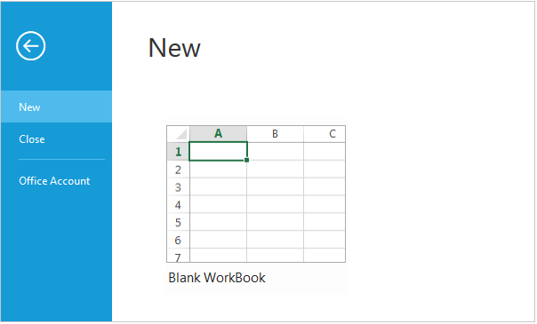

# Application Tab

The Application Tab is used to represent a `Menu` that do some operations, such as File menu to create, open, and print documents. Application Tab classified by `type` property with the following:

*  menu
*  backstage

## Application Menu

The Application Menu is similar to traditional file menu options and Syncfusion `ejMenu` control is used internally to render this. To show Application Menu in Ribbon, set the `type` as `menu` and `menuSettings` to customize properties of `ejMenu`.

### _Create Using Template_

Set the UL element `id` to `menuItemID` property to create Application Menu and it will acts as template to render menu.



    <template>
    

        <ej-ribbon id="Default" e-width="50%" e-application-tab.bind="ApplicationTab" e-tabs.bind="Tabs">
        </ej-ribbon>
    

    

        

            

                

                    

                

                <ul id="RibbonMenu">
                    <li>
                        <a>FILE</a>
                        <ul>
                            <li><a>New</a></li>
                            <li><a>Open</a></li>
                            <li><a>Save</a></li>
                            <li><a>Save As</a></li>
                            <li><a>Print</a></li>
                        </ul>
                    </li>
                </ul>
            

        

    </template>





     export class Default {
     constructor() {
         this.ApplicationTab = { type: ej.Ribbon.ApplicationTabType.Menu, menuItemID: 'RibbonMenu', menuSettings: {  openOnClick: false } };
         this.Tabs = [{ id: 'home', text: 'HOME'}];
     }
    }
    


## Backstage Page

The Backstage page is where documents and related data of those can be managed, such as Create, Save and other information.

The Backstage page has a feature to add custom Control in left side of the page which contains menu items and the right side contains corresponding user controls. 

You can set Application Tab `type` as `backstage` and set `id` , `text` to backstage items. Backstage `pages` can be added with required `itemType` and `contentID` as template id to render template into Backstage. 

Separator between Backstage items can be enabled by setting `enableSeparator` as true. Width of back stage side header can be customized using `headerWidth`, If not set based on content given width will be considered.

To render the Ribbon with the Backstage page, refer to the following code snippet. 


    
    <template>
    

        <ej-ribbon id="Default" e-width="50%" e-application-tab.bind="ApplicationTab" e-tabs.bind="Tabs" e-on-create.trigger="createControl()">
        </ej-ribbon>
    

    

        

            

                

                

                    <table>
                        <tr>
                            <td><button id="btn1" class="e-bsnewbtnstyle">Blank WorkBook</button></td>
                        </tr>
                        <tr>
                            <td></td>
                        </tr>
                    </table>
                

                

                    

                        User Information
                        

                            

                            

                                
user

                                
xy@syncfusion.com

                            

                        

                    

                    <a href="#" style="font-size:11px">Sign out</a>
                    <a href="#" style="display:table;font-size:11px">Switch Account</a>
                

            

        

    

    
    </template>





    export class Default {
    constructor() {
        this.ApplicationTab = {  type: ej.Ribbon.ApplicationTabType.Backstage,  backstageSettings: { text: 'FILE',  height: 350,  width: 1000,  headerWidth: 120,  pages: [ { id: 'new',  text: 'New',  contentID: 'newCon'},  { id: 'close',  text: 'Close',  enableSeparator: true,   itemType: ej.Ribbon.ItemType.Button},   { id: 'account',  text: 'Office Account',  contentID: 'accountCon'}]}};
        this.Tabs = [{ id: 'home', text: 'HOME'}];
    }
    createControl() {
        $('#btn1').ejButton({ size: 'large',  height: 200,  width: 225,  contentType: 'textandimage',  imagePosition: 'imagetop',  prefixIcon: 'e-icon e-blank e-infopageicon'});
    }
    }
    


N> Height & width of backstage can be set using `height` and `width`, if these are not set, Ribbon’s height & width will be considered.

You can add/remove/update backStage item to the ribbon control by using [`addBackStageItem`](https://help.syncfusion.com/api/js/ejribbon#methods:addbackstageitem), [`removeBackStageItem`](https://help.syncfusion.com/api/js/ejribbon#methods:removebackstageitem) and [`updateBackStageItem`](https://help.syncfusion.com/api/js/ejribbon#methods:updatebackstageitem) methods. Also you can show/hide the backstage page in ribbon control by using [`showBackstage`](https://help.syncfusion.com/api/js/ejribbon#methods:showbackstage) and [`hideBackstage`](https://help.syncfusion.com/api/js/ejribbon#methods:hidebackstage methods.
