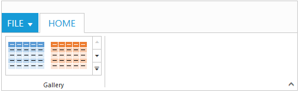
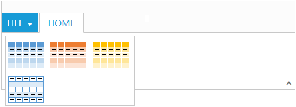

# Gallery

Galleries are used to display items that can be arranged in a grid-type layout. Items in the gallery can be customized as `button`/`menu` to display images, text, or both images and text. You can set `type` of group as `gallery`.

## Gallery Items

`Gallery items` are collection of the items to be included in the main gallery. You can set `text` and `toolTip` to gallery item which can also be customized with `buttonSettings`.
 
Number of `columns` to display in gallery for each row should be specified and the Number of columns in Expanded State `(expandedColumns)` can be customized, if not set, `columns` count will be set as default. 

N> The `itemHeight` and `itemWidth` for gallery item can be set, if not set default values will be used.



    <template>
    

        <ej-ribbon id="default" e-width="100%" e-application-tab.bind="ApplicationTab" e-tabs.bind="Tabs">
        </ej-ribbon>
    

    

        

            

                

                    

                

                <ul id="ribbonmenu">
                    <li>
                        <a>FILE</a>
                        <ul>
                            <li><a>New</a></li>
                            <li><a>Open</a></li>
                        </ul>
                    </li>
                </ul>
                
    </template>





    export class default {
    constructor() {
        this.ApplicationTab = { type: ej.Ribbon.ApplicationTabType.Menu, menuItemID: 'ribbonmenu', menuSettings: {  openOnClick: false } };
        this.Tabs = [{
            id: "home",
            text: "HOME",
            groups: [{
                type: "gallery",
                text: "Gallery",
                content: [{
                    groups: [{
                        id: "Gallery",
                        columns: 2,
                        itemHeight: 54,
                        itemWidth: 73,
                        expandedColumns: 3,
                        type: ej.Ribbon.type.gallery,
                        galleryItems: [{
                            text: "GalleryContent1",
                            toolTip: "GalleryContent1",
                            buttonSettings: {
                                contentType: ej.ContentType.ImageOnly,
                                prefixIcon: "e-gallerycontent1 e-icon e-gbtnimg",
                                cssClass: "e-gbtnposition"
                            }
                        }, {
                            text: "GalleryContent2",
                            toolTip: "GalleryContent2",
                            buttonSettings: {
                                contentType: ej.ContentType.ImageOnly,
                                prefixIcon: "e-gallerycontent2 e-icon e-gbtnimg",
                                cssClass: "e-gbtnposition"
                            }
                        }, {
                            text: "GalleryContent3",
                            toolTip: "GalleryContent3",
                            buttonSettings: {
                                contentType: ej.ContentType.ImageOnly,
                                prefixIcon: "e-gallerycontent3 e-icon e-gbtnimg",
                                cssClass: "e-gbtnposition"
                            }
                        }, {
                            text: "GalleryContent4",
                            toolTip: "GalleryContent4",
                            buttonSettings: {
                                contentType: ej.ContentType.ImageOnly,
                                prefixIcon: "e-gallerycontent4 e-icon e-gbtnimg",
                                cssClass: "e-gbtnposition"
                            }
                        }]
                    }]
                }]
            }]
        }];
    }
    }



Ribbon Gallery.
{:.caption}

Gallery at Expanded State
{:.caption}

## Custom Gallery Items

`Custom gallery items` are the additional items to be displayed at gallery expanded state. You can set `customItemType` as `button` or `menu`, Default is `button`.

You can also set `text` and `toolTip` to custom gallery item which can also be customized with `buttonSettings`/`menuSettings` based on the `customItemType` specified.



    <template>
    

        <ej-ribbon id="Customtooltip" e-width="100%" e-application-tab.bind="ApplicationTab" e-tabs.bind="Tabs">
        </ej-ribbon>
    

    

        

            

                

                    

                

                <ul id="ribbonmenu">
                    <li>
                        <a>FILE</a>
                        <ul>
                            <li><a>New</a></li>
                            <li><a>Open</a></li>
                        </ul>
                    </li>
                </ul>
                <ul id="custommenu">
                    <li>
                        <a>New Quick Step</a>
                        <ul>
                            <li><a>Flag and Move</a></li>
                        </ul>
                    </li>
                </ul>
                
    </template>





    export class CustomToolTip {
    constructor() {
        this.ApplicationTab = { type: ej.Ribbon.ApplicationTabType.Menu, menuItemID: 'ribbonmenu', menuSettings: {  openOnClick: false } };
        this.Tabs = [{
            id: "home",
            text: "HOME",
            groups: [{
                type: "gallery",
                text: "Gallery",
                content: [{
                    groups: [{
                        id: "Gallery",
                        columns: 2,
                        itemHeight: 54,
                        itemWidth: 73,
                        expandedColumns: 3,
                        type: ej.Ribbon.type.gallery,
                        galleryItems: [{
                            text: "GalleryContent1",
                            toolTip: "GalleryContent1",
                            buttonSettings: {
                                contentType: ej.ContentType.ImageOnly,
                                prefixIcon: "e-gallerycontent1 e-icon e-gbtnimg",
                                cssClass: "e-gbtnposition"
                            }
                        }, {
                            text: "GalleryContent2",
                            toolTip: "GalleryContent2",
                            buttonSettings: {
                                contentType: ej.ContentType.ImageOnly,
                                prefixIcon: "e-gallerycontent2 e-icon e-gbtnimg",
                                cssClass: "e-gbtnposition"
                            }
                        }, {
                            text: "GalleryContent3",
                            toolTip: "GalleryContent3",
                            buttonSettings: {
                                contentType: ej.ContentType.ImageOnly,
                                prefixIcon: "e-gallerycontent3 e-icon e-gbtnimg",
                                cssClass: "e-gbtnposition"
                            }
                        }, {
                            text: "GalleryContent4",
                            toolTip: "GalleryContent4",
                            buttonSettings: {
                                contentType: ej.ContentType.ImageOnly,
                                prefixIcon: "e-gallerycontent4 e-icon e-gbtnimg",
                                cssClass: "e-gbtnposition"
                            }
                        }],
                        customGalleryItems: [{
                            customItemType: ej.Ribbon.customItemType.menu,
                            menuId: "custommenu",
                            menuSettings: {
                                openOnClick: false
                            }
                        }, {
                            text: "Clear Formatting",
                            toolTip: "Clear Formatting",
                            customItemType: ej.Ribbon.customItemType.button,
                            buttonSettings: {                                        
                                cssClass: "e-extrabtnstyle"
                            }
                        }]
                    }]
                }]
            }]
        }];
    }
    }
     


