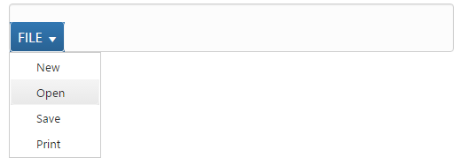
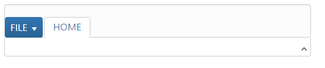
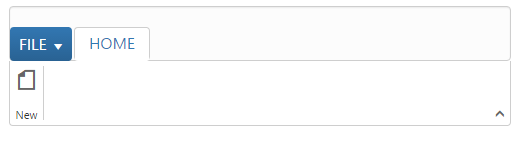
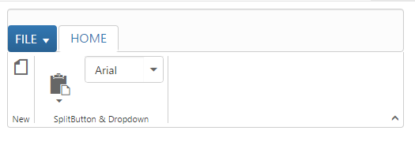

# Getting Started

Before we start with the Ribbon, please refer [this page](https://help.syncfusion.com/aurelia/overview#getting-started) page for general information regarding integrating Syncfusion widget’s.

For quick start, we already configured a template project in GitHub repository [syncfusion-template-repository](https://github.com/aurelia-ui-toolkits/syncfusion-template-repository). Run the below set of commands to clone the repository and install the required packages for Syncfusion Aurelia application.



    > git clone "https://github.com/aurelia-ui-toolkits/syncfusion-template-repository"
    > cd syncfusion-template-repository
    > npm install
    > jspm install



The below steps describes to create Syncfusion Aurelia Ribbon component.

    Create ribbon folder inside src/samples/ location.
    Create ribbon.html file inside src/samples/ribbon folder and use the below code example to render the Ribbon component.



    <template>
    <require from="syncfusion-javascript/Content/ej/web/ribbon-css/ej.icons.css!"></require>
    

      <ej-ribbon id="Ribbon">      </ej-ribbon>
    

    </template>



* Create `ribbon.js` file inside `src/samples/ribbon` folder with below code snippet.



    export class Ribbon {
    
            constructor() {}

    }



N> 2. Ribbon’s sample level icons can be loaded using `ej.icons.CSS` from the location "syncfusion-javascript/Content/ej/web/ribbon-css".

## Control Initialization

Ribbon can be initialized with `Application Tab` and UL list is needed for binding menu to application menu which can be specified through `menuItemID` which denotes `id` of UL.

Define the Application Tab with `type` as `menu` to render simple Ribbon control. Add the template contents which is required for rendering application menu and split button.



    <template>
    <require from="syncfusion-javascript/Content/ej/web/ribbon-css/ej.icons.css!"></require>
    

      <ej-ribbon id="Ribbon" e-width="500px" e-application-tab.bind="ApplicationTab">      </ej-ribbon>      
      <ul id="ribbonMenu">
         <li>
            <a>FILE</a>
            <ul>
               <li><a>New</a></li>
               <li><a>Open</a></li>
               <li><a>Save</a></li>
               <li><a>Print</a></li>
            </ul>
         </li>
      </ul>
       <ul id="split">
        <li>Paste</li>
      </ul>
    

    </template>



Configure the `e-application-tab` bind value `this.ApplicationTab` in Aurelia view-model as shown in the following code.



    export class Ribbon {
        constructor() {
            this.ApplicationTab = {  type: ej.Ribbon.ApplicationTabType.Menu , menuItemID:"ribbonMenu" };        
        } 
    } 



N> Set the required `width` to Ribbon, else default parent container or window width will be considered.

## Adding Tabs

Tab is a set of related groups which are combined into single item. For creating Tab, `id` and `text` properties should be specified. 



    <template>
    <require from="syncfusion-javascript/Content/ej/web/ribbon-css/ej.icons.css!"></require>
    

      <ej-ribbon id="Ribbon" e-width="500px" e-application-tab.bind="ApplicationTab" e-tabs.bind="Tabs">      </ej-ribbon>      
      <ul id="ribbonMenu">
         <li>
            <a>FILE</a>
            <ul>
               <li><a>New</a></li>
               <li><a>Open</a></li>
               <li><a>Save</a></li>
               <li><a>Print</a></li>
            </ul>
         </li>
      </ul>
      <ul id="split">
        <li>Paste</li>
      </ul>
    

    </template>



Configure the `e-tabs` bind value `this.Tabs` in Aurelia view-model as shown in the following code.



    export class Ribbon {
        constructor() {
            this.ApplicationTab = {  type: ej.Ribbon.ApplicationTabType.Menu , menuItemID:"ribbonMenu" };
            this.Tabs = [{ id: 'home', text: 'HOME'}]; 
        } 
    } 



## Configuring Groups

List of controls are combined as logical `groups` into Tab. Group alignment type as `row/column`, Default is `row`. 

Create group item with `text` specified and add content group to Groups collection with ejButton control settings.

Configure the `e-tabs` bind value `this.Tabs` with group and button named as `New`.



    export class Ribbon {
        constructor() {
            this.ApplicationTab = {  type: ej.Ribbon.ApplicationTabType.Menu , menuItemID:"ribbonMenu" };
            this.Tabs = [{ id: 'home', text: 'HOME',groups: [{
                text: "New",
                content: [{
                    groups: [{
                        id: "new",
                        text: "New",
                        buttonSettings: {
                            contentType: ej.ContentType.ImageOnly,
                            prefixIcon: "e-icon e-ribbon e-new",
                        }
                    }]
                }]
            }] 
            }];
        } 
    } 



## Adding Controls to Group

Syncfusion JavaScript Controls can be added to group’s content with corresponding `type` specified like button, split button, toggle button, dropdown list, gallery, custom, etc. Default type is `button`.

Configure the `e-tabs` bind value `this.Tabs` with groups, button , split button and dropdown controls.Also the datasource to dropdown control is configured with bind name `fontFamily`.Please refer to the following code snippets.



    export class Ribbon {
        constructor() {
            let fontFamily = [{ value: 1, text: "Segoe UI" }, { value: 2, text: "Arial" }];
            this.ApplicationTab = {  type: ej.Ribbon.ApplicationTabType.Menu , menuItemID:"ribbonMenu" };
            this.Tabs = [{ id: 'home', text: 'HOME',groups: [{
                text: "New",
                content: [{
                    groups: [{
                        id: "new",
                        text: "New",
                        buttonSettings: {
                            contentType: ej.ContentType.ImageOnly,
                            prefixIcon: "e-icon e-ribbon e-new",
                        }
                    }]
                }]
            },{
                text: "SplitButton & Dropdown",
                alignType: ej.Ribbon.alignType.columns,
                content: [{
                    groups: [{
                        id: "paste",
                        text: "paste",
                        // split button settings
                        splitButtonSettings: {
                            contentType: ej.ContentType.ImageOnly,
                            targetID: "split",
                            prefixIcon: "e-ribbon e-ribbonpaste",
                            buttonMode: "dropdown",
                            arrowPosition: "bottom"
                        }
                    }],
                    defaults: {
                        type: ej.Ribbon.type.splitButton,
                        width: 50,
                        height: 70
                    }
                }, {
                    groups: [{
                        id: "fontFamily",
                        // dropdown list settings
                        type: ej.Ribbon.type.dropDownList,
                        dropdownSettings: {
                            dataSource: fontFamily,
                            value: "1",
                            width: 100
                        }
                    }]
                }]
            }]
            }]; 
        } 
    } 



