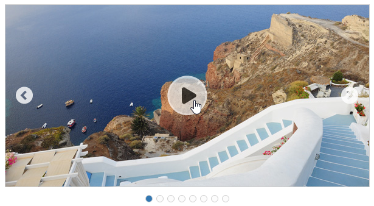
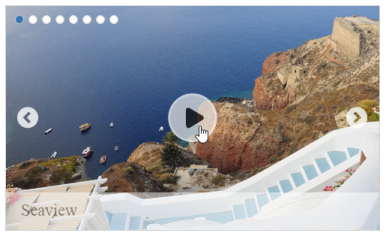

# Getting Started

This section helps to get started of the Rotator component for Aurelia.

## Create a Rotator Component

* To create Syncfusion Aurelia application refer [Aurelia Getting Started](https://help.syncfusion.com/aurelia/overview#getting-started) Documentation.
* Create `rotator` folder inside `src/samples` location.
* Create `rotator.html` file inside `src/samples/rotator` folder and use the below code for rendering Rotator component.



    <template>

        <ul id="sliderContent" ej-rotator="e-slide-width.bind:slideWidth>
        </ul>

    </template>


 

* Create `rotator.js` file inside `src/samples/rotator` folder with below code snippet.



    export class BasicUse {
    constructor() {  
      this.slideWidth = '100%';
      this.frameSpace = '0px';
      this.slideHeight = 'auto';
      this.position = ej.Rotator.PagerPosition.TopLeft;
      this.orientation = ej.Orientation.Horizontal;
  
    }
    }



## Configure data

To configure images for Rotator component, define URL and title for images as given below.



    <ul id="sliderContent" ej-rotator="e-slide-width.bind:slideWidth; 
        e-frame-space.bind:frameSpace; 
        e-pager-position:position;
        e-slide-height.bind: slideHeight;
        e-show-caption: true;
        e-show-play-button: true;
        e-is-responsive:true;">
            <li>
                </li>
            <li>
                </li>
            <li>
                </li>
            <li>
                </li>
            <li>
                </li>
            <li>
                </li>
            <li>
                </li>
            <li>
                </li>
    </ul>	



> _Note:_ _You can find the Rotator properties from the_ [API reference](https://help.syncfusion.com/api/js/ejrotator) _document_
