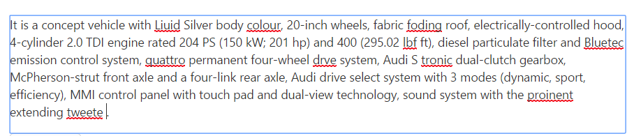

# Functionalities

## Check Spelling

The main functionality of the SpellCheck control is checking the spelling of a word and returns the suggestions for an error word.

For example, if you pass the sentence that contains misspell words as input, you can know the error words in this sentence and its suggestions (apt words to replace).

## Ignore Words

The SpellCheck control provides the support to ignore the words from an error word consideration and also to ignore an error words whenever needed. Please refer the following options to ignore the words.

### Ignore

The `ignore` option is used to ignore a specific word once from the given input string. 

The following code example describes the above method implementation.



<template>
    

        <ej-spell-check id="SpellCheck" contenteditable="true" e-widget.bind="SpellCheck" e-dictionary-settings.bind="dictionarySettings">
        </ej-spell-check>
    

</template>





export class SpellCheck {
    constructor() {
      this.dictionarySettings = {
        dictionaryUrl: 'http://js.syncfusion.com/demos/ejservices/api/SpellCheck/CheckWords',
        customDictionaryUrl: 'http://js.syncfusion.com/demos/ejservices/api/SpellCheck/AddToDictionary'
      };
    }
	attached() {
      setTimeout(()=>{
	    var targetSentence = 'The textarea sample uses a dialog to display the spell errors.';
		var result = this.SpellCheck.ignore("textarea",targetSentence, null);
		alert(result.resultHTML); // This will display the corrected text after the ignore operation performed
      }, 50);
    }
}



### Ignore All

The `ignore all` option is used to ignore all the error word occurrences from the given input string.

The following code example describes the way of using ignore all method.



<template>
    

        <ej-spell-check id="SpellCheck" contenteditable="true" e-widget.bind="SpellCheck" e-dictionary-settings.bind="dictionarySettings">
        </ej-spell-check>
    

</template>





export class SpellCheck {
    constructor() {
      this.dictionarySettings = {
        dictionaryUrl: 'http://js.syncfusion.com/demos/ejservices/api/SpellCheck/CheckWords',
        customDictionaryUrl: 'http://js.syncfusion.com/demos/ejservices/api/SpellCheck/AddToDictionary'
      };
    }
	attached() {
      setTimeout(()=>{
	    var targetSentence = 'This textarea sample uses a dialog to display all the textarea spell errors.';
		var result = this.SpellCheck.ignoreAll("textarea",targetSentence, null);
		alert(result.resultHTML); // This will display the corrected text after the ignoreAll operation performed
      }, 50);
    }
}



### Word Collection to Ignore

The `ignore words` option is used to ignore the collection of words from an error word checking. You can pass the technical terms, brand names which is not present in the dictionary file to this property "ignoreWords" as shown in the following code example and then while checking the spelling these passed words are considered as a correct word.



<template>
    

        <ej-spell-check id="SpellCheck" contenteditable="true" e-widget.bind="SpellCheck" e-dictionary-settings.bind="dictionarySettings" e-ignore-words.bind="IgnoreWords">
            Facebook is a social networking service headquartered in Menlo Park, California. Its website was launched on February 4, 2004, by Mark Zuckerberg with his Harvard College roommates and fellow students Eduardo, Andrew McCollum, Dustin and Chris Hughes.
            The fouders had initially limited the websites membrship to Harvard students, but later expanded it to collges in the Boston area, the Ivy League, and Stanford Univrsity. It graually added support for students at various other universities and later to high-school students.
        </ej-spell-check>
    

    

        <input ej-button="e-text:Spell check" e-on-click.trigger="showErrors($event)" id="CheckSpell" />
    

</template>





export class SpellCheck {
    constructor() {
      this.dictionarySettings = {
        dictionaryUrl: 'http://js.syncfusion.com/demos/ejservices/api/SpellCheck/CheckWords',
        customDictionaryUrl: 'http://js.syncfusion.com/demos/ejservices/api/SpellCheck/AddToDictionary'
      };
      this.IgnoreWords = ["Facebook","Zuckerberg"];
    }
    showErrors() {
      this.SpellCheck.showInDialog();
    }
}



## Ignore Settings

The `ignore settings` helps to ignore the uppercase, mixed case words, alphanumeric words, file path and email addresses from the error word checking. Ignore settings contains the following options to ignore the words based on their category.

* `ignoreAlphaNumericWords` - ignoring the alpha numeric words from an error word consideration.
* `ignoreUpperCase` - ignoring the upper case words from an error word consideration.
* `ignoreMixedCaseWords` - ignoring the mixed case words from an error word consideration.
* `ignoreFileNames` - ignoring the file address path from an error word consideration.
* `ignoreUrl` - ignoring the url links from an error word consideration.
* `ignoreEmailAddress` - ignoring the email address from an error word consideration.

The following code example uses to enable the checking of all the words formed with alphanumeric, uppercase, mixed case words and file paths and email addresses.  



<template>
    

        <ej-spell-check id="SpellCheck" contenteditable="true" e-widget.bind="SpellCheck" e-dictionary-settings.bind="dictionarySettings" e-ignore-settings.bind="IgnoreSettings">
            Facebook is a social networking service headquartered in Menlo Park, California. Its website was launched on February 4, 2004, by Mark Zuckerberg with his Harvard College roommates and fellow students Eduardo, Andrew McCollum, Dustin and Chris Hughes.
            The fouders had initially limited the websites membrship to Harvard students, but later expanded it to collges in the Boston area, the Ivy League, and Stanford Univrsity. It graually added support for students at various other universities and later to high-school students.
        </ej-spell-check>
    

    

        <input ej-button="e-text:Spell check" e-on-click.trigger="showErrors($event)" id="CheckSpell" />
    

</template>





export class SpellCheck {
    constructor() {
      this.dictionarySettings = {
        dictionaryUrl: 'http://js.syncfusion.com/demos/ejservices/api/SpellCheck/CheckWords',
        customDictionaryUrl: 'http://js.syncfusion.com/demos/ejservices/api/SpellCheck/AddToDictionary'
      };
      this.IgnoreSettings = {
                    ignoreAlphaNumericWords:false,
                    ignoreMixedCaseWords:false,
                    ignoreUpperCase:false,
                    ignoreUrl:false,
                    ignoreEmailAddress:false,
                    ignoreFileNames:false
                };
    }
    showErrors() {
      this.SpellCheck.showInDialog();
    }
}



## Change Words

The SpellCheck control provides the support to change an error words from its possible suggestions. Please refer the following options to change an error word.

### Change

The `change` option is used to replace an error word occurrences once from the given input string with the correct word.

The following code example describes the behavior of change method.



<template>
    

        <ej-spell-check id="SpellCheck" contenteditable="true" e-widget.bind="SpellCheck" e-dictionary-settings.bind="dictionarySettings">
        </ej-spell-check>
    

</template>





export class SpellCheck {
    constructor() {
      this.dictionarySettings = {
        dictionaryUrl: 'http://js.syncfusion.com/demos/ejservices/api/SpellCheck/CheckWords',
        customDictionaryUrl: 'http://js.syncfusion.com/demos/ejservices/api/SpellCheck/AddToDictionary'
      };
    }
	attached() {
      setTimeout(()=>{
	    var targetSentence = 'The textarea sample uses a dialog to display the spell errors.';
		var result = this.SpellCheck.change("textarea",targetSentence,"text area", null);
		alert(result.resultHTML); // This will display the corrected text after the change operation performed
      }, 50);
    }
}



### Change All

The `change all` option is used to replace all the occurrences of an error word with the correct word(selected from the suggestions list) from the given inputs string.

The following code example uses to change all the error word occurrences.



<template>
    

        <ej-spell-check id="SpellCheck" contenteditable="true" e-widget.bind="SpellCheck" e-dictionary-settings.bind="dictionarySettings">
        </ej-spell-check>
    

</template>





export class SpellCheck {
    constructor() {
      this.dictionarySettings = {
        dictionaryUrl: 'http://js.syncfusion.com/demos/ejservices/api/SpellCheck/CheckWords',
        customDictionaryUrl: 'http://js.syncfusion.com/demos/ejservices/api/SpellCheck/AddToDictionary'
      };
    }
	attached() {
      setTimeout(()=>{
        var targetSentence = 'This textarea sample uses a dialog to display all the textarea spell errors.';
		var result = this.SpellCheck.changeAll("textarea",targetSentence,"text area", null);
		alert(result.resultHTML); // This will display the corrected text after the changeAll operation performed
      }, 50);
    }
}



## Custom Words

The SpellCheck control provides the support to add the custom words into the custom dictionary file.

The `addToDictionary` option is used to add the custom words into the custom dictionary file.

The following code example uses to add the custom word into the custom dictionary file.



<template>
    

        <ej-spell-check id="SpellCheck" contenteditable="true" e-widget.bind="SpellCheck" e-dictionary-settings.bind="dictionarySettings">
        </ej-spell-check>
    

</template>





export class SpellCheck {
    constructor() {
      this.dictionarySettings = {
        dictionaryUrl: 'http://js.syncfusion.com/demos/ejservices/api/SpellCheck/CheckWords',
        customDictionaryUrl: 'http://js.syncfusion.com/demos/ejservices/api/SpellCheck/AddToDictionary'
      };
    }
	attached() {
      setTimeout(()=>{
		this.SpellCheck.addToDictionary("textarea")	// This will add the custom word into the custom dictionary file
      }, 50);
    }
}



You can also add the custom words into the custom dictionary file through the dialog mode or context menu mode add to dictionary option.

* Dialog Mode - Add To Dictionary button is available in the dialog window, while highlighting the error word in the given input string and clicking this button then the word will be adding into the custom dictionary file.
* Context Menu Mode - Add To Dictionary option is available while right click on the error word and selecting this option, the word will be adding into the custom dictionary file.

## Checking content on typing

SpellCheck control provides support for checking the content, on pressing the `Enter` and `Space` key. The cursor position will also be properly retained, while processing the SpellCheck operations. If you enable “enableValidateOnType” property, the SpellCheck operation will be carried out on typing.

The following code example describes the above behavior.



<template>
    

        <ej-spell-check id="SpellCheck" contenteditable="true" e-widget.bind="SpellCheck" e-dictionary-settings.bind="dictionarySettings" e-context-menu-settings.bind="contextMenu" e-enable-validate-on-type.bind="enableValidate">
        </ej-spell-check>
    

</template>





export class SpellCheck {
    constructor() {
      this.dictionarySettings = {
        dictionaryUrl: 'http://js.syncfusion.com/demos/ejservices/api/SpellCheck/CheckWords',
        customDictionaryUrl: 'http://js.syncfusion.com/demos/ejservices/api/SpellCheck/AddToDictionary'
      };
      this.contextMenu ={
        enable: true
      };
      this.enableValidate= "true";
    }
}



The following screenshot displays the output for the above code

You can also validate the content within the IFrame element or IFrame element target text, by passing the IFrame element id or class name value to the `controlsToValidate` property. 
Detailed information is given [here](https://help.syncfusion.com/js/spellcheck/multiple-target)

## Suggestion Words

The `getSuggestionWords` option is used to retrieve the possible suggestion words for an error word which is provided to correct that spelling.

The following code example describes the above behavior.



<template>
    

        <ej-spell-check id="SpellCheck" contenteditable="true" e-widget.bind="SpellCheck" e-dictionary-settings.bind="dictionarySettings" e-context-menu-settings.bind="contextMenu" e-enable-validate-on-type.bind="enableValidate">
        </ej-spell-check>
    

</template>





export class SpellCheck {
    constructor() {
      this.dictionarySettings = {
        dictionaryUrl: 'http://js.syncfusion.com/demos/ejservices/api/SpellCheck/CheckWords',
        customDictionaryUrl: 'http://js.syncfusion.com/demos/ejservices/api/SpellCheck/AddToDictionary'
      };
    }
    attached() {
      setTimeout(()=>{
		this.SpellCheck.getSuggestionWords("textarea");
        setTimeout(()=>{
            alert(this.SpellCheck._suggestedWords);
        },800);
      }, 50);
    }
}



N> You can get the suggestion words after some time interval once this method is called. Since, ajax request processing takes place in the background.

## Synchronous request

On setting `enableAsync` option to false, enables the synchronous request to the server to perform SpellCheck operations.

The following code example describes the above behavior.



<template>
    

        <ej-spell-check id="SpellCheck" contenteditable="true" e-widget.bind="SpellCheck" e-dictionary-settings.bind="dictionarySettings" e-ajax-data-type.bind="ajaxDataType" e-enable-async.bind="enableAsync">
        </ej-spell-check>
    

</template>





export class SpellCheck {
    constructor() {
      this.dictionarySettings = {
        dictionaryUrl: 'http://js.syncfusion.com/demos/ejservices/api/SpellCheck/CheckWords',
        customDictionaryUrl: 'http://js.syncfusion.com/demos/ejservices/api/SpellCheck/AddToDictionary'
      };
      this.ajaxDataType = "json";
      this.enableAsync= "false";
    }
}



N> You need to set the `ajaxDataType` value as `json` to retrieve the synchronous request result properly.