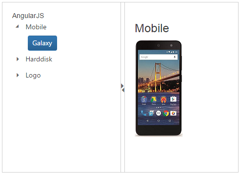

# Getting Started

Splitter component consists of movable split bar(s) that divides a container's display area into two or more resizable and collapsible panels. 
From the following guidelines, you can create a Splitter, add Tree view in the Splitter and set actions to view the image. It is used to split the document or image and Expand or Collapse in the Splitter. The following screenshot demonstrates the functionality of Splitter component.

## Create a Splitter Component

* To create Syncfusion Aurelia application refer [Aurelia Getting Started](https://help.syncfusion.com/aurelia/overview#getting-started) Documentation.
* Create `splitter` folder inside `src/samples` location.
* Create `splitter.html` file inside `src/samples/splitter` folder and use the below code for rendering Splitter component.



    <template>
    <ej-splitter id="outterSplitter"  e-height="350" e-width="100%" e-properties.bind="properties" e-enable-auto-resize="true">
    </ej-splitter>

    </template>


 

* Create `splitter.js` file inside `src/samples/splitter` folder with below code snippet.



    export class BasicUse {
    constructor() {  
        this.properties = [{ paneSize: '50%' }, {}];  
    }
    }



## Configure Splitter Panes

Add div element to create **Splitter**. Save the images in the corresponding location. 



    <ej-splitter id="outterSplitter"  e-height="350" e-width="100%" e-properties.bind="properties"  e-enable-auto-resize="true">
    
					
        

            <h3 class="h3">Aurelia</h3>                          
        

    

    

        

            

                Select any product from the tree to show the description.
            

            

                <h3>Mobile</h3>
                
            

            

                <h3>Harddisk</h3>
                
            

            

                <h3>Logo</h3>
                
            

        

    
                                     
    

    </ej-splitter>



Add the following styles to show the Splitter control in horizontal order.



    .e-splitter{
          display: block;
      }
    .cont {
      padding: 20px;
      min-width: 50px;
     }

    .cont #treeView_Container {
        margin-bottom: 0;
        border: none;
    }

    .h3 {
        font-size: 14px;
        margin: 0;
    }

    .spe {
        display: none;
    }



## Configure Tree View

For adding TreeView component, you have to use ul element to corresponding element.

Add the following code example in HTML file to configure Tree View.



    <ul id="treeView" class="visibleHide" ej-treeview e-nodeSelect="treeClicked">
        <li> Mobile
                <ul>
                    <li id=" Galaxy " class="_child">Galaxy</li>
                </ul>
        </li>
        <li>Harddisk
                <ul>
                    <li id="Harddisk" class="_child">Segate  </li>
                </ul>
        </li>
        <li>Logo
                <ul>
                    <li id="Logo" class="_child">Amazon</li>
                </ul>
        </li>
    </ul>



## Set Actions

Add the following code example in script to set the action to view the image.



    export class BasicUse {
        constructor() {
          this.orientation = ej.Orientation.Vertical;
          this.properties = [{ paneSize: '50%' }, {}];
        }
    treeClicked(sender) {
          let content;
          if (sender.detail.currentElement.hasClass('_child')) {
            content = $('.' + sender.detail.currentElement[0].id).html();
            $('._content').html(content);
          }
        }
    }



The following screenshot is the output for the above code.

> _Note:_ _You can find the Splitter properties from the_ [API reference](https://help.syncfusion.com/api/js/ejsplitter) _document_
