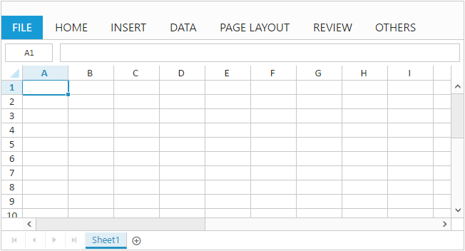

# Getting started

This section explains you the steps required to populate the Spreadsheet with data, format, and export it as excel file. This section covers only the minimal features that you need to know to get started with the Spreadsheet.

## Initialize Spreadsheet

To get some general information about Syncfusion Aurelia widgets integration refer [Aurelia Getting Started documentation](https://help.syncfusion.com/aurelia/overview#getting-started) link.

For quick start, we already configured a template project in GitHub repository [syncfusion-template-repository](https://github.com/aurelia-ui-toolkits/syncfusion-template-repository). Run the below set of commands to clone the repository and install the required packages for Syncfusion Aurelia application.



> git clone "https://github.com/aurelia-ui-toolkits/syncfusion-template-repository"
> cd syncfusion-template-repository
> npm install
> jspm install



The below steps helps to create Syncfusion Aurelia Spreadsheet component,

* Create `spreadsheet` folder inside `src/samples` location.
* Create `spreadsheet.html` file inside  `src/samples/spreadsheet` folder and use the below code for rendering Spreadsheet component. 
* Spreadsheet component is named with 'ej-' prefix and properties in this component is named with 'e-' prefix. E.g. (ej-spreadsheet, e-allow-conditional-formats).



<template>	
  

    <ej-spreadsheet id="Spreadsheet"></ej-spreadsheet>
  

</template>



* Create `spreadsheet.js` file inside `src/samples/spreadsheet` folder with below code snippet.



export class Spreadsheet {
    constructor() {}
}



* Now, we are going to configure the navigation for created Spreadsheet sample in `src/app.js` file



export class App {
    configureRouter(config, router) {
        config.title = 'Aurelia Syncfusion';
        config.map([
            { route: ['', 'welcome'], name: 'welcome', moduleId: 'welcome', nav: true, title: 'Welcome' },
            { route: 'child-router', name: 'child-router', moduleId: 'child-router', nav: true, title: 'Child Router' },
            { route: 'button', name: 'button', moduleId: 'samples/button/button', nav: true, title: 'Button' },
            { route: 'spreadsheet', name: 'spreadsheet', moduleId: 'samples/spreadsheet/spreadsheet', nav: true, title: 'Spreadsheet' }
        ]);
        this.router = router;
    }
}



* To run the application execute the following command, 



gulp watch



Now, the Spreadsheet is rendered with default row and column count.

## Populate Spreadsheet with data

Now, this section explains how to populate JSON data to the Spreadsheet. 

To set data source to Spreadsheet, the `e-range-settings.bind` property is assigned with an instance `this.range` which is specified in constructor.



<template>
  

    <ej-spreadsheet id="Spreadsheet">
      <ej-sheet e-range-settings.bind = "range"></ej-sheet>
    </ej-spreadsheet>
  

</template>





export class Spreadsheet {
    constructor() {
        this.range = [{
            dataSource: [
                { 'Item Name': 'Casual Shoes', Date: '02/14/2014', Time: '11:34:32 AM', Quantity: 10, Price: 20, Amount: 200, Discount: 1, Profit: 10 },
                { 'Item Name': 'Sports Shoes', Date: '06/11/2014', Time: '05:56:32 AM', Quantity: 20, Price: 30, Amount: 600, Discount: 5, Profit: 50 },
                { 'Item Name': 'Formal Shoes', Date: '07/27/2014', Time: '03:32:44 AM', Quantity: 20, Price: 15, Amount: 300, Discount: 7, Profit: 27 },
                { 'Item Name': 'Sandals & Floaters', Date: '11/21/2014', Time: '06:23:54 AM', Quantity: 15, Price: 20, Amount: 300, Discount: 11, Profit: 67 },
                { 'Item Name': 'Flip- Flops & Slippers', Date: '06/23/2014', Time: '12:43:59 AM', Quantity: 30, Price: 10, Amount: 300, Discount: 10, Profit: 70 },
                { 'Item Name': 'Sneakers', Date: '07/22/2014', Time: '10:55:53 AM', Quantity: 40, Price: 20, Amount: 800, Discount: 13, Profit: 66 },
                { 'Item Name': 'Running Shoes', Date: '02/04/2014', Time: '03:44:34 AM', Quantity: 20, Price: 10, Amount: 200, Discount: 3, Profit: 14 },
                { 'Item Name': 'Loafers', Date: '11/30/2014', Time: '03:12:52 AM', Quantity: 31, Price: 10, Amount: 310, Discount: 6, Profit: 29 },
                { 'Item Name': 'Cricket Shoes', Date: '07/09/2014', Time: '11:32:14 AM', Quantity: 41, Price: 30, Amount: 1210, Discount: 12, Profit: 166 },
                { 'Item Name': 'T-Shirts', Date: '10/31/2014', Time: '12:01:44 AM', Quantity: 50, Price: 10, Amount: 500, Discount: 9, Profit: 55 }]
        }];
    }
}


## Apply Conditional Formatting

Conditional formatting helps you to apply formats to a cell or range with certain color based on the cells values. You can use `e-allow-conditional-formats` property to enable/disable Conditional formats.

To apply conditional formats for a range, the `e-c-format-rule.bind` property is assigned with an instance `this.format` which is specified in constructor. The following code example illustrates this,



<template>	
  

    <ej-spreadsheet id="Spreadsheet">
      <ej-sheet e-range-settings.bind = "range" e-c-format-rule.bind="format"></ej-sheet>
    </ej-spreadsheet>
  

</template>





export class Spreadsheet {
    constructor() {
        this.range = [{
            dataSource: [
                { 'Item Name': 'Casual Shoes', Date: '02/14/2014', Time: '11:34:32 AM', Quantity: 10, Price: 20, Amount: 200, Discount: 1, Profit: 10 },
                { 'Item Name': 'Sports Shoes', Date: '06/11/2014', Time: '05:56:32 AM', Quantity: 20, Price: 30, Amount: 600, Discount: 5, Profit: 50 },
                { 'Item Name': 'Formal Shoes', Date: '07/27/2014', Time: '03:32:44 AM', Quantity: 20, Price: 15, Amount: 300, Discount: 7, Profit: 27 },
                { 'Item Name': 'Sandals & Floaters', Date: '11/21/2014', Time: '06:23:54 AM', Quantity: 15, Price: 20, Amount: 300, Discount: 11, Profit: 67 },
                { 'Item Name': 'Flip- Flops & Slippers', Date: '06/23/2014', Time: '12:43:59 AM', Quantity: 30, Price: 10, Amount: 300, Discount: 10, Profit: 70 },
                { 'Item Name': 'Sneakers', Date: '07/22/2014', Time: '10:55:53 AM', Quantity: 40, Price: 20, Amount: 800, Discount: 13, Profit: 66 },
                { 'Item Name': 'Running Shoes', Date: '02/04/2014', Time: '03:44:34 AM', Quantity: 20, Price: 10, Amount: 200, Discount: 3, Profit: 14 },
                { 'Item Name': 'Loafers', Date: '11/30/2014', Time: '03:12:52 AM', Quantity: 31, Price: 10, Amount: 310, Discount: 6, Profit: 29 },
                { 'Item Name': 'Cricket Shoes', Date: '07/09/2014', Time: '11:32:14 AM', Quantity: 41, Price: 30, Amount: 1210, Discount: 12, Profit: 166 },
                { 'Item Name': 'T-Shirts', Date: '10/31/2014', Time: '12:01:44 AM', Quantity: 50, Price: 10, Amount: 500, Discount: 9, Profit: 55 }]
        }];
        this.format = [{ action: ej.Spreadsheet.CFormatRule.GreaterThan, inputs: ["10"], color: ej.Spreadsheet.CFormatHighlightColor.RedFill, range: "D2:D8" }];
    }
}



## Export Spreadsheet as Excel File

The Spreadsheet can save its data, style, format into an excel file. To perform save operation `allowExporting` must be enabled in `e-export-settings.bind` property.

Now the data in Spreadsheet can be saved by providing `excelUrl` in `e-export-settings.bind` property which is assigned with an instance `this.export` in constructor.



<template>
  

    <ej-spreadsheet id="Spreadsheet" e-export-settings.bind = "export">
        <ej-sheet e-range-settings.bind = "range" e-c-format-rule.bind="format"></ej-sheet>
    </ej-spreadsheet>
  

</template>





export class Spreadsheet {
    constructor() {
        this.range = [{
            dataSource: [
                { 'Item Name': 'Casual Shoes', Date: '02/14/2014', Time: '11:34:32 AM', Quantity: 10, Price: 20, Amount: 200, Discount: 1, Profit: 10 },
                { 'Item Name': 'Sports Shoes', Date: '06/11/2014', Time: '05:56:32 AM', Quantity: 20, Price: 30, Amount: 600, Discount: 5, Profit: 50 },
                { 'Item Name': 'Formal Shoes', Date: '07/27/2014', Time: '03:32:44 AM', Quantity: 20, Price: 15, Amount: 300, Discount: 7, Profit: 27 },
                { 'Item Name': 'Sandals & Floaters', Date: '11/21/2014', Time: '06:23:54 AM', Quantity: 15, Price: 20, Amount: 300, Discount: 11, Profit: 67 },
                { 'Item Name': 'Flip- Flops & Slippers', Date: '06/23/2014', Time: '12:43:59 AM', Quantity: 30, Price: 10, Amount: 300, Discount: 10, Profit: 70 },
                { 'Item Name': 'Sneakers', Date: '07/22/2014', Time: '10:55:53 AM', Quantity: 40, Price: 20, Amount: 800, Discount: 13, Profit: 66 },
                { 'Item Name': 'Running Shoes', Date: '02/04/2014', Time: '03:44:34 AM', Quantity: 20, Price: 10, Amount: 200, Discount: 3, Profit: 14 },
                { 'Item Name': 'Loafers', Date: '11/30/2014', Time: '03:12:52 AM', Quantity: 31, Price: 10, Amount: 310, Discount: 6, Profit: 29 },
                { 'Item Name': 'Cricket Shoes', Date: '07/09/2014', Time: '11:32:14 AM', Quantity: 41, Price: 30, Amount: 1210, Discount: 12, Profit: 166 },
                { 'Item Name': 'T-Shirts', Date: '10/31/2014', Time: '12:01:44 AM', Quantity: 50, Price: 10, Amount: 500, Discount: 9, Profit: 55 }]
        }];
        this.format = [{ action: ej.Spreadsheet.CFormatRule.GreaterThan, inputs: ["10"], color: ej.Spreadsheet.CFormatHighlightColor.RedFill, range: "D2:D8" }];
        this.export = { excelUrl: 'http://js.syncfusion.com/demos/ejservices/api/Spreadsheet/ExcelExport' };
    }
}



Use shortcut `Ctrl + S` to save Spreadsheet as excel file
