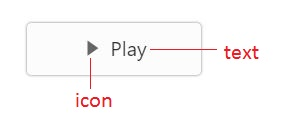
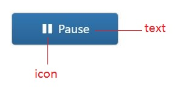

# Getting Started

This section helps to understand the getting started of the Aurelia ToggleButton with the step-by-step instructions.

## Create a ToggleButton control

You can create an Aurelia application and add necessary scripts and styles with the help of the given [Aurelia Getting Started Documentation](https://help.syncfusion.com/aurelia/overview).

We have already configured a template project in GitHub repository [syncfusion-template-repository](https://github.com/aurelia-ui-toolkits/syncfusion-template-repository). Run the below set of commands to clone the repository and install the required packages for Syncfusion Aurelia application.



> git clone "https://github.com/aurelia-ui-toolkits/syncfusion-template-repository"
> cd syncfusion-template-repository
> npm install
> jspm install



The below steps describes to create Syncfusion Aurelia ToggleButton component.

* Create `ToggleButton` folder inside `src/samples/` location.
* Create `ToggleButton.html` file inside `src/samples/ToggleButton` folder and use the below code example to render the ToggleButton component.



<template>
       <input id="toggleBtn" type="checkbox" ej-toggle-button="e-size.bind: btnSize;
                        e-show-rounded-corner.bind: roundedCorner;
                        e-content-type.bind: contentType;
                        e-default-prefix-icon.bind:prefixIcon;
                        e-active-prefix-icon.bind: suffixIcon;
                        e-default-text.bind: defaultText;
                        e-active-text.bind: activeText></input>
                        <label for="toggleBtn">Toggle</label>
</template>



* Create `ToggleButton.js` file with the below code snippet inside `src/samples/ToggleButton` folder.



export class Default {
    constructor() {
      this.btnSize = 'large';
      this.roundedCorner = true;
      this.contentType = 'textandimage';
      this.prefixIcon = 'e-icon e-mediaplay';
      this.suffixIcon = 'e-icon e-mediapause';
      this.defaultText = 'Play';
      this.activeText = 'Pause';
    }
}



* Now, we are going to configure the navigation for created ToggleButton sample in `src/app.js` file.



export class App {
 configureRouter(config, router) {
  config.title = 'Aurelia Syncfusion';
  config.map([
   { route: ['', 'welcome'], name: 'welcome', moduleId: 'welcome',                              
                nav: true, title: 'Welcome' },
   { route: 'child-router',  name: 'child-router', moduleId: 'child-router',                         
                nav: true, title: 'Child Router' },
   { route: 'button',        name: 'button', moduleId: 'samples/button/button',                
                nav: true, title: 'Button' },
   { route: 'ToggleButton',        name: 'ToggleButton', moduleId: 'samples/ToggleButton/ToggleButton',                
                nav: true, title: 'ToggleButton' }
 ]);
 this.router = router;
 }
}



* To run the application, execute the following command.



gulp watch



Execution of above code will render the following output.

 

 