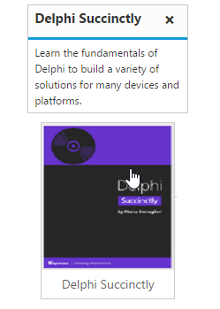

# Getting started

## Preparing HTML document

The Tooltip control has the following list of external JavaScript dependencies. 

* [jQuery](http://jquery.com/) 1.7.1 and later versions

* [jQuery.easing](http://gsgd.co.uk/sandbox/jquery/easing/) - to support animation effects in the components

Refer to the internal dependencies in the following table.

<table>
<tr>
<th>
File                                </th><th>
Description/Usage</th></tr>
<tr>
<td>
ej.core.min.js</td><td>
It is referred always before using all the JS controls.</td></tr>
<tr>
<td>
ej.tooltip.min.js</td><td>
The Tooltip's main file.</td></tr>
</table>

To get started, you can use the `ej.web.all.min.js` file that encapsulates all the `ej` controls and frameworks in one single file.

## Create a Tooltip

Before we start with Tooltip, please refer [this page](https://help.syncfusion.com/aurelia/overview#getting-started) page for general information regarding integrating Syncfusion widget’s.

For quick start, we already configured a template project in GitHub repository [syncfusion-template-repository](https://github.com/aurelia-ui-toolkits/syncfusion-template-repository). Run the below set of commands to clone the repository and install the required packages for Syncfusion Aurelia application.



    > git clone "https://github.com/aurelia-ui-toolkits/syncfusion-template-repository"
    > cd syncfusion-template-repository
    > npm install
    > jspm install



The below steps describes to create Syncfusion Aurelia Tooltip component.

    Create Tooltip folder inside src/samples/ location.
    Create Tooltip.html file inside src/samples/Tooltip folder and use the below code example to render the Tooltip component.
	
The Tooltip can be created from any HTML element with the HTML `id` attribute and pre-defined options set to it. To create the Tooltip, you should call the `ejTooltip` jQuery plug-in function with the options as parameter. Refer to the following code example.


 
      <template>
          

          

          
          
Delphi Succinctly

          

	  </template>




   
    export class Tooltip {
     constructor() {
       this.content = "Learn the fundamentals of Delphi to build a variety of solutions for many devices and platforms.";
      }
    }



Apply the following style sheet



    
    


## Setting Dimensions

Tooltip dimensions can be set using [width](http://help.syncfusion.com/js/api/ejtooltip#members:width) and [height](http://help.syncfusion.com/js/api/ejtooltip#members:height) API.


 
     <template>
        

	     TypeScript lets you write <a  id="link1" ej-tooltip="e-content.bind:content;e-width:200px;e-height:100px"><u>JavaScript</u> </a>the way you really want to.
         

	 </template>
	 // Creates the Tooltip





     export class Tooltip {
      constructor() {
        this.content = "JavaScript is the programming language of HTML and the Web.";
   
          }
          }



## Tooltip Appearance 

You can configure the appearance of the Tooltip with the title, close button and call out as your application requires.


 
    <template>
          

          

          
          
Delphi Succinctly

          

	  </template>

// Creates the Tooltip
    


Apply the following styles to show the Tooltip.



    
    


