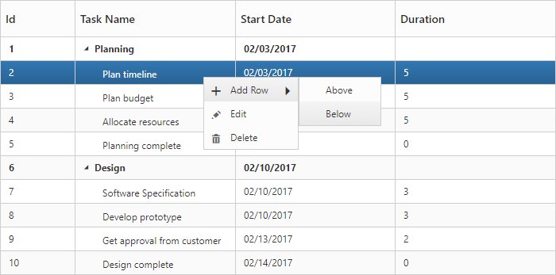
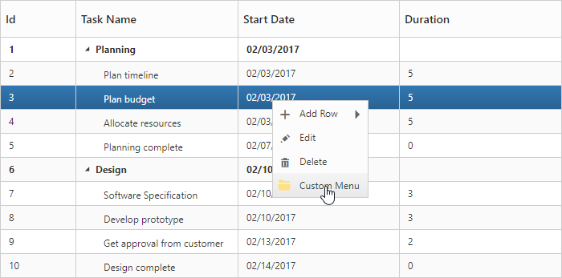
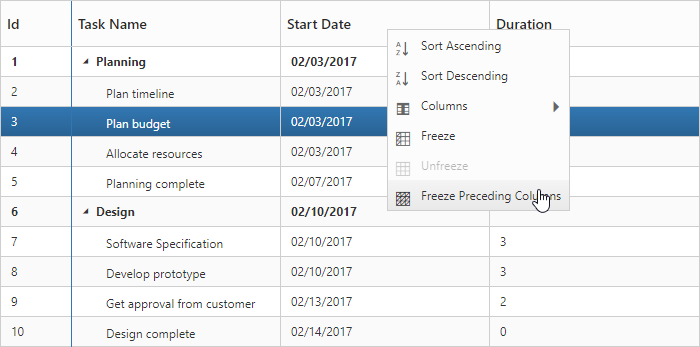

# Context Menu

The context menu in TreeGrid control is used to manipulate (add, edit and delete) the TreeGrid rows. In TreeGrid, context menu can be enabled with [`contextMenuSettings`](https://help.syncfusion.com/api/js/ejtreegrid#members:contextmenusettings) property. The [`contextMenuSettings`](https://help.syncfusion.com/api/js/ejtreegrid#members:contextmenusettings) property contains two inner properties [`showContextMenu`](https://help.syncfusion.com/api/js/ejtreegrid#members:contextmenusettings-showcontextmenu) and [`contextMenuItems`](https://help.syncfusion.com/api/js/ejtreegrid#members:contextmenusettings-contextmenuitems).

The [`showContextMenu`](https://help.syncfusion.com/api/js/ejtreegrid#members:contextmenusettings-showcontextmenu) property is used to enable or disable the context menu, default value for this property is `false`.

The [`contextMenuItems`](https://help.syncfusion.com/api/js/ejtreegrid#members:contextmenusettings-contextmenuitems) property is used to add the menu items to context menu, this property renders `Add` and `Delete` by default when the menu items are not provided.


<template>
    

        <ej-tree-grid 
            e-widget.bind="TreeGrid"
            id="TreeGrid"
            e-allow-sorting="true"
            e-allow-multi-sorting="true"
            e-edit-settings.bind="editSettings"
            e-context-menu-settings.bind="contextMenuSettings"
            >
        </ej-tree-grid>
    

</template>



export class DefaultSample {
    //...
    constructor() {
      this.editSettings = {
        allowEditing: true,
        allowAdding: true,
        rowPosition: ej.TreeGrid.RowPosition.Below,
        allowDeleting: true,
        editMode: 'rowEditing'
      };
      this.contextMenuSettings = {
        showContextMenu: true,
        contextMenuItems: [
          ej.TreeGrid.ContextMenuItems.Add,
          ej.TreeGrid.ContextMenuItems.Edit,
          ej.TreeGrid.ContextMenuItems.Delete
        ]
      };
    }
}


The following screenshot displays the Context menu in TreeGrid control.

## ContextMenu Customization

The Context menu can be customized by adding a new custom menu item to it. In TreeGrid, context menu can be customized using the ContextMenuOpen client-side event. This event is triggered when the context menu is rendered with mouse right click action. The following properties are available in the event.

* headerText: Display text for menu item.
* iconPath: Image location for menu item.
* eventHandler: Client-side event for menu item click.
* menuId: Used to bind event and sub menu items


<template>
    

        <ej-tree-grid 
            e-widget.bind="TreeGrid"
            id="TreeGrid"
            e-allow-sorting="true"
            e-allow-multi-sorting="true"
            e-context-menu-settings.bind="contextMenuSettings"
            e-on-context-menu-open.delegate="contextMenuOpen($event.detail)"
            >
        </ej-tree-grid>
    

</template>




export class DefaultSample {
    constructor() {
      this.contextMenuSettings = {
        showContextMenu: true,
        contextMenuItems: [
          ej.TreeGrid.ContextMenuItems.Add,
          ej.TreeGrid.ContextMenuItems.Edit,
          ej.TreeGrid.ContextMenuItems.Delete
        ]
      };
    }
    contextMenuOpen(args) {
      args.contextMenuItems.push({
        headerText: 'Custom Menu',
        iconPath: 'url(https://js.syncfusion.com/demos/web/content/images/treegrid/folder-open.png)',
        eventHandler: this.customMenuClick,
        menuId: 'customMenu'
      });
    }
    customMenuClick(args) {
      //your code goes here
    }
}


The following screenshot displays the customization of Context menu in TreeGrid control.

# Header Context Menu
Header context menu can be enabled by setting [`showContextMenu`](https://help.syncfusion.com/api/js/ejtreegrid#members:contextmenusettings-showcontextmenu) as `true`. The default value of the [`showContextMenu`](https://help.syncfusion.com/api/js/ejtreegrid#members:contextmenusettings-showcontextmenu) property is `false`.

Following options are shown in header context menu. 

* **Column Chooser** - Display all the column names; you can enable or disable a column by select or deselect the respective column name in the column chooser menu. This option is default option of header context menu.
* **Sort Ascending & Sort Descending** - Used to sort the items in the column. These menu options will be displayed only when you enable the [`allowSorting`](https://help.syncfusion.com/api/js/ejtreegrid#members:allowsorting "allowSorting") property. To perform multilevel sorting, the [`allowMultiSorting`](https://help.syncfusion.com/api/js/ejtreegrid#members:allowmultisorting "allowMultiSorting") property should be enabled.
* **Freeze, Unfreeze & Freeze Preceding Columns** - Used to freeze or unfreeze the columns. These set of menu options will be displayed in all the columns when [`isFrozen`](https://help.syncfusion.com/api/js/ejtreegrid#members:columns-isfrozen "isFrozen") property is enabled in any of the columns. However you can control the visibility of these menu options in a particular column by enabling/disabling the [`allowFreezing`](https://help.syncfusion.com/api/js/ejtreegrid#members:columns-allowfreezing "allowFreezing") property of that specific column.

The below code snippet explains how to enable header context menu in TreeGrid


<template>
    

        <ej-tree-grid 
            e-widget.bind="TreeGrid"
            id="TreeGrid"
            e-allow-sorting="true"
            e-allow-multi-sorting="true"
            e-context-menu-settings.bind="contextMenuSettings"
            >
        </ej-tree-grid>
    

</template>



export class DefaultSample {
    constructor() {
      this.contextMenuSettings = {
        showContextMenu: true,
        contextMenuItems: [
          ej.TreeGrid.ContextMenuItems.Add,
          ej.TreeGrid.ContextMenuItems.Edit,
          ej.TreeGrid.ContextMenuItems.Delete
        ]
      };
    }
}


The following screenshot displays the Header context menu in TreeGrid control.

