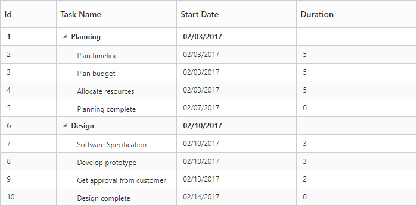
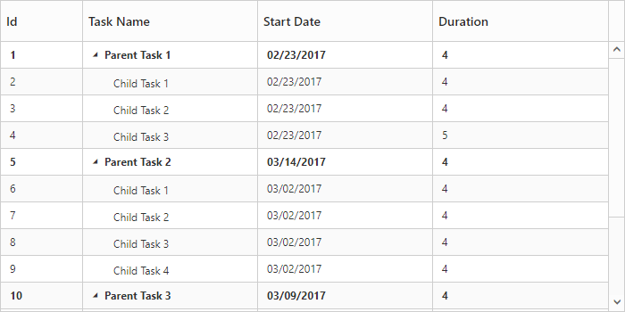

# Data Binding

Data Binding is the process that establishes a connection between the application and different kinds of datasources such as business objects.

## Local Data Binding

In local data binding, datasource for rendering the TreeGrid control is retrieved from the same application locally.

Two types of Data Binding are possible with TreeGrid control, 

* Hierarchical Datasource Binding
* Self-Referential Data Binding (Flat Data)

### Hierarchical Datasource Binding

The [`e-child-mapping`](https://help.syncfusion.com/api/js/ejtreegrid#members:childmapping "childMapping") property is used to map the child records in hierarchical datasource.

The following code example shows you how to bind the hierarchical local data into the TreeGrid control.



<template>
    

        <ej-tree-grid id="TreeGrid"
            e-data-source.bind="ProjectData"
            //...
            >
        </ej-tree-grid>
    

</template>





export class DefaultSample {
    constructor() {
        this.ProjectData = [
          {
              taskID: 1,
              taskName: 'Planning',
              startDate: '02/03/2017',
              subtasks: [
                    { taskID: 2, taskName: 'Plan timeline', startDate: '02/03/2017', duration: 5, },
                    { taskID: 3, taskName: 'Plan budget', startDate: '02/03/2017', duration: 5, },
                    { taskID: 4, taskName: 'Allocate resources', startDate: '02/03/2017',  duration: 5},
                    { taskID: 5, taskName: 'Planning complete', startDate: '02/07/2017', duration: 0}
              ]
          },
          {
              taskID: 6,
              taskName: 'Design',
              startDate: '02/10/2017',
              subtasks: [
                     { taskID: 7, taskName: 'Software Specification', startDate: '02/10/2017',  duration: 3, },
                     { taskID: 8, taskName: 'Develop prototype', startDate: '02/10/2017',  duration: 3 },
                     { taskID: 9, taskName: 'Get approval from customer', startDate: '02/13/2017', duration: 2 },
                     { taskID: 10, taskName: 'Design complete', startDate: '02/14/2017', duration: 0}
              ]
          }
        ];
    }
}



The output of the above steps is as follows:

### Self-Referential Data Binding (Flat Data)

TreeGrid is rendered from Self-Referential data structures by providing two fields, **ID** field and **Parent ID** field.

* **ID Field**: This field contains unique values used to identify nodes. Its name is assigned to the [`e-id-mapping`](https://help.syncfusion.com/api/js/ejtreegrid#members:idmapping "idMapping") property.
* **Parent ID Field**: This field contains values that indicate parent nodes. Its name is assigned to the [`e-parent-id-mapping`](https://help.syncfusion.com/api/js/ejtreegrid#members:parentidmapping "parentIdMapping") property.



<template>
    

        <ej-tree-grid id="TreeGrid"
            e-data-source.bind="ProjectData"
            e-id-mapping="taskID"
            e-parent-id-mapping="parentId">
        </ej-tree-grid>
    

</template>





export class DefaultSample {
    constructor() {
        this.ProjectData = [
            { 'taskID': 1, 'taskName': 'Parent Task 1', 'startDate': '02/23/2017', 'duration': 4 },
            { 'taskID': 2, 'taskName': 'Child Task 1', 'startDate': '02/23/2017', 'duration': 4, 'parentId': 1 },
            { 'taskID': 3, 'taskName': 'Child Task 2', 'startDate': '02/23/2017', 'duration': 4, 'parentId': 1 },
            { 'taskID': 4, 'taskName': 'Child Task 3', 'startDate': '02/23/2017', 'duration': 5, 'Progress': '40', 'parentId': 1 },
            { 'taskID': 5, 'taskName': 'Parent Task 2', 'startDate': '03/14/2017', 'duration': 4 },
            { 'taskID': 6, 'taskName': 'Child Task 1', 'startDate': '03/02/2017', 'duration': 4, 'parentId': 5 },
            { 'taskID': 7, 'taskName': 'Child Task 2', 'startDate': '03/02/2017', 'duration': 4, 'parentId': 5 },
            { 'taskID': 8, 'taskName': 'Child Task 3', 'startDate': '03/02/2017', 'duration': 4, 'parentId': 5 },
            { 'taskID': 9, 'taskName': 'Child Task 4', 'startDate': '03/02/2017', 'duration': 4, 'parentId': 5 },
            { 'taskID': 10, 'taskName': 'Parent Task 3', 'startDate': '03/09/2017', 'duration': 4 },
            { 'taskID': 11, 'taskName': 'Child Task 1', 'startDate': '03/9/2017', 'duration': 4, 'parentId': 10 },
            { 'taskID': 12, 'taskName': 'Child Task 2', 'startDate': '03/9/2017', 'duration': 4, 'parentId': 10 },
            { 'taskID': 13, 'taskName': 'Child Task 3', 'startDate': '03/9/2017', 'duration': 4, 'parentId': 10 },
            { 'taskID': 14, 'taskName': 'Child Task 4', 'startDate': '03/9/2017', 'duration': 4, 'parentId': 10 },
            { 'taskID': 15, 'taskName': 'Child Task 5', 'startDate': '03/9/2017', 'duration': 4, 'parentId': 10 }
        ];
    }
}



The following screenshot shows the output of the above steps,

## Virtual rendering
Virtualization support is used to render large number of records in TreeGrid with effective performance. In this mode all the records are fetched from data source initially, but only few records will be displayed in the document object model (DOM) which should be visible to the user. While scrolling, the visible records are updated in DOM as per the scrolled position. This mode can be enabled by setting [`e-enable-virtualization`](https://help.syncfusion.com/api/js/ejtreegrid#members:enablevirtualization "enableVirtualization") property as `true`. 

The below code example shows how to use this property.



<template>
    

        <ej-tree-grid id="TreeGrid"
            e-data-source.bind="ProjectData"
            e-enable-virtualization="true">
        </ej-tree-grid>
    

</template>


