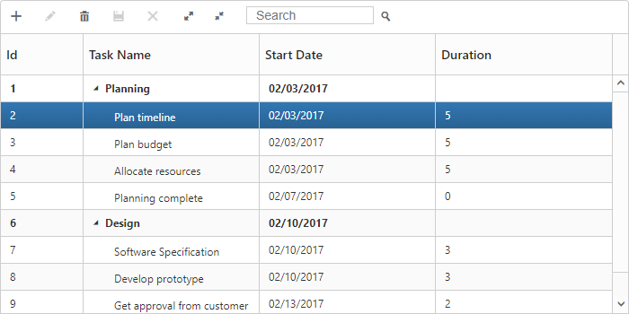
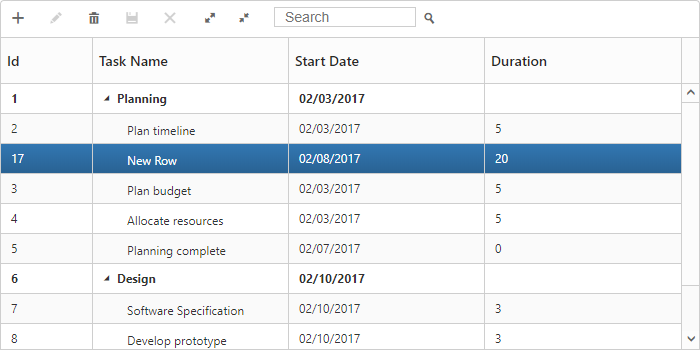
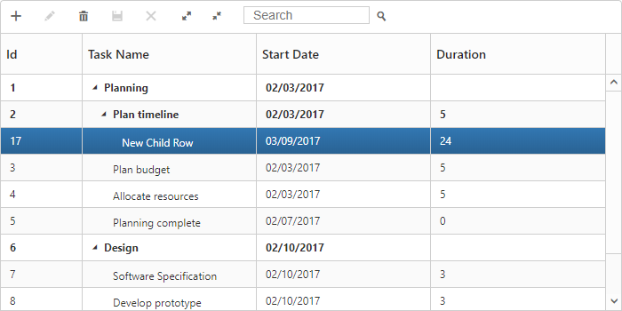
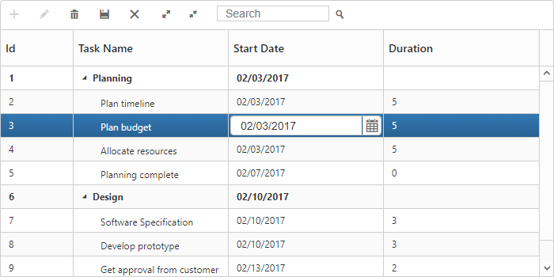
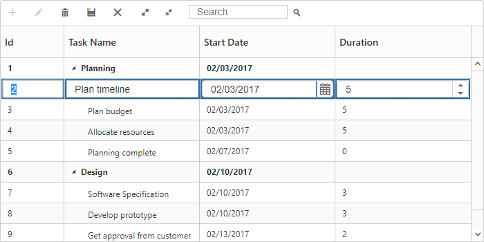
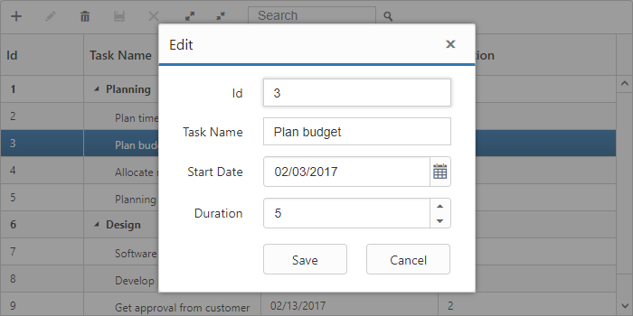
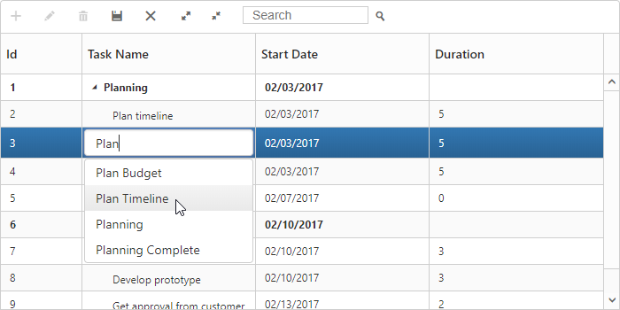
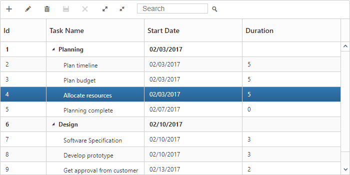
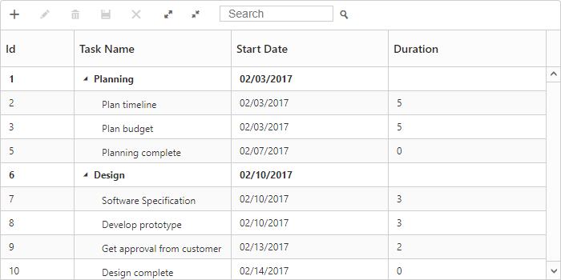
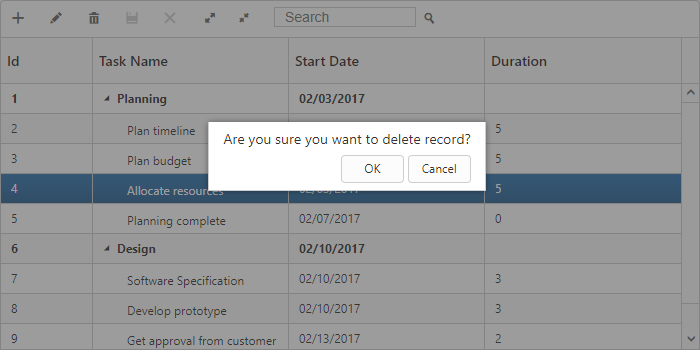

# Editing

TreeGrid provides support to add, edit and delete the records dynamically using [`editSettings`](https://help.syncfusion.com/api/js/ejtreegrid#members:editsettings) property.

## Add new record

TreeGrid provides support for adding a new record by setting [`allowAdding`](https://help.syncfusion.com/api/js/ejtreegrid#members:editsettings-allowadding) property as `true`. You can add new record by toolbar add item click or context menu.

The below code example shows how to enable add option in TreeGrid.


<template>
    

        <ej-tree-grid 
            e-widget.bind="TreeGrid"
            id="TreeGrid"
            e-edit-settings.bind="editSettings"
            >
        </ej-tree-grid>
    

</template>



export class DefaultSample {
    constructor() {
      this.editSettings = {
            allowEditing: true,
            allowAdding: true,
            //...
      };
    }
}


The above screenshot shows before add a new record in TreeGrid.
{:.caption}

The above screenshot shows after add a new record in TreeGrid.
{:.caption}

## Add row position

Using the [`editSettings.rowPosition`](https://help.syncfusion.com/api/js/ejtreegrid#members:editsettings-rowposition) parameter, user can able to insert the record at any desired index at run-time. The user can insert a record dynamically in the following positions

* Top: Top to all the existing records
* Bottom: Bottom to all the existing records
* AboveSelectedRow: Above to the selected row
* BelowSelectedRow: Below to the selected row
* Child: As a child to the selected row 

The below code example shows how to set row position for new record add in TreeGrid.


<template>
    

        <ej-tree-grid 
            e-widget.bind="TreeGrid"
            id="TreeGrid"
            e-edit-settings.bind="editSettings"
            >
        </ej-tree-grid>
    

</template>



export class DefaultSample {
    constructor() {
      this.editSettings = {
            allowEditing: true,
            allowAdding: true,
            rowPosition: ej.TreeGrid.RowPosition.Child,
            //...
      };
    }
}

The below screenshot shows new record added in row position of `Child`.

### Adding records using method

Using [`addRow`](/api/js/ejtreegrid#methods:addrow "addRow") method records can be added dynamically to the TreeGrid. Before calling this method, you should enable the [`allowAdding`](https://help.syncfusion.com/api/js/ejtreegrid#members:editsettings-allowadding) property.

The below code snippet explains dynamically inserting a record in TreeGrid. The record will be inserted as a child node to the current selected record.


<template>
      

        <ej-tree-grid 
            e-widget.bind="TreeGrid"
            id="TreeGrid"
            e-edit-settings.bind="editSettings"
            >
        </ej-tree-grid>
      

      <button type="button" click.delegate="addRecord()">Add New Record</button>
</template>



export class DefaultSample {
      constructor() {
            this.editSettings = {
                  allowEditing: true,
                  allowAdding: true,
                  rowPosition: ej.TreeGrid.RowPosition.Child,
                  //...
            };
      }
      addRecord() {
            var data = {
                  taskID: 20,
                  taskName: 'New Task 20',
                  startDate: '2/20/2014',
                  duration: 7
            };
            this.TreeGrid.addRow(data, ej.TreeGrid.RowPosition.Top);
      }
}


## Edit Modes

TreeGrid supports the below editModes, 

* Cell Editing
* Row Editing
* Dialog Editing

You can enable editing in TreeGrid by enabling the property [`allowEditing`](https://help.syncfusion.com/api/js/ejtreegrid#members:editsettings-allowediting).

### Cell Editing

Update the record through editing a cell by setting [`editMode`](https://help.syncfusion.com/api/js/ejtreegrid#members:editsettings-editmode) as the `CellEditing`.

The following code example shows you how to enable the `CellEditing` in TreeGrid control.


<template>
    

        <ej-tree-grid 
            e-widget.bind="TreeGrid"
            id="TreeGrid"
            e-edit-settings.bind="editSettings"
            >
        </ej-tree-grid>
    

</template>



export class DefaultSample {
    constructor() {
      this.editSettings = {
            allowEditing: true,
            allowAdding: true,
            rowPosition: ej.TreeGrid.RowPosition.Child,
            editMode: ej.TreeGrid.EditMode.CellEditing,
            //...
      };
    }
}


The output of TreeGrid with `CellEditing` is as follows.

### Prevent cell editing

In cell edit action [`beginEdit`](https://help.syncfusion.com/api/js/ejtreegrid#events:beginedit) and [`endEdit`](https://help.syncfusion.com/api/js/ejtreegrid#events:endedit) events are triggered before and after the editing action. Cell editing for specific cell can be prevented by using [`beginEdit`](https://help.syncfusion.com/api/js/ejtreegrid#events:beginedit) event.

The following code example show, how to prevent cell editing in TreeGrid.


<template>
    

        <ej-tree-grid 
            e-widget.bind="TreeGrid"
            id="TreeGrid"
            e-edit-settings.bind="editSettings"
            e-on-begin-edit.delegate="beginEdit($event.detail)"
            e-on-end-edit.delegate="endEdit($event.detail)"
            >
        </ej-tree-grid>
    

</template>



export class DefaultSample {
    constructor() {
      this.editSettings = {
            allowEditing: true,
            allowAdding: true,
            rowPosition: ej.TreeGrid.RowPosition.Child,
            editMode: ej.TreeGrid.EditMode.CellEditing,
            //...
      };
    }
      beginEdit(args) {
            if (args.columnIndex === 1) {
                  args.cancel = true;
            }
      }
      endEdit(args) {

      }
}


### Row Editing

It is possible to make the entire row to editable state and to update a record by setting [`editMode`](https://help.syncfusion.com/api/js/ejtreegrid#members:editsettings-editmode) as `RowEditing`.

The following code example shows you how to enable `RowEditing` in TreeGrid control.


<template>
    

        <ej-tree-grid 
            e-widget.bind="TreeGrid"
            id="TreeGrid"
            e-edit-settings.bind="editSettings"
            >
        </ej-tree-grid>
    

</template>



export class DefaultSample {
    constructor() {
      this.editSettings = {
            allowEditing: true,
            allowAdding: true,
            rowPosition: ej.TreeGrid.RowPosition.Child,
            editMode: ej.TreeGrid.EditMode.RowEditing,
            //...
      };
    }
}


The following output is displayed as a result of the above code example.

### Dialog Editing

Set the [`editMode`](https://help.syncfusion.com/api/js/ejtreegrid#members:editsettings-editmode) as `DialogEditing` to edit/add a record using dialog.

The following code example shows you how to enable the `DialogEditing` in TreeGrid control.


<template>
    

        <ej-tree-grid 
            e-widget.bind="TreeGrid"
            id="TreeGrid"
            e-edit-settings.bind="editSettings"
            >
        </ej-tree-grid>
    

</template>



export class DefaultSample {
    constructor() {
      this.editSettings = {
            allowEditing: true,
            allowAdding: true,
            rowPosition: ej.TreeGrid.RowPosition.Child,
            editMode: ej.TreeGrid.EditMode.DialogEditing,
            //...
      };
    }
}


The output of the TreeGrid with `DialogEditing` is as follows.

The add and edit dialogs can be opened on custom actions instead of toolbar icons using the methods [`showAddDialog`](https://help.syncfusion.com/api/js/ejtreegrid#methods:showadddialog "showAddDialog") and [`showEditDialog`](https://help.syncfusion.com/api/js/ejtreegrid#methods:showeditdialog "showEditDialog").

### Prevent dialog editing

In dialog editing action [`actionBegin`](https://help.syncfusion.com/api/js/ejtreegrid#events:actionbegin) and [`actionComplete`](https://help.syncfusion.com/api/js/ejtreegrid#events:actioncomplete) client side events are triggered before and after the edit action. Dialog editing for specific row can be prevented by using [`actionBegin`](https://help.syncfusion.com/api/js/ejtreegrid#events:actionbegin) event.

The following code example show, how to prevent dialog editing in TreeGrid.


<template>
    

        <ej-tree-grid 
            e-widget.bind="TreeGrid"
            id="TreeGrid"
            e-edit-settings.bind="editSettings"
            e-on-action-begin.delegate="actionBegin($event.detail)"
            >
        </ej-tree-grid>
    

</template>



export class DefaultSample {
    constructor() {
            this.editSettings = {
                  allowEditing: true,
                  allowAdding: true,
                  rowPosition: ej.TreeGrid.RowPosition.Child,
                  editMode: ej.TreeGrid.EditMode.DialogEditing,
                  //...
            };
      }
      actionBegin(args) {
            if (args.requestType === 'beforeOpenEditDialog') {
                  if (args.data.taskID === 4)
                        args.cancel = true;
            }
      }
}


N> While saving the edited record [`actionComplete`](https://help.syncfusion.com/api/js/ejtreegrid#events:actioncomplete) event will be triggered with updated record value in `data` argument and `requestType` as `recordUpdate`. Using this event we can update the database.

## BeginEditAction - edit cell/row by single/double click

In TreeGrid we can perform edit action by single or double click using [`beginEditAction`](https://help.syncfusion.com/api/js/ejtreegrid#members:editsettings-begineditaction) , default value of this property is `DblClick`.
The following code example shows how to enable single click edit in TreeGrid.

<template>
    

        <ej-tree-grid 
            e-widget.bind="TreeGrid"
            id="TreeGrid"
            e-edit-settings.bind="editSettings"
            >
        </ej-tree-grid>
    

</template>



export class DefaultSample {
      constructor() {
          //...
           this.editSettings = {
                  //...
                  beginEditAction: ej.TreeGrid.BeginEditAction.Click,
            };
      }
}


## Cell Edit Template

Edit template is used to create custom editor for editing the column values. This can be achieved by using [`columns.editTemplate`](https://help.syncfusion.com/api/js/ejtreegrid#members:columns-edittemplate).

Following functions required to render edit template in TreeGrid,

* `create` - It is used to create the control on initialization.
* `read` - It is used to read the input value on save.
* `write` - It is used to assign the value to control on editing.

The following code example describes edit template behavior

<template>
    

        <ej-tree-grid 
            e-widget.bind="TreeGrid"
            id="TreeGrid"
            e-edit-settings.bind="editSettings"
            >
        </ej-tree-grid>
    

</template>



export class DefaultSample {
      constructor() {
            this.editSettings = {
                  allowEditing: true,
                  editMode: 'cellEditing',
            };
            this.columns = [
                  { field: 'taskName', headerText: 'Task Name', 
                        editTemplate: {
                        create: function() {
                              return '<input>';
                        },
                        write: function(args) {
                              var autocompleteData = ['Planning', 'Plan Timeline', 'Plan Budget', 'Allocate Resources', 'Planning Complete'];
                              args.element.ejAutocomplete({
                                    width: '100%',
                                    height: 30,
                                    dataSource: autocompleteData,
                                    enableDistinct: true,
                                    value: args.rowData !== undefined ? args.rowData.taskName : ''
                              });
                        },
                        read: function(args) {
                              args.ejAutocomplete('suggestionList').css('display', 'none');
                              return args.ejAutocomplete('getValue');
                        }
                  }
            },
      //...
      ]
    }
}

The output of the TreeGrid width EditTemplate as follows.

The updated record values are maintained in collection in TreeGrid, and the user can retrieve the updated record collection at any time by using the [`getUpdatedRecords`](https://help.syncfusion.com/api/js/ejtreegrid#methods:getupdatedrecords "getUpdatedRecords") method.

## Delete record

TreeGrid provides support to delete a record by enabling [`allowDeleting`](https://help.syncfusion.com/api/js/ejtreegrid#members:editsettings-allowdeleting) property.

The below code example shows how to enable delete option in TreeGrid.


<template>
    

        <ej-tree-grid 
            e-widget.bind="TreeGrid"
            id="TreeGrid"
            e-edit-settings.bind="editSettings"
            >
        </ej-tree-grid>
    

</template>



export class DefaultSample {
      constructor() {
          //...
           this.editSettings = {
                  allowDeleting: true,
                  //...
            };
      }
}


The above screenshot shows before delete a record in TreeGrid.
{:.caption}

The above screenshot shows after delete a record in TreeGrid.
{:.caption}

## Delete confirmation message

Delete confirmation message is used to get the confirmation from the user before deleting action. This confirmation message can be enabled by setting [`showDeleteConfirmDialog`](https://help.syncfusion.com/api/js/ejtreegrid#editsettingsshowdeleteconfirmdialog-boolean) property as `true`.

The following code snippet explains how to enable delete confirmation message in TreeGrid.


<template>
    

        <ej-tree-grid 
            e-widget.bind="TreeGrid"
            id="TreeGrid"
            e-edit-settings.bind="editSettings"
            >
        </ej-tree-grid>
    

</template>



export class DefaultSample {
      constructor() {
          //...
           this.editSettings = {
                  allowDeleting: true,
                  showDeleteConfirmDialog: true
            };
      }
}


