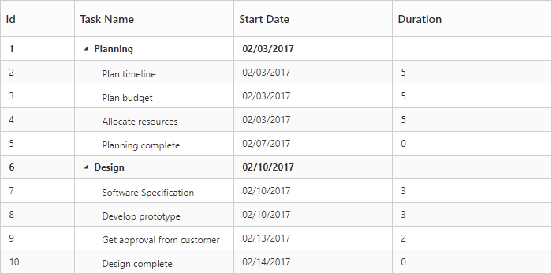
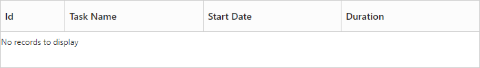
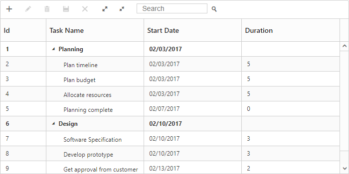
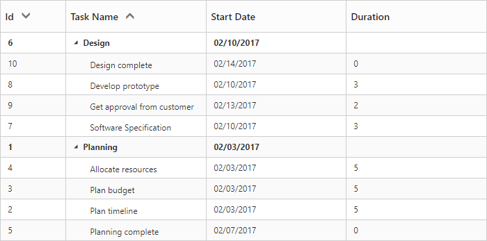
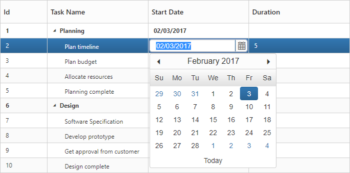
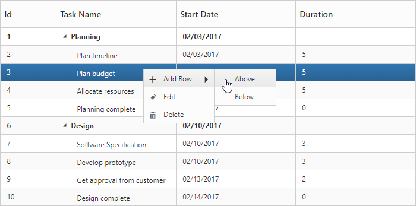
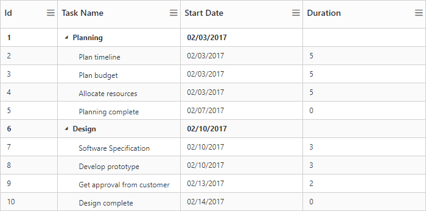

# Getting Started
This section helps to understand the getting started of the Aurelia TreeGrid with the step-by-step instructions.

## Create your first TreeGrid in Aurelia

To get started Syncfusion Aurelia application refer [this](https://help.syncfusion.com/aurelia/overview) page for basic control integration and script references.

The **Essential Aurelia TreeGrid** has been designed to represent and edit the hierarchical data. 

This section explains how to create a TreeGrid widget in your application with hierarchical data source and enable sorting and editing. The following screenshot displays the output.

* Create TreeGrid folder inside src/samples/ location.
* Create TreeGrid.html file inside src/samples/TreeGrid folder and use the below code example to render the TreeGrid component.

1.Create HTML file and add the following necessary script and css files to the HTML file.



    <!DOCTYPE html>
    <html xmlns="http://www.w3.org/1999/xhtml">
        <head>
            <meta name="viewport"content="width=device-width, initial-scale=1.0"/>
            <meta charset="utf-8" />
            <link href=" http://cdn.syncfusion.com/{{ site.releaseversion }}/js/web/flat-azure/ej.web.all.min.css" rel="stylesheet"/>
            
            
            
            
            
        </head>
        <body>
        <!--Add TreeGrid control here -->
        </body>
    </html>



2.Create the TreeGrid with the empty data source.



<template>
    

        <ej-tree-grid id="TreeGrid"               
            e-child-mapping="subtasks"
            e-tree-column-index="1"
            e-columns.bind="columns"
            e-size-settings.bind="sizeSettings">
        </ej-tree-grid>
    

</template>



To render the Aurelia TreeGrid using below code.



export class DefaultSample {
    constructor() {
        this.sizeSettings = {width:"700px", height:"100px"};
        this.columns =  [
            { field: 'taskID', headerText: 'Id', width: 70},
            { field: 'taskName', headerText: 'Task Name' },
            { field: 'startDate', headerText: 'Start Date' },
            { field: 'duration', headerText: 'Duration' }
        ];
    }
}



TreeGrid with empty datasource 
{:.caption}

3.Create data source for TreeGrid.



export class DefaultSample {
    constructor() {
        this.sizeSettings = {width:"700px", height:"350px"};
        this.columns =  [
                        { field: 'taskID', headerText: 'Id', width: 70},
                        { field: 'taskName', headerText: 'Task Name' },
                        { field: 'startDate', headerText: 'Start Date' },
                        { field: 'duration', headerText: 'Duration' }
        ];
        this.ProjectData = [
          {
              taskID: 1,
              taskName: 'Planning',
              startDate: '02/03/2017',
              subtasks: [
                    { taskID: 2, taskName: 'Plan timeline', startDate: '02/03/2017', duration: 5, },
                    { taskID: 3, taskName: 'Plan budget', startDate: '02/03/2017', duration: 5, },
                    { taskID: 4, taskName: 'Allocate resources', startDate: '02/03/2017',  duration: 5},
                    { taskID: 5, taskName: 'Planning complete', startDate: '02/07/2017', duration: 0}
              ]
          },
          {
              taskID: 6,
              taskName: 'Design',
              startDate: '02/10/2017',
              subtasks: [
                     { taskID: 7, taskName: 'Software Specification', startDate: '02/10/2017',  duration: 3, },
                     { taskID: 8, taskName: 'Develop prototype', startDate: '02/10/2017',  duration: 3 },
                     { taskID: 9, taskName: 'Get approval from customer', startDate: '02/13/2017', duration: 2 },
                     { taskID: 10, taskName: 'Design complete', startDate: '02/14/2017', duration: 0}
              ]
          }
        ];
    }
}



4.Initialize the TreeGrid with data source created in last step.



<template>
    

        <ej-tree-grid id="TreeGrid"
            e-data-source.bind="ProjectData"                 
            e-child-mapping="subtasks"
            e-tree-column-index="1"
            e-columns.bind="columns"
            e-size-settings.bind="sizeSettings">
        </ej-tree-grid>
    

</template>



TreeGrid widget is displayed as the output in the following screenshot.

## Enable Toolbar

TreeGrid control contains the toolbar options to Add, Edit, Delete, Cancel, Update, Search, ExpandAll and CollapseAll operations, you can enable the toolbar by using [`e-toolbar-settings`](https://help.syncfusion.com/api/js/ejtreegrid#members:toolbarsettings "toolbarSettings") property.



<template>
    

        <ej-tree-grid id="TreeGrid"
            e-toolbar-settings.bind="toolbarSettings">
        </ej-tree-grid>
    

</template>





export class DefaultSample {
    constructor() {
        this.toolbarSettings = {
            showToolbar: true,
            toolbarItems: [
                ej.TreeGrid.ToolbarItems.Add,
                ej.TreeGrid.ToolbarItems.Edit,
                ej.TreeGrid.ToolbarItems.Delete,
                ej.TreeGrid.ToolbarItems.Update,
                ej.TreeGrid.ToolbarItems.Cancel,
                ej.TreeGrid.ToolbarItems.ExpandAll,
                ej.TreeGrid.ToolbarItems.CollapseAll,
                ej.TreeGrid.ToolbarItems.Search
            ]
        };
    }
}    



The following screen shot displays a Toolbar in TreeGrid.

N> Add, Edit, Delete options are enabled by `allowEditing`, `allowAdding`, `allowDeleting` in the `editSettings` property.

## Enable Sorting

The TreeGrid control contains sorting functionality to arrange the data in ascending or descending order based on a particular column. Sorting can be enabled by using [`e-allow-sorting`](https://help.syncfusion.com/api/js/ejtreegrid#members:allowsorting "allowSorting") property.

### Multicolumn Sorting

You can enable the multicolumn sorting in TreeGrid by setting [`e-allow-multi-sorting`](https://help.syncfusion.com/api/js/ejtreegrid#members:allowmultisorting "allowMultiSorting") as `true` .You can sort multiple columns in TreeGrid by selecting the desired column header when holding the <kbd>Ctrl</kbd> key.



<template>
    

        <ej-tree-grid id="TreeGrid"
            e-allow-sorting="true"
            e-allow-multi-sorting="true">
        </ej-tree-grid>
    

</template>



The following screen shot displays a multiple column sorting in TreeGrid.

## Enable Editing

You can enable editing in TreeGrid by using [`e-edit-settings`](http://help.syncfusion.com/js/api/ejtreegrid#editsettings "editSettings") property and it is illustrated in the following code example.



<template>
    

        <ej-tree-grid id="TreeGrid"
            e-edit-settings.bind="editSettings">
        </ej-tree-grid>
    

</template>





export class DefaultSample {
    constructor() {
        this.editSettings= {
            allowEditing: true,
            allowAdding: true,
            rowPosition: ej.TreeGrid.RowPosition.Below,
            allowDeleting: true,
            editMode: "cellEditing"
        };
    }
}    



[Click](editing) here to refer more details for TreeGrid Editing.

## Enable Context Menu
The context menu in TreeGrid control is used to manipulate (add, edit and delete) the TreeGrid rows. 
In TreeGrid, context menu can be enabled by [`e-context-menu-settings`](https://help.syncfusion.com/api/js/ejtreegrid#members:contextmenusettings "contextMenuSettings") property. The [`e-context-menu-settings`](https://help.syncfusion.com/api/js/ejtreegrid#members:contextmenusettings "contextMenuSettings") property contains two inner properties [`showContextMenu`](https://help.syncfusion.com/api/js/ejtreegrid#members:contextmenusettings-showcontextmenu "showContextMenu") and [`contextMenuItems`](https://help.syncfusion.com/api/js/ejtreegrid#members:contextmenusettings-contextmenuitems contextMenuItems).



<template>
    

        <ej-tree-grid id="TreeGrid"
            e-context-menu-settings.bind="contextMenuSettings">
        </ej-tree-grid>
    

</template>





export class DefaultSample {
    constructor() {
        this.contextMenuSettings = {
            showContextMenu: true,
            contextMenuItems: [
                ej.TreeGrid.ContextMenuItems.Add,
                ej.TreeGrid.ContextMenuItems.Edit,
                ej.TreeGrid.ContextMenuItems.Delete
            ]
        };
    }
}    



The following screenshot displays the context menu in TreeGrid control.

[Click](context-menu) here to refer more details for TreeGrid context menu.

## Enable Column Chooser

You can enable the column menu in TreeGrid, by setting the [`e-show-column-chooser`](https://help.syncfusion.com/api/js/ejtreegrid#members:showcolumnchooser "showColumnChooser") as `true`.



<template>
    

        <ej-tree-grid id="TreeGrid"
            e-show-column-chooser="true">
        </ej-tree-grid>
    

</template>



The following screenshot displays the column chooser in TreeGrid control.

## Define dimension of TreeGrid

By default TreeGrid control was rendered with `100%` width and `450px` height, we can define the dimension of TreeGrid control by using [`e-size-settings`](https://help.syncfusion.com/api/js/ejtreegrid#members:sizesettings "sizeSettings") property. TreeGrid control width and height can be defined by either [`height`](https://help.syncfusion.com/api/js/ejtreegrid#members:sizesettings-height "height") and [`width`](https://help.syncfusion.com/api/js/ejtreegrid#members:sizesettings-width "width") properties or by defining inline style in TreeGrid container element. The below code example shows how to define width and height for TreeGrid control.



<template>
    

        <ej-tree-grid id="TreeGrid"
            e-size-settings.bind="sizeSettings">
        </ej-tree-grid>
    

</template>





export class DefaultSample {
    constructor() {
        this.sizeSettings = {width:"700px", height:"350px"};
    }
}    



N> 1.TreeGrid control will automatically update the width and height value based on container element on window resize action, this can be enabled by setting [`isResponsive`](https://help.syncfusion.com/api/js/ejtreegrid#members:isresponsive "isResponsive") property as `true` for this `height` and `width` value will be defined in percentage.
N> 2.We can also render TreeGrid with auto height by setting [`sizeSettings.height`](https://help.syncfusion.com/api/js/ejtreegrid#members:sizesettings-height "height") as `auto`.
