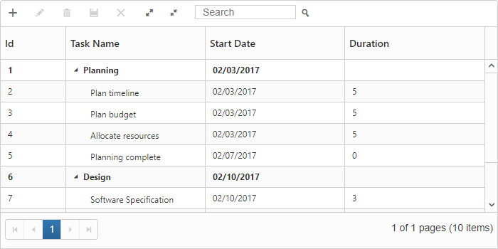

# Paging

TreeGrid provides support for displaying records in paginated view. Paging can be enabled in TreeGrid by setting the [`e-allow-paging`](https://help.syncfusion.com/api/js/ejtreegrid#members:allowpaging) property as `true`.

The below code snippet explains enable paging in TreeGrid.


<template>
    

        <ej-tree-grid 
            e-widget.bind="TreeGrid"
            id="TreeGrid"
            e-allow-paging="true"
            >
        </ej-tree-grid>
    

</template>


The output of the TreeGrid with paging enabled is displayed below.

## Paging settings

The paging in TreeGrid can be customized by using the [`pageSettings`](https://help.syncfusion.com/api/js/ejtreegrid#members:pagesettings) property.

* [`pageSize`](https://help.syncfusion.com/api/js/ejtreegrid#members:pagesettings-pagesize) - Using this property we can limit the number of records to be displayed per page.
* [`pageSizeMode`](https://help.syncfusion.com/api/js/ejtreegrid#members:pagesettings-pagesizemode) - By setting this property as `Root` we can limit the number of root nodes or the 0th level records to be displayed per page . 
When the [`pageSizeMode`](https://help.syncfusion.com/api/js/ejtreegrid#members:pagesettings-pagesizemode) property is set as `Root` the number of records to be displayed per page which is defined in the the [`pageSize`](https://help.syncfusion.com/api/js/ejtreegrid#members:pagesettings-pagesize) property will be considered only for the root nodes or the 0th level records.
* [`pageCount`](https://help.syncfusion.com/api/js/ejtreegrid#members:pagesettings-pagecount) - It is used to display the page number to be displayed in the pager.
* [`currentPage`](https://help.syncfusion.com/api/js/ejtreegrid#members:pagesettings-currentpage) - This property is used to set the active page to be displayed initially.
* [`totalRecordsCount`](https://help.syncfusion.com/api/js/ejtreegrid#members:pagesettings-totalrecordscount) - This property is used to limit the total number of records from the data source to be displayed in TreeGrid.
The following code example explains the properties in pageSettings. 


<template>
    

        <ej-tree-grid 
            e-widget.bind="TreeGrid"
            id="TreeGrid"
            e-allow-paging="true"
            e-page-settings.bind="pageSettings"
            >
        </ej-tree-grid>
    

</template>



export class DefaultSample {
    constructor() {
        this.pageSettings = {
            pageSize: 12,
            pageCount: 8,
            currentPage: 3,
            totalRecordsCount: 50,
            pageSizeMode: ej.TreeGrid.PageSizeMode.Root
        };
    }
}


## Paging - Touch Option

With paging and responsive mode enabled in TreeGrid, it is possible to change the current page using swipe action.


<template>
    

        <ej-tree-grid 
            e-widget.bind="TreeGrid"
            id="TreeGrid"
            e-allow-paging="true"
            e-is-responsive="true"
            >
        </ej-tree-grid>
    

</template>

