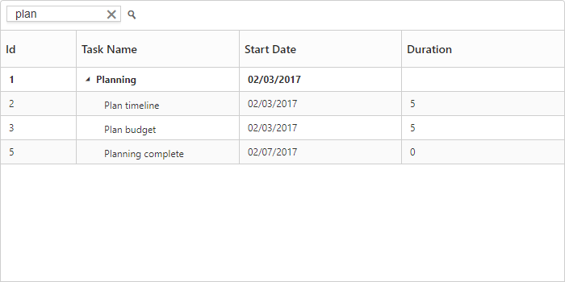

## Searching

The TreeGrid control has an option to search its content using toolbar search box. The toolbar search box can be enabled by using the `toolbarSettings.toolbarItems` property. The following code example explains how to integrate search textbox in toolbar.


<template>
    

        <ej-tree-grid 
            e-widget.bind="TreeGrid"
            id="TreeGrid"
            e-toolbar-settings.bind="toolbarSettings"
            >
        </ej-tree-grid>
    

</template>



export class DefaultSample {
    constructor() {
        this.toolbarSettings = {
            showToolbar: true,
            toolbarItems: [
                ej.TreeGrid.ToolbarItems.Search
            ]
        };
    }
}


The below screenshot shows TreeGrid search with `plan` key word.
