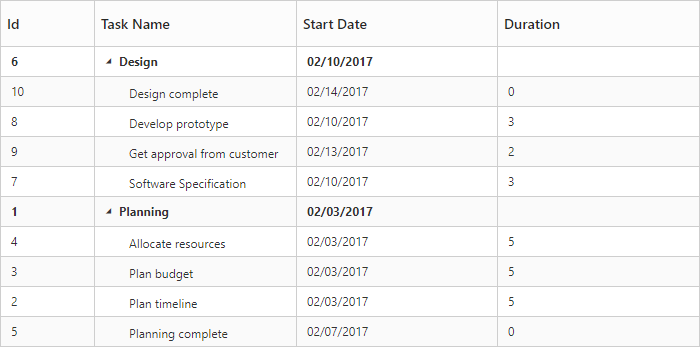

# Sorting

The TreeGrid control has built-in support for Sorting one or more columns.

## Sorting Columns

TreeGrid allows the items to be sorted in ascending or descending order based on the selected column by enabling the [`e-allow-sorting`](https://help.syncfusion.com/api/js/ejtreegrid#members:allowsorting) option in TreeGrid control. The following code example shows you how to enable Sorting in TreeGrid control.


<template>
    

        <ej-tree-grid 
            e-widget.bind="TreeGrid"
            id="TreeGrid"
            e-allow-sorting="true"
            >
        </ej-tree-grid>
    

</template>


## Multicolumn sorting

Gantt allows you to sort multiple columns by clicking the desired column headers while holding the <kbd>CTRL</kbd> key with [`e-allow-multi-sorting`](https://help.syncfusion.com/api/js/ejtreegrid#members:allowmultisorting) as `true` . The following code example shows you how to enable multicolumn sorting in Gantt control.


<template>
    

        <ej-tree-grid 
            e-widget.bind="TreeGrid"
            id="TreeGrid"
            e-allow-sorting="true"
            e-allow-multi-sorting="true"
            >
        </ej-tree-grid>
    

</template>


The following screenshot shows the output of Multicolumn sorting in TreeGrid control.

## Disable sorting for specific column

It is possible to disable sorting for a specific column by setting [`e-allow-sorting`](https://help.syncfusion.com/api/js/ejtreegrid#members:columns-allowsorting) as `false` in the column definition.
The below code snippet demonstrates this.

<template>
    

        <ej-tree-grid 
            e-widget.bind="TreeGrid"
            id="TreeGrid"
            e-allow-sorting="true"
            e-allow-multi-sorting="true"
            e-columns.bind="columns"
            >
        </ej-tree-grid>
    

</template>



export class DefaultSample {
    constructor() {
        this.columns = [
            { field: 'taskID', headerText: 'Id', width: 70, isFrozen: false, allowSorting: false },
            { field: 'taskName', headerText: 'Task Name'},
            //..
        ];
    }
}


## Sort column at initial load
In TreeGrid, It is possible to render the control with sorted columns, this can be achieve by using [`e-sort-settings`](https://help.syncfusion.com/api/js/ejtreegrid#members:sortsettings) property. We can add columns which are sorted initially in [`sortedColumns`](https://help.syncfusion.com/api/js/ejtreegrid#members:sortsettings-sortedcolumns) collection. [`sortedColumns`](https://help.syncfusion.com/api/js/ejtreegrid#members:sortsettings-sortedcolumns) collection was defined with [`field`](https://help.syncfusion.com/api/js/ejtreegrid#members:sortsettings-sortedcolumns-field) and [`direction`](https://help.syncfusion.com/api/js/ejtreegrid#members:sortsettings-sortedcolumns-direction) properties.


<template>
    

        <ej-tree-grid 
            e-widget.bind="TreeGrid"
            id="TreeGrid"
            e-allow-sorting="true"
            e-allow-multi-sorting="true"
            e-sort-settings.bind="sortSettings"
            >
        </ej-tree-grid>
    

</template>



export class DefaultSample {
    constructor() {
        this.sortSettings = {
            sortedColumns: [{ field: 'taskName', direction: ej.SortOrder.Decending }]
        };
    }
}


The following code shows how to add sorted column in TreeGrid.
The below screenshot shows TreeGrid rendered with descending order of `Task Name` column.

