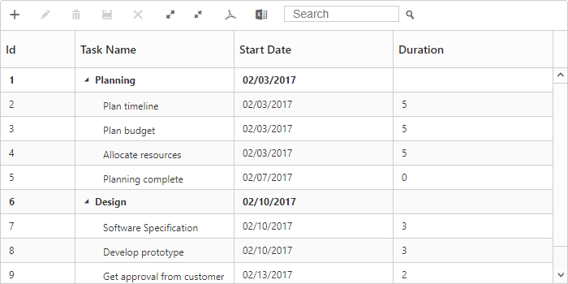
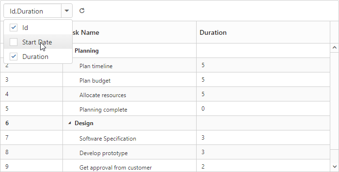

# Toolbar

In TreeGrid we can show/hide the Toolbar by using [`showToolbar`](https://help.syncfusion.com/api/js/ejtreegrid#members:toolbarsettings-showtoolbar) property.We can add default toolbar items by [`toolbarItems`](https://help.syncfusion.com/api/js/ejtreegrid#members:toolbarsettings-toolbaritems). User can also create a custom toolbar items by using [`customToolbarItems`](https://help.syncfusion.com/api/js/ejtreegrid#members:toolbarsettings-customtoolbaritems).

## Default Toolbar Items
Using TreeGrid default toolbar items we can perform below operations.

* **Add**- To add new task.

* **Edit**-To edit a selected task.

* **Delete**- To delete a selected task.
		   
* **Cancel**- To cancel the edited changes in a task.
		   
* **Update**- To save the edited changes in a task.
		   
* **ExpandAll**- To expand all the TreeGrid rows.
		   
* **CollapseAll**- To collapse all the TreeGrid rows.
		   
* **PdfExport**- To export TreeGrid in PDF format.
		   
* **ExcelExport**- To export TreeGrid in Excel format.

We can enable TreeGrid toolbar by using below code example:

<template>
    

        <ej-tree-grid 
            e-widget.bind="TreeGrid"
            id="TreeGrid"
            e-toolbar-settings.bind="toolbarSettings"
            >
        </ej-tree-grid>
    

</template>



export class DefaultSample {
    constructor() {
        this.toolbarSettings = {
            showToolbar: true,
            toolbarItems: [
                ej.TreeGrid.ToolbarItems.Add,
                ej.TreeGrid.ToolbarItems.Edit,
                ej.TreeGrid.ToolbarItems.Delete,
                ej.TreeGrid.ToolbarItems.Update,
                ej.TreeGrid.ToolbarItems.Cancel,
                ej.TreeGrid.ToolbarItems.ExpandAll,
                ej.TreeGrid.ToolbarItems.CollapseAll,
                ej.TreeGrid.ToolbarItems.PdfExport,
                ej.TreeGrid.ToolbarItems.ExcelExport,
                ej.TreeGrid.ToolbarItems.Search
            ]
        };
    }
}

The following screenshot displays the toolbar option in TreeGrid control.

N> To perform add,edit,delete,cancel,update using Toolbar items we need to enable add/edit/delete using [`editSettings`](https://help.syncfusion.com/api/js/ejtreegrid#members:editsettings).
  
## Custom Toolbar Items

CustomToolbarItems allows us to insert custom icons and custom template in TreeGrid toolbar. By using below properties we can customize TreeGrid toolbar as per our requirement.

* [`text`](https://help.syncfusion.com/api/js/ejtreegrid#members:toolbarsettings-customtoolbaritems-text)- To insert the custom icons in toolbar using CSS class name selector.

* [`templateID`](https://help.syncfusion.com/api/js/ejtreegrid#members:toolbarsettings-customtoolbaritems-templateid)-To insert the custom icons in toolbar using script templates. Using this property we can bind HTML elements and other EJ controls to TreeGrid toolbar.

* [`tooltipText`](https://help.syncfusion.com/api/js/ejtreegrid#members:toolbarsettings-customtoolbaritems-tooltiptext)-Displays tooltip text for the custom icons. 

To insert EJ Controls in TreeGrid toolbar we need to initiate the control in [`create`](https://help.syncfusion.com/api/js/ejtreegrid#events:create) client side event.In [`toolbarClick`](https://help.syncfusion.com/api/js/ejtreegrid#events:toolbarclick) client side event we can bind actions to the custom toolbar items.


<template>
    
    
    

        <ej-tree-grid 
            e-widget.bind="TreeGrid"
            id="TreeGrid"
            e-on-create.delegate="create($event.detail)"
            e-on-toolbar-click.delegate="toolbarClick($event.detail)"
            e-toolbar-settings.bind="toolbarSettings"
            >
        </ej-tree-grid>
    

</template>



export class DefaultSample {
    constructor() {
        this.toolbarSettings = {
            showToolbar: true,
            customToolbarItems: [{ templateID: '#ColumnVisibility', tooltipText: 'Column Visibility' }, {text: 'Reset', tooltipText: 'Reset'}]
        };
    }
    create() {
        var dropData = [
            { text: 'Id', value: 'taskID', selected: true },
            { text: 'Start Date', value: 'startDate', selected: true },
            { text: 'Duration', value: 'duration', selected: true }
        ];
        $('#dropdownContainer').ejDropDownList({
            height: 30,
            dataSource: dropData,
            showCheckbox: true,
            field: { text: 'text', value: 'value', selected: 'selected' },
            checkChange: function(args) {
                var treeObj = $('#TreeGrid').data('ejTreeGrid');
                if (args.isChecked === false) {
                    treeObj.hideColumn(args.selectedText);
                } else {
                    treeObj.showColumn(args.selectedText);
                }
            }
        });
    }
    toolbarClick(args) {
        if (args.itemName === 'Reset') {
            var dropObj = $('#dropdownContainer').data('ejDropDownList');
            this.columns[0].visible = this.columns[1].visible = this.columns[2].visible = this.columns[3].visible = true;
            this.TreeGrid.setModel({ 'columns': this.columns });
            dropObj.clearText();
            dropObj.checkAll();
        }
    }
}


