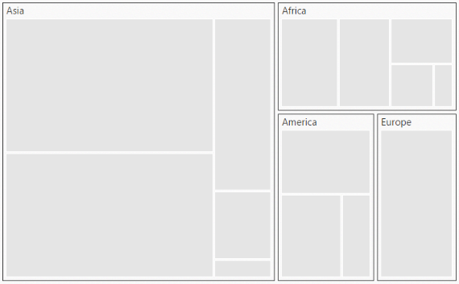

# Getting Started

This section explains briefly about how to create a **TreeMap** in your application with **Aurelia**.

## Create your first TreeMap in Aurelia

You can configure an **Essential Aurelia TreeMap** in simple steps. In this section, you can learn how to configure a TreeMap control in a real-time scenario where it is used to visually represent the percentage of growth in population in each continent. It also provides a walk-through on some of the customization features available in TreeMap control. 

## Add Libraries

To add a **TreeMap** control in your application, refer the following libraries in an **HTML** page. 

* [jQuery](http://jquery.com/) version  1.10.1 and above
* JsRender
* ej.web.all

The following code sample explains how to link these libraries from a [Content Delivery Network (CDN)](https://en.wikipedia.org/wiki/Content_delivery_network).



    <!--  jquery script  -->
      
    <!-- Essential JS UI widget -->
      
    <!-- JS Render widget -->
        
    <!-- Essential JS theme  -->
      



## Initialize TreeMap

Before we start with TreeMap, please refer [this](https://help.syncfusion.com/aurelia/overview#getting-started) page for general information regarding integrating Syncfusion widget’s.

For quick start, we already configured a template project in GitHub repository [syncfusion-template-repository](https://github.com/aurelia-ui-toolkits/syncfusion-template-repository). Run the below set of commands to clone the repository and install the required packages for Syncfusion Aurelia application.



    > git clone "https://github.com/aurelia-ui-toolkits/syncfusion-template-repository"
    > cd syncfusion-template-repository
    > npm install
    > jspm install



The below steps describes to create Syncfusion Aurelia TreeMap component.

    Create TreeMap folder inside src/samples/ location.
    Create TreeMap.html file inside src/samples/TreeMap folder and use the below code example to render the TreeMap component.

Create a **&lt;div&gt;** tag with a specific id and set the height and width to determine the **TreeMap** size to be rendered.



<template>
     

        <ej-tree-map id="container"></ej-tree-map>	
     
      
</template>      



### Populate DataSource

The `data-source` property accepts the collection values as input. For example, you can provide the list of objects as input.

### Weight Value Path

You can calculate the size of the object using `weight-value-path` of **TreeMap**.

Add a **&lt;script&gt;** tag anywhere in a web page and initialize **TreeMap** as illustrated in the following code sample. 



<template>
     

        <ej-tree-map id="container"  e-weight-value-path="Population" e-data-source.bind="population_data">
	 	    
        </ej-tree-map>		
     
      
</template>



Populate the TreeMap data in JSON object. For example, you can use population data of countries to generate TreeMap data as illustrated in the following code sample.



        this.population_data = [
                   { Continent: "Asia", Region: "Southern Asia", Growth: 1.32, Population: 1749046000 },
                   { Continent: "Asia", Region: "Eastern Asia", Growth: 0.57, Population: 1620807000 },
                   { Continent: "Asia", Region: "South-Eastern Asia", Growth: 1.20, Population: 618793000 },
                   { Continent: "Asia", Region: "Western Asia", Growth: 1.98, Population: 245707000 },
                   { Continent: "Asia", Region: "Central Asia", Growth: 1.43, Population: 64370000 },
                   { Continent: "Europe", Region: "Europe", Growth: 0.10, Population: 742452000 },
                   { Continent: "America", Region: "South America", Growth: 1.06, Population: 406740000 },
                   { Continent: "America", Region: "Northern America", Growth: 0.85, Population: 355361000 },
                   { Continent: "America", Region: "Central America", Growth: 1.40, Population: 167387000 },
                   { Continent: "Africa", Region: "Eastern Africa", Growth: 2.89, Population: 373202000 },
                   { Continent: "Africa", Region: "Western Africa", Growth: 2.78, Population: 331255000 },
                   { Continent: "Africa", Region: "Northern Africa", Growth: 1.70, Population: 210002000 },
                   { Continent: "Africa", Region: "Middle Africa", Growth: 2.79, Population: 135750000 },
                   { Continent: "Africa", Region: "Southern Africa", Growth: 0.91, Population: 60425000 }
        ];



N> Population data is referred from [List of continents by population](http://en.wikipedia.org/wiki/List_of_continents_by_population).

The following screenshot displays a TreeMap control that is rendered after executing the above code sample. The control is rendered with the default properties using the above code. 

## Group with Levels

You can group TreeMap items using the levels in it.

### Group Path

You can use `group-path` property for every flat level of the TreeMap control. It is a path to a field on the source object that serves as the “Group” for the level specified. You can group the data based on the `group-path` in the TreeMap control. When the `group-path` is not specified, then the items are not grouped and the data is displayed in the order specified in the `data-source`.

### Group Gap

You can use `group-gap` property to separate the items from every flat level and to differentiate the levels mentioned in the TreeMap control.

The following code sample explains how to group TreeMap Items using ‘Levels’.



  
<template>
     

        <ej-tree-map id="container"  e-weight-value-path="Population" e-data-source.bind="population_data">
	 	    <ej-level e-group-path="Continent" e-group-gap="5"></ej-level> 
        </ej-tree-map>		
     
      
</template>



The following screenshot displays grouping of **TreeMap****Items** using **Levels**.

## Customize TreeMap by Range

You can differentiate the nodes based on its value and color ranges using Range color. You can also define the color value range using from and to properties. 

### Color Value Path

The `color-value-path` of TreeMap is a path to a field on the source object. You can determine the color for the object using `color-value-path` of TreeMap.

The following code sample explains how to customize TreeMap appearance using Range.



this.rangeColorMapping = [
                    { color: "#DC562D", from: "0", to: "1" },
                    { color: "#FED124", from: "1", to: "1.5" },
                    { color: "#487FC1", from: "1.5", to: "2" },
                    { color: "#0E9F49", from: "2", to: "3" }
                ];





  
<template>
     

        <ej-tree-map id="container"  e-weight-value-path="Population" e-color-value-path="Growth" e-data-source.bind="population_data" e-range-color-mapping.bind="rangeColorMapping">
	           <ej-level e-group-path="Continent" e-group-gap="5"></ej-level> 
        </ej-tree-map>		
     
      
</template>



The following screenshot displays a customized **TreeMap** control. 

## Enable Tooltip

You can enable the tooltip by setting `show-tooltip` property to “True”. By default, it takes the property of the bound object that is referred in the `weight-value-path` and displays its content when the corresponding node is hovered. You can customize the template for tooltip using `tooltip-template` property.

## Leaf ItemSettings

You can customize the Leaf level TreeMap items using `leaf-item-settings`. The Label and tooltip values take the property of bound object that is referred in the `label-path` when defined. The following code sample displays how the tooltip is enabled.



 this.leafItemSettings = {labelPath: 'Region'};





   <template>
     

        <ej-tree-map id="container"  e-weight-value-path="Population" e-color-value-path="Growth" e-data-source.bind="population_data" 
                     e-show-tooltip="true" e-tooltip-template="template" e-range-color-mapping.bind="rangeColorMapping" e-leaf-item-settings.bind="leafItemSettings" >
	        <ej-level e-group-path="Continent" e-group-gap="5"></ej-level> 
        </ej-tree-map>		
     
      
</template>

    



The following screenshot displays a ToolTip in a **TreeMap** control.

## Enable Legend

You can set the color value of leaf nodes using TreeMap Legend. This legend is appropriate only for the TreeMap whose leaf nodes are colored using `rangeColorMapping`. You can set `showLegend` property value to “True” to make a legend visible.

### Label for Legend

You can customize the labels of the legend item using `legendLabel` property of `rangeColorMapping`. 

The following code sample illustrates how to add labels for legend in a TreeMap.



 this.leafItemSettings = {labelPath: 'Region'};



    this.legendSettings = { width: 690, height: 38};
    this.rangeColorMapping = [
                    { color: "#DC562D", from: "0", to: "1",  legendLabel: "0 - 1 %    Growth" },
                    { color: "#FED124", from: "1", to: "1.5", legendLabel: "1 - 1.5 % Growth" },
                    { color: "#487FC1", from: "1.5", to: "2", legendLabel: "1.5 - 2 % Growth" },
                    { color: "#0E9F49", from: "2", to: "3", legendLabel: "2 - 3 % Growth" }
                ];



<template>
     

    <ej-tree-map id="container"  e-weight-value-path="Population" e-color-value-path="Growth" e-data-source.bind="population_data" 
       e-show-tooltip="true" e-tooltip-template="template" e-range-color-mapping.bind="rangeColorMapping" 
       e-leaf-item-settings.bind="leafItemSettings"  e-show-legend="true" e-legend-settings.bind="legendSettings">
	  <ej-level e-group-path="Continent" e-group-gap="5"></ej-level> 
   </ej-tree-map>

 

</template>
    


The following screenshot displays labels in a **TreeMap** control. 

N> Population data is referred from [List of continents by population](http://en.wikipedia.org/wiki/List_of_continents_by_population).

