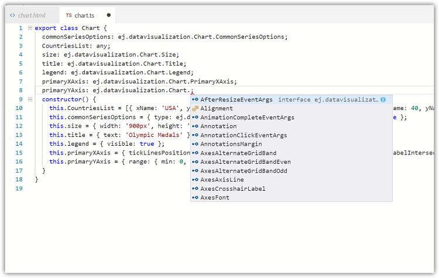

# Exposing ej object globally in typescript application

We have already configured Syncfusion Typings for all our typescript skeletons.

So, to use ej object globally, Clone [syncfusion-templates-repository](https://github.com/aurelia-ui-toolkits/syncfusion-templates-repository) and use any of the typescript skeleton.

The below code snippet will demonstrate the usage of `ej object` for `chart component` properties. `commonSeriesOption's` type and `tickLinesPosition` are declared with ej object.

[view]



<template>
    <ej-chart id="container" e-legend.bind="legend" e-size.bind="size" e-title.bind="title" e-primary-x-axis.bind="primaryXAxis"
        e-enable-canvas-rendering=true e-primary-y-axis.bind="primaryYAxis" e-common-series-options.bind="commonSeriesOptions">
        <ej-series e-data-source.bind="CountriesList" e-x-name="xName" e-y-name="yName" e-name="India">
        </ej-series>
        <ej-series e-data-source.bind="CountriesList" e-x-name="xName" e-y-name="yName1" e-name="Germany">
        </ej-series>
        <ej-series e-data-source.bind="CountriesList" e-x-name="xName" e-y-name="yName2" e-name="England">
        </ej-series>
    </ej-chart>
</template>



[view-model]



export class Chart {
  commonSeriesOptions: ej.datavisualization.Chart.CommonSeriesOptions; 
  CountriesList: any;
  size: ej.datavisualization.Chart.Size;
  title: ej.datavisualization.Chart.Title;
  legend: ej.datavisualization.Chart.Legend;
  primaryXAxis: ej.datavisualization.Chart.PrimaryXAxis; 
  primaryYAxis: ej.datavisualization.Chart.PrimaryYAxis; 
  constructor() { 
    this.CountriesList = [{ xName: 'USA', yName: 50, yName1: 70, yName2: 45}, { xName: 'China', yName: 40, yName1: 60, yName2: 55 }, { xName: 'Japan', yName: 70, yName1: 60, yName2: 50 }]; 
    this.commonSeriesOptions = { type:ej.datavisualization.Chart.Type.Column, enableAnimation: true }; 
    this.size = { width: '900px', height: '550px' }; 
    this.title = { text: 'Olympic Medals' }; 
    this.legend = { visible: true }; 
    this.primaryXAxis = { tickLinesPosition:ej.datavisualization.Chart.TickLinesPosition.Inside, labelIntersectAction:'hide' }; 
    this.primaryYAxis = { range: { min: 0, max: 80, interval: 20 } }; 
  } 
}



Now we can use ej object anywhere in our typescript application like the below screenshot.

