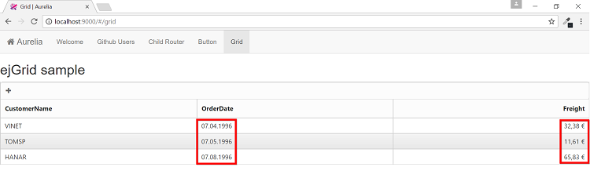
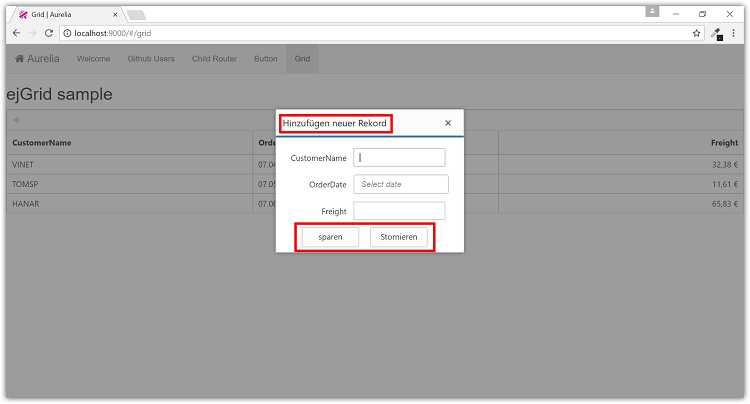

# Globalization and Localization support for Syncfusion Aurelia components

## Globalization

Syncfusion components has been provided with the built-in globalization support, so that it will be able to adapt for the culture-specific number and date format based on the defined locale property. Globalization values will be automatically used when locale property is set with locale value (e.g.) en-US. The en-US locale is currently being used in all the Syncfusion components by default.

## Globalizing Syncfusion Aurelia components

To globalize Syncfusion Aurelia components into a specific culture, it is necessary to refer the culture-specific script files which contains globalized texts.

The following steps will explain about globalizing Syncfusion Aurelia components.

*   Clone [syncfusion-templates-repository](https://github.com/aurelia-ui-toolkits/syncfusion-template-repository) and install project dependencies by executing the following commands.



> git clone https://github.com/aurelia-ui-toolkits/syncfusion-templates-repository.git
> cd syncfusion-templates-repository/skeleton-esnext
> npm install
> jspm install



*   Map [syncfusion-ej-global](https://www.npmjs.com/package/syncfusion-ej-global) package path in `config.js` file.



 paths: {
    "*": "dist/*",
    "github:*": "jspm_packages/github/*",
    "npm:*": "jspm_packages/npm/*",
    "syncfusion-ej-global/*": "jspm_packages/npm/syncfusion-ej-global@15.1.37/*"
  }



N> Installation of [syncfusion-javascript](https://github.com/syncfusion/JavaScript-Widgets) package will automatically install         `syncfusion-ej-global` package. Additionally, we need to add the `syncfusion-ej-global` package path mapping with respect to installed `syncfusion-ej-global` package version in `config.js` file

*   Set `locale` property in grid view which is used to set the culture that we want to use in our grid sample. For that, create `grid.html` file inside `src/samples/grid` folder with the below code snippet.



<template>
    <h2>ejGrid sample</h2>
    

        <ej-grid e-data-source.bind="data" e-locale="de-DE" e-edit-settings.bind="edit" e-toolbar-settings.bind="toolbar">
            <ej-column e-field="CustomerName"></ej-column>
            <ej-column e-field="OrderDate" e-format="{0:MM/dd/yyyy}"></ej-column>
            <ej-column e-field="Freight" e-format="{0:C}" e-text-align="right"></ej-column>
        </ej-grid>
    

</template>



*   To translate our grid sample from default `English` to any of the culture, say for example `German` culture, then we need to refer the `ej.culture.de-DE.min.js` file in grid view-model. For that, create `grid.js` file inside `src/samples/grid` folder with the below code snippet.



import 'syncfusion-ej-global/i18n/ej.culture.de-DE.min.js';

export class ejGrid {
    constructor() {
        this.edit = { allowAdding: true, editMode: ej.Grid.EditMode.Dialog };
        this.toolbar = { showToolbar: true, toolbarItems: [ej.Grid.ToolBarItems.Add] };

        this.data = [{
            CustomerName: "VINET", OrderDate: new Date(8364186e5), Freight: 32.38
        },
        {
            CustomerName: "TOMSP", OrderDate: new Date(836505e6), Freight: 11.61
        },
        {
            CustomerName: "HANAR", OrderDate: new Date(8367642e5), Freight: 65.83
        }]
    }
}



* Now, we are going to configure the navigation for created Grid sample in `src/app.js` file.



export class App {
  configureRouter(config, router) {
    config.title = 'Aurelia';
    config.map([
      { route: ['', 'welcome'], name: 'welcome',      moduleId: 'welcome',               nav: true, title: 'Welcome' },
      { route: 'users',         name: 'users',        moduleId: 'users',                 nav: true, title: 'Github Users' },
      { route: 'child-router',  name: 'child-router', moduleId: 'child-router',          nav: true, title: 'Child Router' },
      { route: 'button',        name: 'button',       moduleId: 'samples/button/button', nav: true, title: 'Button' },
      //Add the router configuration for Grid sample here
      { route: 'grid',          name: 'grid',         moduleId: 'samples/grid/grid',     nav: true, title: 'Grid' }
    ]);

    this.router = router;
  }
}



*   To run the app, execute the following command and browse to [http://localhost:9000](http://localhost:9000) to see the application.



> gulp watch



The below screenshot shows the grid sample with Globalization support.

## Localization

Syncfusion components has also been provided with the built-in localization support, so that it will be able to adapt based on the defined locale value. The en-US locale is currently being used in all the Syncfusion components by default.

## Localizing Syncfusion Aurelia components

To localize Syncfusion Aurelia components into a specific culture, it is necessary to refer the culture-specific script files which contains localized texts.

The steps for localizing Syncfusion Aurelia component is like globalizing Syncfusion Aurelia component except, we need to add localized script file in `grid.js` file additionally. For example, to translate default `English` to `German` culture, then we need to refer the `ej.localetexts.de-DE.min.js` file in our grid view-model.



import 'syncfusion-ej-global/i18n/ej.culture.de-DE.min.js';
import 'syncfusion-ej-global/l10n/ej.localetexts.de-DE.min.js';

export class ejGrid {
    constructor() {
        this.edit = { allowAdding: true, editMode: ej.Grid.EditMode.Dialog };
        this.toolbar = { showToolbar: true, toolbarItems: [ej.Grid.ToolBarItems.Add] };

        this.data = [{
            CustomerName: "VINET", OrderDate: new Date(8364186e5), Freight: 32.38
        },
        {
            CustomerName: "TOMSP", OrderDate: new Date(836505e6), Freight: 11.61
        },
        {
            CustomerName: "HANAR", OrderDate: new Date(8367642e5), Freight: 65.83
        }]
    }
}



The below screenshot shows the grid sample with Localization support.

## FAQ

**Query** : How to install syncfusion-ej-global package?

**Answer** : we need not to install [npm:syncfusion-ej-global](https://www.npmjs.com/package/syncfusion-ej-global) package separately. Installation of `syncfusion-javascript` package will automatically install `syncfusion-ej-global` package.

**Query** : My native culture is not included in syncfusion-ej-global?

**Answer** : `syncfusion-ej-global` package will have only 13 culture files. If our culture is not included in syncfusion-ej-global then we need to install [npm:syncfusion-ej-global-all](https://www.npmjs.com/package/syncfusion-ej-global-all) package separately.

we can install `syncfusion-ej-global-all` by either NPM or JSPM package manager.

To install `syncfusion-ej-global-all` via `NPM` package manager, execute the below command.



> npm install syncfusion-ej-global-all --save



to install `syncfusion-ej-global-all` via `JSPM` package manager, execute the below command.



> jspm install npm:syncfusion-ej-global-all



And then refer localization and globalization file/files from `syncfusion-ej-global-all` package like the below code snippet.



import 'syncfusion-ej-global-all/i18n/ej.culture.de-DE.min.js';
import 'syncfusion-ej-global-all/l10n/ej.localetexts.de-DE.min.js';

