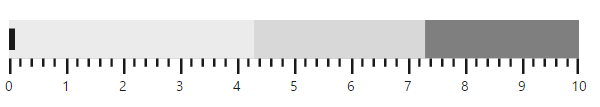
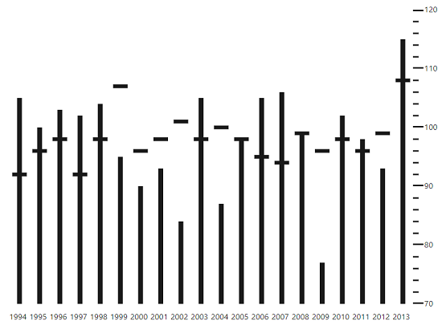
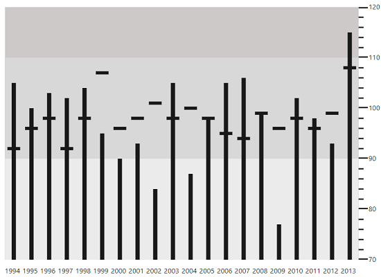
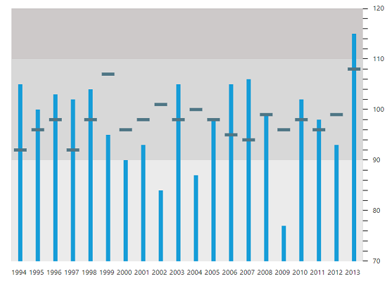
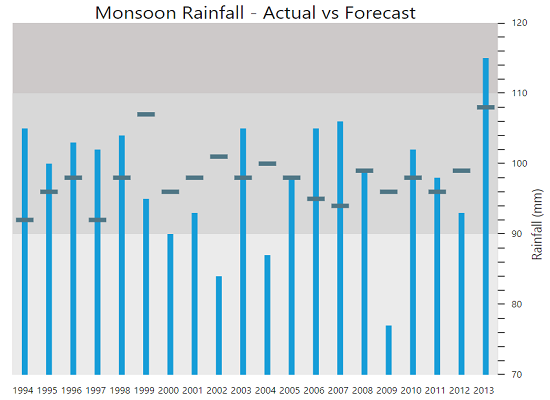
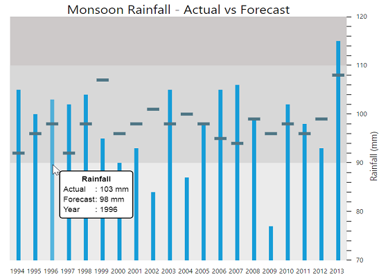

# Getting Started

Before we start with the Bulletgraph, please refer [this page](https://help.syncfusion.com/emberjs/overview/) for general information regarding integrating Syncfusion widget’s.

## Adding JavaScript and CSS Reference

To render the Bulletgraph control, the following list of external dependencies are needed, 

<table>
   <tr>
      <th>
         <b>Files</b>
      </th>
      <th>
         <b>Description/Usage </b>
      </th>
   </tr>
   <tr>
      <td>
         ej.core.min.js
      </td>
      <td>
        It is referred always before using all the JS controls.
      </td>
   </tr>
   <tr>
      <td>
         ej.data.min.js
      </td>
      <td>
         Used to handle data operation and is used while binding data to the JS controls.
      </td>
   </tr>
   <tr>
      <td>
        ej.bulletgraph.min.js
      </td>
      <td>
        Bulletgraph core script file which includes Bulletgraph related scripts files.
      </td>
   </tr>
</table>

N> Uncompressed version of library files are also available which is used for development or debugging purpose and can be generated from the custom script [here](http://csg.syncfusion.com).

## Control Initialization

* Open the command prompt in the folder [ember-app](https://help.syncfusion.com/emberjs/getting-started#create-a-simple-ember-application) or the folder in which the application is created.

* Use the command [ember generate route bulletgraph/default](https://guides.emberjs.com/v2.11.0/routing/defining-your-routes/)to create template `default.hbs` file in templates folder and router `default.js` file in routes folder. It also add the routing content in `router.js`.

* Use below code in `default.hbs` in templates folder to render the bulletgraph.



	{{ej-bulletgraph id="Bulletgraph"}}



* Use the below code in `default.js` in routes folder to bind the model to the bulletgraph.



	import Ember from 'ember';

    export default Ember.Route.extend({
      model() {
         return {
         }
      }
    });



## Running the application

* To run the application, execute below command.


 
 ember serve



* Browse to [http://localhost:4200](http://localhost:4200) to see the application. And navigate to bulletgraph sample. The component is rendered as like the below screenshot. You can make changes in the code found under app folder and the browser should auto-refresh itself while you save files. 

## Provide Required Data

You can customize the values of feature and comparative measure bars in a **BulletGraph**, either locally or remotely. The category data is optional, and is used to display label values in parallel to the measure bars. 

Assign the data in **localData** property to the **dataSource** property of **fields** as shown in the following code example.



export default Ember.Route.extend({
    model() {
	var localData =[{
                    value: 115, comparativeMeasureValue: 108,
                    category: 2013
                },
                {
                    value: 93, comparativeMeasureValue: 99,
                    category: 2012
                },
                {
                    value: 98, comparativeMeasureValue: 96,
                    category: 2011
                },
                {
                    value: 102, comparativeMeasureValue: 98,
                    category: 2010
                },
                {
                    value: 77, comparativeMeasureValue: 96,
                    category: 2009
                },
                {
                    value: 99, comparativeMeasureValue: 99,
                    category: 2008
                },
                {
                    value: 106, comparativeMeasureValue: 94,
                    category: 2007
                },
                {
                    value: 105, comparativeMeasureValue: 95,
                    category: 2006
                },
                {
                    value: 98, comparativeMeasureValue: 98,
                    category: 2005
                },
                {
                    value: 87, comparativeMeasureValue: 100,
                    category: 2004
                },
                {
                    value: 105, comparativeMeasureValue: 98,
                    category: 2003
                },
                {
                    value: 84, comparativeMeasureValue: 101,
                    category: 2002
                },
                {
                    value: 93, comparativeMeasureValue: 98,
                    category: 2001
                },
                {
                    value: 90, comparativeMeasureValue: 96,
                    category: 2000
                },
                {
                    value: 95, comparativeMeasureValue: 107,
                    category: 1999
                },
                {
                    value: 104, comparativeMeasureValue: 98,
                    category: 1998
                },
                {
                    value: 102, comparativeMeasureValue: 92,
                    category: 1997
                },
                {
                    value: 103, comparativeMeasureValue: 98,
                    category: 1996
                },
                {
                    value: 100, comparativeMeasureValue: 96,
                    category: 1995
                },
                {
                    value: 105, comparativeMeasureValue: 92,
                    category: 1994
                }];
        
        return {
            fields: {
                dataSource: localData, category: "category",
                featureMeasures: "value",
                comparativeMeasure: "comparativeMeasureValue"
            },
        }
    }
});
    


Once the **dataSource** property is assigned with the required values, you can bind the variable names used in the **JSON** data to the corresponding fields of the **BulletGraph** as shown in the following code sample.



export default Ember.Route.extend({
    model() {
	var localData =[{
                    value: 115, comparativeMeasureValue: 108,
                    category: 2013
                },
                {
                    value: 93, comparativeMeasureValue: 99,
                    category: 2012
                }
                //...
                ];
        
        return {
            fields: {
                dataSource: localData, category: "category",
                featureMeasures: "value",
                comparativeMeasure: "comparativeMeasureValue"
            },
        }
    }
});
    


**Set Default and Scale Values**

You can plot more number of measure bars within the **BulletGraph**, the height and width of the control should be increased to locate all the measure bars within the graph.The **qualitativeRangeSize** and **quantitativeScaleLength** property needs to be set accordingly as shown in the following code example.

By default, the **BulletGraph** is rendered in the Horizontal orientation with its flow direction set to **Forward.** 

**Minimum**, **maximum** and **interval** values for the **quantitativeScale** of the **bullet graph** should be set, as shown in the following code example.



export default Ember.Route.extend({
    model() {
	    return {
            height: 550,
			width: 650,
            qualitativeRangeSize: 500,
            quantitativeScaleLength: 400, 
            orientation: "vertical",
            flowDirection: "backward",
            quantitativeScaleSettings: {
                location: { x: 120, y: 25 },
                minimum: 70,
                maximum: 120,
                interval: 10,
                labelSettings: { offset: 14, size: 10 }
            },
            fields: {
                dataSource: localData, category: "category",
                featureMeasures: "value",
                comparativeMeasure: "comparativeMeasureValue"
            },
        }
    }
});





          {{ej-bulletgraph id="Bulletgraph" e-height= model.height e-width= model.width e-qualitativeRangeSize=model.qualitativeRangeSize
                e-quantitativeScaleLength=model.quantitativeScaleLength e-orientation=model.orientation e-flowDirection=model.flowDirection e-quantitativeScaleSettings=model.quantitativeScaleSettings
                e-fields = model.fields }}



As you can see in the image above, the bullet graph without any ranges is displayed in the background. The steps to add the **qualitativeRanges** are described in the next section.

**Add Qualitative Ranges**

By default, 3 ranges are displayed in the **BulletGraph** control during the initial rendering of the control with its default values. In order to customize it, you need to set appropriate values for the **rangeEnd** and its **rangeStroke** properties.  Any number of **qualitativeRanges** can be added to the control. 



export default Ember.Route.extend({
    model() {
	    return {
            height: 550,
			width: 650,
            qualitativeRangeSize: 500,
            quantitativeScaleLength: 400, 
            orientation: "vertical",
            flowDirection: "backward",
            quantitativeScaleSettings: {
                location: { x: 120, y: 25 },
                minimum: 70,
                maximum: 120,
                interval: 10,
                labelSettings: { offset: 14, size: 10 }
            },
            fields: {
                dataSource: localData, category: "category",
                featureMeasures: "value",
                comparativeMeasure: "comparativeMeasureValue"
            },
            qualitativeRanges: [{
                rangeEnd: 90
            }, 
            {
                rangeEnd: 110
            },
            {
                rangeEnd: 130, rangeStroke: "#CDC9C9"
            }],
        }
    }
});





          {{ej-bulletgraph id="Bulletgraph" e-height= model.height e-width= model.width e-qualitativeRangeSize=model.qualitativeRangeSize
                e-quantitativeScaleLength=model.quantitativeScaleLength e-orientation=model.orientation e-flowDirection=model.flowDirection e-quantitativeScaleSettings=model.quantitativeScaleSettings
                e-fields = model.fields  e-qualitativeRanges=model.qualitativeRanges }}



After adding **qualitativeRanges** to the **BulletGraph**, the control will be rendered as follows.

 

**Ticks and Measure Bars Customization**

You have to do the following code changes in the quantitative scale in order to customize the tick size, the colors of the feature bar and comparative measure symbols. 



export default Ember.Route.extend({
    model() {
	    return {
            height: 550,
			width: 650,
            qualitativeRangeSize: 500,
            quantitativeScaleLength: 400, 
            orientation: "vertical",
            flowDirection: "backward",
            quantitativeScaleSettings: {
                location: { x: 120, y: 25 },
                minimum: 70,
                maximum: 120,
                interval: 10,
                labelSettings: { offset: 14, size: 10 },
				majorTickSettings:{width:1, size:7},
                minorTickSettings:{width:1},
                comparativeMeasureSettings:{stroke:"#507786"},
                featuredMeasureSettings:{stroke: "#169DD8"},
            },
            fields: {
                dataSource: localData, category: "category",
                featureMeasures: "value",
                comparativeMeasure: "comparativeMeasureValue"
            },
            qualitativeRanges: [{
                rangeEnd: 90
            }, 
            {
                rangeEnd: 110
            },
            {
                rangeEnd: 130, rangeStroke: "#CDC9C9"
            }],
        }
    }
});





          {{ej-bulletgraph id="Bulletgraph" e-height= model.height e-width= model.width e-qualitativeRangeSize=model.qualitativeRangeSize
                e-quantitativeScaleLength=model.quantitativeScaleLength e-orientation=model.orientation e-flowDirection=model.flowDirection e-quantitativeScaleSettings=model.quantitativeScaleSettings
                e-fields = model.fields  e-qualitativeRanges=model.qualitativeRanges }}



When customization of ticks and measure bars is done, **BulletGraph** looks as follows

  

**Add Caption**

You can display an appropriate Caption in the **BulletGraph** by adding the following code example.



export default Ember.Route.extend({
    model() {
	    return {
            height: 550,
			width: 650,
            qualitativeRangeSize: 500,
            quantitativeScaleLength: 400, 
            orientation: "vertical",
            flowDirection: "backward",
            quantitativeScaleSettings: {
                location: { x: 120, y: 25 },
                minimum: 70,
                maximum: 120,
                interval: 10,
                labelSettings: { offset: 14, size: 10 },
				majorTickSettings:{width:1, size:7},
                minorTickSettings:{width:1},
                comparativeMeasureSettings:{stroke:"#507786"},
                featuredMeasureSettings:{stroke: "#169DD8"},
            },
            fields: {
                dataSource: localData, category: "category",
                featureMeasures: "value",
                comparativeMeasure: "comparativeMeasureValue"
            },
            qualitativeRanges: [{
                rangeEnd: 90
            }, 
            {
                rangeEnd: 110
            },
            {
                rangeEnd: 130, rangeStroke: "#CDC9C9"
            }],
            captionSettings: {
                textPosition: "Top",
				textAlignment: "Center",
                location: { x: 470, y: 270 }, 
                text: "Monsoon Rainfall - Actual vs Forecast", 
                font: { fontFamily: 'Segoe UI', size: '20px', 
                        fontWeight: 'regular', opacity: 1 }, 
                subTitle: {
                    textAngle: -90,
                    text: "Rainfall (mm)", location: { x: 570, y: 300 }, 
                    font: { fontFamily: 'Segoe UI', size: '14px',
                    fontWeight: 'regular', opacity: 1} 
                }
            }
        }
    }
});





          {{ej-bulletgraph id="Bulletgraph" e-height= model.height e-width= model.width e-qualitativeRangeSize=model.qualitativeRangeSize
                e-quantitativeScaleLength=model.quantitativeScaleLength e-orientation=model.orientation e-flowDirection=model.flowDirection e-quantitativeScaleSettings=model.quantitativeScaleSettings
                e-fields = model.fields  e-qualitativeRanges=model.qualitativeRanges e-captionSettings=model.captionSettings}}



The following screenshot displays a **BulletGraph** in the caption and title in the **BulletGraph**.

**Show Tooltip**

You can use a Tooltip in your application to display any information. The tooltip is enabled by setting the **visible** property in tooltip to **True**. 



export default Ember.Route.extend({
    model() {
	    return {
            height: 550,
			width: 650,
            tooltipSettings:{visible:true, template: "Tooltip"},
            qualitativeRangeSize: 500,
            quantitativeScaleLength: 400, 
            orientation: "vertical",
            flowDirection: "backward",
            quantitativeScaleSettings: {
                location: { x: 120, y: 25 },
                minimum: 70,
                maximum: 120,
                interval: 10,
                labelSettings: { offset: 14, size: 10 },
				majorTickSettings:{width:1, size:7},
                minorTickSettings:{width:1},
                comparativeMeasureSettings:{stroke:"#507786"},
                featuredMeasureSettings:{stroke: "#169DD8"},
            },
            fields: {
                dataSource: localData, category: "category",
                featureMeasures: "value",
                comparativeMeasure: "comparativeMeasureValue"
            },
            qualitativeRanges: [{
                rangeEnd: 90
            }, 
            {
                rangeEnd: 110
            },
            {
                rangeEnd: 130, rangeStroke: "#CDC9C9"
            }],
            captionSettings: {
                textPosition: "Top",
				textAlignment: "Center",
                location: { x: 470, y: 270 }, 
                text: "Monsoon Rainfall - Actual vs Forecast", 
                font: { fontFamily: 'Segoe UI', size: '20px', 
                        fontWeight: 'regular', opacity: 1 }, 
                subTitle: {
                    textAngle: -90,
                    text: "Rainfall (mm)", location: { x: 570, y: 300 }, 
                    font: { fontFamily: 'Segoe UI', size: '14px',
                    fontWeight: 'regular', opacity: 1} 
                }
            }
        }
    }
});





          {{ej-bulletgraph id="Bulletgraph" e-height= model.height e-width= model.width e-qualitativeRangeSize=model.qualitativeRangeSize
                e-quantitativeScaleLength=model.quantitativeScaleLength e-orientation=model.orientation e-flowDirection=model.flowDirection e-quantitativeScaleSettings=model.quantitativeScaleSettings
                e-fields = model.fields  e-qualitativeRanges=model.qualitativeRanges e-captionSettings=model.captionSettings e-tooltipSettings = model.tooltipSettings}}

           Rainfall 

<table>
<tr><td>Actual</td>
<td>: \{{:currentValue}}  mm</td></tr>
<tr><td>Forecast</td>
<td>: \{{:targetValue}} mm</td></tr>
<tr><td>Year</td>
<td>: \{{:category}} </td></tr>
</table>

 

By using the customization options discussed in this section, the **BulletGraph** is rendered as displayed on the following screenshot.

 

