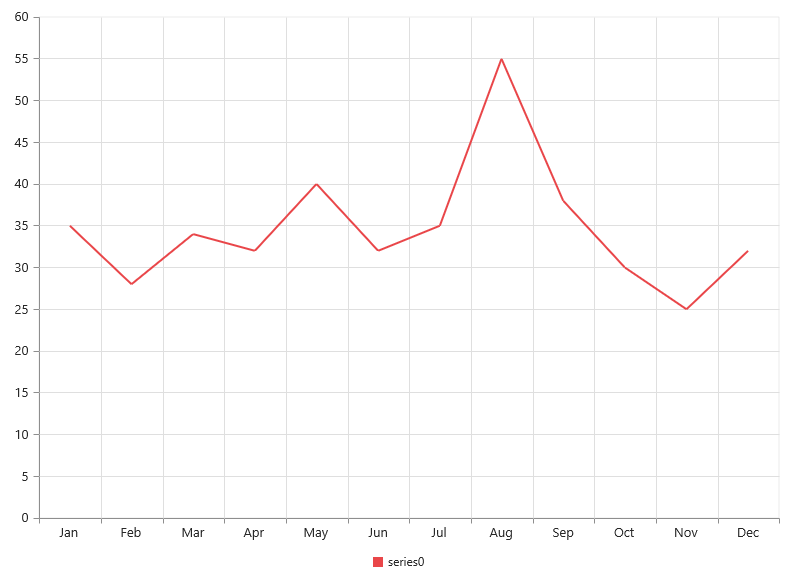

# Getting Started

Before we start with the Chart, please refer [this page](https://help.syncfusion.com/emberjs/overview) for general information regarding integrating Syncfusion widget’s.

## Adding JavaScript and CSS Reference

To render the Chart control, the following list of external dependencies are needed,

<table>
   <tr>
      <th>
         <b>Files</b>
      </th>
      <th>
         <b>Description/Usage </b>
      </th>
   </tr>
   <tr>
      <td>
         ej.core.min.js
      </td>
      <td>
        It is referred always before using all the JS controls.
      </td>
   </tr>
   <tr>
      <td>
         ej.data.min.js
      </td>
      <td>
         Used to handle data operation and is used while binding data to the JS controls.
      </td>
   </tr>
   <tr>
      <td>
        ej.chart.min.js
      </td>
      <td>
        Chart core script file which includes Chart related scripts files.
      </td>
   </tr>
   <tr>
      <td>
        ej.globalize.min.js
      </td>
      <td>
       It is referred when using localization in Chart.
      </td>
   </tr>
   <tr>
      <td>
         ej.scroller.min.js
      </td>
      <td>
         It is referred when scrolling is used in the Chart.
      </td>
   </tr>
</table>

N> Chart uses one or more script files, therefore refer the `ej.web.all.min.js` (which encapsulates all the `ej` controls and frameworks in a single file) in the application instead of referring all the above specified internal dependencies.

To get the real appearance of the Chart, the dependent CSS file `ej.web.all.min.css` (which includes styles of all the widgets) should also needs to be referred as specfied in above code snippet.

## Control Initialization

* Open the command prompt in the folder [ember-app](https://help.syncfusion.com/emberjs/getting-started#create-a-simple-ember-application) or the folder in which the application is created.

* Use the command [ember generate route chart/default](https://guides.emberjs.com/v2.11.0/routing/defining-your-routes/)to create template `default.hbs` file in templates folder and router `default.js` file in routes folder. It also add the routing content in `router.js`.

* Use below code in `default.hbs` in templates folder to render the Chart.



	{{ej-chart id="Chart"}}



* Use the below code in `default.js` in routes folder to bind the model to the Chart.



	export default Ember.Route.extend({
      model() {
         return {
         }
      }
    });



## Running the application

* To run the application, execute below command.


 
 ember serve



* Browse to [http://localhost:4200](http://localhost:4200) to see the application. And navigate to chart sample. The component is rendered as like the below screenshot. You can make changes in the code found under app folder and the browser should auto-refresh itself while you save files. 

## Populate chart with data

Now, this section explains how to plot JSON data to the Chart. First, let us prepare a sample JSON data with each object containing following fields – month and sales. Then, map the month and sales values in the data source to the line series by setting the xName and yName with the field names respectively and then set the actual data by using the dataSource option.



export default Ember.Route.extend({
    model() {
        var chartData = [ { month: 'Jan', sales: 35 },
								  { month: 'Feb', sales: 28 },
								  { month: 'Mar', sales: 34 },
								  { month: 'Apr', sales: 32 },
								  { month: 'May', sales: 40 },
								  { month: 'Jun', sales: 32 },
								  { month: 'Jul', sales: 35 },
								  { month: 'Aug', sales: 55 },
								  { month: 'Sep', sales: 38 },
								  { month: 'Oct', sales: 30 },
								  { month: 'Nov', sales: 25 },
								  { month: 'Dec', sales: 32 }
								];
        return {
            series:
            [{
                    dataSource: chartData, 
					type: "lne",
					xName:"month", 
					yName:"sales",
			}],
        }
    }
});





{{ej-chart id="Chart" e-series=model.series}}



## Add Data Labels

You can add data labels to improve the readability of the chart. This can be achieved by enabling the [`visible`](../api/ejchart#members:series-marker-datalabel-visible) option in the [`marker-dataLabel`](../api/ejchart#members:series-marker-datalabel    ) option. Now, the data labels are rendered at the top of all the data points.

The following code example illustrates this,



export default Ember.Route.extend({
    model() {
        return {
            series:
            [{
                marker: {dataLabel:{visible: true}}
			}],
        }
    }
});





{{ej-chart id="Chart" e-series=model.series}}



There are situations where the default label content is not sufficient to the user. In this case, you can use the [`template`](../api/ejchart#members:series-marker-datalabel-template) option to format the label content with some additional information.



export default Ember.Route.extend({
    model() {
        return {
            series:
            [{
                marker: {dataLabel:{visible: true, template:"dataLabelTemplate"}}
			}],
        }
    }
});





{{ej-chart id="Chart" e-series=model.series}}
      

    
#point.x#:$#point.y#K



The above HTML template is used as a template for each data label. Here, "point.x" and "point.y" are the placeholder text used to display the corresponding data point’s x & y value.

The following code example shows how to set the id of the above template to [`template`](../api/ejchart#members:series-marker-datalabel-template) option,

## Enable Legend

You can enable or disable the legend by using the [`visible`](../api/ejchart#members:legend-visible) option in the [`legend`](../api/ejchart#members:legend). It is enabled in the chart, by default.



export default Ember.Route.extend({
    model() {
        return {
            series:
            [{
			    // ...
                //Add series name to display on the legend item
                    name: "Sales"
			}],
			//Enable chart legend
			legend:{visible: true}
        }
    }
});





{{ej-chart id="Chart" e-legend=model.legend}}



## Enable Tooltip

The Tooltip is useful when you cannot display information by using the [`Data Labels`](data-markers.html#adding-labels) due to the space constraints. You can enable tooltip by using the [`visible`](../api/ejchart#members:series-tooltip-visible) option of the [`tooltip`](../api/ejchart#members:series-tooltip) in the specific series.

The following code example illustrates this,



export default Ember.Route.extend({
    model() {
        return {
            series:
            [{
                tooltip:{visible: true, template: "Template"}
			}],
        }
    }
});





{{ej-chart id="Chart" e-series=model.series}}
      

    
#point.x#:$#point.y#K



## Add Chart Title

You need to add a title to the chart to provide quick information to the user about the data being plotted in the chart. You can add it by using the [`text`](../api/ejchart#members:title-text) option of the [`title`](../api/ejchart#members:title).



export default Ember.Route.extend({
    model() {
        return {
            title: {text: "Sales Analysis"}
        }
    }
});





{{ej-chart id="Chart" e-title=model.title}}
      


