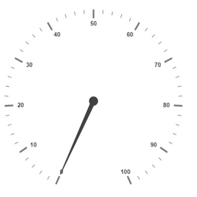
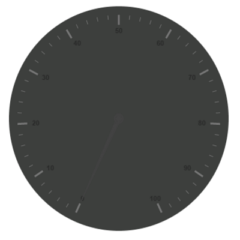
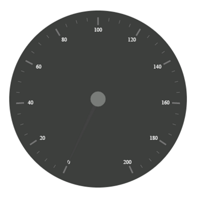
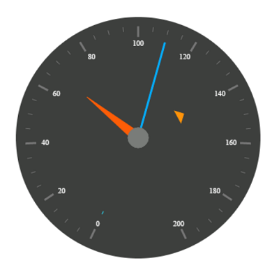
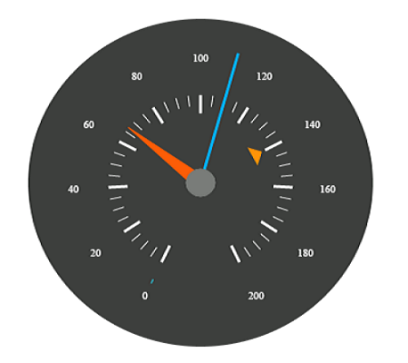
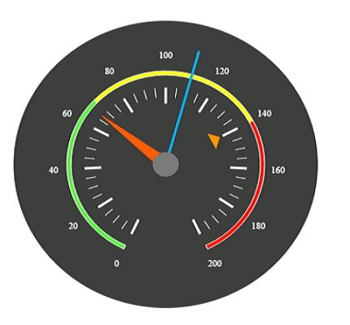
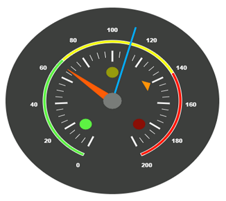
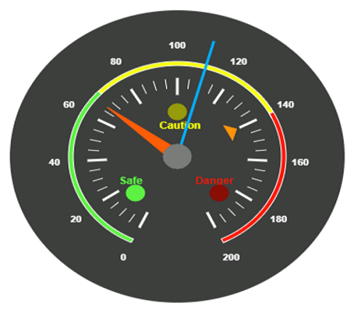

# Getting Started

Before we start with the CircularGauge, please refer [this page](https://help.syncfusion.com/emberjs/overview) for general information regarding integrating Syncfusion widget’s.

## Adding JavaScript and CSS Reference

To render the CircularGauge control, the following list of external dependencies are needed, 

* [jsRender](https://github.com/borismoore/jsrender) - to render the templates

The other required internal dependencies are tabulated below,

<table>
   <tr>
      <th>
         <b>Files</b>
      </th>
      <th>
         <b>Description/Usage </b>
      </th>
   </tr>
   <tr>
      <td>
         ej.core.min.js
      </td>
      <td>
        It is referred always before using all the JS controls.
      </td>
   </tr>
   <tr>
      <td>
         ej.data.min.js
      </td>
      <td>
         Used to handle data operation and is used while binding data to the JS controls.
      </td>
   </tr>
   <tr>
      <td>
        ej.circulargauge.min.js
      </td>
      <td>
        CircularGauge core script file which includes CircularGauge related scripts files.
      </td>
   </tr>
   <tr>
      <td>
        excanvas.min.js
      </td>
      <td>
        
      </td>
   </tr>
</table>

Refer the `ej.web.all.min.js` which encapsulates all the `ej` controls and frameworks in a single file.

## Control Initialization

* Open the command prompt in the folder [ember-app](https://help.syncfusion.com/emberjs/getting-started#create-a-simple-ember-application) or the folder in which the application is created.

* Use the command [ember generate route circulargauge/default](https://guides.emberjs.com/v2.11.0/routing/defining-your-routes/)to create template `default.hbs` file in templates folder and router `default.js` file in routes folder. It also add the routing content in `router.js`.

* Use below code in `default.hbs` in templates folder to render the circulargauge.



	{{ej-circulargauge id="CircularGuage"}}



* Use the below code in `default.js` in routes folder to bind the model to the circulargauge.



	import Ember from 'ember';

    export default Ember.Route.extend({
      model() {
         return {
         }
      }
    });



## Running the application

* To run the application, execute below command.


 
 ember serve



* Browse to [http://localhost:4200](http://localhost:4200) to see the application. And navigate to circulargauge sample. The component is rendered as like the below screenshot. You can make changes in the code found under app folder and the browser should auto-refresh itself while you save files. 

## Set Background Color

You can draw the speedometer with dark background and to vary the speed of the pointer, set the **readOnly** option as **False** for user interaction. 



	{{ej-circulargauge id="CircularGuage"  e-backgroundColor=model.backgroundColor }}





	export default Ember.Route.extend({
      model() {
         return {
             backgroundColor: "#3D3F3D"
         }
      }
    });



The above code example renders a **Gauge** as shown in the following screen shot.

## Provide scale values

* You can customize the pointer cap using the following options- Cap radius, Cap border color, cap background color, pointer cap border width. 

* Set the maximum speed limit in the **Gauge** as 200KmpH.

* Major Ticks and Minor Ticks have the interval values 20 and 5 respectively. Show ranges and show indicators are used to display the ranges and indicators in their respective positions.



	{{ej-circulargauge id="CircularGuage" e-backgroundColor=model.backgroundColor e-width=model.width e-scales=model.scales                 e-height=model.height}}
       




	export default Ember.Route.extend({
      model() {
         return {
            width: 500,
            height: 500,
            backgroundColor: "#3D3F3D",
            scales: [{
                showRanges: true,
                showIndicators: true,
                pointerCap: {
                    radius: 15,
                    borderWidth: 0,
                    backgroundColor: "#797C79",
                    borderColor: "#797C79"
                },
                maximum: 200,
                majorIntervalValue: 20,
                minorIntervalValue: 5,
                //Add the labels customization code here
                //Add the pointers customization code here
                //Add the ticks customization code here
                //Add the ranges customization code here
                //Add the indicators customization code here
                //Add the Custom labels customization code here
            }]
         }
      }
    });



On executing the above code, sample renders a **Circular Gauge** with customized labels as follows.

## Add Label Customization

To display the values in the **Gauge**, scale labels are used. You can customize the label color.  



	{{ej-circulargauge id="CircularGuage" e-backgroundColor=model.backgroundColor e-width=model.width e-scales=model.scales                 e-height=model.height e-readOnly = model.readOnly}}
        





	export default Ember.Route.extend({
      model() {
         return {
            width: 500,
            height: 500,
            backgroundColor: "#3D3F3D",
            readOnly: false,
            scales: [{
                    //Add the labels customization code here
                    labels: [{
                        color: "#ffffff"
                    }],
                    //Add the pointers customization code here
                    //Add the ticks customization code here
                    //Add the ranges customization code here
                    //Add the indicators customization code here
                    //Add the Custom labels customization code here
            }]
         }
      }
    });



On executing the above code, sample renders a default **Circular Gauge** with customized labels as follows.

## Add pointer data

You can use three pointers that denote kilometer value, rotation per minute value and torque value.The torque value pointer should not be similar to other two pointers. Set the torque pointer as marker pointer. You can set other attributes for pointer such as background color, border color, Length, width and distance from scale.



	{{ej-circulargauge id="CircularGuage" e-backgroundColor=model.backgroundColor e-width=model.width e-scales=model.scales                 e-height=model.height e-readOnly = model.readOnly}}
        





	export default Ember.Route.extend({
      model() {
         return {
            width: 500,
            height: 500,
            backgroundColor: "#3D3F3D",
            readOnly: false,
            scales: [{
                    //Add the labels customization code here
                    //Add the pointers customization code here
                    pointers: [{
                        value: 140,
                        distanceFromScale: 60,
                        showBackNeedle: false,
                        length: 20,
                        type: "marker",
                        markerType: "triangle",
                        width: 10,
                        radius: 10,
                        backgroundColor: "#FF940A",
                        border: {
                            color: "#FF940A"
                        },
                    },
                    {
                        value: 110,
                        showBackNeedle: false,
                        length: 150,
                        width: 2,
                        radius: 10,
                        needleType: "rectangle",
                        backgroundColor: "#05AFFF",
                        border: {
                            color: "#05AFFF"
                        },
                    }, {
                        value: 67,
                        showBackNeedle: false,
                        length: 100,
                        width: 15,
                        radius: 10,
                        backgroundColor: "#FC5D07",
                        border: {
                            color: "#FC5D07"
                        },
                    }],
                    //Add the ticks customization code here
                    //Add the ranges customization code here
                    //Add the indicators customization code here
                    //Add the Custom labels customization code here
            }]
         }
      }
    });



On executing the above code, sample renders a customized **Circular Gauge** as follows.

## Add Tick Details

You can display the tick value with customization as given in the following code example. You can set width and height of the Major ticks greater than the Minor ticks. You can set dark background for tick Color to have a better visibility.



	{{ej-circulargauge id="CircularGuage" e-backgroundColor=model.backgroundColor e-width=model.width e-scales=model.scales                 e-height=model.height e-readOnly = model.readOnly}}
        





	export default Ember.Route.extend({
      model() {
         return {
            width: 500,
            height: 500,
            backgroundColor: "#3D3F3D",
            readOnly: false,
            scales: [{
                    //Add the labels customization code here
                    //Add the pointers customization code here
                    //Add the ticks customization code here
                    ticks: [{
                        type: "major",
                        distanceFromScale: 70,
                        height: 20,
                        width: 3,
                        color: "#ffffff"
                    }, {
                        type: "minor",
                        height: 12,
                        width: 1,
                        distanceFromScale: 70,
                        color: "#ffffff"
                    }],
                    //Add the ranges customization code here
                    //Add the indicators customization code here
                    //Add the Custom labels customization code here
            }]
         }
      }
    });



On executing the above code, sample renders a **Circular Gauge** with customized labels as follows.

## Add Range Values

Ranges denote the property of scale value in the speedometer. The color values of the ranges specify the speed variation. Set **showRanges** property to **True** to show the ranges in the **Circular Gauge**. Select safe zone for low speed, caution zone for moderate speed and high zone for high speed. You can customize the range with the properties such as start value, end value, start width, end width,  background color , border color, etc.,



	{{ej-circulargauge id="CircularGuage" e-backgroundColor=model.backgroundColor e-width=model.width e-scales=model.scales                 e-height=model.height e-readOnly = model.readOnly}}
        





	export default Ember.Route.extend({
      model() {
         return {
            width: 500,
            height: 500,
            backgroundColor: "#3D3F3D",
            readOnly: false,
            scales: [{
                    //Add the labels customization code here
                    //Add the pointers customization code here
                    //Add the ticks customization code here
                    //Add the ranges customization code here
                    ranges: [{
                        distanceFromScale: 30,
                        startValue: 0,
                        endValue: 70,
                        backgroundColor: "#5DF243",
                        border: {
                            color: "#FFFFFF"
                        },
                    }, {
                        distanceFromScale: 30,
                        startValue: 70,
                        endValue: 140,
                        backgroundColor: "#F6FF0A",
                        border: {
                            color: "#FFFFFF"
                        },
                    },
                    {
                        distanceFromScale: 30,
                        startValue: 140,
                        endValue: 200,
                        backgroundColor: "#FF1807",
                        border: {
                            color: "#FFFFFF"
                        },
                    }],
                    //Add the indicators customization code here
                    //Add the Custom labels customization code here
            }]
         }
      }
    });



On executing the above code, sample renders a **Circular Gauge** with customized range as follows.

## Add Indicator Details

Indicators denote whether the pointer values are placed in their respective zones. You can position the **indicators** on the respective range value for the required changes. You can set the location of the indicator using **position** property.You can also specify **height**, **width** and **type** for indicators. The **stateRanges** property defines how the indicator should behave when the pointer is in certain values.



	{{ej-circulargauge id="CircularGuage" e-backgroundColor=model.backgroundColor e-width=model.width e-scales=model.scales                 e-height=model.height e-readOnly = model.readOnly}}
        





	export default Ember.Route.extend({
      model() {
         return {
            width: 500,
            height: 500,
            backgroundColor: "#3D3F3D",
            readOnly: false,
            scales: [{
                    //Add the labels customization code here
                    //Add the pointers customization code here
                    //Add the ticks customization code here
                    //Add the ranges customization code here
                    //Add the indicators customization code here
                    indicators: [
                    {
                        height: 10,
                        width: 10,
                        type: "circle",
                        position: { x: 210, y: 300 },
                        stateRanges: [{
                            endValue: 70,
                            startValue: 0,
                            backgroundColor: "#5DF243",
                            borderColor: "#5DF243",
                            text: "",
                            textColor: "#870505"
                        }, {
                            endValue: 200,
                            startValue: 70,
                            backgroundColor: "#145608",
                            borderColor: "#145608",
                            text: "",
                            textColor: "#870505"
                        }]
                    },
                    {
                        height: 10,
                        width: 10,
                        type: "circle",
                        position: { x: 255, y: 200 },
                        stateRanges: [{
                            endValue: 140,
                            startValue: 70,
                            backgroundColor: "#F6FF0A",
                            borderColor: "#F6FF0A",
                            text: "",
                        }, {
                            endValue: 70,
                            startValue: 0,
                            backgroundColor: "#969B0C",
                            borderColor: "#969B0C",
                            text: "",
                        }, {
                            endValue: 200,
                            startValue: 140,
                            backgroundColor: "#969B0C",
                            borderColor: "#969B0C",
                            text: "",
                        }]
                    }, {
                        height: 10,
                        width: 10,
                        type: "circle",
                        position: { x: 300, y: 300 },
                        stateRanges: [{
                            endValue: 140,
                            startValue: 0,
                            backgroundColor: "#890F06",
                            borderColor: "#890F06",
                            text: "",
                        },
                        {
                            endValue: 200,
                            startValue: 140,
                            backgroundColor: "#FF1807",
                            borderColor: "#FF1807",
                            text: "",
                        }]
                    }],
                    //Add the Custom labels customization code here
            }]
         }
      }
    });



On executing the above code, sample renders a **Circular Gauge** with customized indicators as follows.

## Add Custom Label Details

You can specify the text in the **Gauge** using **customLabels** and you can customize it through various properties such as **value**, **position**, **color**, **font**, **size**, **fontFamily** and **fontStyle**. You can use custom texts to display the three range description.



	{{ej-circulargauge id="CircularGuage" e-backgroundColor=model.backgroundColor e-width=model.width e-scales=model.scales                 e-height=model.height e-readOnly = model.readOnly}}
        





	export default Ember.Route.extend({
      model() {
         return {
            width: 500,
            height: 500,
            backgroundColor: "#3D3F3D",
            readOnly: false,
            scales: [{
                    //Add the labels customization code here
                    //Add the pointers customization code here
                    //Add the ticks customization code here
                    //Add the ranges customization code here
                    //Add the indicators customization code here
                    //Add the Custom labels customization code here
                    customLabels: [{
                        value: "Safe",
                        position: { x: 200, y: 280 },
                        color: "#5DF243",
                        font:
                        {
                            size: "12px",
                            fontFamily: "Arial",
                            fontStyle: "Bold"
                        }
                    }, {
                        value: "Caution",
                        position: { x: 253, y: 212 },
                        color: "#F6FF0A",
                        font:
                        {
                            size: "12px",
                            fontFamily: "Arial",
                            fontStyle: "Bold"
                        }
                    }, {
                        value: "Danger",
                        position: { x: 290, y: 280 },
                        color: "#FF1807",
                        font:
                        {
                            size: "12px",
                            fontFamily: "Arial",
                            fontStyle: "Bold"
                        }
                    }]
            }]
         }
      }
    });



The following screenshot displays a **Circular Gauge** control with all customization properties.

