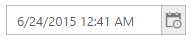
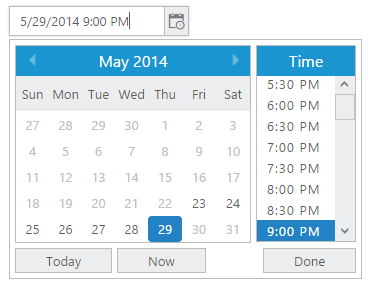

# Getting Started

This section explains briefly about how to create a DateTimePicker in your application with EmberJS.

Before we start with the DateTimePicker, please refer [this page](https://help.syncfusion.com/emberjs/overview) for general information regarding integrating Syncfusion widget’s.

## Adding JavaScript and CSS Reference

To render the DateTimePicker control, the following list of dependencies are required.

<table>
<tr>
<th>
File </th><th>
Description / Usage </th></tr>
<tr>
<td>
ej.core.min.js  </td><td>
Includes only the widget basic functions and Framework features. Must be referred always before using all the JS controls  </td></tr>
<tr>
<td>
ej.globalize.min.js  </td><td>
To support the globalization.  </td></tr>
<tr>
<td>
ej.datepicker.min.js  </td><td>
DatePicker plugin.  </td></tr>
<tr>
<td>
ej.timepicker.min.js  </td><td>
TimePicker plugin.  </td></tr>
<tr>
<td>
ej.datetimepicker.min.js  </td><td>
DateTimePicker plugin.  </td></tr>
<tr>
<td>
ej.scroller.min.js  </td><td>
It is referred when scrolling is used in the DateTimePicker.  </td></tr>
</table>

DateTimePicker uses one or more script files, therefore refer the `ej.web.all.min.js` (which encapsulates all the `ej` controls and frameworks in a single file) in the application instead of referring all the above specified internal dependencies.

To get the real appearance of the DateTimePicker, the dependent CSS file `ej.web.all.min.css` (which includes styles of all the widgets) should also needs to be referred.

## Control Initialization

* Open the command prompt in the folder [ember-app](https://help.syncfusion.com/emberjs/getting-started#create-a-simple-ember-application) or the folder in which the application is created.

* Use the command [ember generate route datetimepicker/default](https://guides.emberjs.com/v2.11.0/routing/defining-your-routes/) to create template `default.hbs` file in templates folder and router `default.js` file in routes folder. It also adds the routing content in `router.js`.

* Use below code in `default.hbs` in templates folder to render the DateTimePicker.

 

       {{ ej-datetimepicker id="dateTimePick" e-value= model.value e-width=model.width}}

 

 * Use the below code in `default.js` in routes folder to bind the model to the DateTimePicker.



     export default Ember.Route.extend({
      model(){
         return {
         value: new Date(),
       width:’180px’
     }
     }
     });



## Running the Application 

To run the application, execute below command.



ember server



Browse to [http://localhost:4200](http://localhost:4200) to see the application. And navigate to DateTimePicker sample. The component is rendered as like the below screenshot. You can make changes in the code found under app folder and the browser should auto-refresh itself while you save files.

# Set the Min and Max Date with Time Interval

In a real-time appointment scenario, the appointment is open only for a limited number of days. You have to select a date and time within the given range. This can be achieved by using the properties min and max that enables the specified date range in the DateTimePicker control.

* Use below code in `default.hbs` in templates folder to render the DateTimePicker.

 

       {{ ej-datetimepicker id="dateTimePick" e-value= model.value e-minDateTime=model.mindatetime e-maxDateTime=model.maxdatetime}}



* Use the below code in `default.js` in routes folder to bind the model to the DateTimePicker.



    export default Ember.Route.extend({
        model(){
        return {
            value: new Date(),
            width:’180px’,
            mindatetime:"05/23/2014 09:00 AM",
            maxdatetime:"05/29/2014 09:00 PM"
        }
        }
        });



Execution of above code will render the following output.

